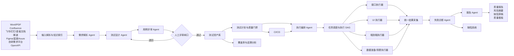
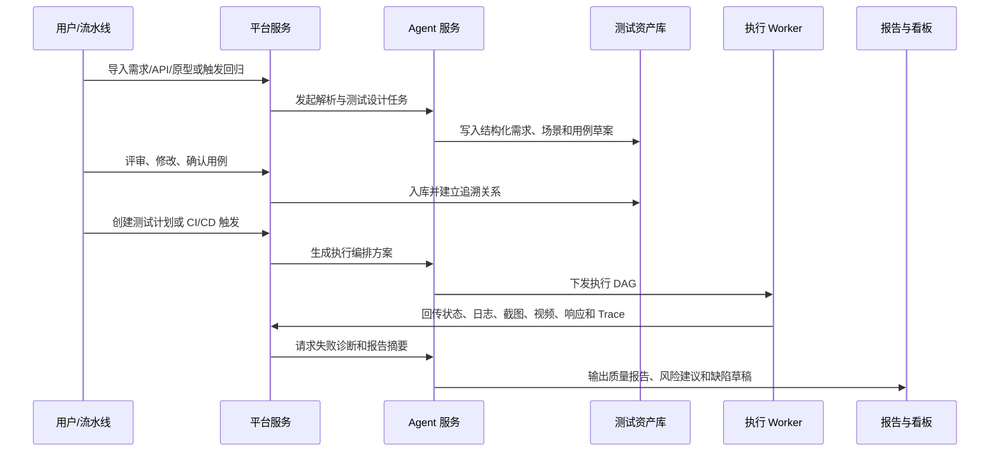
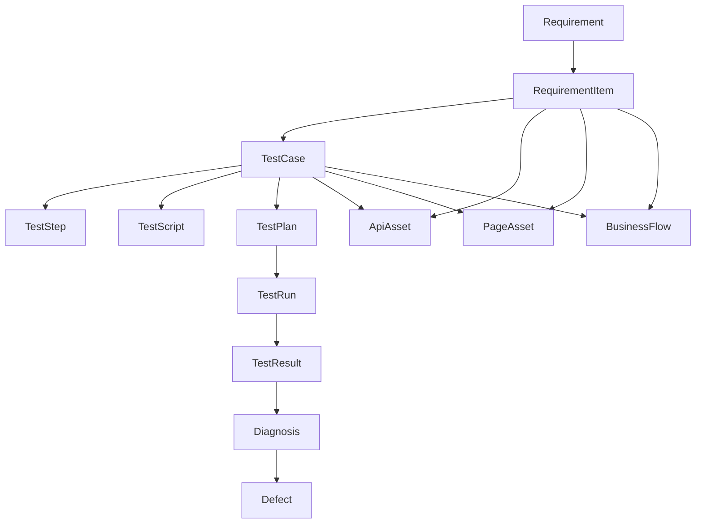
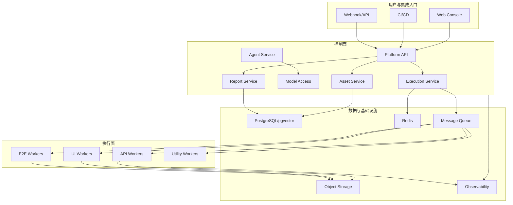

# 基于 AI Agent 的企业级自动化测试平台设计方案

> 面向需求解析、测试设计、资产评审、接口/UI/端到端自动执行、失败诊断、质量报告和持续回归的端到端智能测试平台。

| 项目 | 内容 |
|---|---|
| 适用对象 | QA 团队、研发团队、测试平台团队、质量管理团队、DevOps 团队 |
| 文档版本 | V1.1 |
| 核心目标 | 将需求、接口、原型和历史质量资产转化为可评审、可执行、可追踪、可持续演进的测试资产 |
| 技术约束 | 前端 React 技术体系；服务端 Java + Python 混合架构；底层模型可插拔、可路由、可审计 |
| 设计原则 | 资产优先、人机协同、证据闭环、执行隔离、模型可替换、质量可量化 |

## 1. 建设目标

平台通过多个专业 AI Agent 协同，将需求文档、接口文档、原型信息、历史用例、历史缺陷和线上质量数据转化为可评审、可执行、可追踪的测试资产，并自动完成接口测试、UI 测试和端到端业务链路测试。

核心目标如下：

- 降低测试用例编写、评审、维护和回归成本，提升需求到测试资产的转化效率。
- 建立需求、接口、页面、业务链路、测试用例、执行结果和缺陷之间的全链路追溯。
- 支持接口、UI、端到端链路的统一编排、自动执行、失败诊断和证据采集。
- 通过 AI 失败诊断区分产品缺陷、环境问题、数据问题、脚本问题、依赖问题和误报。
- 建立需求覆盖率、接口覆盖率、页面覆盖率、核心链路覆盖率、自动化稳定性和缺陷趋势的统一视图。
- 接入 CI/CD，在提测、合并、发布和定时巡检前形成自动化回归与质量门禁能力。
- 支持多项目、多租户、多环境、多模型和企业权限审计要求。

## 2. 设计边界与核心假设

平台不是单纯的脚本生成工具，而是测试资产生产、执行和治理平台。AI 负责提升效率和辅助决策，但关键资产入库、发布阻断、缺陷创建等动作需要保留可配置的人机协同闸口。

### 2.1 平台能力边界

| 范围 | 包含 | 暂不优先 |
|---|---|---|
| 测试资产生产 | 需求解析、测试场景生成、用例生成、测试数据建议、脚本草案生成 | 完全无人工参与的自动入库 |
| 自动化执行 | 接口测试、Web UI 测试、端到端混合链路、定时巡检、CI/CD 触发 | 第一阶段覆盖全量移动端和桌面端自动化 |
| 质量分析 | 执行报告、失败归因、缺陷草稿、发布风险建议、趋势看板 | 直接替代测试负责人发布决策 |
| 企业集成 | SSO/RBAC、CI/CD、缺陷系统、代码仓库、通知渠道、对象存储 | 深度绑定某一家 ALM 或 DevOps 平台 |

### 2.2 关键设计假设

- Java 服务承担平台核心域、权限、资产、审计、集成和对外 API。
- Python 服务承担 Agent 编排、模型适配、测试脚本生成、执行器适配、结果解析和智能诊断。
- 测试资产必须版本化，AI 生成结果、人工修改、执行结果和缺陷结论都必须可追溯。
- UI 自动化优先采用 Playwright；接口自动化优先兼容 Pytest + Requests，并保留 Newman、Karate 等执行器扩展点。
- 模型通过本平台自建的统一模型接入层调用，Agent 不直接绑定具体模型厂商或模型版本。
- 首批落地业务为 Web 管理后台，第一阶段优先跑通 Web UI + HTTP API 场景，移动端、性能、安全测试作为后续扩展域。
- 项目从零开始建设，默认不存在可大规模复用的历史自动化资产，因此需要同时建设资产规范、执行规范和平台基础能力。
- 平台从第一天按多租户、多项目、多部门建设，不按单团队临时工具设计。
- 是否允许使用公有云模型需要支持按项目、按应用配置，并可结合数据敏感级别动态路由。

### 2.3 已确认建设约束

| 事项 | 已确认结论 | 架构影响 |
|---|---|---|
| 首批业务 | Web 管理后台 | UI 自动化优先使用 Playwright，重点建设后台表格、表单、权限、审批和配置类场景能力 |
| 项目状态 | 全新项目 | 需要优先建立需求、用例、接口、页面、环境、数据和执行结果的标准模型 |
| 平台形态 | 多租户、多项目、多部门 | 权限、数据隔离、资源配额、审计和配置继承需要进入 MVP |
| 模型策略 | 按项目、按应用控制是否使用公有云模型 | 模型接入层必须支持租户/项目/应用级策略、脱敏、私有模型优先级和审计 |
| 模型部署 | 公有云模型禁用项目不要求完全离线部署 | 禁用公有云模型时可路由到企业内可用模型服务，但不强制私有化全栈离线 |
| 阶段重点 | 用例生成效率、接口自动化规模化、UI/E2E 回归稳定性 | MVP 需要围绕资产生成效率、接口批量执行能力和 UI 稳定性治理设计指标 |
| 业务模块 | Web 管理后台首批模块暂未明确 | 平台需支持先以通用后台场景模板验证，待业务模块明确后再绑定具体业务流 |
| P0 样板 | 采用通用后台模板 | 先覆盖登录、菜单权限、列表查询、表单新增/编辑、审批动作、导入导出和审计日志 |
| 集成范围 | 钉钉、飞书、禅道、Confluence、钉钉文档、飞书文档、语雀、Figma、蓝湖、Axure、自研需求平台；Jira 和其他缺陷平台后续扩展 | 集成层需要采用连接器模式，首期缺陷系统优先对接禅道 |
| 缺陷策略 | 首期优先考虑禅道；无缺陷系统时可将缺陷记录在文档中 | 缺陷闭环需要支持禅道同步、平台内缺陷草稿和文档化缺陷记录三种形态 |
| 协作入口 | 钉钉、飞书用于通知、审批、机器人交互和文档双向同步 | integration-service 需要支持消息、审批、交互卡片、机器人命令和文档回写 |
| 自研需求平台 | 已提供稳定 API 和 Webhook，权限模型、版本字段、需求状态流和 Webhook 事件类型基本完整稳定 | 可作为优先接入的需求主数据源之一，支持事件驱动增量同步，并通过字段映射和事件版本适配应对小范围变动 |
| 测试数据 | 测试数据需要平台自己准备 | 平台需要建设测试数据模板、数据构造、数据绑定、数据清理和生命周期管理能力 |
| 测试账号 | 账号可由被测应用提供，也可由平台在授权范围内创建 | 平台负责账号登记、分组、创建、租借、锁定、释放、回收和使用审计 |

## 3. 总体架构

平台采用“输入与知识层、AI 协同层、测试资产层、执行控制层、执行运行层、分析报告层、企业集成层”的分层架构。



### 3.1 分层职责

| 层级 | 核心能力 | 关键产物 |
|---|---|---|
| 输入与知识层 | 导入 Word/PDF、Confluence、飞书文档、钉钉文档、语雀、禅道、自研需求平台、Swagger/OpenAPI、Figma、蓝湖、Axure | 结构化需求、接口清单、页面元素、业务术语、知识索引 |
| AI 协同层 | 需求解析、测试设计、用例评审、脚本生成、执行编排、失败诊断、报告生成 | 测试场景、测试用例、执行 DAG、诊断结论 |
| 测试资产层 | 管理需求、用例、步骤、数据、脚本、环境、计划、版本和关联关系 | 用例库、数据集、脚本库、追溯图谱 |
| 执行控制层 | 任务创建、调度、队列、并发、重试、超时、取消、资源分配 | 执行任务、执行计划、任务状态 |
| 执行运行层 | 运行接口测试、UI 测试、端到端测试、数据准备和清理任务 | 请求响应、截图、视频、日志、Trace |
| 分析报告层 | 汇总结果、分类失败、生成风险摘要、形成发布建议和趋势看板 | 报告、缺陷草稿、质量门禁结论 |
| 企业集成层 | 对接 CI/CD、缺陷系统、代码仓库、SSO、钉钉、飞书、禅道、文档平台、通知、配置中心和对象存储；Jira 等缺陷平台后续通过连接器扩展 | 流水线回调、缺陷记录、权限策略、通知消息 |

### 3.2 控制面与执行面解耦

为保证企业级稳定性，平台应将控制面和执行面解耦：

- 控制面：资产管理、计划管理、调度决策、权限审计、模型调用、报告聚合。
- 执行面：测试任务实际运行，包括 Playwright、Pytest、Newman、Karate、数据准备和清理任务。
- 执行 Worker 可按项目、环境、浏览器、地区、网络区域和安全等级进行资源池隔离。
- 控制面通过消息队列或任务调度系统下发任务，执行面通过心跳、状态回调和结果上传反馈进度。

## 4. 核心业务闭环



端到端流程：

1. 导入需求文档、接口文档、原型材料、历史缺陷和历史用例。
2. 输入解析服务完成格式解析、分段、去重、清洗、脱敏和知识索引。
3. 需求解析 Agent 抽取功能点、业务规则、角色权限、验收标准、异常约束和领域术语。
4. 测试设计 Agent 生成测试场景、用例、测试数据建议和初步脚本草案。
5. 用例评审 Agent 校验覆盖率、重复性、前置条件、断言完整性、可执行性和优先级。
6. 用户评审确认后沉淀到测试资产库，并关联需求、接口、页面、业务链路和版本。
7. 执行编排 Agent 根据测试计划、环境、依赖、风险等级和资源情况生成执行 DAG。
8. 执行器运行测试并采集接口响应、浏览器截图、视频、控制台日志、网络日志、服务端 Trace 和执行上下文。
9. 失败诊断 Agent 根据证据链生成根因分类、置信度、依据和处理建议。
10. 报告 Agent 输出测试报告、风险摘要、缺陷草稿、质量门禁结论和发布建议。

## 5. 核心 Agent 设计

Agent 不是自由对话机器人，而是受平台约束的任务型组件。每个 Agent 必须有明确输入、输出、工具权限、可观测指标和人工闸口。

| Agent | 职责 | 输入 | 输出 | 关键约束 |
|---|---|---|---|---|
| 需求解析 Agent | 抽取功能点、业务规则、角色权限、验收标准、异常场景和术语 | PRD、用户故事、原型说明、历史缺陷 | 结构化需求模型、需求拆分建议 | 输出必须结构化，可回溯到原文片段 |
| 接口理解 Agent | 解析 OpenAPI、错误码、鉴权、依赖关系和字段约束 | OpenAPI、接口示例、接口变更记录 | 接口资产、依赖图、断言建议 | 不直接生成不可解释断言 |
| 页面理解 Agent | 解析原型、页面截图、DOM 快照和控件语义 | Figma/原型说明、页面截图、URL、DOM | 页面模型、控件清单、用户路径 | 元素定位优先语义定位 |
| 测试设计 Agent | 生成场景、等价类、边界值、异常流、权限矩阵和回归集 | 结构化需求、接口资产、页面模型、历史缺陷 | 测试场景与用例草案 | 必须标记生成依据、优先级和风险 |
| 用例评审 Agent | 检查重复、遗漏、覆盖率、前置条件、断言和可执行性 | 用例草案、需求模型、资产库 | 评审意见、补全建议、风险项 | 不替代人工最终确认 |
| 脚本生成 Agent | 将已确认用例转换为接口脚本、UI 脚本或混合链路脚本 | 已确认用例、环境配置、执行器规范 | 可执行脚本、脚本依赖、维护说明 | 脚本需通过静态校验和试运行 |
| 执行编排 Agent | 选择执行器、编排依赖、准备数据、触发任务和重试策略 | 测试计划、环境、资源、历史稳定性 | 执行任务 DAG | 不能绕过环境权限和并发限制 |
| 失败诊断 Agent | 分析日志、截图、响应、Trace 和历史失败，判断失败原因 | 执行结果、证据材料、变更信息 | 根因分类、置信度、修复建议 | 必须给出证据引用和不确定性 |
| 报告 Agent | 汇总测试结果、风险、趋势和发布建议 | 执行汇总、诊断结论、质量门禁规则 | 测试报告、质量摘要、缺陷草稿 | 发布建议需可配置，不直接强制发布 |

### 5.1 Agent 输出契约

所有 Agent 输出必须满足：

- 结构化：优先输出 JSON Schema 定义的结构化对象，便于入库和校验。
- 可追溯：每个结论标记来源，包括文档片段、接口定义、历史缺陷、执行证据或人工输入。
- 可评审：生成资产分为草稿、待评审、已确认、已废弃等状态。
- 可回放：记录模型、Prompt 版本、上下文摘要、工具调用、输出结果和人工修改。
- 可降级：模型失败时可回退到规则引擎、模板生成或人工处理。

### 5.2 Agent 协同方式

建议采用“工作流编排 + 受控自治”的混合模式：

- 固定流程使用 LangGraph、Temporal 或平台自研状态机编排，保证可回放和可恢复。
- 单个 Agent 内部可根据任务调用检索、解析、代码生成、执行试跑、结果解析等工具。
- 跨 Agent 传递结构化上下文，不传递大段自然语言对话历史。
- 对关键节点设置人工闸口，例如用例入库、批量脚本覆盖、缺陷创建和发布阻断。

## 6. 知识输入与检索增强

AI 生成质量高度依赖输入质量。平台需要建设输入解析和知识索引能力，而不是把原始文档直接塞给模型。

### 6.1 输入类型

| 输入 | 解析内容 | 处理要求 |
|---|---|---|
| Word/PDF | 功能点、业务规则、验收标准、角色权限、异常规则 | 保留章节层级、页码、段落和原文引用 |
| Confluence/飞书文档/钉钉文档/语雀 | 在线需求、评审记录、评论、附件和版本历史 | 通过连接器同步，保留文档版本、作者和更新时间 |
| 禅道/自研需求平台 | 需求、任务、缺陷、迭代、状态流和关联关系 | 作为首期需求源和缺陷闭环源，支持双向状态同步 |
| OpenAPI/Swagger | 路径、方法、参数、Schema、错误码、鉴权、示例 | 校验版本差异和废弃接口 |
| Figma/蓝湖/Axure | 页面、控件、状态、跳转、表单规则、交互说明 | 建立页面和控件语义模型，关联 Web 管理后台页面 |
| 历史用例 | 场景、步骤、断言、数据、执行稳定性 | 全新项目初期可为空，后续持续沉淀并复用高价值用例 |
| 历史缺陷 | 模块、严重级别、根因、复现步骤、修复版本 | 初期来自禅道或文档化缺陷记录，后续用于生成回归用例和风险规则 |
| 代码变更 | 变更文件、接口变更、影响模块 | 支持影响面分析和精准回归 |

### 6.2 知识索引

- 文档索引：按项目、版本、模块、需求、章节和原文片段建立索引。
- 向量索引：用于相似需求、历史用例、历史缺陷和知识片段检索。
- 结构化索引：接口、字段、页面、控件、业务规则和枚举值进入关系模型。
- 图谱索引：建立需求、接口、页面、用例、缺陷、执行计划和执行结果之间的关系图。
- 脱敏索引：敏感字段、客户数据、Token、手机号、身份证、邮箱等必须在进入模型前处理。

## 7. 测试资产与追溯模型

平台的核心竞争力是测试资产的结构化、版本化和追溯能力。

### 7.1 核心实体

| 实体 | 关键字段 | 说明 |
|---|---|---|
| Project | id, name, tenant_id, repo, default_env | 项目空间 |
| Requirement | id, title, source, version, content_ref, acceptance_criteria, status | 需求与验收标准，是覆盖率追踪的根节点 |
| RequirementItem | id, requirement_id, type, rule, source_span, priority | 细粒度功能点、规则、权限或异常约束 |
| ApiAsset | id, service, path, method, version, schema_ref, auth_type | 接口资产 |
| PageAsset | id, name, url_pattern, component_tree_ref, version | 页面资产 |
| BusinessFlow | id, name, nodes, edges, priority | 跨接口、跨页面或跨系统业务链路 |
| TestCase | id, name, type, priority, status, owner, version | 测试用例主表 |
| TestStep | id, case_id, order, action, target, input, expected, data_ref | 测试步骤，支持自然语言和可执行动作双表示 |
| TestDataSet | id, name, scope, data_schema, lifecycle, masking_level | 测试数据集 |
| TestScript | id, case_id, executor_type, language, repo_ref, version, status | 可执行脚本 |
| TestPlan | id, name, scope, env, trigger_type, gate_policy | 测试计划和质量门禁 |
| TestRun | id, plan_id, environment, trigger_type, commit_sha, started_at | 一次测试执行任务 |
| TestResult | id, run_id, case_id, status, duration, error_message, artifacts | 执行结果和证据材料 |
| Diagnosis | id, result_id, root_cause, confidence, evidence_refs, suggestion | 失败诊断结论 |
| Defect | id, title, severity, root_cause, evidence, external_id, status | 缺陷草稿或已同步缺陷系统的记录 |
| ModelInvocation | id, agent, model, prompt_version, input_hash, output_ref, cost, latency | 模型调用审计 |

### 7.2 追溯关系



追溯能力需要回答：

- 某条需求是否有用例覆盖，是否有自动化覆盖，最近一次执行是否通过。
- 某个接口变更影响哪些需求、用例、业务链路和回归计划。
- 某个页面控件变化会影响哪些 UI 脚本和端到端链路。
- 某次发布失败由哪些缺陷、环境问题或脚本问题造成。
- 某个 AI 生成用例来自哪段需求、哪个 Prompt、哪个模型和哪次人工修改。

## 8. 测试用例生成能力

AI 用例生成不应只覆盖正向路径，还需要结合需求规则、接口约束、页面语义和历史缺陷沉淀异常场景、边界条件、权限组合和回归重点。平台生成的用例必须支持人工评审、版本管理和追溯。

| 用例类型 | 生成依据 | 典型内容 | 自动化建议 |
|---|---|---|---|
| 功能用例 | 需求功能点、验收标准 | 主流程、分支流程、提示信息、状态变化 | 可先自然语言评审，再转脚本 |
| 接口用例 | OpenAPI、字段规则、鉴权规则 | 请求参数、响应断言、依赖接口、错误码 | 优先自动化 |
| UI 用例 | 页面原型、控件语义、用户路径 | 页面跳转、表单输入、按钮交互、截图断言 | 覆盖核心路径，避免过细 UI 检查 |
| 端到端用例 | 跨系统业务流程 | 登录、搜索、下单、支付、查询等完整链路 | 少量高价值稳定链路 |
| 异常与边界用例 | 业务规则、历史缺陷、字段约束 | 空值、越界、重复提交、权限不足、超时 | 接口优先，UI 选择关键场景 |
| 权限矩阵用例 | 角色、组织、数据权限、操作权限 | 可见性、可操作性、越权访问 | 接口 + UI 混合 |
| 回归用例 | 高频缺陷、核心链路、发布影响范围 | 冒烟用例、核心链路、风险模块覆盖 | CI/CD 门禁重点 |

### 8.1 用例质量规则

生成或入库的用例必须具备：

- 明确的需求来源和覆盖对象。
- 明确的前置条件、测试数据、操作步骤和预期结果。
- 明确的优先级、风险等级、自动化可行性和维护成本。
- 明确的断言，不接受“结果正确”“页面正常”等不可执行描述。
- 对无法自动化或不建议自动化的用例给出原因。
- 对高风险场景保留历史缺陷、线上事故或业务规则依据。

### 8.2 人机协同评审

建议设计三类评审：

- 快速评审：测试人员批量确认 AI 生成的场景和优先级。
- 细节评审：对高风险用例逐条检查步骤、数据、断言和脚本。
- 变更评审：需求或接口变更后，只评审受影响的用例和脚本。

## 9. 接口测试能力

接口测试是第一阶段最适合规模化落地的能力，应优先建设稳定资产和自动执行闭环。

核心能力：

- 支持 Swagger/OpenAPI 导入，自动识别路径、方法、参数、响应 Schema、错误码、鉴权和示例。
- 自动生成请求体、边界数据、鉴权 Token 获取步骤和接口依赖链。
- 支持环境变量、前后置脚本、数据驱动和接口组合场景；Mock 服务作为后续扩展能力预留。
- 断言包括状态码、响应字段、Schema 校验、业务码、数据库结果和跨接口数据一致性。
- 执行结果保留请求、响应、耗时、重试记录、Trace、关联日志和脱敏后的证据。

| 能力项 | 说明 |
|---|---|
| 接口资产管理 | 按服务、模块、版本管理接口定义，支持与需求、用例和缺陷关联 |
| 变更识别 | 比较不同 OpenAPI 版本，识别新增、删除、字段变更和兼容性风险 |
| 数据构造 | 根据字段类型、枚举、正则、Schema 和业务规则生成有效值、无效值、边界值 |
| 依赖编排 | 自动识别登录、创建对象、查询对象、清理对象等前后置依赖 |
| 断言生成 | 从响应 Schema、验收标准、历史样例和业务规则中推导断言 |
| 契约测试 | 支持消费者契约、Provider 校验和兼容性检查 |
| 兼容执行器 | 可接入 Pytest + Requests、Postman Newman、Karate 等执行引擎 |

推荐第一阶段以 Pytest + Requests 作为默认接口执行器，原因是生态成熟、可扩展性强、与 Python Agent 和数据分析能力衔接自然。

## 10. UI 测试能力

UI 测试执行器建议优先采用 Playwright，兼顾稳定性、现代浏览器支持、并发能力和可观测性。平台应通过语义定位、截图证据和页面状态断言减少脆弱选择器带来的维护成本。

核心能力：

- 支持 Web UI、H5 页面和后台管理系统的自动化测试。
- 支持录制回放、AI 辅助元素定位、自然语言步骤转脚本。
- 支持页面截图、视频、控制台日志、网络请求、Trace Viewer 和可视化对比。
- 支持弹窗、上传文件、多标签页、等待策略和测试账号管理；验证码旁路作为后续扩展能力预留。
- 脚本生成优先使用 role、label、text、test id 等语义定位，降低 CSS/XPath 脆弱性。

### 10.1 UI 稳定性规范

- 产品前端需要逐步补充稳定的 `data-testid` 或同类测试标识。
- 禁止大量依赖绝对 XPath、动态 class、纯坐标点击和固定 sleep。
- 对关键步骤使用页面状态、接口完成、元素可见和业务断言组合等待。
- 截图断言用于关键页面和视觉回归，不用于所有普通交互。
- 验证码、短信、支付、第三方登录等场景暂不作为 MVP 重点；如果实际落地遇到阻塞，再补充旁路或 Mock 能力。

## 11. 端到端编排能力

端到端执行需要打通接口和 UI：接口适合做数据准备和结果校验，UI 适合验证真实用户路径和页面交互。执行编排 Agent 负责任务 DAG、依赖关系、重试、并发、超时和清理策略。

| 阶段 | 动作 | 执行方式 |
|---|---|---|
| 数据准备 | 创建测试用户、初始化商品、生成订单前置数据 | 接口、数据库、测试数据服务 |
| 用户路径 | 登录、搜索商品、加入购物车、提交订单 | UI 自动化 |
| 后台校验 | 查询订单状态、库存变化、支付回调记录 | 接口、数据库校验 |
| 清理回收 | 删除测试数据、释放账号、回滚环境状态 | 接口、脚本任务 |
| 证据采集 | 保留截图、视频、响应体、日志和 Trace 链路 | 统一结果采集器 |

### 11.1 执行 DAG 设计

执行任务应被拆解为 DAG 节点：

- setup：环境检查、账号锁定、数据准备。
- api_test：接口用例批量执行。
- ui_test：浏览器用例执行。
- e2e_flow：跨接口和 UI 的混合链路。
- verify：数据库、消息、缓存、第三方回调校验。
- cleanup：数据清理、账号释放、环境恢复。
- report：结果聚合、失败诊断、报告生成。

每个节点需要支持独立超时、重试、跳过条件、失败策略、日志采集和资源需求声明。

## 12. 执行与调度设计

企业级测试平台必须重视执行隔离和任务可恢复性，否则 AI 生成再多用例也无法稳定落地。

### 12.1 调度能力

| 能力 | 设计要求 |
|---|---|
| 触发方式 | 手动触发、CI/CD 触发、定时触发、接口调用触发、变更影响触发 |
| 并发控制 | 按租户、项目、环境、资源池、浏览器和执行器类型限流 |
| 重试策略 | 区分可重试失败、环境抖动、断言失败和脚本错误 |
| 任务恢复 | 调度服务重启后可恢复未完成任务状态 |
| 队列优先级 | 支持发布门禁、冒烟、全量回归、巡检等不同优先级 |
| 资源隔离 | 按项目或安全级别隔离 Worker、网络、账号和测试数据 |

### 12.2 执行 Worker

执行 Worker 建议容器化部署：

- API Worker：运行 Pytest、Newman、Karate 等接口测试。
- UI Worker：运行 Playwright 浏览器测试，支持 Chromium、Firefox、WebKit。
- E2E Worker：支持接口 + UI + 数据校验混合链路。
- Utility Worker：运行数据准备、清理、文件处理等辅助任务；Mock 任务作为后续扩展能力预留。

Worker 输出统一结果协议，避免平台核心服务绑定具体执行器内部格式。

### 12.3 测试数据与账号管理

测试数据和测试账号需要分开治理：

- 测试数据由平台负责准备，包括数据模板、数据生成、数据导入、数据绑定、数据隔离、数据清理和生命周期管理。
- 平台应支持按租户、项目、应用、环境和用例类型维护测试数据集。
- 数据构造优先通过被测系统开放的 API 完成；如果没有 API，可通过数据库脚本、测试数据服务或人工导入方式补足，但需要记录来源和清理策略。
- 测试账号默认可由被测应用提供；当被测应用开放账号、组织、角色和权限相关 API 时，平台也可以在授权范围内自动创建、配置、禁用和回收测试账号。
- 平台负责账号池管理，包括账号登记、账号创建、角色分组、组织归属、权限绑定、环境绑定、租借锁定、并发占用、释放回收、失效检测和使用审计。
- 权限体系测试需要重点支持账号矩阵构造，例如管理员、普通用户、只读用户、审批人、跨部门用户、无权限用户和数据隔离用户。
- 验证码、短信、第三方登录等人机校验场景暂不在 MVP 建设范围内；如果测试执行被阻塞，再由平台补充旁路策略配置。
- 第三方依赖 Mock 暂不在 MVP 建设范围内；如果后续遇到外部依赖导致执行不稳定，再评估平台统一 Mock 或对接应用已有 Mock 服务。

## 13. 失败诊断与缺陷闭环

失败诊断 Agent 的目标不是“给一个看似聪明的解释”，而是基于证据链降低排查成本，并明确结论置信度。

### 13.1 失败分类

| 分类 | 典型特征 | 处理建议 |
|---|---|---|
| 产品缺陷 | 业务断言失败、接口返回业务错误、页面状态与需求不符 | 生成缺陷草稿并关联证据 |
| 脚本问题 | 元素定位失败、等待策略错误、测试逻辑与需求不一致 | 自动建议脚本修复或标记维护 |
| 环境问题 | 服务不可用、配置错误、依赖超时、DNS/网络异常 | 通知环境负责人，避免误报缺陷 |
| 测试数据问题 | 数据不存在、账号无权限、数据被污染、清理失败 | 触发数据重建或账号释放 |
| 第三方依赖问题 | 支付、短信、外部接口异常 | 标记依赖方并给出影响范围 |
| 需求/用例问题 | 需求变更未同步、预期结果不明确 | 退回用例评审或需求确认 |

### 13.2 诊断证据

诊断结论必须引用：

- 失败步骤、错误栈、断言差异。
- 接口请求、响应、状态码、业务码和耗时。
- UI 截图、视频、DOM 快照、控制台日志和网络日志。
- 服务端 Trace、日志关键片段和链路耗时。
- 最近需求、接口、代码和配置变更。
- 历史相似失败和处理结果。

缺陷创建建议采用“AI 生成草稿 + 人工确认同步”的模式。缺陷草稿包含标题、严重级别、复现步骤、期望结果、实际结果、证据链接、疑似根因和影响范围。

首期缺陷闭环优先支持禅道。如果目标用户暂未使用统一缺陷系统，平台可以将缺陷草稿记录在平台内，并支持同步到飞书文档、钉钉文档、语雀或 Confluence 等文档中，作为轻量化缺陷台账。Jira 和其他缺陷平台通过后续连接器扩展接入。

## 14. 测试报告与质量门禁

测试报告需要同时服务研发排查、测试复盘和发布决策，因此应包括数据指标、失败证据、AI 摘要和明确的发布建议。

### 14.1 报告内容

- 测试概览：总用例数、通过数、失败数、跳过数、通过率、执行耗时和稳定性指标。
- 覆盖率：需求覆盖率、接口覆盖率、页面覆盖率、核心链路覆盖率和自动化覆盖率。
- 失败明细：失败用例、失败步骤、错误信息、截图、日志、接口响应和 Trace。
- 失败分类：产品缺陷、脚本问题、环境问题、测试数据问题、第三方依赖问题。
- 风险摘要：高风险模块、阻塞缺陷、回归建议、是否建议发布。
- 趋势分析：按版本、模块、服务、团队和环境维度展示质量变化。
- AI 结论：结论、依据、置信度和未确认事项。

### 14.2 质量门禁

质量门禁规则应可配置：

| 门禁项 | 示例规则 |
|---|---|
| 冒烟通过率 | P0/P1 用例通过率必须为 100% |
| 阻塞缺陷 | 不允许存在未关闭 Blocker/Critical 缺陷 |
| 覆盖率 | 本次变更影响需求自动化覆盖率不低于阈值 |
| 稳定性 | 近 7 次执行中 flaky 用例比例低于阈值 |
| 接口兼容性 | 不允许出现破坏性接口变更未评审 |
| 风险确认 | 高风险 AI 诊断必须人工确认 |

报告结论示例：

```text
本次共执行 128 条用例，通过 116 条，失败 9 条，跳过 3 条，通过率 90.6%。

主要风险集中在订单支付和优惠券计算模块，其中 5 个失败用例疑似产品缺陷。
建议阻塞发布，优先修复支付回调失败和优惠金额计算错误问题。
```

## 15. 模型接入与自由切换

平台底层模型需要通过本平台自建的统一模型接入层调用，Agent 不直接绑定某一个模型厂商或某一个模型版本。首期由本平台封装模型接入、路由、脱敏、审计、限流、降级和成本统计能力；未来如果企业已有统一模型接入平台，也可通过适配器扩展接入。所有模型能力通过标准接口、配置中心和路由策略进行管理，使业务侧可以按任务、环境、成本、性能和合规要求自由切换。

| 能力项 | 设计要求 | 价值 |
|---|---|---|
| 统一模型接入层 | 本平台对外提供内部标准模型调用接口，对内封装不同模型厂商和模型部署形态 | Agent 层保持稳定，不因模型替换而重写业务逻辑 |
| 自建模型网关 | 首期由本平台封装 OpenAI、Azure OpenAI、私有化大模型、本地模型和未来新增模型的调用差异 | 平台可独立管理模型路由、鉴权、限流、脱敏、审计、成本和降级 |
| 统一模型平台适配器 | 作为未来扩展能力，可对接企业已有模型接入平台 | 避免未来重复建设企业已有能力，降低扩展成本 |
| 模型配置中心 | 支持按租户、项目、Agent、任务类型配置默认模型、备选模型、温度、上下文长度和超时 | 无需发版即可调整模型策略 |
| 动态路由策略 | 按任务复杂度、成本预算、响应时延、数据敏感级别和模型可用性选择模型 | 在质量、成本和速度之间做可控平衡 |
| Prompt 适配层 | 为不同模型维护提示词模板、输出格式约束和结构化解析策略 | 减少不同模型输出风格差异带来的不稳定 |
| 降级与容灾 | 主模型失败或超时时自动切换到备选模型，并记录降级原因 | 保障用例生成、执行诊断和报告生成不中断 |
| 效果评估 | 记录每次调用的输入摘要、输出质量、耗时、Token 消耗、失败率和人工采纳率 | 为模型选型和持续优化提供数据依据 |

### 15.1 模型治理

- 需求解析、用例生成、失败诊断和报告总结可以分别配置不同模型，不要求全平台使用同一个底层模型。
- 模型使用策略支持按租户、项目、应用、环境和任务类型配置；项目或应用可明确禁止使用公有云模型。
- 敏感项目、敏感应用和高敏感数据优先路由到私有化模型或本地模型，普通摘要类任务可路由到成本更低的模型。
- 高复杂度任务使用能力更强的模型，批量生成或低风险任务使用轻量模型。
- 模型切换通过配置、灰度和评估机制完成，保留模型版本、Prompt 版本和输出结果的追溯关系。
- 对 Agent 输出建立离线评测集，包括需求解析准确率、用例有效率、断言完整率、诊断准确率和人工采纳率。
- 模型接入层在调用前执行数据分级和脱敏策略校验，调用后记录模型厂商、模型版本、路由原因、输入摘要、输出引用、成本和审计信息。
- 禁用公有云模型的项目不要求完全离线部署，但必须禁止数据出公网模型，并路由到企业允许的内网模型、专有云模型或人工处理流程。

### 15.2 模型接入形态

| 形态 | 适用场景 | 平台职责 |
|---|---|---|
| 平台自建模型网关 | 首期采用 | 直接封装模型厂商 API，提供路由、鉴权、限流、脱敏、审计、成本统计和降级 |
| 对接统一模型平台 | 未来扩展 | 通过适配器接入企业模型平台，平台侧保留 Agent 任务配置、Prompt 版本、输出契约和业务审计 |
| 混合模式 | 未来扩展 | 统一对 Agent 暴露一个模型接入接口，在接入层内部根据项目、应用、任务和数据敏感级别路由 |

首期明确由本平台自建模型接入封装。无论未来是否扩展企业统一模型平台，Agent 层都只调用平台定义的模型接入接口，不直接调用模型厂商或企业统一模型平台的原始接口。

## 16. 技术选型建议

前端统一采用 React 技术体系，保证控制台、用例编辑器、报告看板和执行监控页面的交互体验一致。服务端采用 Java 和 Python 混合架构：Java 侧承担平台工程化、权限、资产管理和企业系统集成；Python 侧承担 AI Agent、测试脚本生成、执行适配和数据分析等更贴近模型与自动化生态的能力。

| 层级 | 推荐技术 | 说明 |
|---|---|---|
| 前端 | React + TypeScript + Ant Design / Arco Design | 建设测试平台控制台、用例编辑器、报告看板和执行监控页面 |
| 后端 | Java Spring Boot + Python FastAPI | Java 承载平台核心服务；Python 承载 Agent、执行适配和智能分析 |
| Agent 编排 | LangGraph / Temporal / 自研状态机 | 复杂 Agent 流程建议可回放、可恢复、可审计 |
| 模型接入 | 本平台自建统一模型接入层，未来可扩展对接企业统一模型接入平台 | 支持底层模型按任务、项目、环境和成本策略自由切换 |
| 接口测试 | Pytest + Requests / Newman / Karate | 根据团队技术栈选择可扩展执行器 |
| UI 测试 | Playwright 优先，Selenium 兼容 | Playwright 更适合现代 Web 稳定自动化 |
| 移动测试 | Appium | 后续覆盖原生 App 或混合 App 场景 |
| 调度 | Temporal / Argo Workflows / Celery | 支持重试、状态持久化、并发控制和任务编排 |
| 消息队列 | Kafka / RabbitMQ / Redis Stream | 承载任务分发、状态回调、事件通知 |
| 存储 | PostgreSQL + pgvector + Redis + OSS/S3/MinIO | 管理结构化资产、向量检索、缓存和执行证据 |
| 报告 | Allure + 自研质量报告 | 快速复用测试报告能力，并补充 AI 质量分析 |
| CI/CD | Jenkins / GitLab CI / GitHub Actions | 接入流水线，实现自动回归和质量门禁 |
| 可观测性 | OpenTelemetry + Prometheus + Grafana + ELK/Loki | 采集链路、指标、日志和执行证据 |

### 16.1 服务划分建议

| 服务 | 建议职责 |
|---|---|
| portal-web | 前端控制台、用例编辑、执行监控、报告看板 |
| platform-api | 项目、权限、资产、计划、报告、审计、企业集成 |
| asset-service | 需求、接口、页面、用例、脚本、测试数据和版本管理 |
| agent-service | Agent 编排、Prompt 管理、模型调用、结构化输出校验 |
| model-access | 本平台自建模型接入抽象、模型路由、降级、限流、成本统计和调用审计；未来可适配企业统一模型平台 |
| execution-service | 任务调度、DAG 管理、Worker 管理、执行状态聚合 |
| result-service | 结果解析、证据上传、失败聚合、Allure 数据适配 |
| integration-service | CI/CD、缺陷系统、代码仓库、通知和 SSO 集成 |
| worker-api/ui/e2e | 不同执行器 Worker，可独立扩缩容和隔离部署 |

### 16.2 企业连接器设计

由于首期需要集成钉钉、飞书、禅道、Confluence、钉钉文档、飞书文档、语雀、Figma、蓝湖、Axure 和自研需求平台，建议单独建设连接器框架，由 integration-service 统一承载第三方适配能力。Jira 和其他缺陷平台不作为首期必做，后续根据真实用户环境扩展。

| 连接器类型 | 目标系统 | 核心能力 |
|---|---|---|
| 协作连接器 | 钉钉、飞书 | 执行完成通知、门禁失败通知、缺陷提醒、审批流、机器人交互、交互卡片、文档双向同步入口 |
| 缺陷连接器 | 禅道；Jira 和其他缺陷平台后续扩展 | 缺陷草稿同步、状态回写、严重级别映射、附件证据上传 |
| 需求连接器 | 禅道、Confluence、自研需求平台 | 需求同步、版本同步、状态同步、需求与用例关联；自研需求平台优先支持 API + Webhook 增量同步，并支持字段映射、状态流映射和事件版本兼容 |
| 文档连接器 | 飞书文档、钉钉文档、语雀、Confluence、Word/PDF | 文档导入、增量同步、权限校验、版本快照、评审意见、用例链接和缺陷台账回写 |
| 原型连接器 | Figma、蓝湖、Axure | 页面、控件、交互说明、截图和原型版本同步 |
| CI/CD 连接器 | Jenkins、GitLab CI、GitHub Actions 或自研流水线 | 流水线触发、质量门禁回调、执行报告链接回写 |

连接器需要统一以下能力：

- 认证管理：OAuth、Token、应用凭证和企业内部单点登录凭证统一管理。
- 增量同步：按更新时间、版本号、Webhook 或定时任务拉取变更。
- 字段映射：不同系统的需求、缺陷、状态、优先级和人员字段需要可配置映射。
- 幂等处理：重复 Webhook、重复同步和失败重试不能造成重复资产。
- 权限继承：第三方文档或需求的可见范围需要映射到平台租户、部门、项目和角色。
- 审计追踪：记录同步来源、同步时间、外部对象 ID、版本和操作人。
- 交互闭环：钉钉和飞书机器人支持查询执行状态、发起用例评审、审批缺陷同步、确认失败归因和回写报告链接。
- 版本兼容：自研需求平台后续字段或事件小范围变更时，通过连接器版本、字段映射配置和事件兼容层适配，避免影响核心资产模型。

## 17. 安全、权限与合规

企业级平台必须从第一天考虑安全与审计，否则后续很难补。

| 领域 | 设计要求 |
|---|---|
| 身份认证 | 接入企业 SSO、LDAP、OIDC 或 OAuth2 |
| 权限模型 | RBAC + 项目空间隔离，支持项目管理员、测试负责人、测试人员、研发、只读观察者 |
| 数据隔离 | 多租户、项目、环境和资源池隔离 |
| 密钥管理 | Token、账号、数据库密码、API Key 进入密钥管理系统，不落明文 |
| 数据脱敏 | 文档、日志、请求响应、截图中的敏感数据需要识别和脱敏 |
| 审计日志 | 记录资产变更、模型调用、执行触发、缺陷同步、权限变更和门禁放行 |
| 执行安全 | Worker 权限最小化，限制访问生产数据和敏感网络 |
| 模型合规 | 敏感数据进入模型前脱敏或路由到私有模型，保留调用审计 |

## 18. 非功能性要求

| 维度 | 建议指标 |
|---|---|
| 可用性 | 核心平台服务可用性不低于 99.5%，执行 Worker 故障不影响控制面 |
| 可扩展性 | Worker 可水平扩容，支持按项目和执行器类型扩缩容 |
| 性能 | 常规需求解析任务分钟级完成，接口批量执行支持并发配置 |
| 稳定性 | 任务状态可恢复，执行结果幂等上传，失败重试可配置 |
| 可观测性 | 平台调用链路、Agent 调用、模型耗时、执行任务、Worker 状态均可观测 |
| 可维护性 | 用例、脚本、Prompt、模型配置和门禁规则均版本化 |
| 成本控制 | 记录模型 Token、执行资源、存储占用和项目级成本 |

## 19. 部署架构建议



部署建议：

- MVP 可采用单集群部署，控制面服务和 Worker 分命名空间隔离。
- 企业规模化后按项目、环境或安全域拆分 Worker 资源池。
- 对需要访问内网环境的 Worker 使用专用网络和最小权限访问策略。
- 执行证据统一进入对象存储，结构化索引进入 PostgreSQL。
- 大文件、截图、视频和 Trace 设置生命周期策略，避免存储成本失控。

## 20. MVP 建设范围

第一阶段建议先形成完整闭环，不追求一次性覆盖所有复杂场景。由于项目从零开始且明确按多租户、多项目、多部门建设，MVP 不能只做单项目 Demo，需要在平台底座上保留租户、部门、项目、应用、权限、审计和模型策略的最小闭环。业务场景优先选择 Web 管理后台，把“需求输入 -> 用例生成 -> 自动执行 -> 报告输出 -> 缺陷草稿”跑通。

第一阶段优先级如下：

1. 用例生成效率：让需求、接口和原型输入能够快速转化为可评审测试场景、用例和数据建议。
2. 接口自动化规模化：优先形成 OpenAPI 导入、接口用例批量生成、批量执行、批量断言和结果聚合能力。
3. UI/E2E 回归稳定性：围绕 Web 管理后台建立 Playwright 稳定定位、等待策略、证据采集和 Flaky 治理能力。

质量门禁在 MVP 中保留基础报告和风险提示，但不作为第一阶段最核心目标。

### 20.1 MVP 工作包拆分

| 工作包 | 优先级 | 核心范围 | 关键交付物 | 依赖关系 |
|---|---|---|---|---|
| WP1 平台基础底座 | P0 | 多租户、多部门、多项目、多应用、用户角色、环境配置、操作审计 | 租户/部门/项目/应用模型，RBAC，环境管理，审计日志，基础控制台 | 无 |
| WP2 模型接入层 | P0 | 本平台自建模型接入封装，支持模型配置、调用审计、脱敏校验、失败降级和成本记录 | model-access 服务，模型配置中心，Prompt 版本管理，调用日志 | WP1 |
| WP3 测试资产模型 | P0 | 需求、接口、页面、用例、步骤、测试数据、脚本、执行计划、执行结果和缺陷草稿模型 | 核心表结构/API，资产状态流，版本记录，追溯关系 | WP1 |
| WP4 需求与文档输入 | P0 | Word/PDF、Confluence、飞书文档、钉钉文档、语雀、自研需求平台 API + Webhook 接入 | 文档导入，需求结构化解析，Webhook 增量同步，字段映射配置 | WP1、WP2、WP3 |
| WP5 AI 用例生成与评审 | P0 | 基于需求、接口和原型生成测试场景、测试用例、测试数据建议，并支持人工评审 | 需求解析 Agent，测试设计 Agent，用例评审页面，用例入库流程 | WP2、WP3、WP4 |
| WP6 OpenAPI 接口自动化 | P0 | OpenAPI 导入、接口资产管理、接口用例生成、Pytest 执行、断言和结果采集 | OpenAPI 解析器，接口用例生成器，Pytest 执行器，接口报告 | WP2、WP3、WP5 |
| WP7 Web 管理后台 UI/E2E | P1 | 通用后台模板场景，覆盖登录、菜单权限、列表查询、表单新增/编辑、审批动作、导入导出、审计日志 | Playwright 脚本生成，UI 执行器，截图/视频采集，Flaky 标记 | WP3、WP5、WP8 |
| WP8 测试数据与账号池 | P1 | 平台准备测试数据；账号可由应用提供或平台授权创建；支持账号租借、锁定、释放和审计 | 测试数据集，数据构造/清理任务，账号池，权限账号矩阵 | WP1、WP3 |
| WP9 执行编排与任务调度 | P1 | 测试计划、手动触发、定时触发、基础 CI/CD 触发、环境变量、任务状态管理 | 执行计划，任务 DAG，Worker 调度，执行状态流，CI/CD 回调 | WP3、WP6、WP7 |
| WP10 结果报告与失败诊断 | P1 | Allure 风格报告、AI 失败摘要、风险提示、缺陷草稿、文档化缺陷台账 | 测试报告，失败分类，证据链接，缺陷草稿，发布风险摘要 | WP2、WP6、WP7、WP9 |
| WP11 企业协作连接器 | P1 | 钉钉/飞书通知、审批、机器人交互、文档双向同步；禅道缺陷同步 | 钉钉/飞书机器人，审批回调，文档回写，禅道连接器 | WP1、WP3、WP10 |
| WP12 原型输入连接器骨架 | P2 | Figma、蓝湖、Axure 原型信息导入骨架，优先支持页面和控件语义理解 | 原型导入接口，页面模型，控件清单，原型版本快照 | WP3、WP5 |

### 20.2 MVP 迭代建议

| 迭代 | 目标 | 建议包含工作包 | 验收标准 |
|---|---|---|---|
| Iteration 0 基础骨架 | 平台能登录、建项目、配环境、调模型、存资产 | WP1、WP2、WP3 | 可创建租户/项目/应用，可配置模型，可创建需求和用例草稿 |
| Iteration 1 需求到用例 | 跑通需求输入到用例评审入库 | WP4、WP5 | 自研需求平台或文档导入后，可生成可评审用例并入库 |
| Iteration 2 接口规模化 | 跑通 OpenAPI 到接口批量执行 | WP6、WP9 部分能力 | 可导入 OpenAPI，批量生成接口用例，执行并采集结果 |
| Iteration 3 UI/E2E 稳定性 | 跑通通用后台模板的 UI/E2E 自动化 | WP7、WP8、WP9 | 可执行登录、菜单权限、列表、表单、审批等通用后台场景 |
| Iteration 4 报告与协作闭环 | 形成报告、失败摘要、缺陷草稿和协作通知 | WP10、WP11 | 执行完成后可生成报告，推送钉钉/飞书，缺陷可同步禅道或写入文档 |
| Iteration 5 原型增强 | 补充原型输入对页面理解的辅助价值 | WP12 | 可导入 Figma/蓝湖/Axure 页面信息并关联 UI 用例 |

### 20.3 MVP 暂缓

- 复杂移动端自动化。
- 全量视觉回归测试。
- 大规模性能测试和安全测试。
- 跨多地域执行资源调度。
- 完整需求图谱和代码级精准影响分析。
- 完全自动缺陷创建和自动修复脚本合并。
- 验证码、短信、第三方登录旁路能力。
- 第三方依赖 Mock 平台化能力。

## 21. 分阶段路线图

| 阶段 | 时间建议 | 目标 | 关键交付 |
|---|---|---|---|
| P0 验证期 | 2-4 周 | 验证用例生成、接口规模化和 UI 稳定执行可行性 | 需求解析 Demo、接口用例批量生成、Playwright 后台通用场景执行、报告样例 |
| P1 MVP | 8-12 周 | 跑通多租户、多项目下的首个业务闭环 | 平台基础模型、资产库、人工评审、接口批量执行、UI/E2E 稳定性治理、失败摘要、基础连接器、CI/CD 接入 |
| P2 企业化 | 8-12 周 | 强化多部门规模化使用和稳定执行 | 权限审计、Worker 资源池、质量门禁、禅道/钉钉/飞书深度集成、Jira 等缺陷平台扩展、模型治理 |
| P3 智能增强 | 持续迭代 | 提升生成质量和诊断准确率 | 历史缺陷学习、影响面分析、Flaky 治理、精准回归、评测体系 |

## 22. 治理与风险控制

| 风险 | 表现 | 控制措施 |
|---|---|---|
| AI 生成不准确 | 用例遗漏、断言错误、脚本不可执行 | 人工评审、结构化输出校验、离线评测集、Prompt 版本管理 |
| 用例膨胀 | 生成大量低价值用例，执行成本上升 | 优先级、风险等级、去重聚类、回归集分层 |
| UI 自动化脆弱 | 选择器频繁失效、误报多 | 语义定位、test id 规范、等待策略、Flaky 分析 |
| 环境和数据不稳定 | 执行失败难以归因 | 测试数据服务、账号池、环境健康检查、清理机制 |
| 模型供应商锁定 | 模型切换成本高 | 统一模型接入层、Prompt 适配层、输出契约 |
| 敏感数据泄露 | 文档、日志或截图进入外部模型 | 数据脱敏、私有模型路由、密钥管理和审计 |
| 缺陷误报 | AI 自动提交错误缺陷 | 缺陷草稿人工确认、置信度和证据链 |
| 执行资源失控 | Worker 并发过高、浏览器资源耗尽 | 队列限流、资源配额、任务优先级和弹性扩缩容 |

## 23. 关键指标体系

| 指标类型 | 指标 |
|---|---|
| 资产效率 | 需求解析耗时、用例生成耗时、人工采纳率、用例维护耗时 |
| 覆盖质量 | 需求覆盖率、接口覆盖率、页面覆盖率、核心链路覆盖率、自动化覆盖率 |
| 执行质量 | 执行通过率、失败分类占比、平均执行耗时、重试成功率、Flaky 率 |
| 诊断质量 | AI 诊断准确率、人工修正率、缺陷草稿采纳率、平均定位耗时 |
| 发布质量 | 门禁拦截次数、线上缺陷逃逸率、回归缺陷发现率 |
| 成本效率 | 模型调用成本、Worker 资源成本、存储成本、单用例执行成本 |

## 24. 待讨论与需确认事项

以下事项已确认：

- 首批落地业务是 Web 管理后台。
- Web 管理后台首批具体模块暂未明确，方案按通用后台场景模板先行设计，后续再绑定具体业务域。
- P0 样板采用通用后台模板，覆盖登录、菜单权限、列表查询、表单新增/编辑、审批动作、导入导出和审计日志。
- 需要集成钉钉、禅道、飞书、钉钉文档、飞书文档、语雀文档、Confluence、Figma、蓝湖、Axure 和自研需求平台；Jira 和其他缺陷平台后续按真实用户环境扩展。
- 需求来源包括 Word/PDF、Confluence、飞书文档、钉钉文档、语雀文档、禅道和自研需求平台。
- 是否使用公有云模型需要支持按项目、按应用配置。
- 公有云模型禁用项目不要求完全离线部署，但必须保证数据不进入公有云模型。
- 模型接入首期由本平台自建封装，未来可扩展适配企业统一模型接入平台。
- 当前为全新项目，暂不依赖既有自动化资产迁移。
- 平台按多租户、多项目、多部门建设。
- 第一阶段重点关注用例生成效率、接口自动化规模化、UI/E2E 回归稳定性。
- 钉钉、飞书不仅用于通知，还需要承载审批、机器人交互和文档双向同步。
- 自研需求平台提供稳定 API 和 Webhook，权限模型、版本字段、需求状态流和 Webhook 事件类型基本完整稳定，可作为优先接入的需求源；后续小范围变动通过连接器版本兼容处理。
- 测试数据由平台准备；测试账号可由被测应用提供，也可由平台在授权范围内通过应用接口创建和回收，平台统一负责账号池管理和使用审计。
- 缺陷系统首期优先考虑禅道；如果用户没有缺陷系统，缺陷可先记录在平台内或同步到文档台账。

仍建议继续确认的问题：

- 暂无，当前关键建设约束已确认。后续进入详细设计阶段时，再按接口协议、数据模型、页面原型和部署环境继续细化。

## 25. 推荐结论

建议采用“资产治理平台 + AI Agent 生产力 + 稳定执行基础设施”的组合路线，而不是只做一个 AI 脚本生成器。

第一阶段以用例生成效率、接口自动化规模化和 Web 管理后台 UI/E2E 稳定回归为突破口。由于具体后台模块暂未明确，建议 P0 使用通用后台场景模板验证平台能力，待业务模块确定后再沉淀领域用例、业务链路和质量指标。第二阶段再加强多项目治理、质量门禁、历史缺陷学习、精准回归和模型效果评估。这样既能快速产生业务价值，也能避免因为一开始追求全自动、全场景覆盖而导致落地风险过高。
