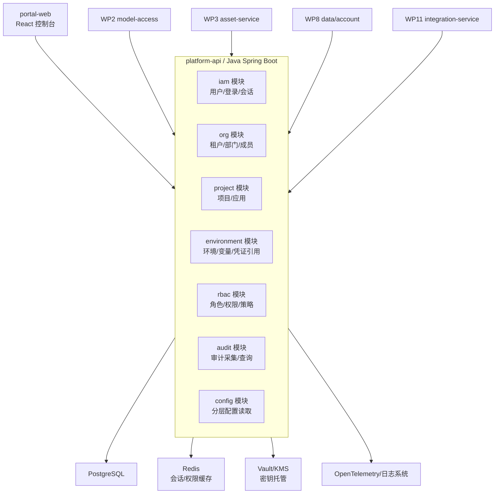
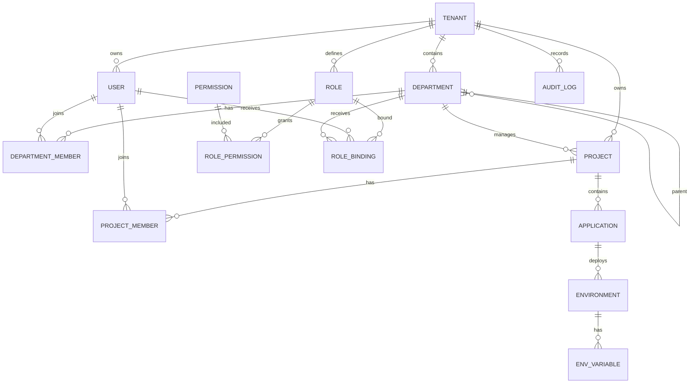
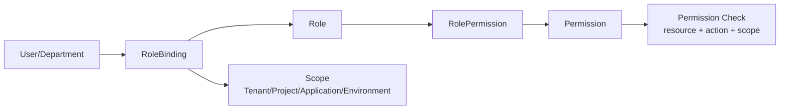
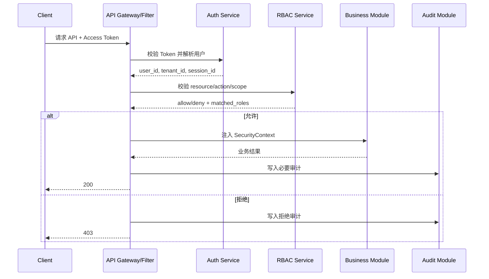
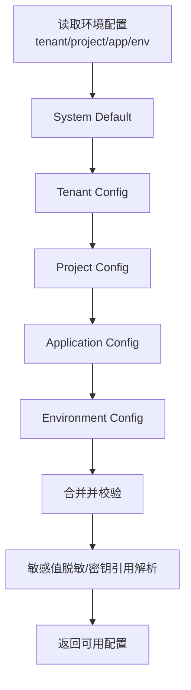
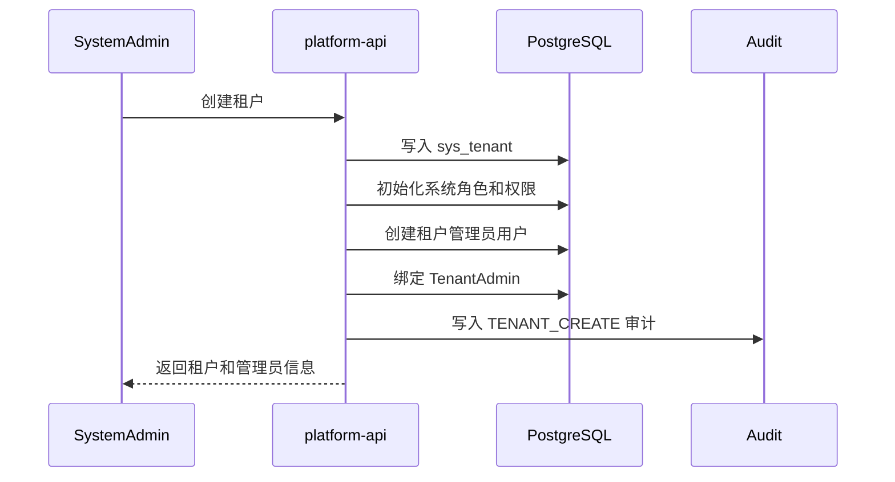
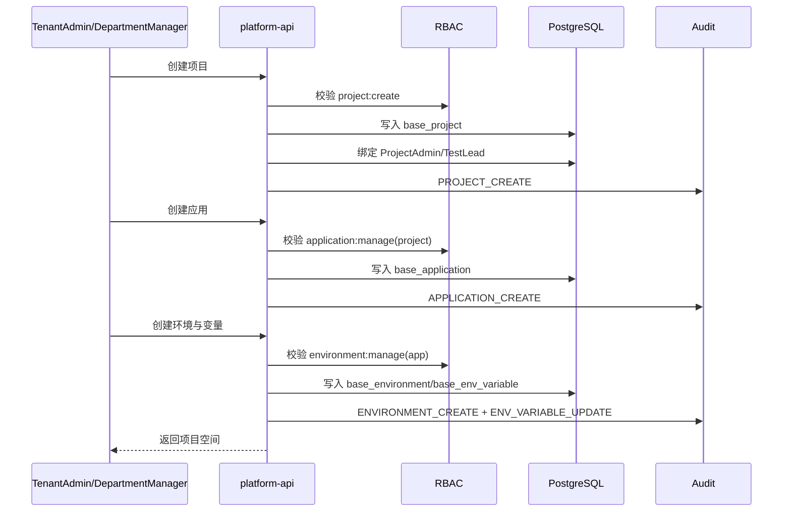
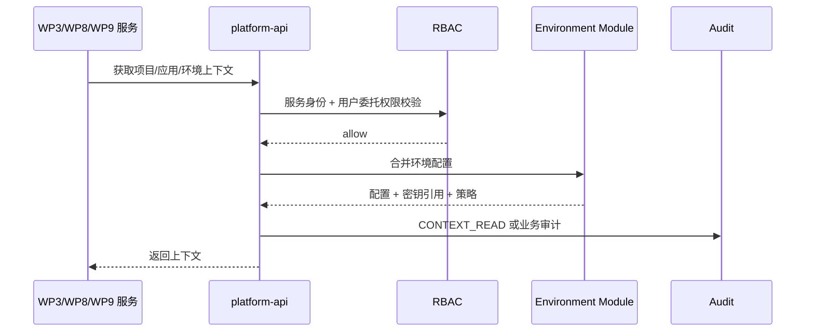

# WP1 平台基础底座 - 系统架构设计

> 历史归档说明：本文记录 WP1 早期系统架构草案，不代表当前实现口径。当前实现以 `doc/mvp/final/engineering/当前实现基线.md`、代码、迁移脚本和自动化测试为准：后端为单个 `platform-api` Java 服务，WP1/WP2/WP3 是同服务内领域模块，不建设多租户，API 使用 camelCase，分页使用 `index/size`。

| 项目 | 内容 |
|---|---|
| 工作包 | WP1 平台基础底座 |
| 范围 | 多租户、多部门、多项目、多应用、用户角色、环境配置、操作审计 |
| 依赖 | 无 |
| 被依赖 | WP2 模型接入层、WP3 测试资产模型、WP4 输入连接器、WP8 测试数据与账号池、WP11 企业协作连接器 |
| 技术背景 | 前端 React；服务端 Java + Python 混合架构；Java 承载平台核心域、权限、审计、配置和对外 API |

## 1. 架构目标与设计原则

WP1 是平台所有后续能力的控制面底座，目标不是只完成登录和菜单，而是建立企业级自动化测试平台可长期演进的组织、权限、环境和审计基础。

### 1.1 架构目标

1. 支持多租户、多部门、多项目、多应用的基础空间模型。
2. 支持企业用户、角色、权限、成员关系和项目空间隔离。
3. 支持应用环境、环境变量、凭证引用、模型策略入口和执行资源入口的统一配置。
4. 支持平台关键操作审计，为资产变更、模型调用、执行触发、缺陷同步和门禁放行提供统一审计能力。
5. 为 WP2/WP3/WP8/WP11 提供稳定的租户上下文、权限校验、配置读取和审计写入接口。
6. MVP 阶段允许单集群部署，但数据模型和接口必须保留企业化扩展能力。

### 1.2 设计原则

| 原则 | 说明 |
|---|---|
| 租户优先 | 所有业务主表必须包含 `tenant_id`，跨租户数据默认不可见、不可关联、不可统计。 |
| 项目空间隔离 | 需求、用例、执行、报告、环境、模型策略等后续资产均以项目为主要工作空间。 |
| 应用承载被测系统 | 项目下可包含多个被测应用，应用是环境、模型策略、账号池和执行配置的重要作用域。 |
| 权限前置 | API 层统一解析用户身份、租户、部门、项目和角色，不把权限判断分散到业务代码深处。 |
| 配置分层 | 支持租户、项目、应用、环境多级配置，读取时按明确优先级合并，写入时保留来源层级。 |
| 审计不可绕过 | 权限变更、环境配置、密钥引用、项目成员、关键开关必须记录审计日志。 |
| 密钥不落明文 | Token、账号密码、数据库密码、API Key 只保存密钥引用，明文进入 Vault/KMS 或企业密钥系统。 |
| 软删除与可恢复 | 基础组织对象优先软删除，避免历史资产、执行结果和审计记录失去归属。 |

## 2. WP1 在整体平台中的边界

### 2.1 WP1 包含

| 模块 | MVP 范围 |
|---|---|
| 租户管理 | 租户创建、启停、基础配额、租户管理员绑定。 |
| 部门管理 | 部门树、部门成员、部门负责人、用户主部门和兼任部门。 |
| 用户与身份 | 本地用户模型、企业 SSO 映射预留、登录会话、用户状态。 |
| 项目管理 | 项目创建、归属部门、项目成员、项目角色、项目状态。 |
| 应用管理 | 项目下被测应用登记、应用类型、代码仓库/服务标识、敏感级别。 |
| 环境管理 | 应用环境、访问地址、环境变量、凭证引用、健康检查配置。 |
| RBAC | 平台级、租户级、项目级角色；菜单权限、资源权限、操作权限。 |
| 审计日志 | 操作审计、配置变更审计、权限变更审计、登录审计、后续业务审计接入点。 |
| 基础控制台 | 支撑以上对象的管理页面和列表查询。 |

### 2.2 WP1 不包含

| 不包含项 | 归属工作包 | WP1 需要提供的接口 |
|---|---|---|
| 模型厂商、Prompt、模型调用日志 | WP2 | 模型策略作用域、是否允许公有云模型、审计写入。 |
| 需求、接口、页面、用例、脚本、执行结果 | WP3 | 项目、应用、环境、用户、权限上下文。 |
| 文档、需求平台、禅道、飞书、钉钉连接器 | WP4/WP11 | 第三方凭证引用、权限映射基础、审计写入。 |
| 测试数据集、账号池、数据清理任务 | WP8 | 应用环境、部门/项目隔离、凭证引用、审计写入。 |
| 执行调度、Worker 资源池、CI/CD 触发 | WP9 | 项目/环境权限、环境配置读取、资源池挂载字段。 |

## 3. 服务/模块划分

MVP 建议先由 `platform-api` 承载 WP1 能力，内部按领域模块拆包。后续当租户、审计或权限压力上升时，再拆出独立服务。这样可以降低首期分布式复杂度，同时保持模块边界清晰。



### 3.1 模块职责

| 模块 | 职责 | 对外能力 |
|---|---|---|
| iam | 用户、登录、会话、SSO 映射预留、Token 校验 | 当前用户、用户列表、登录登出、会话续期。 |
| org | 租户、部门树、部门成员、部门负责人 | 租户上下文、部门树、用户组织关系。 |
| project | 项目、项目成员、项目角色、应用 | 项目空间、应用登记、成员授权。 |
| environment | 环境、环境变量、服务地址、凭证引用、健康检查配置 | 环境详情、变量解析、凭证引用读取。 |
| rbac | 角色、权限点、角色绑定、权限计算 | API 鉴权、菜单权限、按钮权限、资源权限。 |
| audit | 审计事件采集、审计查询、审计归档预留 | 写审计、查审计、导出审计。 |
| config | 租户/项目/应用/环境级配置合并 | 分层配置读取、配置变更审计。 |

## 4. 核心领域模型与关系

### 4.1 核心实体

| 实体 | 说明 | 关键字段 |
|---|---|---|
| Tenant | 租户，企业或业务隔离单元 | `id`, `code`, `name`, `status`, `plan`, `quota` |
| Department | 租户内部门树 | `id`, `tenant_id`, `parent_id`, `name`, `path`, `manager_user_id` |
| User | 平台用户 | `id`, `tenant_id`, `username`, `display_name`, `email`, `mobile`, `status` |
| DepartmentMember | 用户与部门关系 | `tenant_id`, `dept_id`, `user_id`, `is_primary`, `position` |
| Project | 测试工作空间 | `id`, `tenant_id`, `dept_id`, `code`, `name`, `status`, `sensitivity_level` |
| ProjectMember | 项目成员 | `tenant_id`, `project_id`, `user_id`, `role_id`, `member_type` |
| Application | 被测应用 | `id`, `tenant_id`, `project_id`, `code`, `name`, `app_type`, `sensitivity_level` |
| Environment | 应用环境 | `id`, `tenant_id`, `project_id`, `app_id`, `code`, `name`, `env_type` |
| EnvVariable | 环境变量 | `env_id`, `key`, `value_type`, `value_cipher_ref`, `value_plain_masked` |
| Role | 角色定义 | `id`, `tenant_id`, `scope`, `code`, `name`, `is_system` |
| Permission | 权限点 | `id`, `code`, `resource_type`, `action`, `description` |
| RolePermission | 角色权限绑定 | `role_id`, `permission_id` |
| RoleBinding | 用户/部门与角色绑定 | `tenant_id`, `subject_type`, `subject_id`, `role_id`, `scope_type`, `scope_id` |
| AuditLog | 审计日志 | `tenant_id`, `actor_user_id`, `action`, `resource_type`, `resource_id`, `diff` |

### 4.2 关系图



## 5. 层级与隔离策略

### 5.1 层级模型

```text
Tenant
  └── Department Tree
        └── Project
              └── Application
                    └── Environment
```

说明：

1. 租户是最高隔离边界，租户间数据、用户、配置、审计日志默认不可见。
2. 部门是组织归属和授权辅助边界，不直接替代项目空间。
3. 项目是测试资产、执行计划、模型策略和协作流程的主要工作空间。
4. 应用是被测系统抽象，一个项目可以包含多个前端、后端服务或后台系统。
5. 环境绑定到应用，并继承项目和应用的策略。

### 5.2 数据隔离策略

| 层级 | 隔离要求 | MVP 实现 |
|---|---|---|
| 租户 | 强隔离，默认不可跨租户查询和关联 | 所有业务表强制 `tenant_id`；API 从认证上下文注入；数据库索引包含 `tenant_id`。 |
| 部门 | 组织视图隔离和授权继承 | 部门树 `path` 支持快速查询；角色可绑定到部门范围。 |
| 项目 | 资产、执行、报告、环境主要隔离边界 | 所有项目内对象包含 `project_id`；项目成员或租户管理员才可访问。 |
| 应用 | 被测系统、模型策略、环境配置隔离 | 应用包含敏感级别和公有云模型开关；后续 WP2/WP8 继承使用。 |
| 环境 | 测试执行和凭证隔离 | 环境变量按环境保存；密钥只保存引用；生产环境默认只读或禁用执行。 |

### 5.3 配置继承优先级

读取配置时按以下优先级从高到低覆盖：

```text
Environment > Application > Project > Tenant > System Default
```

适用配置包括：

- 是否允许使用公有云模型。
- 数据敏感级别。
- 默认执行资源池。
- 默认通知渠道。
- 环境变量和服务地址。
- 审计保留策略。

## 6. RBAC 权限模型设计

### 6.1 权限模型

WP1 采用 `RBAC + 资源作用域 + 少量策略条件`。MVP 不引入完整 ABAC 引擎，但为后续扩展保留 `condition_json` 字段。



### 6.2 角色分层

| 角色 | 作用域 | 说明 |
|---|---|---|
| SystemAdmin | 系统 | SaaS/平台运维角色，管理租户和系统配置。MVP 可仅保留后台初始化能力。 |
| TenantAdmin | 租户 | 管理本租户部门、用户、项目、应用、角色和审计。 |
| DepartmentManager | 部门 | 管理部门成员，查看本部门项目，发起项目创建。 |
| ProjectAdmin | 项目 | 管理项目成员、应用、环境、项目配置。 |
| TestLead | 项目 | 管理测试资产、计划、执行和报告。WP3 后续扩展使用。 |
| Tester | 项目 | 创建和维护测试资产、触发授权环境执行。WP3/WP9 后续扩展使用。 |
| Developer | 项目 | 查看资产、执行结果、失败证据，可维护接口/应用信息。 |
| Viewer | 项目 | 只读查看项目、应用、环境脱敏信息和审计摘要。 |

### 6.3 权限点命名

权限点建议采用稳定编码：

```text
{resource}:{action}
```

示例：

| 权限点 | 说明 |
|---|---|
| `tenant:manage` | 管理租户基础信息和状态。 |
| `department:read` | 查看部门树和成员。 |
| `department:manage` | 管理部门和成员。 |
| `user:read` | 查看用户信息。 |
| `user:manage` | 创建、禁用、同步用户。 |
| `project:create` | 创建项目。 |
| `project:read` | 查看项目。 |
| `project:manage` | 管理项目基础信息和成员。 |
| `application:manage` | 管理应用。 |
| `environment:read` | 查看环境配置。 |
| `environment:manage` | 管理环境配置。 |
| `secret:reference` | 引用密钥，不读取明文。 |
| `audit:read` | 查询审计日志。 |
| `role:manage` | 管理角色和授权。 |

### 6.4 鉴权流程



### 6.5 实现要点

1. `SecurityContext` 必须包含 `tenant_id`, `user_id`, `project_id`, `roles`, `permissions`。
2. 权限缓存可放 Redis，缓存 Key 包含用户、租户、项目和角色版本。
3. 角色或权限变更后递增 `auth_version`，使缓存失效。
4. 跨项目访问必须显式校验，不允许只依赖前端菜单隐藏。
5. 环境密钥读取只返回密钥引用或脱敏值，不返回明文。

## 7. 审计日志设计

### 7.1 审计范围

| 类别 | 事件示例 |
|---|---|
| 登录审计 | 登录成功、登录失败、登出、Token 刷新、SSO 绑定。 |
| 组织审计 | 租户启停、部门创建、部门移动、成员加入/移除。 |
| 权限审计 | 角色创建、角色授权、成员授权、权限回收。 |
| 项目审计 | 项目创建、项目状态变更、项目成员变更。 |
| 应用审计 | 应用创建、敏感级别变更、公有云模型策略变更。 |
| 环境审计 | 环境创建、URL 变更、变量变更、凭证引用变更、健康检查变更。 |
| 安全审计 | 越权访问、密钥引用失败、敏感配置读取失败。 |
| 业务接入审计 | WP2/WP3/WP8/WP11 通过统一接口写入模型调用、资产变更、执行触发、缺陷同步等事件。 |

### 7.2 审计事件结构

| 字段 | 说明 |
|---|---|
| `id` | 审计事件 ID。 |
| `tenant_id` | 租户 ID，强制必填。 |
| `trace_id` | 请求链路 ID，用于串联 API、模型、执行和连接器日志。 |
| `actor_user_id` | 操作人。系统任务可使用虚拟用户或 `actor_type=SYSTEM`。 |
| `actor_ip` | 操作来源 IP。 |
| `user_agent` | 浏览器或客户端标识。 |
| `action` | 操作编码，如 `PROJECT_CREATE`。 |
| `resource_type` | 资源类型，如 `PROJECT`、`ENVIRONMENT`。 |
| `resource_id` | 资源 ID。 |
| `scope_type` | `TENANT`、`PROJECT`、`APPLICATION`、`ENVIRONMENT`。 |
| `scope_id` | 作用域 ID。 |
| `result` | `SUCCESS`、`FAILED`、`DENIED`。 |
| `before_json` | 变更前摘要，敏感字段脱敏。 |
| `after_json` | 变更后摘要，敏感字段脱敏。 |
| `diff_json` | 字段级差异，敏感字段只记录是否变化。 |
| `reason` | 失败原因或人工操作原因。 |
| `created_at` | 事件时间。 |

### 7.3 审计写入策略

1. 管理类 API 使用注解或拦截器声明审计事件，业务执行成功后写入。
2. 权限拒绝事件由鉴权过滤器写入。
3. 配置变更必须记录字段级 diff。
4. 密钥类字段只记录引用 ID、是否变更和脱敏摘要。
5. 审计写入失败不能影响主流程，但必须打错误日志并进入补偿队列。
6. 审计查询默认按租户隔离，支持按项目、应用、环境、用户、操作类型和时间范围过滤。

## 8. 配置与环境管理设计

### 8.1 环境模型

一个应用可以有多个环境：

| 环境类型 | 说明 | MVP 策略 |
|---|---|---|
| `DEV` | 开发环境 | 可执行，可读写。 |
| `TEST` | 测试环境 | 默认执行环境。 |
| `STAGING` | 预发环境 | 可执行，但需要项目管理员配置。 |
| `PROD` | 生产环境 | MVP 默认禁用自动化执行，仅允许只读配置和健康检查。 |
| `CUSTOM` | 自定义环境 | 由项目管理员维护。 |

### 8.2 环境配置内容

| 配置 | 示例 | 安全要求 |
|---|---|---|
| 基础地址 | `https://test.example.com` | 普通字段。 |
| API 网关地址 | `https://api-test.example.com` | 普通字段。 |
| 数据库连接引用 | `vault://db/order-test` | 只保存密钥引用。 |
| 登录账号引用 | `vault://account/admin-test` | 只保存密钥引用，WP8 账号池后续接管。 |
| 环境变量 | `BASE_URL`, `API_BASE_URL`, `TENANT_CODE` | 可配置是否敏感。 |
| 请求头模板 | `X-Env`, `X-Tenant` | 敏感值使用密钥引用。 |
| 健康检查 | URL、方法、期望状态码、超时 | 结果进入环境状态。 |
| 执行开关 | 是否允许 API/UI/E2E 执行 | PROD 默认关闭。 |

### 8.3 环境变量解析



返回给不同调用方的内容不同：

| 调用方 | 返回内容 |
|---|---|
| 前端控制台 | 明文非敏感配置 + 敏感字段脱敏值 + 密钥引用元信息。 |
| 执行服务 | 非敏感配置 + 密钥引用，是否解密由 Worker 所在安全域决定。 |
| 后续 Agent | 非敏感配置 + 脱敏摘要，默认不提供密钥。 |

## 9. 关键 API 草案

API 前缀建议为 `/api/v1`。所有接口默认从 Token 中获取 `tenant_id`，禁止客户端传入任意租户 ID 进行越权访问。系统管理员操作租户时使用单独后台权限。

### 9.1 租户与部门

| 方法 | 路径 | 说明 | 权限 |
|---|---|---|---|
| `POST` | `/admin/tenants` | 创建租户 | `tenant:manage` |
| `GET` | `/tenants/current` | 获取当前租户 | 登录用户 |
| `PATCH` | `/tenants/current` | 更新当前租户基础信息 | `tenant:manage` |
| `GET` | `/departments/tree` | 查询部门树 | `department:read` |
| `POST` | `/departments` | 创建部门 | `department:manage` |
| `PATCH` | `/departments/{deptId}` | 更新部门 | `department:manage` |
| `POST` | `/departments/{deptId}/members` | 添加部门成员 | `department:manage` |
| `DELETE` | `/departments/{deptId}/members/{userId}` | 移除部门成员 | `department:manage` |

### 9.2 用户与角色

| 方法 | 路径 | 说明 | 权限 |
|---|---|---|---|
| `GET` | `/users` | 查询用户 | `user:read` |
| `POST` | `/users` | 创建本地用户或预创建 SSO 用户 | `user:manage` |
| `PATCH` | `/users/{userId}` | 更新用户 | `user:manage` |
| `PATCH` | `/users/{userId}/status` | 启用/禁用用户 | `user:manage` |
| `GET` | `/roles` | 查询角色 | `role:manage` 或项目管理员 |
| `POST` | `/roles` | 创建租户自定义角色 | `role:manage` |
| `PUT` | `/roles/{roleId}/permissions` | 更新角色权限 | `role:manage` |
| `POST` | `/role-bindings` | 绑定角色 | `role:manage` 或 `project:manage` |
| `DELETE` | `/role-bindings/{bindingId}` | 移除角色绑定 | `role:manage` 或 `project:manage` |
| `GET` | `/auth/me` | 当前用户、角色、菜单权限 | 登录用户 |

### 9.3 项目、应用、环境

| 方法 | 路径 | 说明 | 权限 |
|---|---|---|---|
| `GET` | `/projects` | 查询可访问项目 | `project:read` |
| `POST` | `/projects` | 创建项目 | `project:create` |
| `GET` | `/projects/{projectId}` | 项目详情 | `project:read` |
| `PATCH` | `/projects/{projectId}` | 更新项目 | `project:manage` |
| `POST` | `/projects/{projectId}/members` | 添加项目成员 | `project:manage` |
| `DELETE` | `/projects/{projectId}/members/{userId}` | 移除项目成员 | `project:manage` |
| `GET` | `/projects/{projectId}/applications` | 查询应用 | `application:read` |
| `POST` | `/projects/{projectId}/applications` | 创建应用 | `application:manage` |
| `PATCH` | `/applications/{appId}` | 更新应用 | `application:manage` |
| `GET` | `/applications/{appId}/environments` | 查询环境 | `environment:read` |
| `POST` | `/applications/{appId}/environments` | 创建环境 | `environment:manage` |
| `GET` | `/environments/{envId}` | 环境详情 | `environment:read` |
| `PATCH` | `/environments/{envId}` | 更新环境 | `environment:manage` |
| `PUT` | `/environments/{envId}/variables` | 批量更新环境变量 | `environment:manage` |
| `POST` | `/environments/{envId}/health-check` | 触发健康检查 | `environment:read` |

### 9.4 配置与审计

| 方法 | 路径 | 说明 | 权限 |
|---|---|---|---|
| `GET` | `/configs/effective` | 获取合并后配置 | 按作用域权限 |
| `PUT` | `/configs` | 写入分层配置 | 对应作用域管理权限 |
| `POST` | `/audit/events` | 内部服务写入审计事件 | 服务间鉴权 |
| `GET` | `/audit/events` | 查询审计日志 | `audit:read` |
| `GET` | `/audit/events/{eventId}` | 审计详情 | `audit:read` |

### 9.5 API 示例

创建应用：

```json
{
  "project_id": "prj_001",
  "code": "admin-portal",
  "name": "后台管理系统",
  "app_type": "WEB",
  "repo_url": "https://git.example.com/team/admin-portal",
  "sensitivity_level": "INTERNAL",
  "allow_public_model": false
}
```

创建环境变量：

```json
{
  "variables": [
    {
      "key": "BASE_URL",
      "value_type": "PLAIN",
      "value": "https://test-admin.example.com"
    },
    {
      "key": "ADMIN_PASSWORD",
      "value_type": "SECRET_REF",
      "secret_ref": "vault://veri-agent/test/admin-password"
    }
  ]
}
```

## 10. 数据库表设计草案

以下为 PostgreSQL 草案。字段类型按实现时的数据库规范调整，主键建议使用雪花 ID、UUID 或统一 ID 生成器。所有表默认包含 `created_at`, `created_by`, `updated_at`, `updated_by`, `deleted_at`。

### 10.1 组织与用户

| 表 | 关键字段 | 索引建议 |
|---|---|---|
| `sys_tenant` | `id`, `code`, `name`, `status`, `plan`, `quota_json`, `settings_json` | `uk_code(code)` |
| `sys_department` | `id`, `tenant_id`, `parent_id`, `name`, `path`, `sort_order`, `manager_user_id`, `status` | `idx_tenant_parent(tenant_id,parent_id)`, `idx_tenant_path(tenant_id,path)` |
| `sys_user` | `id`, `tenant_id`, `username`, `display_name`, `email`, `mobile`, `avatar_url`, `source`, `external_id`, `status`, `last_login_at` | `uk_tenant_username(tenant_id,username)`, `idx_tenant_email(tenant_id,email)` |
| `sys_department_member` | `id`, `tenant_id`, `dept_id`, `user_id`, `is_primary`, `position`, `status` | `uk_dept_user(dept_id,user_id)`, `idx_user(user_id)` |
| `sys_session` | `id`, `tenant_id`, `user_id`, `token_hash`, `refresh_token_hash`, `expires_at`, `revoked_at`, `ip`, `user_agent` | `idx_user(user_id)`, `idx_token_hash(token_hash)` |

### 10.2 项目、应用、环境

| 表 | 关键字段 | 索引建议 |
|---|---|---|
| `base_project` | `id`, `tenant_id`, `dept_id`, `code`, `name`, `description`, `status`, `sensitivity_level`, `allow_public_model`, `settings_json` | `uk_tenant_code(tenant_id,code)`, `idx_dept(dept_id)` |
| `base_project_member` | `id`, `tenant_id`, `project_id`, `user_id`, `role_id`, `member_type`, `status` | `uk_project_user_role(project_id,user_id,role_id)`, `idx_user(user_id)` |
| `base_application` | `id`, `tenant_id`, `project_id`, `code`, `name`, `app_type`, `repo_url`, `service_key`, `owner_user_id`, `sensitivity_level`, `allow_public_model`, `status`, `settings_json` | `uk_project_code(project_id,code)`, `idx_project(project_id)` |
| `base_environment` | `id`, `tenant_id`, `project_id`, `app_id`, `code`, `name`, `env_type`, `base_url`, `api_base_url`, `allow_api_execution`, `allow_ui_execution`, `allow_e2e_execution`, `status`, `health_status`, `settings_json` | `uk_app_code(app_id,code)`, `idx_project(project_id)` |
| `base_env_variable` | `id`, `tenant_id`, `project_id`, `app_id`, `env_id`, `key`, `value_type`, `plain_value`, `secret_ref`, `masked_value`, `description`, `is_required` | `uk_env_key(env_id,key)`, `idx_project(project_id)` |
| `base_config` | `id`, `tenant_id`, `scope_type`, `scope_id`, `config_key`, `config_value_json`, `value_type`, `version` | `uk_scope_key(tenant_id,scope_type,scope_id,config_key)` |

### 10.3 RBAC

| 表 | 关键字段 | 索引建议 |
|---|---|---|
| `auth_permission` | `id`, `code`, `name`, `resource_type`, `action`, `description`, `is_system` | `uk_code(code)` |
| `auth_role` | `id`, `tenant_id`, `scope`, `code`, `name`, `description`, `is_system`, `status` | `uk_tenant_scope_code(tenant_id,scope,code)` |
| `auth_role_permission` | `id`, `tenant_id`, `role_id`, `permission_id` | `uk_role_permission(role_id,permission_id)` |
| `auth_role_binding` | `id`, `tenant_id`, `subject_type`, `subject_id`, `role_id`, `scope_type`, `scope_id`, `condition_json`, `status` | `idx_subject(tenant_id,subject_type,subject_id)`, `idx_scope(tenant_id,scope_type,scope_id)` |
| `auth_policy_version` | `tenant_id`, `version`, `updated_at` | `pk_tenant(tenant_id)` |

### 10.4 审计

| 表 | 关键字段 | 索引建议 |
|---|---|---|
| `audit_log` | `id`, `tenant_id`, `trace_id`, `actor_type`, `actor_user_id`, `actor_ip`, `user_agent`, `action`, `resource_type`, `resource_id`, `scope_type`, `scope_id`, `result`, `before_json`, `after_json`, `diff_json`, `reason`, `created_at` | `idx_tenant_time(tenant_id,created_at)`, `idx_resource(tenant_id,resource_type,resource_id)`, `idx_actor(tenant_id,actor_user_id,created_at)` |
| `audit_outbox` | `id`, `tenant_id`, `event_json`, `status`, `retry_count`, `next_retry_at`, `created_at` | `idx_status_retry(status,next_retry_at)` |

### 10.5 表设计约束

1. 所有业务表必须带 `tenant_id`。
2. 项目内资源必须带 `project_id`，应用环境必须同时保留 `app_id` 和 `project_id`，便于权限过滤和统计。
3. 唯一索引必须包含租户或父级作用域，避免跨租户冲突。
4. `settings_json` 可承载低频扩展字段，高频查询字段必须独立列。
5. 审计日志只追加，不更新，不物理删除；归档由后续数据生命周期任务处理。

## 11. 关键流程时序

### 11.1 初始化租户与首个管理员



### 11.2 创建项目、应用和环境



### 11.3 后续服务读取上下文



## 12. 安全、性能、可扩展性考虑

### 12.1 安全

1. API 层强制租户隔离，禁止通过请求参数覆盖认证上下文中的 `tenant_id`。
2. 管理接口必须校验资源作用域，尤其是项目、应用和环境 ID 的归属关系。
3. 敏感配置不返回明文，前端仅展示脱敏值。
4. 密钥托管使用 Vault/KMS；MVP 如果暂未接入企业密钥系统，也必须用可替换的 `SecretProvider` 抽象。
5. 登录失败、越权访问、权限变更和密钥引用变更必须审计。
6. 生产环境默认关闭自动化执行开关，防止测试任务误打生产。
7. 审计日志中的请求体、响应体和 diff 需要脱敏。

### 12.2 性能

| 场景 | 建议 |
|---|---|
| 权限校验 | 用户权限计算结果缓存到 Redis，本地短 TTL 缓存热点权限。 |
| 部门树查询 | 使用 `path` 或闭包表优化子树查询；MVP 可用 `path`。 |
| 项目列表 | 按用户授权项目分页查询，避免一次性加载全部项目。 |
| 审计查询 | 按 `tenant_id + created_at` 建索引，时间范围必填或默认近 7 天。 |
| 配置读取 | 合并后的有效配置可缓存，配置变更后按作用域失效。 |

### 12.3 可扩展性

1. 角色绑定保留 `scope_type/scope_id`，后续可扩展到资产、计划、报告等细粒度作用域。
2. `condition_json` 预留给数据权限、时间窗、环境类型等策略条件。
3. 环境配置只保存密钥引用，便于后续执行 Worker 在安全域内解密。
4. 审计模块提供内部写入 API，后续所有工作包都接入同一套审计查询。
5. 配置模型支持层级继承，WP2 模型策略、WP9 执行资源策略可复用。

## 13. 与后续工作包的接口边界

| 工作包 | WP1 提供 | WP1 不承担 |
|---|---|---|
| WP2 模型接入层 | 租户/项目/应用/环境作用域；是否允许公有云模型；敏感级别；审计写入。 | 模型厂商适配、Prompt 管理、Token 成本统计。 |
| WP3 测试资产模型 | 项目、应用、环境、成员、权限上下文；资产 API 鉴权标准。 | 需求、接口、页面、用例、脚本、执行结果表。 |
| WP4 需求与文档输入 | 第三方系统凭证引用、用户映射、权限继承基础、审计写入。 | 文档解析、Webhook 兼容、字段映射规则。 |
| WP5 AI 用例生成与评审 | 当前用户、项目权限、应用模型策略、环境上下文。 | Agent 编排、结构化输出校验、用例评审流。 |
| WP8 测试数据与账号池 | 应用环境、凭证引用、项目成员、账号使用审计入口。 | 数据模板、账号租借、数据清理、账号矩阵。 |
| WP9 执行编排与任务调度 | 环境执行开关、环境变量、项目/环境权限、资源池配置入口。 | DAG、Worker 调度、执行状态机。 |
| WP10 报告与失败诊断 | 用户/项目/环境上下文、审计入口、报告查看权限。 | 报告聚合、AI 诊断、缺陷草稿。 |
| WP11 企业协作连接器 | 第三方凭证引用、用户映射、权限映射、审计写入。 | 钉钉/飞书/禅道具体连接器。 |

## 14. 风险与技术决策建议

### 14.1 主要风险

| 风险 | 表现 | 建议控制 |
|---|---|---|
| 权限模型过粗 | 后续资产、执行、报告无法按项目和环境隔离 | MVP 就实现 `scope_type/scope_id`，不要只做全局角色。 |
| 权限模型过重 | 首期研发被复杂策略拖慢 | MVP 采用 RBAC，ABAC 仅预留字段，不建设策略 DSL。 |
| 环境密钥泄露 | 环境变量、账号密码、Token 出现在数据库或审计日志 | 引入 `SecretProvider` 抽象；明文禁止入库；审计脱敏。 |
| 审计不可追溯 | 后续模型调用、执行触发、缺陷同步无法统一查询 | WP1 提供统一审计表和内部写入 API。 |
| 租户隔离遗漏 | 后续资产表漏加 `tenant_id`，产生越权风险 | 建立数据库基类、API 拦截器和代码检查规则。 |
| 配置继承混乱 | 项目、应用、环境配置互相覆盖不清晰 | 明确优先级和返回来源，配置查询返回 `source_scope`。 |
| 组织结构变更影响资产归属 | 部门移动或人员离职导致项目不可访问 | 项目归属与部门解耦；项目成员显式授权。 |

### 14.2 技术决策建议

| 决策点 | 建议 | 理由 |
|---|---|---|
| WP1 服务形态 | MVP 放在 `platform-api` 内，模块化拆包 | 减少首期服务治理成本，保持边界可拆。 |
| 权限模型 | RBAC + Scope + 预留 Condition | 覆盖 MVP 企业权限诉求，避免过早引入复杂策略引擎。 |
| 部门树实现 | `path` 字段实现树查询 | 简单高效，满足 MVP 部门树和子部门查询。 |
| 审计写入 | 主流程同步尝试 + 失败进入 outbox | 保证审计尽量实时，同时不阻断业务。 |
| 密钥管理 | `SecretProvider` 抽象，优先对接 Vault/KMS | 防止后续替换密钥系统造成大规模改造。 |
| 配置存储 | 高频字段列化，低频扩展进 `settings_json/base_config` | 兼顾查询性能和扩展性。 |
| 生产环境策略 | 默认禁用自动化执行 | 符合企业安全基线，后续通过审批或策略开放。 |

## 15. 可拆解研发任务建议

| 任务 | 说明 | 验收标准 |
|---|---|---|
| WP1-01 数据库初始化 | 创建租户、用户、部门、项目、应用、环境、RBAC、审计表 | 可执行迁移脚本，基础索引完整。 |
| WP1-02 租户与用户模块 | 租户初始化、用户 CRUD、登录会话 | 可登录并获取当前用户上下文。 |
| WP1-03 部门模块 | 部门树、成员关系、负责人 | 可维护部门树和部门成员。 |
| WP1-04 RBAC 模块 | 权限点、角色、角色绑定、鉴权拦截器 | API 能按租户、项目、应用作用域拦截。 |
| WP1-05 项目与应用模块 | 项目、项目成员、应用登记 | 可创建项目、添加成员、登记被测应用。 |
| WP1-06 环境配置模块 | 环境、变量、密钥引用、健康检查配置 | 可维护 TEST/STAGING 等环境并返回脱敏配置。 |
| WP1-07 审计模块 | 审计事件模型、写入、查询、权限拒绝审计 | 管理操作和越权访问可查询审计。 |
| WP1-08 基础控制台 | React 页面：部门、用户、项目、应用、环境、角色、审计 | 研发和测试可通过 UI 完成基础配置。 |
| WP1-09 后续工作包接口 | 当前上下文、有效配置、审计写入内部 API | WP2/WP3 可基于接口开发，不直接读 WP1 表。 |

## 16. MVP 验收标准

1. 可创建租户、部门、用户、项目、应用和环境。
2. 可给用户授予租户管理员、项目管理员、测试负责人、测试人员、研发、只读观察者等角色。
3. 用户只能看到自己有权限的项目、应用和环境。
4. 项目管理员可维护项目成员、应用和环境配置。
5. 环境配置支持普通变量和密钥引用，敏感值不落明文、不在前端展示明文。
6. 应用和项目可配置是否允许使用公有云模型，供 WP2 读取。
7. 关键管理操作、权限拒绝和环境配置变更都有审计日志。
8. WP2/WP3 至少可以通过接口获取项目上下文、应用策略、环境配置和写入审计事件。
