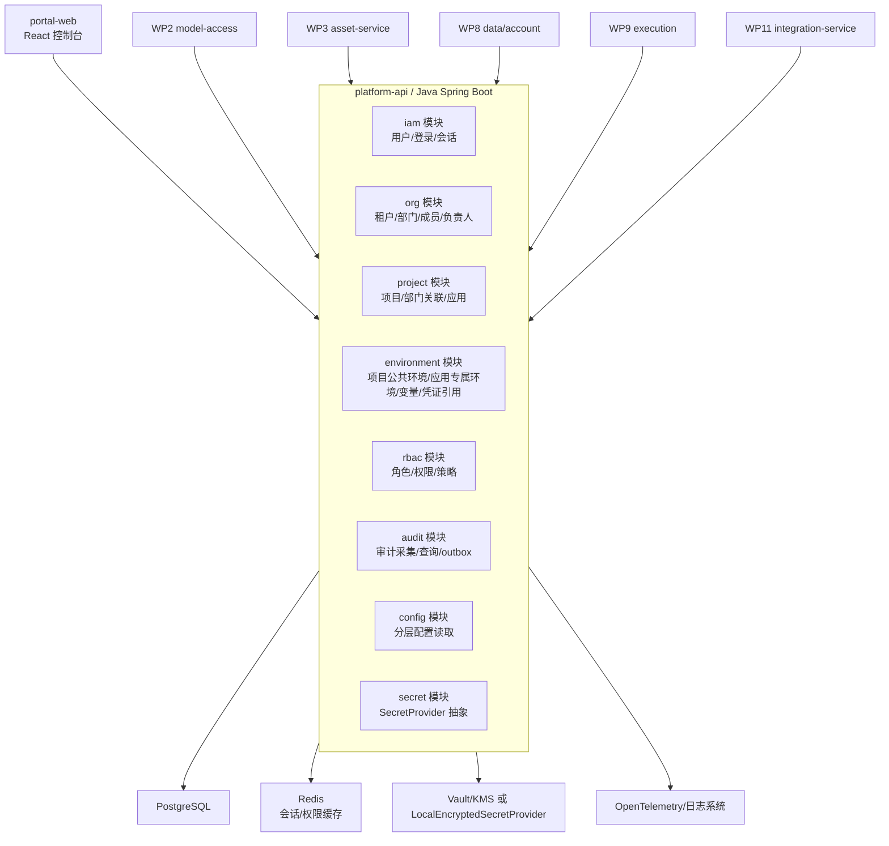
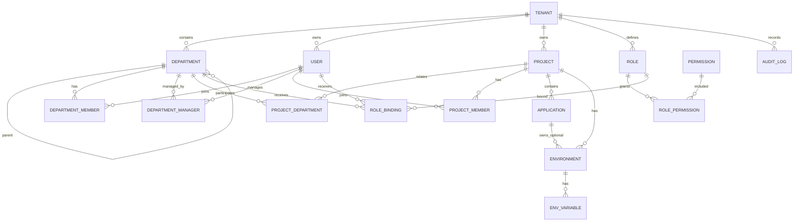
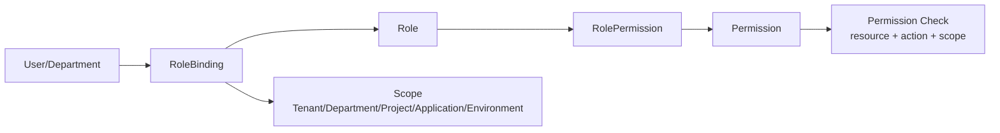
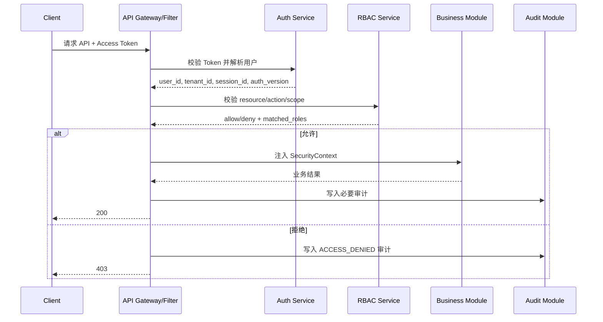
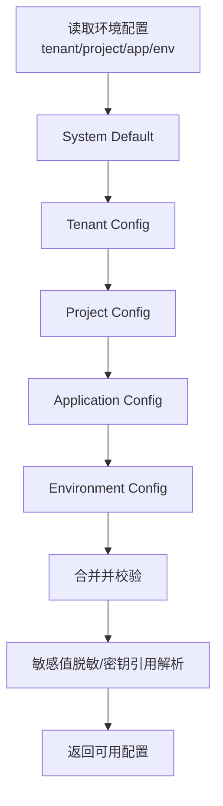
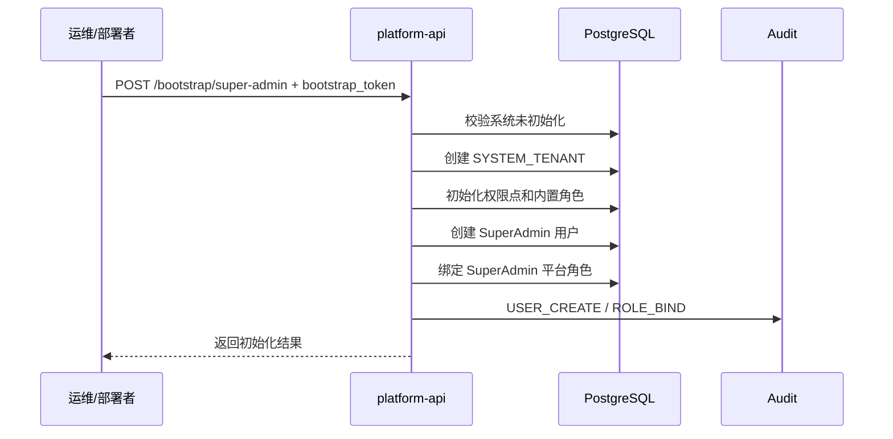
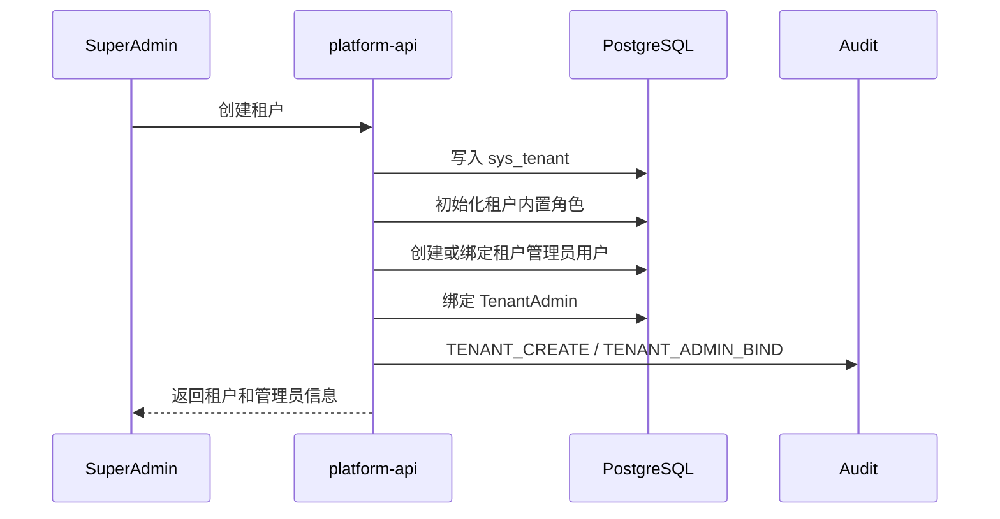
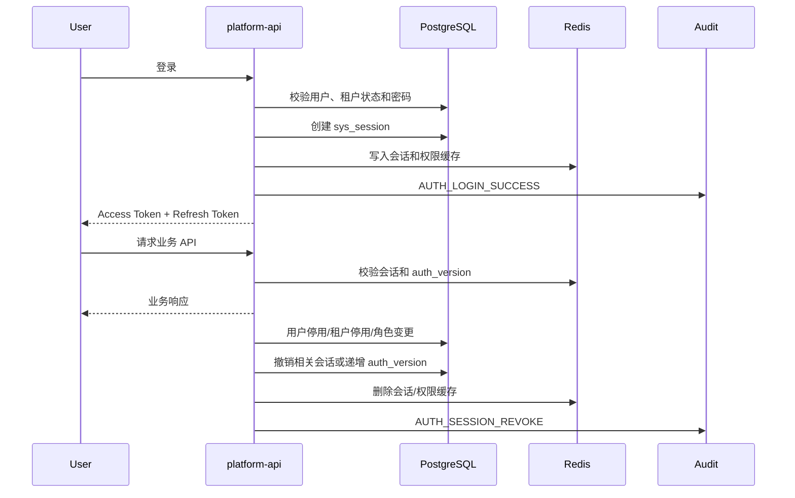
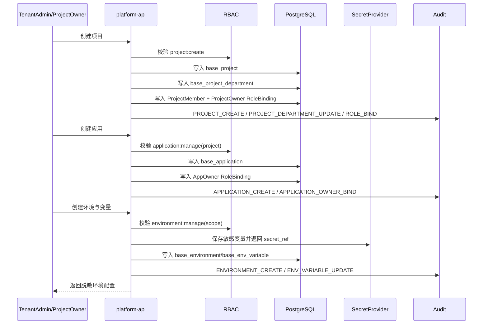
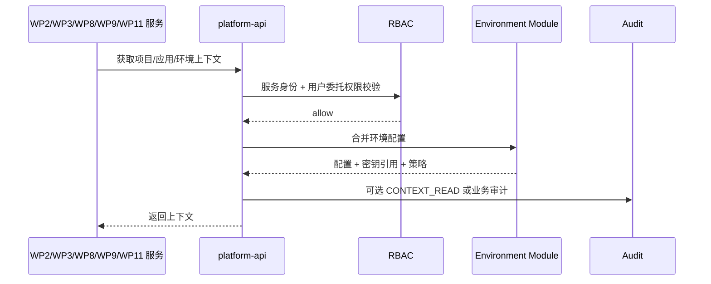

# WP1 平台基础底座 - 架构设计最终版

> 历史归档说明：本文是 2026-05-17 单平台决策前后的过渡版，仍保留大量早期多租户和未来拆分规划内容，不再作为当前实现依据。当前实现以 `doc/mvp/final/engineering/当前实现基线.md`、`doc/mvp/final/WP1-单平台P0交付版-PRD与架构补充.md`、代码、迁移脚本和自动化测试为准。

| 项目 | 内容 |
|---|---|
| 工作包 | WP1 平台基础底座 |
| 范围 | 单平台、多部门、多项目、多应用、用户角色、环境配置、操作审计 |
| 设计状态 | 最终版，可用于接口评审、数据库设计、研发拆任务和测试用例设计 |
| 依赖 | 无 |
| 被依赖 | WP2 模型接入层、WP3 测试资产模型、WP4 输入连接器、WP8 测试数据与账号池、WP9 执行编排与任务调度、WP11 企业协作连接器 |
| 技术背景 | 前端 React；服务端 Java + Python 混合架构；Java 承载平台核心域、权限、审计、配置和对外 API |
| 对齐文档 | `doc/AI_Agent自动化测试平台设计方案.md`、`doc/mvp/WP1-平台基础底座-PRD.md` |

## 1. 架构目标与设计原则

WP1 是平台所有后续能力的控制面底座，目标不是只完成登录和菜单，而是建立企业级自动化测试平台可长期演进的组织、权限、环境和审计基础。

本最终版收敛项目审核和测试评估中的 P0/P1 问题，冻结以下研发口径：

> 口径修订：根据 2026-05-17 产品决策，WP1 取消多租户体系，不再建设租户管理、租户管理员和跨租户隔离能力。当前以 `doc/mvp/final/engineering/WP1-单平台化调整说明.md`、数据库迁移脚本和代码实现为准。

1. 预置角色编码冻结为 `SuperAdmin`、`PlatformAdmin`、`DepartmentManager`、`ProjectOwner`、`AppOwner`、`Tester`、`Developer`、`Auditor`。
2. 项目与部门采用多对多关联表；部门负责人采用关联表；项目负责人和应用负责人通过成员关系或角色绑定表达，不在项目/应用主表保存单负责人字段。
3. 环境同时支持项目公共环境和应用专属环境，并在模型、API、权限和唯一性规则中显式区分。
4. 普通变量可明文存储；敏感变量不得明文入库，必须通过 `SecretProvider` 保存密文或密钥引用，响应、审计、日志、导出均脱敏。
5. P0 API 契约、P0 审计事件、初始化/登录/会话/停用失效流程作为 WP1 研发和测试门禁。
6. 后续 WP2/WP3/WP8/WP9/WP11 不直接读写 WP1 表，只通过 WP1 API 获取上下文、配置和审计能力。

### 1.1 架构目标

1. 支持单平台、多部门、多项目、多应用的基础空间模型。
2. 支持企业用户、角色、权限、成员关系和项目空间隔离。
3. 支持项目公共环境、应用专属环境、普通变量、敏感变量、凭证引用、模型策略入口和执行资源入口的统一配置。
4. 支持平台关键操作审计，为资产变更、模型调用、执行触发、缺陷同步和门禁放行提供统一审计能力。
5. 为 WP2/WP3/WP8/WP9/WP11 提供稳定的租户上下文、权限校验、配置读取和审计写入接口。
6. MVP 阶段允许单集群部署，但数据模型和接口必须保留企业化扩展能力。

### 1.2 设计原则

| 原则 | 说明 |
|---|---|
| 租户优先 | 所有业务主表必须包含 `tenant_id`，跨租户数据默认不可见、不可关联、不可统计。 |
| 项目空间隔离 | 需求、用例、执行、报告、环境、模型策略等后续资产均以项目为主要工作空间。 |
| 应用承载被测系统 | 项目下可包含多个被测应用，应用是环境、模型策略、账号池和执行配置的重要作用域。 |
| 权限前置 | API 层统一解析用户身份、租户、部门、项目和角色，不把权限判断分散到业务代码深处。 |
| 配置分层 | 支持租户、项目、应用、环境多级配置，读取时按明确优先级合并，写入时保留来源层级。 |
| 审计不可绕过 | 权限变更、环境配置、密钥引用、项目成员、关键开关必须记录审计日志。 |
| 敏感值不落明文 | Token、账号密码、数据库密码、API Key、Cookie 等敏感值不得明文入库、回显、审计或导出。 |
| 软删除与可恢复 | 基础组织对象优先软删除，避免历史资产、执行结果和审计记录失去归属。 |

## 2. WP1 在整体平台中的边界

### 2.1 WP1 包含

| 模块 | MVP 范围 |
|---|---|
| 租户管理 | 租户创建、启停、基础配额字段、租户管理员绑定。基础配额仅保存字段，不实现计费或商业化能力。 |
| 部门管理 | 部门树、部门成员、部门负责人、用户主部门和兼任部门。 |
| 用户与身份 | 本地用户模型、企业 SSO 映射预留、登录会话、用户状态、停用失效。 |
| 项目管理 | 项目创建、关联部门、项目成员、项目角色、项目负责人角色、项目状态。 |
| 应用管理 | 项目下被测应用登记、应用类型、代码仓库/服务标识、敏感级别、应用负责人角色。 |
| 环境管理 | 项目公共环境、应用专属环境、访问地址、普通变量、敏感变量、凭证引用、健康检查配置字段。 |
| RBAC | 平台级、租户级、部门级、项目级、应用级、环境级角色作用域；菜单权限、资源权限、操作权限。 |
| 审计日志 | 操作审计、配置变更审计、权限变更审计、登录审计、后续业务审计接入点。 |
| 基础控制台 | 支撑以上对象的管理页面和列表查询。 |

### 2.2 WP1 不包含

| 不包含项 | 归属工作包 | WP1 需要提供的接口 |
|---|---|---|
| 模型厂商、Prompt、模型调用日志 | WP2 | 模型策略作用域、是否允许公有云模型、敏感级别、审计写入。 |
| 需求、接口、页面、用例、脚本、执行结果 | WP3 | 项目、应用、环境、用户、权限上下文。 |
| 文档、需求平台、禅道、飞书、钉钉连接器 | WP4/WP11 | 第三方凭证引用、权限映射基础、审计写入。 |
| 测试数据集、账号池、数据清理任务 | WP8 | 应用环境、部门/项目隔离、凭证引用、审计写入。 |
| 执行调度、Worker 资源池、CI/CD 触发 | WP9 | 项目/环境权限、环境配置读取、资源池挂载字段。 |

WP1 只维护 `allow_public_model`、`sensitivity_level`、执行开关、资源池标识等策略字段，不实现模型路由、执行调度、账号租借或连接器业务逻辑。

## 3. 服务/模块划分

MVP 建议先由 `platform-api` 承载 WP1 能力，内部按领域模块拆包。后续当租户、审计或权限压力上升时，再拆出独立服务。



### 3.1 模块职责

| 模块 | 职责 | 对外能力 |
|---|---|---|
| iam | 用户、登录、会话、SSO 映射预留、Token 校验、停用失效 | 当前用户、用户列表、登录登出、会话续期、会话撤销。 |
| org | 租户、部门树、部门成员、部门负责人 | 租户上下文、部门树、用户组织关系。 |
| project | 项目、项目部门关联、项目成员、项目角色、应用 | 项目空间、应用登记、成员授权。 |
| environment | 项目公共环境、应用专属环境、环境变量、服务地址、凭证引用、健康检查配置 | 环境详情、变量解析、凭证引用读取。 |
| rbac | 角色、权限点、角色绑定、权限计算 | API 鉴权、菜单权限、按钮权限、资源权限。 |
| audit | 审计事件采集、审计查询、审计归档预留、审计 outbox | 写审计、查审计、导出审计。 |
| config | 租户/项目/应用/环境级配置合并 | 分层配置读取、配置变更审计。 |
| secret | `SecretProvider` 抽象、敏感值保存、掩码、临时密钥迁移 | 创建密钥引用、覆盖密钥、返回脱敏摘要。 |

### 3.2 模块依赖与事务边界

1. `iam` 依赖 `rbac` 读取权限摘要，不反向写角色。
2. `org` 管理租户、部门和用户组织关系；项目归属不依赖部门单字段，而通过 `base_project_department` 关联。
3. `project` 创建项目时可在同一事务内写入项目、项目部门关联、项目成员和负责人角色绑定；审计写入采用同步尝试加 outbox 补偿。
4. `environment` 写入敏感变量时先调用 `secret` 获得 `secret_ref`，再保存变量元数据；若密钥保存失败，环境变量写入失败。
5. 权限拒绝审计由鉴权过滤器写入；业务成功审计由业务模块声明事件并在事务提交后写入。
6. 后续服务调用 WP1 时必须使用服务身份加用户委托上下文，禁止直接连接 WP1 数据库。

## 4. 核心领域模型与关系

### 4.1 核心实体

| 实体 | 说明 | 关键字段 |
|---|---|---|
| Tenant | 租户，企业或业务隔离单元 | `id`, `code`, `name`, `status`, `plan`, `quota_json` |
| Department | 租户内部门树 | `id`, `tenant_id`, `parent_id`, `name`, `path`, `status` |
| DepartmentManager | 部门负责人关联 | `tenant_id`, `dept_id`, `user_id`, `status` |
| User | 平台用户 | `id`, `tenant_id`, `username`, `display_name`, `email`, `mobile`, `status`, `auth_version` |
| DepartmentMember | 用户与部门关系 | `tenant_id`, `dept_id`, `user_id`, `is_primary`, `position`, `status` |
| Project | 测试工作空间 | `id`, `tenant_id`, `code`, `name`, `status`, `sensitivity_level`, `allow_public_model` |
| ProjectDepartment | 项目与部门关联 | `tenant_id`, `project_id`, `dept_id`, `relation_type`, `is_primary` |
| ProjectMember | 项目成员 | `tenant_id`, `project_id`, `user_id`, `member_type`, `status` |
| Application | 被测应用 | `id`, `tenant_id`, `project_id`, `code`, `name`, `app_type`, `sensitivity_level`, `allow_public_model` |
| Environment | 运行环境 | `id`, `tenant_id`, `project_id`, `app_id`, `scope_type`, `code`, `name`, `env_type` |
| EnvVariable | 环境变量 | `env_id`, `key`, `value_kind`, `plain_value`, `secret_ref`, `masked_value` |
| Role | 角色定义 | `id`, `tenant_id`, `scope`, `code`, `name`, `is_system` |
| Permission | 权限点 | `id`, `code`, `resource_type`, `action`, `description` |
| RolePermission | 角色权限绑定 | `role_id`, `permission_id` |
| RoleBinding | 用户/部门与角色绑定 | `tenant_id`, `subject_type`, `subject_id`, `role_id`, `scope_type`, `scope_id` |
| AuditLog | 审计日志 | `tenant_id`, `actor_user_id`, `action`, `resource_type`, `resource_id`, `diff_json` |

项目负责人通过以下任一方式表达：

1. `ProjectMember.member_type=OWNER`，同时绑定 `ProjectOwner` 到 `scope_type=PROJECT, scope_id=project_id`。
2. 页面展示负责人时以项目成员中拥有 `ProjectOwner` 角色的启用用户为准。

应用负责人通过以下任一方式表达：

1. 项目成员绑定 `AppOwner` 到 `scope_type=APPLICATION, scope_id=app_id`。
2. 页面展示负责人时以拥有该应用 `AppOwner` 角色的启用用户为准。

### 4.2 关系图



## 5. 层级与隔离策略

### 5.1 层级模型

```text
Tenant
  ├── Department Tree
  └── Project
        ├── ProjectDepartment
        ├── Application
        │     └── Application Environment
        └── Project Environment
```

说明：

1. 租户是最高隔离边界，租户间数据、用户、配置、审计日志默认不可见。
2. 部门是组织归属和授权辅助边界，不直接替代项目空间。
3. 项目是测试资产、执行计划、模型策略和协作流程的主要工作空间，可关联多个部门。
4. 应用是被测系统抽象，一个项目可以包含多个前端、后端服务或后台系统。
5. 环境分为项目公共环境和应用专属环境，两者都必须归属于项目。

### 5.2 数据隔离策略

| 层级 | 隔离要求 | MVP 实现 |
|---|---|---|
| 租户 | 强隔离，默认不可跨租户查询和关联 | 所有业务表强制 `tenant_id`；API 从认证上下文注入；数据库索引包含 `tenant_id`。 |
| 部门 | 组织视图隔离和授权继承 | 部门树 `path` 支持快速查询；角色可绑定到部门范围。 |
| 项目 | 资产、执行、报告、环境主要隔离边界 | 所有项目内对象包含 `project_id`；项目成员或租户管理员才可访问。 |
| 应用 | 被测系统、模型策略、应用环境配置隔离 | 应用包含敏感级别和公有云模型开关；后续 WP2/WP8 继承使用。 |
| 环境 | 测试执行和凭证隔离 | 环境变量按环境保存；敏感值只保存密钥引用；生产环境默认只读或禁用执行。 |

平台级操作的审计 `tenant_id` 使用系统租户常量 `SYSTEM_TENANT`，同时 `scope_type=PLATFORM`，避免空租户造成查询和索引口径不一致。

### 5.3 配置继承优先级

读取配置时按以下优先级从高到低覆盖：

```text
Environment > Application > Project > Tenant > System Default
```

适用配置包括：

- 是否允许使用公有云模型。
- 数据敏感级别。
- 默认执行资源池标识。
- 默认通知渠道。
- 环境变量和服务地址。
- 审计保留策略字段。

`GET /configs/effective` 必须返回每个配置项的 `source_scope_type`、`source_scope_id`、`overridden` 和 `masked`，便于排障。删除高优先级配置后恢复低优先级默认值。

## 6. RBAC 权限模型设计

### 6.1 权限模型

WP1 采用 `RBAC + 资源作用域 + 少量策略条件`。MVP 不引入完整 ABAC 引擎，但为后续扩展保留 `condition_json` 字段。



### 6.2 预置角色编码冻结

| 角色编码 | 作用域 | 说明 | 默认数据范围 |
|---|---|---|---|
| `SuperAdmin` | 平台级 | 平台初始化、租户创建、平台级审计查看 | 全平台，含 `SYSTEM_TENANT` |
| `TenantAdmin` | 租户级 | 管理本租户部门、用户、角色、项目、应用、环境和租户审计 | 当前租户 |
| `DepartmentManager` | 部门级 | 查看和维护本部门基础信息、部门成员，查看部门关联项目 | 绑定部门及其子部门 |
| `ProjectOwner` | 项目级 | 管理项目基础信息、项目部门、项目成员、项目应用、项目环境 | 绑定项目 |
| `AppOwner` | 应用级 | 管理应用基础信息、应用专属环境、应用级配置 | 绑定应用 |
| `Tester` | 项目级 | 查看项目、应用、环境，使用授权环境，后续 WP3/WP9 扩展资产和执行权限 | 绑定项目 |
| `Developer` | 项目级 | 查看项目、应用、环境和后续失败证据，协作定位问题 | 绑定项目 |
| `Auditor` | 租户级/项目级/应用级 | 只读查看授权范围内审计日志，不能修改业务配置 | 绑定审计范围 |

内置角色不可删除；MVP 内置角色权限只读。租户自定义角色为 P1，可继承同样的 `scope_type/scope_id` 模型。

### 6.3 权限点命名

权限点采用稳定编码：

```text
{resource}:{action}
```

P0 权限点如下：

| 权限点 | 说明 |
|---|---|
| `tenant:read`、`tenant:manage` | 查看、管理租户基础信息和状态。 |
| `department:read`、`department:manage` | 查看、管理部门树、成员和负责人。 |
| `user:read`、`user:manage` | 查看、创建、编辑、启停、锁定用户。 |
| `project:read`、`project:create`、`project:manage` | 查看、创建、管理项目、项目部门和成员。 |
| `application:read`、`application:manage` | 查看、管理应用。 |
| `environment:read`、`environment:manage`、`environment:use` | 查看、管理和使用环境。 |
| `secret:reference`、`secret:write` | 引用密钥、写入或覆盖敏感值；均不代表读取明文。 |
| `audit:read`、`audit:export`、`audit:write_internal` | 查询、导出、内部写入审计。 |
| `role:read`、`role:manage`、`role:bind` | 查看角色、管理角色、绑定或解绑角色。 |
| `config:read`、`config:manage` | 读取有效配置、写入分层配置。 |

### 6.4 预置角色权限矩阵

| 资源/动作 | SuperAdmin | TenantAdmin | DepartmentManager | ProjectOwner | AppOwner | Tester | Developer | Auditor |
|---|---|---|---|---|---|---|---|---|
| 租户管理 | 全部 | 本租户查看/编辑基础信息 | 无 | 无 | 无 | 无 | 无 | 只读审计 |
| 部门管理 | 全部 | 本租户全部 | 本部门成员维护 | 只读关联部门 | 只读关联部门 | 只读 | 只读 | 只读审计 |
| 用户管理 | 全部 | 本租户全部 | 本部门用户查看 | 项目成员查看 | 应用成员查看 | 自身查看 | 自身查看 | 只读审计 |
| 角色授权 | 全部 | 本租户租户级/项目级 | 无 | 本项目项目级/应用级 | 本应用应用级 | 无 | 无 | 无 |
| 项目 | 全部 | 本租户全部 | 查看部门关联项目 | 本项目管理 | 只读所属项目 | 授权项目只读 | 授权项目只读 | 授权范围审计 |
| 应用 | 全部 | 本租户全部 | 查看部门关联项目下应用 | 本项目全部 | 本应用管理 | 授权项目只读 | 授权项目只读 | 授权范围审计 |
| 环境 | 全部 | 本租户全部 | 查看部门关联项目环境 | 本项目全部 | 本应用专属环境管理 | 查看/使用授权环境 | 查看环境 | 授权范围审计 |
| 审计 | 全部 | 本租户审计 | 本部门相关审计只读 | 本项目审计只读 | 本应用审计只读 | 无 | 无 | 授权范围只读/导出 |

授权约束：

1. 用户不能授予超过自身作用域和权限集合的角色。
2. `ProjectOwner` 不能授予 `TenantAdmin`。
3. `AppOwner` 只能在所属应用范围内绑定 `AppOwner`、`Tester`、`Developer`、`Auditor` 等低于或等于自身范围的角色。
4. `Auditor` 不能执行业务配置写操作。

### 6.5 鉴权流程



### 6.6 实现要点

1. `SecurityContext` 必须包含 `tenant_id`, `user_id`, `session_id`, `auth_version`, `scope`, `roles`, `permissions`。
2. 权限缓存可放 Redis，缓存 Key 包含用户、租户、项目、应用、环境和 `auth_version`。
3. 角色、权限、成员、用户状态或租户状态变更后递增 `auth_version` 或租户 `policy_version`，使缓存失效。
4. 跨项目访问必须显式校验，不允许只依赖前端菜单隐藏。
5. 环境密钥读取只返回密钥引用或脱敏值，不返回明文。

## 7. 审计日志设计

### 7.1 审计范围

| 类别 | 事件示例 |
|---|---|
| 登录审计 | 登录成功、登录失败、登出、Token 刷新、会话失效、账号锁定。 |
| 组织审计 | 租户启停、部门创建、部门移动、成员加入/移除、负责人变更。 |
| 权限审计 | 角色创建、角色授权、成员授权、权限回收。 |
| 项目审计 | 项目创建、项目状态变更、项目部门变更、项目成员变更。 |
| 应用审计 | 应用创建、负责人变更、敏感级别变更、公有云模型策略字段变更。 |
| 环境审计 | 项目公共环境创建、应用环境创建、URL 变更、变量变更、凭证引用变更、健康检查配置变更。 |
| 安全审计 | 越权访问、密钥引用失败、敏感配置读取失败、停用资源访问。 |
| 业务接入审计 | WP2/WP3/WP8/WP9/WP11 通过统一接口写入模型调用、资产变更、执行触发、缺陷同步等事件。 |

### 7.2 审计事件结构

| 字段 | 说明 |
|---|---|
| `id` | 审计事件 ID。 |
| `tenant_id` | 租户 ID；平台级操作使用 `SYSTEM_TENANT`。 |
| `trace_id` | 请求链路 ID，用于串联 API、模型、执行和连接器日志。 |
| `actor_type` | `USER`、`SERVICE`、`SYSTEM`。 |
| `actor_user_id` | 操作人。系统任务可为空并使用 `actor_type=SYSTEM`。 |
| `actor_service` | 服务身份，如 `wp3-asset-service`。 |
| `actor_ip` | 操作来源 IP。 |
| `user_agent` | 浏览器或客户端标识。 |
| `action` | 操作编码，如 `PROJECT_CREATE`。 |
| `resource_type` | 资源类型，如 `PROJECT`、`ENVIRONMENT`。 |
| `resource_id` | 资源 ID。 |
| `scope_type` | `PLATFORM`、`TENANT`、`DEPARTMENT`、`PROJECT`、`APPLICATION`、`ENVIRONMENT`。 |
| `scope_id` | 作用域 ID。 |
| `result` | `SUCCESS`、`FAILED`、`DENIED`。 |
| `before_json` | 变更前摘要，敏感字段脱敏。 |
| `after_json` | 变更后摘要，敏感字段脱敏。 |
| `diff_json` | 字段级差异，敏感字段只记录是否变化、掩码或密钥引用 ID。 |
| `reason` | 失败原因、拒绝原因或人工操作原因。 |
| `created_at` | 事件时间。 |

### 7.3 审计写入策略

1. 管理类 API 使用注解或拦截器声明审计事件，业务执行成功后写入。
2. 权限拒绝事件由鉴权过滤器写入，必须保证业务方法未执行。
3. 配置变更必须记录字段级 diff。
4. 密钥类字段只记录引用 ID、是否变更和脱敏摘要。
5. 审计写入失败不能影响主流程，但必须写入 `audit_outbox`，后台任务按 1 分钟、5 分钟、30 分钟、2 小时退避重试；连续失败超过 10 次标记 `DEAD` 并告警。
6. 审计查询默认按租户隔离，支持按项目、应用、环境、用户、操作类型和时间范围过滤。
7. 审计默认查询最近 7 天；超过 180 天范围需 `audit:export` 或管理员权限。

### 7.4 P0 审计事件清单

| 事件编码 | 触发点 | 资源类型 | 结果 | 脱敏要求 |
|---|---|---|---|---|
| `AUTH_LOGIN_SUCCESS` | 登录成功 | `USER` | `SUCCESS` | 不记录密码、Token。 |
| `AUTH_LOGIN_FAILED` | 登录失败 | `USER` | `FAILED` | 原因分类化，不泄露账号是否存在。 |
| `AUTH_LOGOUT` | 登出 | `SESSION` | `SUCCESS` | 不记录 Token 明文。 |
| `AUTH_TOKEN_REFRESH` | Token 刷新 | `SESSION` | `SUCCESS/FAILED` | 只记录 session_id。 |
| `AUTH_SESSION_REVOKE` | 用户停用、租户停用、登出导致会话撤销 | `SESSION` | `SUCCESS` | 记录撤销原因。 |
| `ACCESS_DENIED` | 无权限或越权访问 | 目标资源 | `DENIED` | 请求参数敏感字段脱敏。 |
| `TENANT_CREATE` | 创建租户 | `TENANT` | `SUCCESS/FAILED` | 联系方式按规则脱敏。 |
| `TENANT_UPDATE` | 编辑租户 | `TENANT` | `SUCCESS/FAILED` | diff 脱敏。 |
| `TENANT_ENABLE`、`TENANT_DISABLE` | 启停租户 | `TENANT` | `SUCCESS/FAILED` | 记录影响范围摘要。 |
| `TENANT_ADMIN_BIND`、`TENANT_ADMIN_UNBIND` | 指定或移除租户管理员 | `ROLE_BINDING` | `SUCCESS/FAILED` | 无敏感明文。 |
| `DEPARTMENT_CREATE`、`DEPARTMENT_UPDATE`、`DEPARTMENT_ENABLE`、`DEPARTMENT_DISABLE` | 部门维护 | `DEPARTMENT` | `SUCCESS/FAILED` | 无敏感明文。 |
| `DEPARTMENT_MEMBER_ADD`、`DEPARTMENT_MEMBER_REMOVE` | 部门成员变更 | `DEPARTMENT_MEMBER` | `SUCCESS/FAILED` | 无敏感明文。 |
| `DEPARTMENT_MANAGER_ADD`、`DEPARTMENT_MANAGER_REMOVE` | 部门负责人变更 | `DEPARTMENT_MANAGER` | `SUCCESS/FAILED` | 无敏感明文。 |
| `USER_CREATE`、`USER_INVITE`、`USER_UPDATE`、`USER_ENABLE`、`USER_DISABLE`、`USER_LOCK` | 用户维护 | `USER` | `SUCCESS/FAILED` | 手机号、邮箱脱敏。 |
| `ROLE_CREATE`、`ROLE_UPDATE`、`ROLE_PERMISSION_UPDATE` | 角色维护 | `ROLE` | `SUCCESS/FAILED` | 无敏感明文。 |
| `ROLE_BIND`、`ROLE_UNBIND` | 授权或回收 | `ROLE_BINDING` | `SUCCESS/FAILED` | 无敏感明文。 |
| `PROJECT_CREATE`、`PROJECT_UPDATE`、`PROJECT_ARCHIVE`、`PROJECT_DISABLE`、`PROJECT_ENABLE` | 项目维护 | `PROJECT` | `SUCCESS/FAILED` | 无敏感明文。 |
| `PROJECT_DEPARTMENT_UPDATE` | 项目关联部门变更 | `PROJECT_DEPARTMENT` | `SUCCESS/FAILED` | 无敏感明文。 |
| `PROJECT_MEMBER_ADD`、`PROJECT_MEMBER_REMOVE` | 项目成员变更 | `PROJECT_MEMBER` | `SUCCESS/FAILED` | 无敏感明文。 |
| `APPLICATION_CREATE`、`APPLICATION_UPDATE`、`APPLICATION_DISABLE`、`APPLICATION_ENABLE` | 应用维护 | `APPLICATION` | `SUCCESS/FAILED` | 仓库 URL 可按内部规则脱敏。 |
| `APPLICATION_OWNER_BIND`、`APPLICATION_OWNER_UNBIND` | 应用负责人变更 | `ROLE_BINDING` | `SUCCESS/FAILED` | 无敏感明文。 |
| `ENVIRONMENT_CREATE`、`ENVIRONMENT_UPDATE`、`ENVIRONMENT_ENABLE`、`ENVIRONMENT_DISABLE` | 环境维护 | `ENVIRONMENT` | `SUCCESS/FAILED` | URL 正常记录，敏感参数脱敏。 |
| `ENV_VARIABLE_UPDATE` | 环境变量批量更新 | `ENV_VARIABLE` | `SUCCESS/FAILED` | 敏感值只记录 `changed=true`、`secret_ref`、`masked_value`。 |
| `ENV_AUTH_CONFIG_UPDATE` | 鉴权配置变更 | `ENVIRONMENT` | `SUCCESS/FAILED` | Token、Cookie、密码全部脱敏。 |
| `CONFIG_UPDATE` | 分层配置写入 | `CONFIG` | `SUCCESS/FAILED` | 敏感配置脱敏。 |
| `AUDIT_QUERY` | 查询审计详情或大范围审计 | `AUDIT_LOG` | `SUCCESS/FAILED` | 查询条件脱敏。 |
| `AUDIT_EXPORT`、`USER_EXPORT`、`CONFIG_EXPORT` | 导出 | 对应资源 | `SUCCESS/FAILED` | 导出文件不得含敏感明文。 |
| `INTERNAL_AUDIT_WRITE` | 后续 WP 写入审计 | `AUDIT_LOG` | `SUCCESS/FAILED` | 按事件 payload 脱敏。 |

## 8. 配置与环境管理设计

### 8.1 环境模型

环境分为两类：

| 环境作用域 | 字段表达 | 说明 | 权限边界 |
|---|---|---|---|
| 项目公共环境 | `scope_type=PROJECT`, `project_id` 必填, `app_id=null` | 适用于项目级公共服务、统一网关、共享账号或跨应用链路基础配置。 | 需要 `environment:manage` on Project；读取需要项目成员权限。 |
| 应用专属环境 | `scope_type=APPLICATION`, `project_id` 必填, `app_id` 必填 | 适用于单个被测应用的 URL、变量、鉴权和执行开关。 | 需要 `environment:manage` on Application 或 Project；读取需要应用或项目授权。 |

环境类型：

| 环境类型 | 说明 | MVP 策略 |
|---|---|---|
| `DEV` | 开发环境 | 可执行，可读写。 |
| `TEST` | 测试环境 | 默认执行环境。 |
| `STAGING` | 预发环境 | 可执行，但需要项目管理员配置。 |
| `PROD` | 生产环境 | MVP 默认禁用自动化执行，仅允许只读配置和健康检查配置字段。 |
| `SANDBOX` | 沙箱环境 | 可执行，可读写。 |
| `CUSTOM` | 自定义环境 | 由项目管理员维护。 |

唯一性规则：

1. 项目公共环境：`tenant_id + project_id + scope_type=PROJECT + code` 唯一。
2. 应用专属环境：`tenant_id + app_id + scope_type=APPLICATION + code` 唯一。
3. 同一项目中允许项目公共环境和应用专属环境使用相同 `code`，但 API 返回必须包含 `scope_type` 区分。

### 8.2 环境配置内容

| 配置 | 示例 | 安全要求 |
|---|---|---|
| 基础 Web 地址 | `https://test.example.com` | 普通字段。 |
| API 网关地址 | `https://api-test.example.com` | 普通字段。 |
| 数据库连接引用 | `secret://local/db/order-test` | 只保存密钥引用。 |
| 登录账号引用 | `secret://local/account/admin-test` | 只保存密钥引用，WP8 账号池后续接管。 |
| 普通变量 | `BASE_URL`, `API_BASE_URL`, `TENANT_CODE` | 可明文保存和返回。 |
| 敏感变量 | `ADMIN_PASSWORD`, `API_TOKEN`, `COOKIE_SECRET` | 通过 `SecretProvider` 保存，不明文入库和回显。 |
| 请求头模板 | `X-Env`, `X-Tenant`, `Authorization` | 敏感值使用密钥引用。 |
| 健康检查配置 | URL、方法、期望状态码、超时 | WP1 只保存配置和状态字段，实际探测可 P1 或 WP9 接管。 |
| 执行开关 | 是否允许 API/UI/E2E 执行 | `PROD` 默认关闭。 |

### 8.3 环境变量与 SecretProvider

`EnvVariable.value_kind` 冻结为：

| 类型 | 存储字段 | 响应策略 | 审计策略 |
|---|---|---|---|
| `PLAIN` | `plain_value` | 可返回明文，按调用方权限展示。 | 可记录变更前后摘要。 |
| `SECRET` | `secret_ref`, `masked_value`, `secret_provider` | 只返回掩码、引用 ID、更新时间，不返回明文。 | 只记录是否变化、掩码和引用 ID。 |
| `SECRET_REF` | `secret_ref`, `secret_provider` | 只返回引用 ID 和掩码。 | 只记录引用变化。 |

`SecretProvider` 接口：

```text
createSecret(tenantId, scope, key, plaintext) -> secretRef, maskedValue, version
updateSecret(secretRef, plaintext) -> secretRef, maskedValue, version
deleteSecret(secretRef) -> deleted
describeSecret(secretRef) -> provider, maskedValue, version, updatedAt
```

MVP 临时实现：

1. 使用 `LocalEncryptedSecretProvider`，在数据库表 `secret_store` 保存密文，不保存明文。
2. 加密算法使用 `AES-256-GCM`；每条密钥独立随机 IV；认证标签随密文保存。
3. 主密钥从部署环境变量或文件密钥注入，不入库，不写日志。生产部署必须由运维密钥系统托管。
4. `secret_ref` 格式为 `secret://local/{tenant_id}/{scope_type}/{scope_id}/{secret_id}`。
5. 密钥轮换通过新增 `master_key_version` 支持后台重加密；MVP 至少保留版本字段。
6. 未来迁移 Vault/KMS 时实现 `VaultSecretProvider`，保持 `secret_ref` 抽象不变；迁移任务逐条读取本地密文、写入 Vault/KMS、更新 `secret_ref` 和 `provider`，历史审计不改写。

### 8.4 环境变量解析



返回给不同调用方的内容不同：

| 调用方 | 返回内容 |
|---|---|
| 前端控制台 | 明文非敏感配置 + 敏感字段脱敏值 + 密钥引用元信息。 |
| 执行服务 | 非敏感配置 + 密钥引用；是否解密由 Worker 所在安全域和后续 WP9 决定。 |
| 后续 Agent | 非敏感配置 + 脱敏摘要，默认不提供密钥引用，除非明确具备服务权限。 |

## 9. P0 API 契约草案

API 前缀为 `/api/v1`。所有接口默认从 Token 中获取 `tenant_id`，禁止客户端传入任意租户 ID 覆盖认证上下文。系统管理员操作租户时使用平台级权限。

### 9.1 通用契约

统一响应：

```json
{
  "code": "OK",
  "message": "success",
  "trace_id": "trc_202605160001",
  "data": {}
}
```

分页响应：

```json
{
  "code": "OK",
  "message": "success",
  "trace_id": "trc_202605160001",
  "data": {
    "items": [],
    "page": 1,
    "page_size": 20,
    "total": 0
  }
}
```

列表参数统一为 `page`、`page_size`、`sort`、`order`、`keyword` 和资源筛选字段。`page_size` 默认 20，最大 100。创建类接口支持可选请求头 `Idempotency-Key`；未提供时按唯一索引防重复。

统一错误码：

| 错误码 | HTTP | 说明 |
|---|---:|---|
| `OK` | 200/201 | 成功。 |
| `BAD_REQUEST` | 400 | 请求结构非法。 |
| `VALIDATION_ERROR` | 400 | 必填、格式、长度、枚举非法。 |
| `UNAUTHORIZED` | 401 | 未登录、Token 无效或会话过期。 |
| `FORBIDDEN` | 403 | 权限不足或越权访问，写入 `ACCESS_DENIED`。 |
| `NOT_FOUND` | 404 | 资源不存在或不可见；跨租户资源默认按安全策略可返回 404。 |
| `CONFLICT` | 409 | 唯一性冲突、重复绑定、幂等冲突。 |
| `INVALID_STATE` | 409 | 状态不允许当前操作。 |
| `SECRET_REQUIRED` | 400 | 敏感变量缺少密钥值或引用。 |
| `SECRET_PROVIDER_ERROR` | 502 | 密钥服务不可用或加密失败。 |
| `AUDIT_WRITE_PENDING` | 202 | 内部审计写入进入补偿队列，仅内部 API 使用。 |
| `INTERNAL_ERROR` | 500 | 系统异常。 |

### 9.2 初始化、认证与当前用户

| 方法 | 路径 | 权限点 | 审计事件 | 关键请求字段 | 关键响应字段 | 错误码 |
|---|---|---|---|---|---|---|
| `POST` | `/bootstrap/super-admin` | 初始化令牌 | `USER_CREATE` | `bootstrap_token`, `username`, `password`, `display_name`, `email` | `user_id`, `role=SuperAdmin` | `VALIDATION_ERROR`, `CONFLICT`, `FORBIDDEN` |
| `POST` | `/auth/login` | 无 | `AUTH_LOGIN_SUCCESS/FAILED` | `tenant_code` 可选, `username`, `password` | `access_token`, `refresh_token`, `expires_in`, `user` | `UNAUTHORIZED`, `INVALID_STATE` |
| `POST` | `/auth/logout` | 登录用户 | `AUTH_LOGOUT` | `refresh_token` 可选 | `revoked=true` | `UNAUTHORIZED` |
| `POST` | `/auth/refresh` | 登录用户 | `AUTH_TOKEN_REFRESH` | `refresh_token` | `access_token`, `expires_in` | `UNAUTHORIZED`, `INVALID_STATE` |
| `GET` | `/auth/me` | 登录用户 | 无 | 无 | `user`, `tenant`, `roles`, `permissions`, `menus`, `auth_version` | `UNAUTHORIZED` |
| `GET` | `/sessions` | `user:manage` 或本人 | `AUDIT_QUERY` | `user_id` 可选 | `items[].session_id`, `expires_at`, `revoked_at` | `FORBIDDEN` |
| `DELETE` | `/sessions/{sessionId}` | `user:manage` 或本人 | `AUTH_SESSION_REVOKE` | 无 | `revoked=true` | `FORBIDDEN`, `NOT_FOUND` |

### 9.3 租户与部门

| 方法 | 路径 | 权限点 | 审计事件 | 关键请求字段 | 关键响应字段 | 错误码 |
|---|---|---|---|---|---|---|
| `POST` | `/admin/tenants` | `tenant:manage` on Platform | `TENANT_CREATE`, `TENANT_ADMIN_BIND` | `code`, `name`, `contact`, `admin_user` | `tenant_id`, `admin_user_id`, `status` | `CONFLICT`, `VALIDATION_ERROR` |
| `GET` | `/tenants/current` | 登录用户 | 无 | 无 | `id`, `code`, `name`, `status`, `settings` | `UNAUTHORIZED` |
| `PATCH` | `/tenants/current` | `tenant:manage` | `TENANT_UPDATE` | `name`, `contact`, `description`, `settings` | 更新后租户 | `FORBIDDEN`, `INVALID_STATE` |
| `PATCH` | `/admin/tenants/{tenantId}/status` | `tenant:manage` on Platform | `TENANT_ENABLE/TENANT_DISABLE` | `status`, `reason` | `status`, `revoked_sessions` | `INVALID_STATE` |
| `GET` | `/departments/tree` | `department:read` | 无 | `status` 可选 | 部门树、负责人列表 | `FORBIDDEN` |
| `POST` | `/departments` | `department:manage` | `DEPARTMENT_CREATE` | `parent_id`, `code`, `name`, `sort_order` | `dept_id`, `path`, `status` | `CONFLICT`, `VALIDATION_ERROR` |
| `PATCH` | `/departments/{deptId}` | `department:manage` | `DEPARTMENT_UPDATE` | `name`, `code`, `parent_id`, `sort_order` | 更新后部门 | `INVALID_STATE`, `CONFLICT` |
| `PATCH` | `/departments/{deptId}/status` | `department:manage` | `DEPARTMENT_ENABLE/DEPARTMENT_DISABLE` | `status`, `reason` | `status` | `INVALID_STATE` |
| `PUT` | `/departments/{deptId}/managers` | `department:manage` | `DEPARTMENT_MANAGER_ADD/REMOVE` | `user_ids[]` 覆盖语义 | `managers[]` | `VALIDATION_ERROR`, `FORBIDDEN` |
| `POST` | `/departments/{deptId}/members` | `department:manage` | `DEPARTMENT_MEMBER_ADD` | `user_id`, `is_primary`, `position` | `member_id` | `CONFLICT`, `INVALID_STATE` |
| `DELETE` | `/departments/{deptId}/members/{userId}` | `department:manage` | `DEPARTMENT_MEMBER_REMOVE` | `replacement_primary_dept_id` 可选 | `removed=true` | `INVALID_STATE` |

### 9.4 用户与角色

| 方法 | 路径 | 权限点 | 审计事件 | 关键请求字段 | 关键响应字段 | 错误码 |
|---|---|---|---|---|---|---|
| `GET` | `/users` | `user:read` | 无 | `dept_id`, `status`, `keyword`, 分页 | 用户分页、部门、角色摘要 | `FORBIDDEN` |
| `POST` | `/users` | `user:manage` | `USER_CREATE/USER_INVITE` | `username`, `display_name`, `email`, `mobile`, `dept_ids`, `primary_dept_id`, `invite` | `user_id`, `status` | `CONFLICT`, `VALIDATION_ERROR` |
| `PATCH` | `/users/{userId}` | `user:manage` | `USER_UPDATE` | `display_name`, `email`, `mobile`, `dept_ids`, `primary_dept_id` | 更新后用户 | `FORBIDDEN`, `INVALID_STATE` |
| `PATCH` | `/users/{userId}/status` | `user:manage` | `USER_ENABLE/USER_DISABLE/USER_LOCK` | `status`, `reason` | `status`, `revoked_sessions` | `INVALID_STATE` |
| `GET` | `/users/{userId}/permissions` | `user:read` | 无 | 无 | `roles`, `role_bindings`, `effective_permissions` | `FORBIDDEN` |
| `GET` | `/roles` | `role:read` | 无 | `scope`, `builtin` | 角色列表和权限摘要 | `FORBIDDEN` |
| `GET` | `/roles/{roleId}/permissions` | `role:read` | 无 | 无 | `permissions[]` | `FORBIDDEN` |
| `POST` | `/roles` | `role:manage` | `ROLE_CREATE` | `code`, `name`, `scope`, `permission_ids` | `role_id` | `CONFLICT` |
| `PUT` | `/roles/{roleId}/permissions` | `role:manage` | `ROLE_PERMISSION_UPDATE` | `permission_ids[]` 覆盖语义 | `permissions[]` | `FORBIDDEN`, `INVALID_STATE` |
| `POST` | `/role-bindings` | `role:bind` | `ROLE_BIND` | `subject_type`, `subject_id`, `role_code/role_id`, `scope_type`, `scope_id` | `binding_id`, `effective=true` | `FORBIDDEN`, `CONFLICT` |
| `DELETE` | `/role-bindings/{bindingId}` | `role:bind` | `ROLE_UNBIND` | `reason` 可选 | `removed=true` | `FORBIDDEN`, `NOT_FOUND` |

### 9.5 项目、应用、环境

| 方法 | 路径 | 权限点 | 审计事件 | 关键请求字段 | 关键响应字段 | 错误码 |
|---|---|---|---|---|---|---|
| `GET` | `/projects` | `project:read` | 无 | `status`, `dept_id`, `owner_user_id`, `keyword`, 分页 | 项目分页、负责人、关联部门 | `FORBIDDEN` |
| `POST` | `/projects` | `project:create` | `PROJECT_CREATE`, `PROJECT_DEPARTMENT_UPDATE`, `ROLE_BIND` | `code`, `name`, `dept_ids`, `owner_user_ids`, `description`, `sensitivity_level`, `allow_public_model` | `project_id`, `owners`, `departments` | `CONFLICT`, `VALIDATION_ERROR` |
| `GET` | `/projects/{projectId}` | `project:read` | 无 | 无 | 项目详情、成员、应用数、环境数 | `FORBIDDEN`, `NOT_FOUND` |
| `PATCH` | `/projects/{projectId}` | `project:manage` | `PROJECT_UPDATE` | `name`, `description`, `sensitivity_level`, `allow_public_model` | 更新后项目 | `INVALID_STATE` |
| `PUT` | `/projects/{projectId}/departments` | `project:manage` | `PROJECT_DEPARTMENT_UPDATE` | `dept_ids[]`, `primary_dept_id` | `departments[]` | `VALIDATION_ERROR` |
| `PATCH` | `/projects/{projectId}/status` | `project:manage` | `PROJECT_ARCHIVE/PROJECT_DISABLE/PROJECT_ENABLE` | `status`, `reason` | `status` | `INVALID_STATE` |
| `POST` | `/projects/{projectId}/members` | `project:manage` | `PROJECT_MEMBER_ADD`, `ROLE_BIND` | `user_id`, `role_codes[]`, `member_type` | `member_id`, `role_bindings[]` | `FORBIDDEN`, `CONFLICT` |
| `DELETE` | `/projects/{projectId}/members/{userId}` | `project:manage` | `PROJECT_MEMBER_REMOVE`, `ROLE_UNBIND` | `reason` 可选 | `removed=true` | `INVALID_STATE` |
| `GET` | `/projects/{projectId}/applications` | `application:read` | 无 | `status`, `app_type`, `keyword` | 应用列表、负责人 | `FORBIDDEN` |
| `POST` | `/projects/{projectId}/applications` | `application:manage` | `APPLICATION_CREATE`, `APPLICATION_OWNER_BIND` | `code`, `name`, `app_type`, `owner_user_ids`, `default_web_url`, `default_api_base_url`, `repo_url`, `sensitivity_level`, `allow_public_model` | `app_id`, `owners` | `CONFLICT`, `VALIDATION_ERROR` |
| `PATCH` | `/applications/{appId}` | `application:manage` | `APPLICATION_UPDATE` | `name`, `app_type`, `owner_user_ids`, `default_web_url`, `default_api_base_url`, `repo_url`, `sensitivity_level`, `allow_public_model` | 更新后应用 | `FORBIDDEN`, `INVALID_STATE` |
| `PATCH` | `/applications/{appId}/status` | `application:manage` | `APPLICATION_ENABLE/APPLICATION_DISABLE` | `status`, `reason` | `status` | `INVALID_STATE` |
| `GET` | `/projects/{projectId}/environments` | `environment:read` | 无 | `scope_type`, `app_id`, `env_type`, `status` | 项目公共和应用专属环境列表 | `FORBIDDEN` |
| `POST` | `/projects/{projectId}/environments` | `environment:manage` on Project | `ENVIRONMENT_CREATE` | `scope_type=PROJECT`, `code`, `name`, `env_type`, `web_url`, `api_base_url`, 执行开关 | `env_id`, `scope_type` | `CONFLICT`, `VALIDATION_ERROR` |
| `GET` | `/applications/{appId}/environments` | `environment:read` | 无 | `env_type`, `status` | 应用专属环境列表 | `FORBIDDEN` |
| `POST` | `/applications/{appId}/environments` | `environment:manage` on Application | `ENVIRONMENT_CREATE` | `scope_type=APPLICATION`, `code`, `name`, `env_type`, `web_url`, `api_base_url`, 执行开关 | `env_id`, `scope_type`, `app_id` | `CONFLICT`, `VALIDATION_ERROR` |
| `GET` | `/environments/{envId}` | `environment:read` | 无 | `include_variables=true/false` | 环境详情、变量脱敏列表 | `FORBIDDEN`, `NOT_FOUND` |
| `PATCH` | `/environments/{envId}` | `environment:manage` | `ENVIRONMENT_UPDATE` | `name`, `env_type`, `web_url`, `api_base_url`, 执行开关, `health_check` | 更新后环境 | `INVALID_STATE` |
| `PATCH` | `/environments/{envId}/status` | `environment:manage` | `ENVIRONMENT_ENABLE/ENVIRONMENT_DISABLE` | `status`, `reason` | `status` | `INVALID_STATE` |
| `PUT` | `/environments/{envId}/variables` | `environment:manage`, `secret:write` for secret | `ENV_VARIABLE_UPDATE` | `mode=REPLACE/MERGE`, `variables[]` | 变量列表，敏感值脱敏 | `SECRET_REQUIRED`, `SECRET_PROVIDER_ERROR` |

变量批量更新语义：

1. `REPLACE`：请求中未出现的变量视为删除。
2. `MERGE`：只新增或覆盖请求中的变量；`deleted=true` 表示删除指定变量。
3. 任一变量校验或密钥保存失败时整体失败，不做部分成功。

### 9.6 配置、上下文与审计

| 方法 | 路径 | 权限点 | 审计事件 | 关键请求字段 | 关键响应字段 | 错误码 |
|---|---|---|---|---|---|---|
| `GET` | `/configs/effective` | `config:read` + 目标作用域读权限 | 无 | `project_id`, `app_id`, `env_id`, `keys[]` | `items[].key`, `value`, `source_scope`, `masked` | `FORBIDDEN` |
| `PUT` | `/configs` | `config:manage` | `CONFIG_UPDATE` | `scope_type`, `scope_id`, `configs[]`, `mode` | `version`, `items[]` | `FORBIDDEN`, `VALIDATION_ERROR` |
| `GET` | `/contexts/projects/{projectId}` | 服务身份或 `project:read` | 可选 `CONTEXT_READ` | `include=apps,environments,members,permissions` | 项目上下文 | `FORBIDDEN` |
| `GET` | `/contexts/environments/{envId}` | 服务身份或 `environment:read` | 可选 `CONTEXT_READ` | `caller_type=FRONTEND/EXECUTOR/AGENT` | 环境上下文、配置、密钥引用策略 | `FORBIDDEN` |
| `POST` | `/audit/events` | 服务身份 + `audit:write_internal` | `INTERNAL_AUDIT_WRITE` | `action`, `resource`, `scope`, `result`, `diff`, `reason` | `event_id`, `status` | `FORBIDDEN`, `VALIDATION_ERROR` |
| `GET` | `/audit/events` | `audit:read` | 大范围查询记 `AUDIT_QUERY` | 时间范围、操作人、资源、动作、结果、项目、应用、分页 | 审计分页 | `FORBIDDEN` |
| `GET` | `/audit/events/{eventId}` | `audit:read` | `AUDIT_QUERY` | 无 | 审计详情 | `FORBIDDEN`, `NOT_FOUND` |
| `POST` | `/audit/events/export` | `audit:export` | `AUDIT_EXPORT` | 筛选条件、格式 | `export_task_id` | `FORBIDDEN` |

内部 API 调用必须带服务令牌和用户委托头：

```text
Authorization: Bearer <service_token>
X-Delegated-User-Id: usr_xxx
X-Trace-Id: trc_xxx
```

## 10. 数据库表设计草案

以下为 PostgreSQL 草案。字段类型按实现时的数据库规范调整，主键建议使用雪花 ID、UUID 或统一 ID 生成器。所有业务表默认包含 `created_at`, `created_by`, `updated_at`, `updated_by`, `deleted_at`。

### 10.1 组织与用户

| 表 | 关键字段 | 索引建议 |
|---|---|---|
| `sys_tenant` | `id`, `code`, `name`, `status`, `plan`, `quota_json`, `settings_json` | `uk_code(code)` |
| `sys_department` | `id`, `tenant_id`, `parent_id`, `name`, `code`, `path`, `sort_order`, `status` | `uk_tenant_code(tenant_id,code)`, `idx_tenant_parent(tenant_id,parent_id)`, `idx_tenant_path(tenant_id,path)` |
| `sys_department_manager` | `id`, `tenant_id`, `dept_id`, `user_id`, `status` | `uk_dept_user(dept_id,user_id)`, `idx_user(user_id)` |
| `sys_user` | `id`, `tenant_id`, `username`, `password_hash`, `display_name`, `email`, `mobile`, `avatar_url`, `source`, `external_id`, `status`, `auth_version`, `last_login_at` | `uk_tenant_username(tenant_id,username)`, `idx_tenant_email(tenant_id,email)` |
| `sys_department_member` | `id`, `tenant_id`, `dept_id`, `user_id`, `is_primary`, `position`, `status` | `uk_dept_user(dept_id,user_id)`, `idx_user(user_id)`, `idx_user_primary(tenant_id,user_id,is_primary)` |
| `sys_session` | `id`, `tenant_id`, `user_id`, `token_hash`, `refresh_token_hash`, `expires_at`, `refresh_expires_at`, `revoked_at`, `revoked_reason`, `ip`, `user_agent` | `idx_user(user_id)`, `idx_token_hash(token_hash)`, `idx_refresh_hash(refresh_token_hash)` |

`sys_department.manager_user_id` 不再使用，避免与多人负责人需求冲突。

### 10.2 项目、应用、环境

| 表 | 关键字段 | 索引建议 |
|---|---|---|
| `base_project` | `id`, `tenant_id`, `code`, `name`, `description`, `status`, `sensitivity_level`, `allow_public_model`, `settings_json` | `uk_tenant_code(tenant_id,code)` |
| `base_project_department` | `id`, `tenant_id`, `project_id`, `dept_id`, `relation_type`, `is_primary`, `status` | `uk_project_dept(project_id,dept_id)`, `idx_dept(dept_id)` |
| `base_project_member` | `id`, `tenant_id`, `project_id`, `user_id`, `member_type`, `status` | `uk_project_user(project_id,user_id)`, `idx_user(user_id)` |
| `base_application` | `id`, `tenant_id`, `project_id`, `code`, `name`, `app_type`, `default_web_url`, `default_api_base_url`, `repo_url`, `service_key`, `sensitivity_level`, `allow_public_model`, `status`, `settings_json` | `uk_project_code(project_id,code)`, `idx_project(project_id)` |
| `base_environment` | `id`, `tenant_id`, `project_id`, `app_id`, `scope_type`, `code`, `name`, `env_type`, `web_url`, `api_base_url`, `allow_api_execution`, `allow_ui_execution`, `allow_e2e_execution`, `status`, `health_status`, `health_check_json`, `settings_json` | `uk_project_env(project_id,scope_type,code) where app_id is null`, `uk_app_env(app_id,scope_type,code) where app_id is not null`, `idx_project(project_id)` |
| `base_env_variable` | `id`, `tenant_id`, `project_id`, `app_id`, `env_id`, `key`, `value_kind`, `plain_value`, `secret_ref`, `secret_provider`, `masked_value`, `description`, `is_required` | `uk_env_key(env_id,key)`, `idx_project(project_id)` |
| `base_config` | `id`, `tenant_id`, `scope_type`, `scope_id`, `config_key`, `config_value_json`, `value_type`, `is_sensitive`, `version` | `uk_scope_key(tenant_id,scope_type,scope_id,config_key)` |
| `secret_store` | `id`, `tenant_id`, `scope_type`, `scope_id`, `provider`, `cipher_text`, `iv`, `tag`, `masked_value`, `master_key_version`, `status` | `idx_tenant_scope(tenant_id,scope_type,scope_id)` |

`base_project.dept_id` 和 `base_application.owner_user_id` 不再使用；负责人通过 `auth_role_binding` 表达。

### 10.3 RBAC

| 表 | 关键字段 | 索引建议 |
|---|---|---|
| `auth_permission` | `id`, `code`, `name`, `resource_type`, `action`, `description`, `is_system` | `uk_code(code)` |
| `auth_role` | `id`, `tenant_id`, `scope`, `code`, `name`, `description`, `is_system`, `status` | `uk_tenant_scope_code(tenant_id,scope,code)` |
| `auth_role_permission` | `id`, `tenant_id`, `role_id`, `permission_id` | `uk_role_permission(role_id,permission_id)` |
| `auth_role_binding` | `id`, `tenant_id`, `subject_type`, `subject_id`, `role_id`, `scope_type`, `scope_id`, `condition_json`, `status` | `idx_subject(tenant_id,subject_type,subject_id)`, `idx_scope(tenant_id,scope_type,scope_id)` |
| `auth_policy_version` | `tenant_id`, `version`, `updated_at` | `pk_tenant(tenant_id)` |

### 10.4 审计

| 表 | 关键字段 | 索引建议 |
|---|---|---|
| `audit_log` | `id`, `tenant_id`, `trace_id`, `actor_type`, `actor_user_id`, `actor_service`, `actor_ip`, `user_agent`, `action`, `resource_type`, `resource_id`, `scope_type`, `scope_id`, `result`, `before_json`, `after_json`, `diff_json`, `reason`, `created_at` | `idx_tenant_time(tenant_id,created_at)`, `idx_resource(tenant_id,resource_type,resource_id)`, `idx_actor(tenant_id,actor_user_id,created_at)` |
| `audit_outbox` | `id`, `tenant_id`, `event_json`, `status`, `retry_count`, `next_retry_at`, `last_error`, `created_at`, `updated_at` | `idx_status_retry(status,next_retry_at)` |

### 10.5 表设计约束

1. 所有业务表必须带 `tenant_id`。
2. 项目内资源必须带 `project_id`；应用环境必须同时保留 `app_id` 和 `project_id`；项目公共环境 `app_id` 必须为空。
3. 唯一索引必须包含租户或父级作用域，避免跨租户冲突。
4. `settings_json` 可承载低频扩展字段，高频查询字段必须独立列。
5. 审计日志只追加，不更新，不物理删除；归档由后续数据生命周期任务处理。
6. 敏感值不得写入 `plain_value`、`settings_json`、`audit_log.*_json`、应用日志或导出文件。

## 11. 关键流程时序

### 11.1 系统初始化与首个超级管理员



初始化规则：

1. `bootstrap_token` 由部署环境变量提供，只允许使用一次。
2. 系统已有 `SuperAdmin` 后接口返回 `CONFLICT`。
3. 初始密码必须满足密码策略，响应不返回密码。

### 11.2 初始化租户与首个管理员



### 11.3 登录、会话与停用失效



会话策略：

1. Access Token 默认 2 小时有效；Refresh Token 默认 7 天有效。
2. 登出撤销当前会话；用户停用、锁定、租户停用撤销该范围内所有会话。
3. 密码连续失败 5 次锁定 30 分钟，并记录 `AUTH_LOGIN_FAILED`；是否自动 `USER_LOCK` 由配置控制，MVP 默认开启。
4. 权限变更后旧 Token 仍可完成认证，但因 `auth_version` 不匹配必须重新计算权限，不得保留已撤销权限。

### 11.4 创建项目、应用和环境



### 11.5 后续服务读取上下文



## 12. 安全、性能、可扩展性考虑

### 12.1 安全

1. API 层强制租户隔离，禁止通过请求参数覆盖认证上下文中的 `tenant_id`。
2. 管理接口必须校验资源作用域，尤其是项目、应用和环境 ID 的归属关系。
3. 敏感配置不返回明文，前端仅展示脱敏值。
4. 密钥托管使用 `SecretProvider` 抽象；MVP 使用 `LocalEncryptedSecretProvider`，后续迁移 Vault/KMS。
5. 登录失败、越权访问、权限变更、密钥引用变更和停用失效必须审计。
6. 生产环境默认关闭自动化执行开关，防止测试任务误打生产。
7. 审计日志中的请求体、响应体和 diff 需要脱敏。
8. 服务间调用使用服务令牌，并携带用户委托上下文；普通用户 Token 不得调用内部审计写入接口。

### 12.2 性能

| 场景 | 建议 |
|---|---|
| 权限校验 | 用户权限计算结果缓存到 Redis，本地短 TTL 缓存热点权限。 |
| 部门树查询 | 使用 `path` 优化子树查询；MVP 不引入闭包表。 |
| 项目列表 | 按用户授权项目分页查询，避免一次性加载全部项目。 |
| 审计查询 | 按 `tenant_id + created_at` 建索引，时间范围必填或默认近 7 天。 |
| 配置读取 | 合并后的有效配置可缓存，配置变更后按作用域失效。 |
| 会话失效 | 用户、租户、权限版本变更通过 Redis Key 前缀和版本号快速失效。 |

### 12.3 可扩展性

1. 角色绑定保留 `scope_type/scope_id`，后续可扩展到资产、计划、报告等细粒度作用域。
2. `condition_json` 预留给数据权限、时间窗、环境类型等策略条件。
3. 环境配置只保存密钥引用，便于后续执行 Worker 在安全域内解密。
4. 审计模块提供内部写入 API，后续所有工作包都接入同一套审计查询。
5. 配置模型支持层级继承，WP2 模型策略、WP9 执行资源策略可复用。

## 13. 与后续工作包的接口边界

后续 WP2/WP3/WP8/WP9/WP11 禁止直接读写 WP1 数据库表。所有上下文、配置、权限和审计能力必须通过 WP1 API 获取或写入。

| 工作包 | WP1 提供 | WP1 不承担 | 接入约束 |
|---|---|---|---|
| WP2 模型接入层 | 租户/项目/应用/环境作用域；是否允许公有云模型；敏感级别；审计写入。 | 模型厂商适配、Prompt 管理、Token 成本统计。 | 通过 `/contexts/*` 和 `/configs/effective` 获取策略，不读 `base_*` 表。 |
| WP3 测试资产模型 | 项目、应用、环境、成员、权限上下文；资产 API 鉴权标准。 | 需求、接口、页面、用例、脚本、执行结果表。 | 资产表保存 WP1 资源 ID，但校验通过 WP1 API。 |
| WP4 需求与文档输入 | 第三方系统凭证引用、用户映射、权限继承基础、审计写入。 | 文档解析、Webhook 兼容、字段映射规则。 | 凭证仅保存 `secret_ref`，连接器不得读取 WP1 密文表。 |
| WP8 测试数据与账号池 | 应用环境、凭证引用、项目成员、账号使用审计入口。 | 数据模板、账号租借、数据清理、账号矩阵。 | 账号池使用 WP1 环境上下文和审计 API。 |
| WP9 执行编排与任务调度 | 环境执行开关、环境变量、项目/环境权限、资源池配置入口。 | DAG、Worker 调度、执行状态机。 | 执行前调用 WP1 验证环境可用和用户权限。 |
| WP10 报告与失败诊断 | 用户/项目/环境上下文、审计入口、报告查看权限。 | 报告聚合、AI 诊断、缺陷草稿。 | 报告权限以 WP1 项目/应用/环境授权为准。 |
| WP11 企业协作连接器 | 第三方凭证引用、用户映射、权限映射、审计写入。 | 钉钉/飞书/禅道具体连接器。 | 连接器操作必须写入 `POST /audit/events`。 |

## 14. 风险与技术决策建议

### 14.1 主要风险

| 风险 | 表现 | 控制决策 |
|---|---|---|
| 权限模型过粗 | 后续资产、执行、报告无法按项目和环境隔离 | MVP 实现 `scope_type/scope_id`，并冻结八个预置角色。 |
| 权限模型过重 | 首期研发被复杂策略拖慢 | MVP 采用 RBAC，ABAC 仅预留字段，不建设策略 DSL。 |
| 环境密钥泄露 | 环境变量、账号密码、Token 出现在数据库或审计日志 | 普通变量和敏感变量分型；敏感值通过 `SecretProvider`；审计脱敏。 |
| 审计不可追溯 | 后续模型调用、执行触发、缺陷同步无法统一查询 | WP1 提供统一审计表和内部写入 API，并输出 P0 审计事件清单。 |
| 租户隔离遗漏 | 后续资产表漏加 `tenant_id`，产生越权风险 | 建立数据库基类、API 拦截器和代码检查规则。 |
| 配置继承混乱 | 项目、应用、环境配置互相覆盖不清晰 | 明确优先级和返回来源，配置查询返回 `source_scope`。 |
| 组织结构变更影响资产归属 | 部门移动或人员离职导致项目不可访问 | 项目归属与部门解耦；项目成员显式授权。 |

### 14.2 技术决策建议

| 决策点 | 最终建议 | 理由 |
|---|---|---|
| WP1 服务形态 | MVP 放在 `platform-api` 内，模块化拆包 | 减少首期服务治理成本，保持边界可拆。 |
| 权限模型 | RBAC + Scope + 预留 Condition | 覆盖 MVP 企业权限诉求，避免过早引入复杂策略引擎。 |
| 角色编码 | 冻结为 `SuperAdmin/TenantAdmin/DepartmentManager/ProjectOwner/AppOwner/Tester/Developer/Auditor` | 与 PRD 一致，消除研发和测试口径差异。 |
| 项目部门 | 使用 `base_project_department` 多对多 | 满足 PRD 项目可关联多个部门。 |
| 负责人表达 | 部门负责人关联表；项目/应用负责人通过角色绑定表达 | 支持多人负责人，避免单字段返工。 |
| 环境模型 | 项目公共环境与应用专属环境共用 `base_environment`，用 `scope_type/app_id` 区分 | API 和权限边界清晰，便于后续 WP9 使用。 |
| 部门树实现 | `path` 字段实现树查询 | 简单高效，满足 MVP 部门树和子部门查询。 |
| 审计写入 | 主流程同步尝试 + 失败进入 outbox | 保证审计尽量实时，同时不阻断业务。 |
| 密钥管理 | `SecretProvider` 抽象，MVP 本地加密，后续 Vault/KMS | 防止后续替换密钥系统造成大规模改造。 |
| 配置存储 | 高频字段列化，低频扩展进 `settings_json/base_config` | 兼顾查询性能和扩展性。 |
| 生产环境策略 | 默认禁用自动化执行 | 符合企业安全基线，后续通过审批或策略开放。 |

## 15. 可拆解研发任务建议

| 任务 | 说明 | 验收标准 |
|---|---|---|
| WP1-01 数据库初始化 | 创建租户、用户、部门、项目、应用、环境、Secret、RBAC、审计表 | 可执行迁移脚本，基础索引完整；不出现已废弃单负责人字段。 |
| WP1-02 租户与用户模块 | 超级管理员初始化、租户初始化、用户 CRUD、登录会话 | 可登录并获取当前用户上下文；停用后会话失效。 |
| WP1-03 部门模块 | 部门树、成员关系、多人负责人 | 可维护部门树、部门成员和负责人关联表。 |
| WP1-04 RBAC 模块 | 权限点、冻结预置角色、角色绑定、鉴权拦截器 | API 能按租户、部门、项目、应用、环境作用域拦截。 |
| WP1-05 项目与应用模块 | 项目、项目部门关联、项目成员、应用登记、负责人角色 | 可创建项目、关联多部门、添加成员、登记被测应用和多人负责人。 |
| WP1-06 环境配置模块 | 项目公共环境、应用专属环境、变量、密钥引用、健康检查配置 | 可维护环境并返回脱敏配置；敏感值不明文入库。 |
| WP1-07 SecretProvider | 本地加密密钥提供器和迁移扩展点 | `SECRET` 变量保存、覆盖、脱敏、审计均符合要求。 |
| WP1-08 审计模块 | 审计事件模型、写入、查询、权限拒绝审计、outbox | P0 审计事件 100% 覆盖；补偿重试可观测。 |
| WP1-09 基础控制台 | React 页面：部门、用户、项目、应用、环境、角色、审计 | 研发和测试可通过 UI 完成基础配置。 |
| WP1-10 后续工作包接口 | 当前上下文、有效配置、审计写入内部 API | WP2/WP3/WP8/WP9/WP11 可基于接口开发，不直接读 WP1 表。 |

## 16. MVP 验收标准

1. 可初始化 `SuperAdmin`，并由 `SuperAdmin` 创建租户和租户管理员。
2. 可创建租户、部门、用户、项目、应用、项目公共环境和应用专属环境。
3. 可给用户授予 `TenantAdmin`、`DepartmentManager`、`ProjectOwner`、`AppOwner`、`Tester`、`Developer`、`Auditor` 等冻结角色。
4. 项目可关联多个部门；部门可维护多个负责人；项目负责人和应用负责人由成员或角色绑定表达。
5. 用户只能看到自己有权限的项目、应用和环境；跨租户、跨项目、越权授权均被后端拒绝。
6. 项目负责人可维护项目成员、应用和项目/应用环境配置；应用负责人可维护授权应用配置和应用专属环境。
7. 环境配置支持普通变量和敏感变量；敏感值不落明文、不在前端、接口、日志、审计和导出中展示明文。
8. 应用和项目可配置是否允许使用公有云模型，供 WP2 读取；WP1 不实现模型路由。
9. 登录成功、登录失败、登出、停用失效、关键管理操作、权限拒绝和环境配置变更都有审计日志。
10. 停用用户、锁定用户、停用租户后相关会话立即失效；权限变更后旧 Token 不保留已撤销权限。
11. `GET /configs/effective` 返回有效配置、来源作用域和脱敏策略。
12. WP2/WP3/WP8/WP9/WP11 至少可以通过 API 获取项目上下文、应用策略、环境配置和写入审计事件，且不得直接读写 WP1 表。
