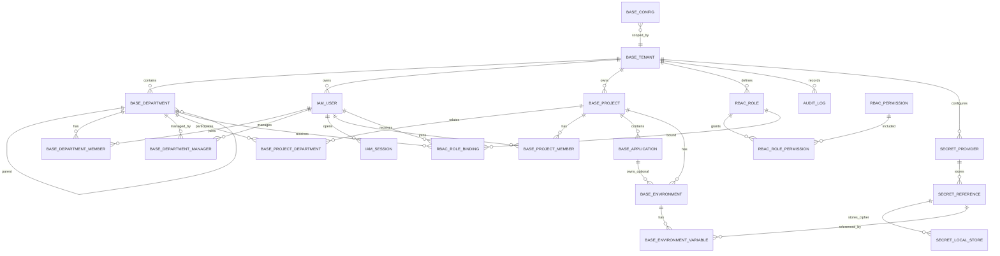

# WP1 数据库设计

> 历史归档说明：本文记录早期多租户数据库设计，不代表当前落库实现。当前数据库以 `db/migration/wp1`、`db/validation`、`doc/mvp/final/engineering/当前实现基线.md` 和当前代码为准；当前实现不包含 `base_tenant`，业务表不维护 `tenant_id`。

| 项目 | 内容 |
|---|---|
| 工作包 | WP1 平台基础底座 |
| 面向阶段 | MVP P0 研发落地 |
| 默认数据库 | PostgreSQL 15+ |
| 适用模块 | IAM、ORG、Project、Environment、RBAC、Config、Secret、Audit |
| 依赖文档 | `WP1-平台基础底座-PRD-最终版.md`、`WP1-平台基础底座-架构设计-最终版.md`、`WP1-P0-API契约.md`、`WP1-权限矩阵与菜单矩阵.md` |

## 1. 设计目标与边界

WP1 数据库承载平台控制面权威数据：租户、部门、用户、项目、应用、环境、配置、权限、密钥引用和审计。设计目标是保证后续 WP2/WP3/WP8/WP9/WP11 可以稳定复用 WP1 上下文，但不能绕过 WP1 API 直接读写 WP1 表。

核心原则：

1. 租户优先：除平台级字典表、迁移表外，业务表必须包含 `tenant_id`，所有唯一约束和查询索引优先包含 `tenant_id`。
2. 软删除优先：组织、项目、应用、环境、授权等基础对象默认软删除，历史审计和后续资产仍能追溯归属。
3. 负责人多人化：部门负责人、项目负责人、应用负责人均不落单一负责人字段，通过关系表和角色绑定表达。
4. 项目多部门：项目与部门使用多对多关联，主责部门通过关联表 `is_primary=true` 表达。
5. 环境双作用域：项目公共环境和应用专属环境共用 `base_environment`，通过 `scope_type` 和 `app_id` 明确区分。
6. 敏感值不落明文：敏感变量、鉴权凭证、SecretProvider 凭据只保存密钥引用、版本和掩码摘要。
7. 审计不可绕过：关键写操作、授权变更、登录、拒绝访问、配置和密钥引用变更必须写 `audit_log`；审计失败进入 outbox 补偿。

## 2. 通用建模规范

### 2.1 命名规范

| 类型 | 规范 | 示例 |
|---|---|---|
| 表名 | 模块前缀 + 领域名，蛇形命名 | `base_tenant`、`rbac_role_binding` |
| 主键 | `id uuid` | `id uuid primary key` |
| 外键列 | `{entity}_id` | `tenant_id`、`project_id` |
| 唯一索引 | `uk_{table}_{columns}` | `uk_base_project_tenant_code` |
| 普通索引 | `idx_{table}_{columns}` | `idx_audit_log_tenant_time` |
| Check 约束 | `ck_{table}_{name}` | `ck_base_environment_scope` |

### 2.2 通用字段

业务主表默认包含：

| 字段 | 类型 | 说明 |
|---|---|---|
| `id` | `uuid` | 主键，服务端生成。 |
| `tenant_id` | `uuid` | 租户 ID。平台级操作使用系统租户 `SYSTEM_TENANT`。 |
| `status` | `varchar(32)` | 状态枚举。按对象定义取值。 |
| `created_by` | `uuid` | 创建人，可为空表示系统初始化。 |
| `created_at` | `timestamptz` | 创建时间。 |
| `updated_by` | `uuid` | 最近更新人。 |
| `updated_at` | `timestamptz` | 最近更新时间。 |
| `deleted_at` | `timestamptz` | 软删除时间，未删除为空。 |
| `deleted_by` | `uuid` | 删除人。 |
| `version` | `bigint` | 乐观锁版本。 |

例外：

- `rbac_permission` 是平台级权限字典，不带 `tenant_id`。
- `schema_migration` 由 migration 工具管理，不进入业务模型。
- `audit_log` 不做业务软删除，按保留策略分区归档。

### 2.3 tenant_id 策略

1. 租户内业务表 `tenant_id` 必填，由认证上下文或初始化流程注入，客户端不得覆盖。
2. 逻辑外键必须校验同租户归属，禁止跨租户关联用户、部门、项目、应用、环境。
3. 平台级角色绑定、平台级审计使用系统租户记录，建议系统租户编码固定为 `SYSTEM_TENANT`。
4. PostgreSQL 可在 P1 引入 RLS；MVP P0 先通过 API 层强制租户过滤，并用联合索引降低误查风险。

### 2.4 外键策略

P0 建议对基础稳定关系使用数据库外键，对高频审计和软删除跨模块关系使用逻辑外键。

| 类型 | 策略 |
|---|---|
| 强一致主数据 | 可建外键，如 `department.tenant_id -> tenant.id`、`application.project_id -> project.id`。 |
| 软删除关系 | 外键使用 `on delete restrict`，业务删除走软删除。 |
| 审计日志 | 不建强外键，保留资源 ID 字符串和 JSON 摘要，避免历史主体删除后审计不可用。 |
| Secret 引用 | 不强依赖外部 Vault/KMS；本地 provider 通过 `secret_ref` 逻辑关联 `secret_reference`，本地密文保存到 `secret_local_store`。 |

## 3. 核心建模说明

### 3.1 多租户隔离

租户是最高隔离边界。`base_tenant` 全局唯一，其他业务对象通过 `tenant_id` 归属租户。租户内唯一对象采用 `(tenant_id, code)` 或 `(tenant_id, parent_id, name)` 唯一约束，并在 `deleted_at is null` 条件下生效。

### 3.2 项目多部门

项目不保存单一部门字段。项目与部门通过 `base_project_department` 多对多关联：

- `relation_type` 表达 `OWNER`、`PARTICIPANT`、`OBSERVER` 等协作关系。
- `is_primary=true` 表达主责部门，同一项目只能有一个未删除主责部门。
- 主责部门必须属于关联部门且为启用部门，由服务层校验。

### 3.3 多人负责人

部门负责人使用 `base_department_manager` 记录多人关系，并同步或等价生成 `DepartmentManager` 角色绑定。

项目负责人通过两层表达：

- `base_project_member.member_type='OWNER'` 表达成员视图。
- `rbac_role_binding.role_code='ProjectOwner'` 且 `scope_type='PROJECT'` 表达权限。

应用负责人同理，通过 `rbac_role_binding.role_code='AppOwner'` 且 `scope_type='APPLICATION'` 表达权限，页面展示以有效角色绑定为准。

### 3.4 项目公共环境与应用专属环境

环境统一存储在 `base_environment`：

- 项目公共环境：`scope_type='PROJECT'`，`app_id is null`。
- 应用专属环境：`scope_type='APPLICATION'`，`app_id not null`，且应用必须属于同一 `project_id`。
- 环境编码唯一性按作用域隔离：同一项目公共环境 `code` 唯一；同一应用专属环境 `code` 唯一。

### 3.5 普通变量与敏感变量

环境变量存储在 `base_environment_variable`：

- `value_kind='PLAIN'`：允许保存 `plain_value`。
- `value_kind='SECRET'`：请求携带明文，WP1 调用 SecretProvider 后只保存 `secret_ref`、`masked_value`、`secret_provider`、`secret_version`。
- `value_kind='SECRET_REF'`：调用方提交已有引用，WP1 校验引用格式和作用域，不读取明文。

敏感变量不得在 `plain_value`、审计 JSON、导出和日志中出现明文。

### 3.6 角色绑定作用域

`rbac_role_binding` 是授权事实表：

- `subject_type` 支持 `USER`、`DEPARTMENT`，P1 可扩展 `SERVICE_ACCOUNT`。
- `scope_type` 支持 `PLATFORM`、`TENANT`、`DEPARTMENT`、`PROJECT`、`APPLICATION`、`ENVIRONMENT`。
- `scope_id` 在 `PLATFORM` 可为空或固定系统租户 ID；其他作用域必须为对应资源 ID。
- 同一主体、角色、作用域在未删除状态下只能绑定一次。

授权时必须由服务层校验操作者权限集合、角色层级和作用域不超过自身管理范围。

## 4. 表设计

### 4.1 租户：`base_tenant`

| 项 | 内容 |
|---|---|
| 用途 | 平台数据隔离边界，代表企业、事业部或独立组织。 |
| 关键字段 | `code`、`name`、`status`、`contact_json`、`quota_json`、`settings_json`、`retention_policy_json`。 |
| 主键 | `id`。 |
| 唯一约束 | `code` 全局唯一，未删除租户名称建议唯一但不强制。 |
| 外键/逻辑外键 | 无上级业务外键。 |
| 索引 | `uk_base_tenant_code`、`idx_base_tenant_status`、`idx_base_tenant_created_at`。 |
| 软删除策略 | P0 不提供删除入口；如需删除，仅软删除并保留历史数据。 |
| tenant_id 策略 | 自身 `id` 即租户 ID；可不额外保存 `tenant_id`。 |
| 审计字段 | 完整审计字段；创建、编辑、启停写 `audit_log`。 |

### 4.2 部门：`base_department`

| 项 | 内容 |
|---|---|
| 用途 | 租户内部门树、组织归属和授权辅助边界。 |
| 关键字段 | `tenant_id`、`parent_id`、`code`、`name`、`path`、`level`、`sort_order`、`status`。 |
| 主键 | `id`。 |
| 唯一约束 | `(tenant_id, code)`；同父级 `(tenant_id, parent_id, name)` 未删除唯一。 |
| 外键/逻辑外键 | `tenant_id -> base_tenant.id`；`parent_id -> base_department.id`，服务层校验同租户和无环。 |
| 索引 | `(tenant_id, parent_id, sort_order)`、`(tenant_id, path)`、`(tenant_id, status)`。 |
| 软删除策略 | 软删除；存在启用子部门、启用用户主部门、启用项目主责部门时阻断。 |
| tenant_id 策略 | 必填，所有查询带租户过滤。 |
| 审计字段 | 完整审计字段；创建、编辑、启停、移动写审计。 |

### 4.3 部门负责人：`base_department_manager`

| 项 | 内容 |
|---|---|
| 用途 | 表达部门多人负责人关系。 |
| 关键字段 | `tenant_id`、`dept_id`、`user_id`、`status`。 |
| 主键 | `id`。 |
| 唯一约束 | `(tenant_id, dept_id, user_id)` 未删除唯一。 |
| 外键/逻辑外键 | `dept_id -> base_department.id`、`user_id -> iam_user.id`；服务层校验同租户。 |
| 索引 | `(tenant_id, dept_id)`、`(tenant_id, user_id)`。 |
| 软删除策略 | 负责人移除时软删除或置 `status='DISABLED'`。 |
| tenant_id 策略 | 必填，与部门、用户一致。 |
| 审计字段 | 完整审计字段；增删同步写 `DEPARTMENT_MANAGER_ADD/REMOVE` 和角色绑定审计。 |

### 4.4 用户：`iam_user`

| 项 | 内容 |
|---|---|
| 用途 | 平台操作主体和本地身份记录。 |
| 关键字段 | `tenant_id`、`username`、`password_hash`、`display_name`、`email`、`mobile`、`status`、`external_id`、`auth_version`、`last_login_at`。 |
| 主键 | `id`。 |
| 唯一约束 | `(tenant_id, username)`；`(tenant_id, email)` 在邮箱非空时唯一；`(tenant_id, external_id)` 在非空时唯一。 |
| 外键/逻辑外键 | `tenant_id -> base_tenant.id`。 |
| 索引 | `(tenant_id, status)`、`(tenant_id, display_name)`、`(tenant_id, last_login_at)`。 |
| 软删除策略 | P0 不提供硬删除；停用或锁定通过 `status`；删除仅软删除并撤销会话。 |
| tenant_id 策略 | 必填；用户不能跨租户加入部门或项目。 |
| 审计字段 | 完整审计字段；创建、邀请、编辑、启停、锁定写审计。 |

### 4.5 部门成员：`base_department_member`

| 项 | 内容 |
|---|---|
| 用途 | 用户与部门多对多关系，支持主部门和兼任部门。 |
| 关键字段 | `tenant_id`、`dept_id`、`user_id`、`is_primary`、`position`、`status`。 |
| 主键 | `id`。 |
| 唯一约束 | `(tenant_id, dept_id, user_id)` 未删除唯一；每个用户只能有一个 `is_primary=true` 的未删除启用关系。 |
| 外键/逻辑外键 | `dept_id -> base_department.id`、`user_id -> iam_user.id`。 |
| 索引 | `(tenant_id, user_id)`、`(tenant_id, dept_id, status)`、主部门部分唯一索引。 |
| 软删除策略 | 移除成员软删除；移除主部门前必须指定替代主部门或阻断。 |
| tenant_id 策略 | 必填，与部门、用户一致。 |
| 审计字段 | 完整审计字段；成员新增、移除、主部门变更写审计。 |

### 4.6 会话：`iam_session`

| 项 | 内容 |
|---|---|
| 用途 | 登录会话、刷新令牌摘要、撤销状态和安全追踪。 |
| 关键字段 | `tenant_id`、`user_id`、`session_token_hash`、`refresh_token_hash`、`auth_version`、`client_ip`、`user_agent`、`expires_at`、`revoked_at`。 |
| 主键 | `id`。 |
| 唯一约束 | `session_token_hash`、`refresh_token_hash`。 |
| 外键/逻辑外键 | `user_id -> iam_user.id`；审计不依赖会话外键。 |
| 索引 | `(tenant_id, user_id, revoked_at)`、`(expires_at)`、`(tenant_id, created_at desc)`。 |
| 软删除策略 | 会话不软删除；通过 `revoked_at` 和过期时间失效，按保留期清理。 |
| tenant_id 策略 | 必填，来自用户租户；平台初始化会话使用系统租户。 |
| 审计字段 | 创建和撤销记录 `created_at`、`revoked_by`；登录、登出、刷新、撤销写审计。 |

### 4.7 项目：`base_project`

| 项 | 内容 |
|---|---|
| 用途 | 测试资产和协作的主要工作空间。 |
| 关键字段 | `tenant_id`、`code`、`name`、`status`、`sensitivity_level`、`allow_public_model`、`default_resource_pool`。 |
| 主键 | `id`。 |
| 唯一约束 | `(tenant_id, code)` 未删除唯一。 |
| 外键/逻辑外键 | `tenant_id -> base_tenant.id`。 |
| 索引 | `(tenant_id, status)`、`(tenant_id, name)`、`(tenant_id, sensitivity_level)`。 |
| 软删除策略 | 归档和停用优先；删除仅软删除，后续资产仍保留 project_id。 |
| tenant_id 策略 | 必填；项目内对象必须与项目同租户。 |
| 审计字段 | 完整审计字段；创建、编辑、归档、启停写审计。 |

### 4.8 项目部门关联：`base_project_department`

| 项 | 内容 |
|---|---|
| 用途 | 表达项目关联多个部门和主责部门。 |
| 关键字段 | `tenant_id`、`project_id`、`dept_id`、`relation_type`、`is_primary`、`status`。 |
| 主键 | `id`。 |
| 唯一约束 | `(tenant_id, project_id, dept_id)` 未删除唯一；同一项目只有一个 `is_primary=true`。 |
| 外键/逻辑外键 | `project_id -> base_project.id`、`dept_id -> base_department.id`。 |
| 索引 | `(tenant_id, project_id)`、`(tenant_id, dept_id)`、主责部门部分唯一索引。 |
| 软删除策略 | 覆盖关联部门时对移除关系软删除。 |
| tenant_id 策略 | 必填，与项目、部门一致。 |
| 审计字段 | 完整审计字段；覆盖关联写 `PROJECT_DEPARTMENT_UPDATE`。 |

### 4.9 项目成员：`base_project_member`

| 项 | 内容 |
|---|---|
| 用途 | 项目成员清单、成员类型和成员状态。 |
| 关键字段 | `tenant_id`、`project_id`、`user_id`、`member_type`、`status`、`joined_at`。 |
| 主键 | `id`。 |
| 唯一约束 | `(tenant_id, project_id, user_id)` 未删除唯一。 |
| 外键/逻辑外键 | `project_id -> base_project.id`、`user_id -> iam_user.id`。 |
| 索引 | `(tenant_id, project_id, status)`、`(tenant_id, user_id, status)`、`(tenant_id, member_type)`。 |
| 软删除策略 | 移除项目成员软删除，并同步回收项目/应用/环境作用域角色绑定。 |
| tenant_id 策略 | 必填，与项目、用户一致。 |
| 审计字段 | 完整审计字段；成员新增、移除写审计。 |

### 4.10 应用：`base_application`

| 项 | 内容 |
|---|---|
| 用途 | 项目下被测系统登记。 |
| 关键字段 | `tenant_id`、`project_id`、`code`、`name`、`app_type`、`default_web_url`、`default_api_base_url`、`repo_url`、`sensitivity_level`、`allow_public_model`、`status`。 |
| 主键 | `id`。 |
| 唯一约束 | `(tenant_id, project_id, code)` 未删除唯一。 |
| 外键/逻辑外键 | `project_id -> base_project.id`。 |
| 索引 | `(tenant_id, project_id, status)`、`(tenant_id, app_type)`。 |
| 软删除策略 | 停用优先；软删除应用前需处理应用专属环境和角色绑定。 |
| tenant_id 策略 | 必填，与项目一致。 |
| 审计字段 | 完整审计字段；创建、编辑、启停、负责人变更写审计。 |

### 4.11 环境：`base_environment`

| 项 | 内容 |
|---|---|
| 用途 | 项目公共环境和应用专属环境。 |
| 关键字段 | `tenant_id`、`project_id`、`app_id`、`scope_type`、`code`、`name`、`env_type`、`web_url`、`api_base_url`、`execution_policy_json`、`health_check_json`、`auth_secret_ref`、`status`。 |
| 主键 | `id`。 |
| 唯一约束 | 项目公共环境 `(tenant_id, project_id, code)`；应用专属环境 `(tenant_id, app_id, code)`。 |
| 外键/逻辑外键 | `project_id -> base_project.id`、`app_id -> base_application.id`；服务层校验 app 属于 project。 |
| 索引 | `(tenant_id, project_id, scope_type, status)`、`(tenant_id, app_id, status)`、`(tenant_id, env_type)`。 |
| 软删除策略 | 停用优先；软删除后变量同步软删除，审计保留。 |
| tenant_id 策略 | 必填，与项目、应用一致。 |
| 审计字段 | 完整审计字段；创建、编辑、启停、鉴权配置变更写审计。 |

### 4.12 环境变量：`base_environment_variable`

| 项 | 内容 |
|---|---|
| 用途 | 环境级普通变量、敏感变量和外部密钥引用。 |
| 关键字段 | `tenant_id`、`env_id`、`key`、`value_kind`、`plain_value`、`secret_ref`、`secret_provider`、`secret_version`、`masked_value`、`description`、`status`。 |
| 主键 | `id`。 |
| 唯一约束 | `(tenant_id, env_id, key)` 未删除唯一。 |
| 外键/逻辑外键 | `env_id -> base_environment.id`；`secret_ref` 逻辑关联 SecretProvider。 |
| 索引 | `(tenant_id, env_id)`、`(tenant_id, secret_provider)`、`(tenant_id, key)`。 |
| 软删除策略 | 变量删除软删除；敏感变量删除可触发 SecretProvider 废弃或保留版本。 |
| tenant_id 策略 | 必填，与环境一致。 |
| 审计字段 | 完整审计字段；变量更新写审计，敏感字段只记录脱敏摘要。 |

### 4.13 配置：`base_config`

| 项 | 内容 |
|---|---|
| 用途 | System/Tenant/Project/Application/Environment 分层配置。 |
| 关键字段 | `tenant_id`、`scope_type`、`scope_id`、`config_key`、`value_json`、`value_kind`、`secret_ref`、`masked_value`、`status`。 |
| 主键 | `id`。 |
| 唯一约束 | `(tenant_id, scope_type, scope_id, config_key)` 未删除唯一。 |
| 外键/逻辑外键 | `scope_id` 按 `scope_type` 逻辑关联对应资源。 |
| 索引 | `(tenant_id, scope_type, scope_id)`、`(tenant_id, config_key)`。 |
| 软删除策略 | 删除配置项软删除，读取有效配置时回退低优先级。 |
| tenant_id 策略 | 系统默认配置使用系统租户；租户内配置使用当前租户。 |
| 审计字段 | 完整审计字段；配置变更写审计，敏感配置脱敏。 |

### 4.14 权限：`rbac_permission`

| 项 | 内容 |
|---|---|
| 用途 | 平台权限点字典。 |
| 关键字段 | `code`、`resource_type`、`action`、`scope_mask`、`description`、`status`。 |
| 主键 | `id`。 |
| 唯一约束 | `code` 全局唯一。 |
| 外键/逻辑外键 | 无。 |
| 索引 | `(resource_type, action)`、`status`。 |
| 软删除策略 | 内置权限不删除；废弃时置 `status='DISABLED'`。 |
| tenant_id 策略 | 无 `tenant_id`，平台级字典。 |
| 审计字段 | 保留创建/更新时间；权限初始化写系统审计。 |

### 4.15 角色：`rbac_role`

| 项 | 内容 |
|---|---|
| 用途 | 内置角色和租户自定义角色定义。 |
| 关键字段 | `tenant_id`、`code`、`name`、`scope_type`、`is_system`、`is_builtin`、`status`、`description`。 |
| 主键 | `id`。 |
| 唯一约束 | `(tenant_id, code)` 未删除唯一；系统角色使用系统租户。 |
| 外键/逻辑外键 | `tenant_id -> base_tenant.id`。 |
| 索引 | `(tenant_id, scope_type, status)`、`(tenant_id, is_builtin)`。 |
| 软删除策略 | 内置角色不可删除和停用；自定义角色 P1 可软删除。 |
| tenant_id 策略 | 内置角色可在系统租户维护一份模板；租户创建时复制到租户，便于后续自定义扩展。 |
| 审计字段 | 完整审计字段；角色创建、编辑、停用写审计。 |

### 4.16 角色权限：`rbac_role_permission`

| 项 | 内容 |
|---|---|
| 用途 | 角色包含的权限点。 |
| 关键字段 | `tenant_id`、`role_id`、`permission_id`、`effect`。 |
| 主键 | `id`。 |
| 唯一约束 | `(tenant_id, role_id, permission_id)` 未删除唯一。 |
| 外键/逻辑外键 | `role_id -> rbac_role.id`、`permission_id -> rbac_permission.id`。 |
| 索引 | `(tenant_id, role_id)`、`permission_id`。 |
| 软删除策略 | 覆盖角色权限时对移除项软删除。 |
| tenant_id 策略 | 与角色一致。 |
| 审计字段 | 完整审计字段；权限覆盖写 `ROLE_PERMISSION_UPDATE`。 |

### 4.17 角色绑定：`rbac_role_binding`

| 项 | 内容 |
|---|---|
| 用途 | 用户或部门在指定资源作用域上获得角色。 |
| 关键字段 | `tenant_id`、`subject_type`、`subject_id`、`role_id`、`role_code`、`scope_type`、`scope_id`、`condition_json`、`expires_at`、`status`。 |
| 主键 | `id`。 |
| 唯一约束 | `(tenant_id, subject_type, subject_id, role_id, scope_type, scope_id)` 未删除唯一。 |
| 外键/逻辑外键 | `role_id -> rbac_role.id`；`subject_id` 和 `scope_id` 按类型逻辑关联。 |
| 索引 | `(tenant_id, subject_type, subject_id, status)`、`(tenant_id, scope_type, scope_id, status)`、`(tenant_id, role_code)`。 |
| 软删除策略 | 解绑软删除，并递增相关用户 `auth_version` 或刷新权限缓存。 |
| tenant_id 策略 | 必填；平台级绑定使用系统租户或目标租户上下文，`scope_type='PLATFORM'`。 |
| 审计字段 | 完整审计字段；绑定、解绑写审计。 |

### 4.18 审计日志：`audit_log`

| 项 | 内容 |
|---|---|
| 用途 | 记录登录、授权、组织、项目、环境、配置、拒绝访问和内部审计事件。 |
| 关键字段 | `tenant_id`、`trace_id`、`actor_type`、`actor_user_id`、`actor_service`、`actor_ip`、`action`、`resource_type`、`resource_id`、`scope_type`、`scope_id`、`result`、`before_json`、`after_json`、`diff_json`、`reason`、`created_at`。 |
| 主键 | `id`。 |
| 唯一约束 | 无业务唯一；可按 `idempotency_key` 防重复写入。 |
| 外键/逻辑外键 | 不建强外键，保留历史可读性。 |
| 索引 | `(tenant_id, created_at desc)`、`(tenant_id, action, created_at desc)`、`(tenant_id, resource_type, resource_id)`、`(tenant_id, actor_user_id, created_at desc)`、`trace_id`。 |
| 软删除策略 | 不软删除；按时间分区、归档和保留策略清理。 |
| tenant_id 策略 | 必填；平台级审计使用系统租户。 |
| 审计字段 | 审计表自身不再写审计，查询和导出可写额外 `AUDIT_QUERY/AUDIT_EXPORT`。 |

### 4.19 审计 outbox：`audit_outbox`

| 项 | 内容 |
|---|---|
| 用途 | 审计写入失败或异步派发补偿。 |
| 关键字段 | `tenant_id`、`event_payload_json`、`status`、`retry_count`、`next_retry_at`、`last_error`、`locked_at`、`locked_by`。 |
| 主键 | `id`。 |
| 唯一约束 | 可选 `(tenant_id, idempotency_key)`。 |
| 外键/逻辑外键 | 无强外键。 |
| 索引 | `(status, next_retry_at)`、`(tenant_id, created_at)`。 |
| 软删除策略 | 不软删除；成功处理后保留短周期，之后归档或清理。 |
| tenant_id 策略 | 必填；事件 payload 内也必须包含 tenant_id。 |
| 审计字段 | 保留创建/更新时间和处理状态。 |

### 4.20 SecretProvider：`secret_provider`

| 项 | 内容 |
|---|---|
| 用途 | 登记可用密钥提供方，例如 `LOCAL_ENCRYPTED`、`VAULT`、`KMS`。 |
| 关键字段 | `tenant_id`、`provider_code`、`provider_type`、`config_json`、`is_default`、`status`。 |
| 主键 | `id`。 |
| 唯一约束 | `(tenant_id, provider_code)` 未删除唯一；同租户只能一个默认 provider。 |
| 外键/逻辑外键 | `tenant_id -> base_tenant.id`。 |
| 索引 | `(tenant_id, provider_type, status)`、默认 provider 部分唯一索引。 |
| 软删除策略 | 存在有效 `secret_reference` 时禁止删除；可停用。 |
| tenant_id 策略 | 系统默认 provider 使用系统租户；租户可覆盖默认 provider。 |
| 审计字段 | 完整审计字段；配置变更必须脱敏并写审计。 |

### 4.21 Secret 引用：`secret_reference`

| 项 | 内容 |
|---|---|
| 用途 | 本地或外部 SecretProvider 的密钥引用元数据，不保存明文；本地加密密文落到 `secret_local_store`。 |
| 关键字段 | `tenant_id`、`provider_id`、`secret_ref`、`scope_type`、`scope_id`、`purpose`、`masked_value`、`secret_version`、`status`、`rotated_at`、`expires_at`。 |
| 主键 | `id`。 |
| 唯一约束 | `(tenant_id, secret_ref)`。 |
| 外键/逻辑外键 | `provider_id -> secret_provider.id`；`scope_id` 按作用域逻辑关联。 |
| 索引 | `(tenant_id, scope_type, scope_id)`、`(tenant_id, provider_id, status)`、`(tenant_id, purpose)`。 |
| 软删除策略 | 删除敏感变量时可置 `DEPRECATED`；物理删除由密钥保留策略控制。 |
| tenant_id 策略 | 必填，secret_ref 必须包含同租户标识。 |
| 审计字段 | 完整审计字段；创建、轮换、废弃写脱敏审计。 |

### 4.22 本地密文存储：`secret_local_store`

| 项 | 内容 |
|---|---|
| 用途 | `LOCAL_ENCRYPTED` SecretProvider 的本地密文存储表，只保存密文、随机 IV、认证 Tag 和主密钥版本，不保存明文。 |
| 关键字段 | `tenant_id`、`secret_ref_id`、`cipher_text`、`iv`、`auth_tag`、`algorithm`、`master_key_version`、`status`。 |
| 主键 | `id`。 |
| 唯一约束 | `(tenant_id, secret_ref_id)`。 |
| 外键/逻辑外键 | `secret_ref_id -> secret_reference.id`；服务层校验关联 provider 类型为 `LOCAL_ENCRYPTED`。 |
| 索引 | `(tenant_id, secret_ref_id)`、`(tenant_id, status)`。 |
| 软删除策略 | 不硬删；撤销密钥时置 `status='REVOKED'`，保留审计和历史引用。 |
| tenant_id 策略 | 必填，与 `secret_reference.tenant_id` 一致。 |
| 审计字段 | 完整审计字段；写入、轮换、撤销写审计，但审计中不得出现 `cipher_text`、`iv`、`auth_tag`。 |

### 4.23 权限版本策略

WP1 不单独建设 `auth_policy_version` 表。P0 权限缓存失效采用两类版本字段：

- `iam_user.auth_version`：用户级权限版本。用户状态变更、用户角色绑定/解绑、用户部门关系变化时递增。
- `rbac_role.version`：角色级权限版本。角色权限点变化、角色启停时递增。

权限缓存 Key 必须包含 `tenant_id`、`user_id`、`iam_user.auth_version` 和相关角色版本摘要。租户级全局策略版本可在 P1 视性能需要扩展，P0 不落表。

## 5. Mermaid ER 图



## 6. PostgreSQL DDL 草案

以下 DDL 接近可落地，但枚举、分区和局部索引可在 migration 中按团队规范拆分。

### 6.1 扩展与公共函数

```sql
create extension if not exists pgcrypto;

create table if not exists base_tenant (
    id uuid primary key default gen_random_uuid(),
    code varchar(32) not null,
    name varchar(64) not null,
    status varchar(32) not null default 'ENABLED',
    contact_json jsonb not null default '{}'::jsonb,
    quota_json jsonb not null default '{}'::jsonb,
    settings_json jsonb not null default '{}'::jsonb,
    retention_policy_json jsonb not null default '{}'::jsonb,
    description text,
    created_by uuid,
    created_at timestamptz not null default now(),
    updated_by uuid,
    updated_at timestamptz not null default now(),
    deleted_by uuid,
    deleted_at timestamptz,
    version bigint not null default 0,
    constraint ck_base_tenant_status check (status in ('ENABLED','DISABLED'))
);
create unique index uk_base_tenant_code on base_tenant(code) where deleted_at is null;
create index idx_base_tenant_status on base_tenant(status) where deleted_at is null;
```

### 6.2 组织与 IAM

```sql
create table base_department (
    id uuid primary key default gen_random_uuid(),
    tenant_id uuid not null references base_tenant(id),
    parent_id uuid references base_department(id),
    code varchar(32) not null,
    name varchar(64) not null,
    path varchar(1024) not null,
    level int not null default 1,
    sort_order int not null default 0,
    status varchar(32) not null default 'ENABLED',
    created_by uuid,
    created_at timestamptz not null default now(),
    updated_by uuid,
    updated_at timestamptz not null default now(),
    deleted_by uuid,
    deleted_at timestamptz,
    version bigint not null default 0,
    constraint ck_base_department_status check (status in ('ENABLED','DISABLED'))
);
create unique index uk_base_department_tenant_code on base_department(tenant_id, code) where deleted_at is null;
create unique index uk_base_department_parent_name on base_department(tenant_id, coalesce(parent_id, '00000000-0000-0000-0000-000000000000'::uuid), name) where deleted_at is null;
create index idx_base_department_parent on base_department(tenant_id, parent_id, sort_order) where deleted_at is null;
create index idx_base_department_path on base_department(tenant_id, path) where deleted_at is null;

create table iam_user (
    id uuid primary key default gen_random_uuid(),
    tenant_id uuid not null references base_tenant(id),
    username varchar(64) not null,
    password_hash varchar(255),
    display_name varchar(64) not null,
    email varchar(128),
    mobile varchar(32),
    status varchar(32) not null default 'PENDING_ACTIVATION',
    external_id varchar(128),
    auth_version bigint not null default 1,
    must_change_password boolean not null default false,
    last_login_at timestamptz,
    created_by uuid,
    created_at timestamptz not null default now(),
    updated_by uuid,
    updated_at timestamptz not null default now(),
    deleted_by uuid,
    deleted_at timestamptz,
    version bigint not null default 0,
    constraint ck_iam_user_status check (status in ('PENDING_ACTIVATION','ENABLED','DISABLED','LOCKED'))
);
create unique index uk_iam_user_tenant_username on iam_user(tenant_id, username) where deleted_at is null;
create unique index uk_iam_user_tenant_email on iam_user(tenant_id, email) where email is not null and deleted_at is null;
create unique index uk_iam_user_tenant_external on iam_user(tenant_id, external_id) where external_id is not null and deleted_at is null;
create index idx_iam_user_status on iam_user(tenant_id, status) where deleted_at is null;

create table base_department_member (
    id uuid primary key default gen_random_uuid(),
    tenant_id uuid not null references base_tenant(id),
    dept_id uuid not null references base_department(id),
    user_id uuid not null references iam_user(id),
    is_primary boolean not null default false,
    position varchar(64),
    status varchar(32) not null default 'ENABLED',
    created_by uuid,
    created_at timestamptz not null default now(),
    updated_by uuid,
    updated_at timestamptz not null default now(),
    deleted_by uuid,
    deleted_at timestamptz,
    version bigint not null default 0,
    constraint ck_base_department_member_status check (status in ('ENABLED','DISABLED'))
);
create unique index uk_dept_member_dept_user on base_department_member(tenant_id, dept_id, user_id) where deleted_at is null;
create unique index uk_dept_member_primary_user on base_department_member(tenant_id, user_id) where is_primary = true and status = 'ENABLED' and deleted_at is null;
create index idx_dept_member_user on base_department_member(tenant_id, user_id, status) where deleted_at is null;
create index idx_dept_member_dept on base_department_member(tenant_id, dept_id, status) where deleted_at is null;

create table base_department_manager (
    id uuid primary key default gen_random_uuid(),
    tenant_id uuid not null references base_tenant(id),
    dept_id uuid not null references base_department(id),
    user_id uuid not null references iam_user(id),
    status varchar(32) not null default 'ENABLED',
    created_by uuid,
    created_at timestamptz not null default now(),
    updated_by uuid,
    updated_at timestamptz not null default now(),
    deleted_by uuid,
    deleted_at timestamptz,
    version bigint not null default 0
);
create unique index uk_dept_manager_dept_user on base_department_manager(tenant_id, dept_id, user_id) where deleted_at is null;
create index idx_dept_manager_user on base_department_manager(tenant_id, user_id) where deleted_at is null;

create table iam_session (
    id uuid primary key default gen_random_uuid(),
    tenant_id uuid not null references base_tenant(id),
    user_id uuid not null references iam_user(id),
    session_token_hash varchar(128) not null,
    refresh_token_hash varchar(128) not null,
    auth_version bigint not null,
    client_ip inet,
    user_agent text,
    expires_at timestamptz not null,
    refreshed_at timestamptz,
    revoked_at timestamptz,
    revoked_by uuid,
    revoke_reason text,
    created_at timestamptz not null default now()
);
create unique index uk_iam_session_token on iam_session(session_token_hash);
create unique index uk_iam_session_refresh on iam_session(refresh_token_hash);
create index idx_iam_session_user_active on iam_session(tenant_id, user_id, revoked_at, expires_at);
```

### 6.3 项目、应用、环境

```sql
create table base_project (
    id uuid primary key default gen_random_uuid(),
    tenant_id uuid not null references base_tenant(id),
    code varchar(32) not null,
    name varchar(64) not null,
    status varchar(32) not null default 'PREPARING',
    sensitivity_level varchar(32) not null default 'INTERNAL',
    allow_public_model boolean not null default false,
    default_resource_pool varchar(64),
    description text,
    created_by uuid,
    created_at timestamptz not null default now(),
    updated_by uuid,
    updated_at timestamptz not null default now(),
    deleted_by uuid,
    deleted_at timestamptz,
    version bigint not null default 0,
    constraint ck_base_project_status check (status in ('PREPARING','ACTIVE','ARCHIVED','DISABLED')),
    constraint ck_base_project_sensitivity check (sensitivity_level in ('PUBLIC','INTERNAL','CONFIDENTIAL','STRICT'))
);
create unique index uk_base_project_tenant_code on base_project(tenant_id, code) where deleted_at is null;
create index idx_base_project_status on base_project(tenant_id, status) where deleted_at is null;

create table base_project_department (
    id uuid primary key default gen_random_uuid(),
    tenant_id uuid not null references base_tenant(id),
    project_id uuid not null references base_project(id),
    dept_id uuid not null references base_department(id),
    relation_type varchar(32) not null default 'PARTICIPANT',
    is_primary boolean not null default false,
    status varchar(32) not null default 'ENABLED',
    created_by uuid,
    created_at timestamptz not null default now(),
    updated_by uuid,
    updated_at timestamptz not null default now(),
    deleted_by uuid,
    deleted_at timestamptz,
    version bigint not null default 0
);
create unique index uk_project_dept on base_project_department(tenant_id, project_id, dept_id) where deleted_at is null;
create unique index uk_project_primary_dept on base_project_department(tenant_id, project_id) where is_primary = true and status = 'ENABLED' and deleted_at is null;
create index idx_project_dept_dept on base_project_department(tenant_id, dept_id) where deleted_at is null;

create table base_project_member (
    id uuid primary key default gen_random_uuid(),
    tenant_id uuid not null references base_tenant(id),
    project_id uuid not null references base_project(id),
    user_id uuid not null references iam_user(id),
    member_type varchar(32) not null default 'MEMBER',
    status varchar(32) not null default 'ENABLED',
    joined_at timestamptz not null default now(),
    created_by uuid,
    created_at timestamptz not null default now(),
    updated_by uuid,
    updated_at timestamptz not null default now(),
    deleted_by uuid,
    deleted_at timestamptz,
    version bigint not null default 0,
    constraint ck_project_member_type check (member_type in ('OWNER','MEMBER','OBSERVER'))
);
create unique index uk_project_member on base_project_member(tenant_id, project_id, user_id) where deleted_at is null;
create index idx_project_member_user on base_project_member(tenant_id, user_id, status) where deleted_at is null;

create table base_application (
    id uuid primary key default gen_random_uuid(),
    tenant_id uuid not null references base_tenant(id),
    project_id uuid not null references base_project(id),
    code varchar(32) not null,
    name varchar(64) not null,
    app_type varchar(32) not null,
    default_web_url text,
    default_api_base_url text,
    repo_url text,
    service_identifier varchar(128),
    sensitivity_level varchar(32) not null default 'INTERNAL',
    allow_public_model boolean not null default false,
    status varchar(32) not null default 'ENABLED',
    description text,
    created_by uuid,
    created_at timestamptz not null default now(),
    updated_by uuid,
    updated_at timestamptz not null default now(),
    deleted_by uuid,
    deleted_at timestamptz,
    version bigint not null default 0,
    constraint ck_base_application_status check (status in ('ENABLED','DISABLED')),
    constraint ck_base_application_sensitivity check (sensitivity_level in ('PUBLIC','INTERNAL','CONFIDENTIAL','STRICT'))
);
create unique index uk_application_project_code on base_application(tenant_id, project_id, code) where deleted_at is null;
create index idx_application_project_status on base_application(tenant_id, project_id, status) where deleted_at is null;

create table base_environment (
    id uuid primary key default gen_random_uuid(),
    tenant_id uuid not null references base_tenant(id),
    project_id uuid not null references base_project(id),
    app_id uuid references base_application(id),
    scope_type varchar(32) not null,
    code varchar(32) not null,
    name varchar(64) not null,
    env_type varchar(32) not null,
    web_url text,
    api_base_url text,
    execution_policy_json jsonb not null default '{}'::jsonb,
    health_check_json jsonb not null default '{}'::jsonb,
    auth_secret_ref text,
    status varchar(32) not null default 'ENABLED',
    created_by uuid,
    created_at timestamptz not null default now(),
    updated_by uuid,
    updated_at timestamptz not null default now(),
    deleted_by uuid,
    deleted_at timestamptz,
    version bigint not null default 0,
    constraint ck_environment_scope check (
        (scope_type = 'PROJECT' and app_id is null) or
        (scope_type = 'APPLICATION' and app_id is not null)
    ),
    constraint ck_environment_env_type check (env_type in ('DEV','TEST','STAGING','PREPROD','PROD')),
    constraint ck_environment_status check (status in ('ENABLED','DISABLED'))
);
create unique index uk_env_project_code on base_environment(tenant_id, project_id, code) where scope_type = 'PROJECT' and deleted_at is null;
create unique index uk_env_app_code on base_environment(tenant_id, app_id, code) where scope_type = 'APPLICATION' and deleted_at is null;
create index idx_env_project_status on base_environment(tenant_id, project_id, scope_type, status) where deleted_at is null;
create index idx_env_app_status on base_environment(tenant_id, app_id, status) where deleted_at is null;

create table base_environment_variable (
    id uuid primary key default gen_random_uuid(),
    tenant_id uuid not null references base_tenant(id),
    env_id uuid not null references base_environment(id),
    key varchar(128) not null,
    value_kind varchar(32) not null,
    plain_value text,
    secret_ref text,
    secret_provider varchar(64),
    secret_version varchar(64),
    masked_value varchar(255),
    description text,
    status varchar(32) not null default 'ENABLED',
    created_by uuid,
    created_at timestamptz not null default now(),
    updated_by uuid,
    updated_at timestamptz not null default now(),
    deleted_by uuid,
    deleted_at timestamptz,
    version bigint not null default 0,
    constraint ck_env_var_kind check (value_kind in ('PLAIN','SECRET','SECRET_REF')),
    constraint ck_env_var_secret check (
        (value_kind = 'PLAIN' and plain_value is not null and secret_ref is null) or
        (value_kind in ('SECRET','SECRET_REF') and plain_value is null and secret_ref is not null)
    )
);
create unique index uk_env_var_key on base_environment_variable(tenant_id, env_id, key) where deleted_at is null;
create index idx_env_var_env on base_environment_variable(tenant_id, env_id) where deleted_at is null;
```

### 6.4 配置、权限与密钥

```sql
create table base_config (
    id uuid primary key default gen_random_uuid(),
    tenant_id uuid not null references base_tenant(id),
    scope_type varchar(32) not null,
    scope_id uuid,
    config_key varchar(128) not null,
    value_kind varchar(32) not null default 'PLAIN',
    value_json jsonb,
    secret_ref text,
    masked_value varchar(255),
    status varchar(32) not null default 'ENABLED',
    created_by uuid,
    created_at timestamptz not null default now(),
    updated_by uuid,
    updated_at timestamptz not null default now(),
    deleted_by uuid,
    deleted_at timestamptz,
    version bigint not null default 0,
    constraint ck_config_scope check (scope_type in ('SYSTEM','TENANT','PROJECT','APPLICATION','ENVIRONMENT')),
    constraint ck_config_kind check (value_kind in ('PLAIN','SECRET_REF'))
);
create unique index uk_config_scope_key on base_config(tenant_id, scope_type, coalesce(scope_id, '00000000-0000-0000-0000-000000000000'::uuid), config_key) where deleted_at is null;
create index idx_config_scope on base_config(tenant_id, scope_type, scope_id) where deleted_at is null;

create table rbac_permission (
    id uuid primary key default gen_random_uuid(),
    code varchar(128) not null,
    resource_type varchar(64) not null,
    action varchar(64) not null,
    scope_mask varchar(255) not null default '',
    description text,
    status varchar(32) not null default 'ENABLED',
    created_at timestamptz not null default now(),
    updated_at timestamptz not null default now()
);
create unique index uk_permission_code on rbac_permission(code);
create index idx_permission_resource_action on rbac_permission(resource_type, action);

create table rbac_role (
    id uuid primary key default gen_random_uuid(),
    tenant_id uuid not null references base_tenant(id),
    code varchar(64) not null,
    name varchar(64) not null,
    scope_type varchar(32) not null,
    is_system boolean not null default false,
    is_builtin boolean not null default true,
    status varchar(32) not null default 'ENABLED',
    description text,
    created_by uuid,
    created_at timestamptz not null default now(),
    updated_by uuid,
    updated_at timestamptz not null default now(),
    deleted_by uuid,
    deleted_at timestamptz,
    version bigint not null default 0
);
create unique index uk_role_tenant_code on rbac_role(tenant_id, code) where deleted_at is null;
create index idx_role_scope on rbac_role(tenant_id, scope_type, status) where deleted_at is null;

create table rbac_role_permission (
    id uuid primary key default gen_random_uuid(),
    tenant_id uuid not null references base_tenant(id),
    role_id uuid not null references rbac_role(id),
    permission_id uuid not null references rbac_permission(id),
    effect varchar(16) not null default 'ALLOW',
    created_by uuid,
    created_at timestamptz not null default now(),
    deleted_by uuid,
    deleted_at timestamptz,
    version bigint not null default 0
);
create unique index uk_role_permission on rbac_role_permission(tenant_id, role_id, permission_id) where deleted_at is null;
create index idx_role_permission_role on rbac_role_permission(tenant_id, role_id) where deleted_at is null;

create table rbac_role_binding (
    id uuid primary key default gen_random_uuid(),
    tenant_id uuid not null references base_tenant(id),
    subject_type varchar(32) not null,
    subject_id uuid not null,
    role_id uuid not null references rbac_role(id),
    role_code varchar(64) not null,
    scope_type varchar(32) not null,
    scope_id uuid,
    condition_json jsonb not null default '{}'::jsonb,
    expires_at timestamptz,
    status varchar(32) not null default 'ENABLED',
    created_by uuid,
    created_at timestamptz not null default now(),
    updated_by uuid,
    updated_at timestamptz not null default now(),
    deleted_by uuid,
    deleted_at timestamptz,
    version bigint not null default 0,
    constraint ck_role_binding_subject check (subject_type in ('USER','DEPARTMENT')),
    constraint ck_role_binding_scope check (scope_type in ('PLATFORM','TENANT','DEPARTMENT','PROJECT','APPLICATION','ENVIRONMENT'))
);
create unique index uk_role_binding_unique on rbac_role_binding(
    tenant_id, subject_type, subject_id, role_id, scope_type,
    coalesce(scope_id, '00000000-0000-0000-0000-000000000000'::uuid)
) where deleted_at is null;
create index idx_role_binding_subject on rbac_role_binding(tenant_id, subject_type, subject_id, status) where deleted_at is null;
create index idx_role_binding_scope on rbac_role_binding(tenant_id, scope_type, scope_id, status) where deleted_at is null;

create table secret_provider (
    id uuid primary key default gen_random_uuid(),
    tenant_id uuid not null references base_tenant(id),
    provider_code varchar(64) not null,
    provider_type varchar(32) not null,
    config_json jsonb not null default '{}'::jsonb,
    is_default boolean not null default false,
    status varchar(32) not null default 'ENABLED',
    created_by uuid,
    created_at timestamptz not null default now(),
    updated_by uuid,
    updated_at timestamptz not null default now(),
    deleted_by uuid,
    deleted_at timestamptz,
    version bigint not null default 0,
    constraint ck_secret_provider_type check (provider_type in ('LOCAL_ENCRYPTED','VAULT','KMS')),
    constraint ck_secret_provider_status check (status in ('ENABLED','DISABLED'))
);
create unique index uk_secret_provider_code on secret_provider(tenant_id, provider_code) where deleted_at is null;
create unique index uk_secret_provider_default on secret_provider(tenant_id) where is_default = true and status = 'ENABLED' and deleted_at is null;

create table secret_reference (
    id uuid primary key default gen_random_uuid(),
    tenant_id uuid not null references base_tenant(id),
    provider_id uuid not null references secret_provider(id),
    secret_ref text not null,
    scope_type varchar(32) not null,
    scope_id uuid not null,
    purpose varchar(64) not null,
    masked_value varchar(255),
    secret_version varchar(64),
    status varchar(32) not null default 'ACTIVE',
    rotated_at timestamptz,
    expires_at timestamptz,
    created_by uuid,
    created_at timestamptz not null default now(),
    updated_by uuid,
    updated_at timestamptz not null default now(),
    deleted_by uuid,
    deleted_at timestamptz,
    version bigint not null default 0,
    constraint ck_secret_reference_status check (status in ('ACTIVE','DEPRECATED','REVOKED'))
);
create unique index uk_secret_reference_ref on secret_reference(tenant_id, secret_ref);
create index idx_secret_reference_scope on secret_reference(tenant_id, scope_type, scope_id);

create table secret_local_store (
    id uuid primary key default gen_random_uuid(),
    tenant_id uuid not null references base_tenant(id),
    secret_ref_id uuid not null references secret_reference(id),
    cipher_text text not null,
    iv varchar(128) not null,
    auth_tag varchar(128) not null,
    algorithm varchar(64) not null default 'AES-256-GCM',
    master_key_version varchar(64) not null,
    status varchar(32) not null default 'ACTIVE',
    created_by uuid,
    created_at timestamptz not null default now(),
    updated_by uuid,
    updated_at timestamptz not null default now(),
    deleted_by uuid,
    deleted_at timestamptz,
    version bigint not null default 0,
    constraint ck_secret_local_store_status check (status in ('ACTIVE','ROTATED','REVOKED')),
    constraint uk_secret_local_store_ref unique (tenant_id, secret_ref_id)
);
create index idx_secret_local_store_status on secret_local_store(tenant_id, status);
```

### 6.5 审计

```sql
create table audit_log (
    id uuid primary key default gen_random_uuid(),
    tenant_id uuid not null,
    trace_id varchar(128),
    idempotency_key varchar(128),
    actor_type varchar(32) not null,
    actor_user_id uuid,
    actor_service varchar(128),
    actor_ip inet,
    user_agent text,
    action varchar(128) not null,
    resource_type varchar(64) not null,
    resource_id varchar(128),
    scope_type varchar(32) not null,
    scope_id uuid,
    result varchar(32) not null,
    before_json jsonb,
    after_json jsonb,
    diff_json jsonb,
    reason text,
    created_at timestamptz not null default now(),
    constraint ck_audit_actor_type check (actor_type in ('USER','SERVICE','SYSTEM')),
    constraint ck_audit_result check (result in ('SUCCESS','FAILED','DENIED'))
);
create index idx_audit_tenant_time on audit_log(tenant_id, created_at desc);
create index idx_audit_action_time on audit_log(tenant_id, action, created_at desc);
create index idx_audit_resource on audit_log(tenant_id, resource_type, resource_id);
create index idx_audit_actor_time on audit_log(tenant_id, actor_user_id, created_at desc);
create index idx_audit_trace on audit_log(trace_id);

create table audit_outbox (
    id uuid primary key default gen_random_uuid(),
    tenant_id uuid not null,
    idempotency_key varchar(128),
    event_payload_json jsonb not null,
    status varchar(32) not null default 'PENDING',
    retry_count int not null default 0,
    next_retry_at timestamptz not null default now(),
    last_error text,
    locked_at timestamptz,
    locked_by varchar(128),
    created_at timestamptz not null default now(),
    updated_at timestamptz not null default now(),
    constraint ck_audit_outbox_status check (status in ('PENDING','PROCESSING','DONE','FAILED','DEAD'))
);
create unique index uk_audit_outbox_idempotency on audit_outbox(tenant_id, idempotency_key) where idempotency_key is not null;
create index idx_audit_outbox_pending on audit_outbox(status, next_retry_at);
```

## 7. 初始化种子数据

### 7.1 权限点

P0 权限点必须一次性初始化，编码不可随意变更：

```sql
insert into rbac_permission(code, resource_type, action, scope_mask, description) values
('tenant:read','tenant','read','PLATFORM,TENANT','查看租户'),
('tenant:create','tenant','create','PLATFORM','创建租户'),
('tenant:edit','tenant','edit','PLATFORM,TENANT','编辑租户'),
('tenant:enable','tenant','enable','PLATFORM','启用租户'),
('tenant:disable','tenant','disable','PLATFORM','停用租户'),
('tenant:assign_admin','tenant','assign_admin','PLATFORM,TENANT','指定租户管理员'),
('department:read','department','read','TENANT,DEPARTMENT,PROJECT','查看部门'),
('department:create','department','create','TENANT','创建部门'),
('department:edit','department','edit','TENANT,DEPARTMENT','编辑部门'),
('department:enable','department','enable','TENANT,DEPARTMENT','启用部门'),
('department:disable','department','disable','TENANT,DEPARTMENT','停用部门'),
('department:member_manage','department','member_manage','TENANT,DEPARTMENT','管理部门成员'),
('user:read','user','read','TENANT,DEPARTMENT,PROJECT,APPLICATION','查看用户'),
('user:create','user','create','TENANT','创建用户'),
('user:edit','user','edit','TENANT,DEPARTMENT','编辑用户'),
('user:enable','user','enable','TENANT','启用用户'),
('user:disable','user','disable','TENANT','停用用户'),
('user:lock','user','lock','TENANT','锁定用户'),
('user:assign_role','user','assign_role','TENANT,PROJECT,APPLICATION','分配角色'),
('role:read','role','read','PLATFORM,TENANT,PROJECT,APPLICATION','查看角色'),
('role:create','role','create','TENANT','创建角色'),
('role:edit','role','edit','TENANT','编辑角色'),
('role:bind','role','bind','PLATFORM,TENANT,PROJECT,APPLICATION,ENVIRONMENT','绑定角色'),
('role:unbind','role','unbind','PLATFORM,TENANT,PROJECT,APPLICATION,ENVIRONMENT','解绑角色'),
('project:read','project','read','TENANT,DEPARTMENT,PROJECT','查看项目'),
('project:create','project','create','TENANT,DEPARTMENT','创建项目'),
('project:edit','project','edit','TENANT,PROJECT','编辑项目'),
('project:archive','project','archive','TENANT,PROJECT','归档项目'),
('project:disable','project','disable','TENANT,PROJECT','停用项目'),
('project:member_manage','project','member_manage','TENANT,PROJECT','管理项目成员'),
('application:read','application','read','TENANT,PROJECT,APPLICATION','查看应用'),
('application:create','application','create','TENANT,PROJECT','创建应用'),
('application:edit','application','edit','TENANT,PROJECT,APPLICATION','编辑应用'),
('application:disable','application','disable','TENANT,PROJECT,APPLICATION','停用应用'),
('environment:read','environment','read','TENANT,PROJECT,APPLICATION,ENVIRONMENT','查看环境'),
('environment:create','environment','create','TENANT,PROJECT,APPLICATION','创建环境'),
('environment:edit','environment','edit','TENANT,PROJECT,APPLICATION,ENVIRONMENT','编辑环境'),
('environment:disable','environment','disable','TENANT,PROJECT,APPLICATION,ENVIRONMENT','停用环境'),
('environment:use','environment','use','PROJECT,APPLICATION,ENVIRONMENT','使用环境'),
('config:read','config','read','TENANT,PROJECT,APPLICATION,ENVIRONMENT','查看配置'),
('config:edit','config','edit','TENANT,PROJECT,APPLICATION,ENVIRONMENT','编辑配置'),
('audit:read','audit','read','PLATFORM,TENANT,DEPARTMENT,PROJECT,APPLICATION,ENVIRONMENT','查看审计'),
('audit:export','audit','export','PLATFORM,TENANT,PROJECT,APPLICATION,ENVIRONMENT','导出审计'),
('audit:write_internal','audit','write_internal','SERVICE','内部写审计'),
('secret:reference','secret','reference','TENANT,PROJECT,APPLICATION,ENVIRONMENT','引用密钥'),
('context:read','context','read','PLATFORM,TENANT,DEPARTMENT,PROJECT,APPLICATION,ENVIRONMENT','查看上下文'),
('context:switch','context','switch','PLATFORM,TENANT,DEPARTMENT,PROJECT,APPLICATION,ENVIRONMENT','切换上下文'),
('context:effective_read','context','effective_read','PLATFORM,TENANT,PROJECT,APPLICATION,ENVIRONMENT','读取有效上下文')
on conflict (code) do nothing;
```

### 7.2 8 个预置角色

租户创建时复制以下角色到目标租户；系统租户也保留一份模板。

| 角色编码 | 名称 | 默认作用域 | 说明 |
|---|---|---|---|
| `SuperAdmin` | 超级管理员 | `PLATFORM` | 平台初始化、租户治理、平台审计。 |
| `TenantAdmin` | 租户管理员 | `TENANT` | 租户内组织、用户、项目、应用、环境、权限、审计管理。 |
| `DepartmentManager` | 部门负责人 | `DEPARTMENT` | 部门成员和部门关联项目协同。 |
| `ProjectOwner` | 项目负责人 | `PROJECT` | 项目成员、应用、项目公共环境、项目配置管理。 |
| `AppOwner` | 应用负责人 | `APPLICATION` | 应用信息和应用专属环境管理。 |
| `Tester` | 测试工程师 | `PROJECT`/`APPLICATION`/`ENVIRONMENT` | 授权范围只读和启用环境使用。 |
| `Developer` | 研发工程师 | `PROJECT`/`APPLICATION` | 授权范围脱敏查看。 |
| `Auditor` | 审计员 | `TENANT`/`PROJECT`/`APPLICATION`/`ENVIRONMENT` | 授权范围审计只读和导出。 |

### 7.3 角色权限绑定建议

| 角色 | 默认权限点 |
|---|---|
| `SuperAdmin` | 全部 `tenant:*`、`role:*`、`audit:*`、`context:*`，以及平台排障只读 `department:read`、`user:read`、`project:read`、`application:read`、`environment:read`、`config:read`。 |
| `TenantAdmin` | 租户内除 `tenant:create`、`tenant:enable`、`tenant:disable` 外的 WP1 管理权限；包含组织、用户、项目、应用、环境、配置、角色绑定、租户审计。 |
| `DepartmentManager` | `department:read`、`department:edit`、`department:enable`、`department:disable`、`department:member_manage`、`user:read`、`user:edit`、`project:read`、`application:read`、`environment:read`、`config:read`、`audit:read`、`context:*`。 |
| `ProjectOwner` | `project:read`、`project:edit`、`project:archive`、`project:disable`、`project:member_manage`、`application:*`、`environment:*`、`config:*`、`role:read`、`role:bind`、`role:unbind`、`audit:read`、`context:*`、`secret:reference`。 |
| `AppOwner` | `project:read`、`application:read`、`application:edit`、`application:disable`、`environment:read`、`environment:create`、`environment:edit`、`environment:disable`、`config:read`、`config:edit`、`role:read`、`role:bind`、`role:unbind`、`audit:read`、`context:*`、`secret:reference`。 |
| `Tester` | `project:read`、`application:read`、`environment:read`、`environment:use`、`config:read`、`context:read`、`context:switch`、`context:effective_read`。 |
| `Developer` | `project:read`、`application:read`、`environment:read`、`config:read`、`context:read`、`context:switch`、`context:effective_read`。 |
| `Auditor` | `tenant:read`、`department:read`、`user:read`、`project:read`、`application:read`、`environment:read`、`config:read`、`role:read`、`audit:read`、`audit:export`、`context:read`、`context:effective_read`。 |

落地脚本建议使用 `insert into rbac_role ... returning id` 后按 `permission.code` 写入 `rbac_role_permission`，避免硬编码权限 UUID。

### 7.4 系统默认配置

系统租户初始化以下 `base_config`：

| 配置键 | 默认值 | 说明 |
|---|---|---|
| `allow_public_model` | `false` | 默认禁止公有云模型，租户/项目/应用/环境可覆盖。 |
| `sensitivity_level` | `"INTERNAL"` | 默认敏感级别。 |
| `default_resource_pool` | `"default"` | 默认执行资源池标识，WP1 只保存。 |
| `execution.api_enabled` | `true` | API 执行开关默认启用。 |
| `execution.ui_enabled` | `true` | UI 执行开关默认启用。 |
| `execution.e2e_enabled` | `true` | E2E 执行开关默认启用。 |
| `execution.prod_default_enabled` | `false` | PROD 环境默认禁止自动执行。 |
| `notification.default_channel` | `null` | 默认通知渠道。 |
| `audit.retention_days` | `365` | 审计在线保留天数建议值。 |
| `audit.retention_cleanup_enabled` | `false` | 审计保留清理默认关闭，需发布评审后开启。 |
| `audit.retention_min_days` | `30` | 审计清理 cutoff 的最小安全窗口。 |
| `audit.retention_cleanup_batch_size` | `1000` | 单次审计清理批量上限建议值。 |
| `session.access_token_ttl_minutes` | `30` | 访问令牌 TTL。 |
| `session.refresh_token_ttl_days` | `14` | 刷新令牌 TTL。 |
| `secret.default_provider` | `"local"` | 默认 SecretProvider 编码。 |

默认 SecretProvider：

```sql
insert into secret_provider(tenant_id, provider_code, provider_type, config_json, is_default, status)
values (:system_tenant_id, 'local', 'LOCAL_ENCRYPTED', '{"key_source":"env","key_env":"WP1_LOCAL_SECRET_MASTER_KEY"}', true, 'ENABLED');
```

## 8. 迁移策略

### 8.1 版本管理

1. 使用 Flyway 或 Liquibase 管理版本，脚本目录建议：`db/migration/wp1`。
2. 版本命名：`V{major}_{minor}_{patch}__wp1_{module}_{summary}.sql`，示例：`V1_0_0__wp1_base_schema.sql`。
3. 数据修复脚本命名：`R__wp1_seed_permissions.sql` 或 `V1_0_5__wp1_backfill_project_primary_dept.sql`。
4. 每个 migration 必须在空库和含历史数据环境均可执行，禁止依赖本地临时状态。

### 8.2 发布顺序

1. 创建扩展、租户、权限、角色、SecretProvider 基础表。
2. 创建组织、IAM、会话表。
3. 创建项目、应用、环境、变量、配置表。
4. 创建审计和 outbox 表。
5. 初始化系统租户、权限点、8 个预置角色、系统默认配置。
6. 创建必要索引和约束；大表索引生产环境使用 `create index concurrently`。

### 8.3 回滚策略

1. 结构性回滚优先采用向前修复，不建议生产环境直接 `drop table/drop column`。
2. 可逆变更必须提供 rollback 脚本或 Liquibase rollback 块。
3. 删除字段采用两阶段：先停用读写并灰度观察，再后续版本物理删除。
4. 唯一约束和 check 约束上线前先执行数据探查，发现脏数据先修复再加约束。
5. 种子数据回滚只停用或恢复上一版本权限映射，避免删除历史角色权限导致审计不可解释。

### 8.4 数据修复策略

1. 数据修复脚本必须幂等，可重复执行。
2. 修复前输出影响行数，修复后输出校验 SQL。
3. 跨租户数据修复必须逐租户执行，并记录操作审计或运维变更单。
4. 敏感字段修复不得打印明文；如果发现明文敏感值，立即迁移到 SecretProvider 并清理原字段。
5. 修复涉及权限和角色绑定时，必须递增相关用户 `auth_version` 或清理权限缓存。

## 9. 性能与索引建议

1. 所有租户内列表查询索引首列使用 `tenant_id`，第二列按常用过滤字段：`status`、`project_id`、`dept_id`、`user_id`、`scope_type`。
2. 软删除表的唯一约束使用部分唯一索引 `where deleted_at is null`。
3. 审计日志按月或按季度分区，分区键使用 `created_at`，常用查询索引保留在分区表上。
4. `audit_log.before_json/after_json/diff_json` P0 不建议建 GIN 索引；如果后续需要按 JSON 字段搜索，再针对明确字段建立表达式索引。
5. 部门树 `path` 可使用前缀匹配；如层级查询压力上升，可增加 `ltree` 扩展或闭包表。
6. 权限计算高频读取应使用 Redis 缓存，缓存 key 至少包含 `tenant_id`、`user_id`、`auth_version`。
7. 会话表按 `expires_at` 定期清理，活跃会话查询使用 `(tenant_id, user_id, revoked_at, expires_at)`。
8. 环境有效配置读取建议服务层一次性按作用域批量查询，避免逐 key 查询。
9. 大表新增索引生产环境使用并发索引，避免长时间锁表。

## 10. 数据保留与归档建议

| 数据 | 在线保留 | 归档策略 |
|---|---:|---|
| 租户、部门、用户、项目、应用、环境 | 长期保留 | 软删除后仍保留，随租户归档策略处理。 |
| 会话 | 30-90 天 | 过期且撤销的会话可定期物理清理。 |
| 环境变量历史 | 当前值长期保留 | 变量旧值不保留明文；敏感引用按 SecretProvider 策略保留版本。 |
| 审计日志 | 默认 365 天 | 月分区归档到低成本存储；导出仍需脱敏。 |
| 审计 outbox | 成功 7-30 天 | 失败和死信保留至人工处理完成。 |
| Secret 引用 | 按合规策略 | 废弃密钥引用保留元数据，外部密钥按 provider 策略销毁。 |

租户停用不等于删除。租户停用后保留全部数据，只阻断普通用户登录和业务写入，`SuperAdmin` 可查看和恢复。

## 11. 安全与脱敏要求

1. 密码只保存强哈希，例如 Argon2id 或 bcrypt，禁止保存可逆密文。
2. Token、Cookie、API Key、账号密码、OAuth Secret、数据库密码等敏感值必须走 SecretProvider，不得进入普通字段。
3. `secret_provider.config_json` 中如需保存 provider 配置，只能保存非敏感连接信息；敏感 provider 凭据仍使用部署环境变量或外部 KMS。
4. 审计 JSON、应用日志、错误消息、导出文件不得出现敏感明文。
5. 邮箱、手机号在审计和导出中按规则脱敏；管理详情接口按权限返回。
6. URL 字段写审计前必须清理 query 中疑似凭证参数，例如 `token`、`key`、`secret`、`password`。
7. `SuperAdmin`、`TenantAdmin` 也不得查看敏感值明文，只能覆盖、删除或查看掩码摘要。
8. WP1/WP2/WP3 在 MVP 阶段属于同一 `platform-api` Java 服务内的领域模块，模块互调优先使用 Spring 应用服务；外部集成调用内部 API 时必须使用服务令牌、`X-Delegated-User-Id` 和 `X-Caller-Service`，由 WP1 同时校验调用方身份和委托用户权限。
9. 数据库账号按最小权限划分：应用账号仅允许访问 WP1 schema 必需 DML；migration 账号独立管理 DDL。

## 12. 后续 WP 数据访问边界

WP2/WP3/WP8/WP9/WP11 只能通过 WP1 API 使用 WP1 数据，不允许直接读写 WP1 数据库表。

| 调用方 | 允许方式 | 禁止事项 |
|---|---|---|
| WP2 模型接入层 | 调用上下文、配置、审计 API 获取项目/应用策略。 | 直接读 `base_config`、`base_project`；在审计中写 Prompt 或密钥明文。 |
| WP3 测试资产模型 | 保存 WP1 资源 ID，校验和上下文读取走 WP1 API。 | 直接维护项目成员、环境变量或角色绑定。 |
| WP8 测试数据与账号池 | 调用环境上下文、配置、审计 API 获取环境和凭证引用。 | 通过 WP1 表读取账号密码或写账号池业务数据。 |
| WP9 执行编排与任务调度 | 调用环境 use-check、有效配置和审计 API。 | 绕过停用环境、PROD 默认禁用策略或直接读环境变量表。 |
| WP11 企业协作连接器 | 调用配置、Secret 引用和审计 API。 | 要求 WP1 返回第三方凭证明文，或绕过 WP1 写审计。 |

后续 WP 可在自身库保存 WP1 的 `tenant_id`、`project_id`、`app_id`、`env_id` 作为逻辑归属字段，但资源存在性、状态、权限和有效配置必须通过 WP1 API 校验。缓存 WP1 上下文时，P0 建议 TTL 不超过 5 分钟，并在 `auth_version` 或上下文版本变化后主动刷新。
