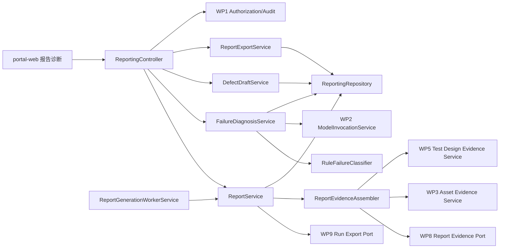

# WP10 报告与失败诊断 - 技术设计与接口契约

| 项目 | 内容 |
|---|---|
| 工作包 | WP10 报告与失败诊断 |
| 角色产出 | 资深服务端架构师 |
| 文档性质 | 技术设计、数据模型、状态机、接口契约和服务端质量约束 |
| 当前口径 | 当前范围已推进至 M10：`platform-api` 已新增 `reporting` 模块，消费 WP9/WP8/WP3/WP5 脱敏摘要，支持默认同步生成和可选异步生成 worker，通过既有快照提供同项目报告对比，通过 WP2 受控模型调用生成诊断建议，并提供缺陷草稿、JSON/Markdown 脱敏导出和 quality gate |
| 版本 | v0.3 |
| 日期 | 2026-06-17 |

## 1. 架构原则

1. WP10 是报告和诊断控制面，不触发 runner、不调度 execution run、不修改 WP9 状态。
2. API 使用统一 envelope，JSON 字段使用 camelCase，分页使用 `index/size`。
3. SQL 放在 MyBatis Mapper XML，不在 Java 代码拼接 SQL。
4. 不恢复多租户，不新增 `tenant_id`。
5. WP10 不直接读写 WP8/WP9/WP3/WP5 表，跨 WP 输入必须通过应用服务、导出接口或明确 port。
6. 报告生成必须快照化，`READY` 后详情不随源 run 静默变化。
7. 所有响应、导出、审计和模型输入默认 whitelist，禁止字段命中即阻断导出或模型调用。
8. Java 代码需符合《阿里巴巴 Java 开发手册》和仓库 `AGENTS.md` 注释准入要求。

## 2. 模块边界



| 组件 | 职责 |
|---|---|
| `ReportController` | health、生成、列表、详情、同项目快照对比和归档入口。 |
| `ReportGenerationWorkerService` | 可选后台生成 worker，按固定 delay 扫描 WP10 自身 `QUEUED` 报告，条件认领为 `GENERATING`，生成 `READY/FAILED` 快照，并恢复 stale `GENERATING`。 |
| `ReportCompareService` | 读取两份已存在的 WP10 快照，校验同项目约束，并输出 metadata、summary、诊断、evidence manifest 与 defect draft 的 aggregate-only diff。 |
| `FailureDiagnosisController` | 规则分类查询、AI 诊断触发和诊断详情。 |
| `DefectDraftController` | 缺陷草稿创建、审阅、dismiss 和 payload preview。 |
| `ReportExportController` | JSON/Markdown 脱敏摘要和 manifest 导出。 |
| `ReportService` | 报告状态机、幂等键、WP9 run export 读取、快照生成和审计。 |
| `ReportEvidenceAssembler` | 聚合 WP9/WP8/WP3/WP5 证据 manifest，从 WP9 脱敏节点摘要识别白名单 refs，经跨 WP 应用服务取 aggregate-only 证据，不保存原始 evidence 正文。 |
| `AssetCrossWpReportEvidenceService` | WP3 报告证据应用服务，按项目 scope 校验需求/API/页面/业务流/用例引用并返回状态、计数、digest 所需信号。 |
| `TestDesignCrossWpReportEvidenceService` | WP5 报告证据应用服务，按项目 scope 校验任务/候选引用并返回任务、候选和报告 manifest 聚合信号。 |
| `RuleFailureClassifier` | 根据状态、errorCode、nodeType、runnerMode、timeout、blocked 和 lease 状态分类失败。 |
| `FailureDiagnosisService` | 构造脱敏 bounded 上下文，调用 WP2，持久化诊断摘要和 fallback。 |
| `DefectDraftService` | 从报告和诊断生成平台内草稿，不写外部系统。 |
| `ReportExportService` | 生成导出摘要、字段集版本、digest 和 redaction scan 结果。 |
| `ReportingRepository` | MyBatis 仓储，维护报告、证据、诊断、草稿和导出 manifest。 |

## 3. 状态机

### 3.1 Report

```text
QUEUED -> GENERATING -> READY
QUEUED -> GENERATING -> FAILED
FAILED -> QUEUED       (retry generate)
READY -> ARCHIVED
FAILED -> ARCHIVED
```

异步生成关闭时，`POST /api/v1/reports` 和 FAILED retry 仍按兼容模式在请求线程内直接生成 `READY/FAILED` 快照。异步生成开启时，生成请求先写 `QUEUED`；后台 worker 通过条件更新完成 `QUEUED -> GENERATING` 认领，成功后写 `READY`、失败后写 `FAILED`。stale `GENERATING` 超过配置阈值会被恢复为 `FAILED/REPORT_GENERATION_TIMEOUT`。

非法状态流返回 `REPORT_INVALID_STATE` 并写拒绝审计。

### 3.2 Diagnosis

```text
NOT_REQUESTED -> RULE_READY
RULE_READY -> AI_RUNNING -> AI_READY
RULE_READY -> AI_RUNNING -> AI_FAILED
AI_FAILED -> AI_RUNNING  (retry diagnose)
```

AI 失败不回滚规则分类。

### 3.3 DefectDraft

```text
DRAFT -> REVIEWED
DRAFT -> DISMISSED
REVIEWED -> EXPORTED
DISMISSED -> DRAFT      (restore)
```

P0 的 `EXPORTED` 只表示平台内 payload preview 已生成，不表示外部系统写入成功。

## 4. 建议数据模型

| 表 | 关键字段 | 说明 |
|---|---|---|
| `report_execution_report` | `id/project_id/execution_run_id/request_key/status/schema_version/source_run_digest/report_summary_json/redaction_policy_json/generated_by/generated_at/failed_code/trace_id` | 报告主表和快照摘要。 |
| `report_evidence_manifest` | `id/report_id/source_wp/source_type/source_ref_digest/schema_version/summary_keys_json/redaction_flags_json/evidence_summary_json/created_at` | 证据 manifest，只保存引用、状态、计数、digest 和摘要 key。 |
| `report_failure_diagnosis` | `id/report_id/status/classification_json/model_invocation_digest/confidence/manual_review_required/diagnosis_summary_json/error_code/created_at/updated_at` | 规则分类和 AI 诊断结果。 |
| `report_defect_draft` | `id/report_id/diagnosis_id/status/title/reproduction_summary/impact_summary/priority_suggestion/evidence_refs_json/payload_preview_json/created_by/updated_by` | 缺陷草稿和外部 payload preview。 |
| `report_export_manifest` | `id/report_id/export_type/status/schema_version/field_set_version/redaction_policy_json/content_digest/aggregate_only/exported_by/exported_at/block_reason` | JSON/Markdown 导出 manifest。 |

索引要求：

1. `report_execution_report(project_id,status,generated_at)`。
2. `report_execution_report(project_id,execution_run_id,request_key)` 唯一。
3. `report_evidence_manifest(report_id,source_wp,source_type)`。
4. `report_failure_diagnosis(report_id,status,updated_at)`。
5. `report_defect_draft(report_id,status,updated_at)`。
6. `report_export_manifest(report_id,export_type,created_at)`。

## 5. 配置项草案

| 配置 | 默认值 | 说明 |
|---|---|---|
| `veri-agent.reporting.enabled` | `true` | WP10 报告控制面总开关。 |
| `veri-agent.reporting.generate-enabled` | `true` | 是否允许生成或重试报告。 |
| `veri-agent.reporting.async-generation-enabled` | `false` | 是否将生成和重试请求先写入 `QUEUED`，由后台 worker 异步处理；默认关闭以保持同步兼容。 |
| `veri-agent.reporting.generation-worker-enabled` | `true` | 是否启用 managed 后台生成 worker。 |
| `veri-agent.reporting.generation-worker-interval-ms` | `5000` | worker 固定 delay 轮询间隔，服务端会限制到安全范围。 |
| `veri-agent.reporting.generation-worker-initial-delay-ms` | `30000` | worker 启动后的初始延迟。 |
| `veri-agent.reporting.generation-worker-id` | `wp10-report-worker` | worker tick 和生成摘要中记录的 worker 标识。 |
| `veri-agent.reporting.generation-worker-batch-size` | `4` | 单次 worker tick 扫描和认领的 queued report 上限。 |
| `veri-agent.reporting.generation-running-timeout-seconds` | `1800` | `GENERATING` 超时恢复阈值。 |
| `veri-agent.reporting.generation-recovery-batch-size` | `50` | 单次 tick 恢复 stale `GENERATING` 的上限。 |
| `veri-agent.reporting.diagnosis-enabled` | `true` | 是否允许 AI 诊断；关闭后保留规则分类。 |
| `veri-agent.reporting.defect-draft-enabled` | `true` | 是否允许生成缺陷草稿。 |
| `veri-agent.reporting.export-enabled` | `true` | 是否允许导出脱敏摘要。 |
| `veri-agent.reporting.max-evidence-items` | `200` | 单报告 evidence manifest 上限。 |
| `veri-agent.reporting.max-diagnosis-context-chars` | `12000` | 发送 WP2 前的脱敏上下文字符上限。 |
| `veri-agent.reporting.max-export-markdown-chars` | `30000` | Markdown 摘要导出字符上限。 |
| `veri-agent.reporting.schema-version` | `wp10-report-v1` | 报告 schema version。 |
| `veri-agent.reporting.field-set-version` | `wp10-report-export-fields-v1` | 导出字段集版本。 |

## 6. 权限和审计

| 权限点 | 服务端用途 |
|---|---|
| `report:read` | health、列表、详情、诊断详情、草稿摘要读取。 |
| `report:generate` | 生成、重试报告和读取 WP9 run export。 |
| `report:diagnose` | 触发 AI 诊断。 |
| `report:export` | JSON/Markdown 摘要导出。 |
| `report:manage` | 归档报告、审阅和 dismiss 草稿。 |

审计事件：

| 事件 | 触发 | payload 要求 |
|---|---|---|
| `report.generated` | 报告生成成功 | reportId、projectId、executionRunId、schemaVersion、sourceRunDigest、evidenceCount |
| `report.generate.queued` | 异步生成或重试入队 | reportId、projectId、executionRunId、asyncGeneration、generationWorkerId |
| `report.generate.recovered` | stale `GENERATING` 被 worker 恢复为 FAILED | reportId、projectId、executionRunId、errorCode、workerRecovered |
| `report.generate.rejected` | 权限、状态、输入或源 run 阻断 | reasonCode、projectId、executionRunId digest、traceId |
| `report.diagnosis.requested` | AI 诊断请求 | reportId、contextDigest、modelPurpose、budgetPolicy |
| `report.diagnosis.completed` | 诊断完成或降级 | reportId、status、modelInvocationDigest、confidence、manualReviewRequired |
| `report.defect_draft.created` | 草稿创建 | reportId、draftId、diagnosisId、evidenceRefCount |
| `report.defect_draft.reviewed` | 草稿审阅、dismiss 或恢复 | reportId、draftId、fromStatus、toStatus、externalSystemWriteAttempted=false |
| `report.exported` | 导出成功 | reportId、exportType、contentDigest、fieldSetVersion、aggregateOnly |
| `report.export.blocked` | 脱敏扫描阻断 | reportId、blockedReason、matchedPolicyCode、traceId |

审计 payload 不记录 actor 之外的个人标识值、原始 payload、Prompt、响应正文、stdout/stderr、secretRef 明文、token、cookie 或 Authorization。

## 7. 跨 WP Port 契约

| Port | 输入 | 输出白名单 | 禁止 |
|---|---|---|---|
| WP9 run export | `executionRunId`、project scope | `ExecutionRunExportResponse` 中 schemaVersion、run、nodes、nodeStatusCounts、redactionPolicy | raw runner artifact、stdout/stderr、请求响应正文、webhook payload、claimToken |
| WP9 handoff | run detail 中 `REPORT_HANDOFF` 节点摘要 | `reportHandoffReady/rawReportStored=false/schemaVersion/summaryDigest` | report body、raw evidence |
| WP8 evidence | projectId、run/account/data refs | `TestDataReportEvidenceResponse` 中 refs、status、counts、digest、summary keys、脱敏账号摘要 | `secret://` 原文、lease token、密码、cookie、Authorization、数据正文 |
| WP3 asset summary | projectId、trace refs | 需求/API/页面/业务流/用例计数、状态、digest 和 trace coverage | 资产正文、内部 ID 清单、原型完整 JSON |
| WP5 manifest | task/report refs | aggregate-only manifest、row count、digest、policy flags | 候选正文、Prompt、模型载荷、评审意见原文 |
| WP2 diagnosis invocation | 脱敏 diagnosis context | invocationId digest、status、model output 摘要、成本和 fallback 信息 | provider secret、raw prompt/raw response 进入报告响应 |

## 8. 接口契约

统一前缀：`/api/v1/reports`

| 方法 | 路径 | 权限 | 说明 |
|---|---|---|---|
| `GET` | `/health` | 公开只读 | 返回开关、limits、schema 和 redaction policy 摘要；不返回报告、证据、provider、prompt 或 secret 明细。 |
| `POST` | `/` | `report:generate` | M10 已实现。默认同步基于 executionRunId 生成 aggregate-only 报告快照；开启 `async-generation-enabled` 时先返回 `QUEUED`，由 WP10 worker 后台生成。 |
| `GET` | `/` | `report:read` | M2 已实现。分页查询报告列表，支持 `projectId`、`executionRunId`、`status`。 |
| `GET` | `/{id}` | `report:read` | M10 已实现。查询报告详情并返回 WP9/WP8/WP3/WP5 evidence manifest、最新诊断和缺陷草稿摘要。 |
| `GET` | `/{id}/compare?baselineReportId=` | `report:read` | M10 已实现。对比当前报告与同项目 baseline 报告的 aggregate-only metadata、summary、最新诊断、evidence manifest 和缺陷草稿聚合差异；拒绝自比和跨项目对比。 |
| `POST` | `/{id}/retry` | `report:generate` | M10 已实现。仅允许 FAILED 报告重试；同步模式直接重新生成，异步模式先清理主表失败字段和 summary 旧失败标记后入队。 |
| `POST` | `/{id}/archive` | `report:manage` | M2 已实现。归档报告并记录 `report.archived` 审计事件。 |
| `POST` | `/{id}/diagnoses` | `report:diagnose` | M4C 已实现。READY 报告可触发 WP2 受控 AI 诊断，成功写 `AI_READY` 和 model invocation digest，失败写 `AI_FAILED/REPORT_DIAGNOSIS_POLICY_BLOCKED` 并保留规则 fallback。 |
| `GET` | `/{id}/diagnoses/latest` | `report:read` | M4C 已实现。按项目 scope 查询最新诊断详情。 |
| `POST` | `/{id}/defect-drafts` | `report:generate` | M5B 已实现。基于 READY 报告、latest diagnosis 和 evidence digest 生成平台内 DRAFT 草稿。 |
| `PATCH` | `/{id}/defect-drafts/{draftId}` | `report:manage` | M5B 已实现。支持 `DRAFT -> REVIEWED/DISMISSED`，拒绝非法状态流。 |
| `GET` | `/{id}/export` | `report:export` | M5A 已实现。`exportType=JSON|MARKDOWN` 导出脱敏摘要和 manifest；只允许 READY 报告，数据库仅保存 export manifest、content digest 和 redaction policy，不保存导出正文。 |

## 9. 关键请求与响应

### 9.1 生成报告

```json
{
  "projectId": "project-alpha",
  "executionRunId": "uuid",
  "requestKey": "release-2026-06-16-smoke-report",
  "reason": "release gate"
}
```

```json
{
  "id": "uuid",
  "projectId": "project-alpha",
  "executionRunId": "uuid",
  "status": "READY",
  "schemaVersion": "wp10-report-v1",
  "sourceRunDigest": "sha256-hex",
  "idempotentReplay": false,
  "summary": {
    "runStatus": "FAILED",
    "triggerType": "WEBHOOK",
    "durationMillis": 95321,
    "nodeStatusCounts": {"SUCCEEDED": 3, "FAILED": 1, "BLOCKED": 1},
    "failureBucketCounts": {"ASSERTION_FAILED": 1, "DEPENDENCY_BLOCKED": 1}
  },
  "redactionPolicy": {
    "aggregateOnly": true,
    "crossWpDirectTableReadAllowed": false,
    "rawRunnerArtifactStored": false,
    "secretPlaintextStored": false,
    "requestResponseBodyStored": false
  },
  "traceId": "trc_xxx"
}
```

M2 实现说明：`projectId` 入参可为项目 code 或 ID，服务端会通过 platform context 规范化为项目资源 ID 后落库。生成前先调用 WP9 `runProjectScopeId` 做项目归属校验，跨项目 run 返回 `REPORT_SOURCE_RUN_NOT_FOUND` 且不会触发 WP9 export；只有归属通过后才调用 `ExecutionRunService.exportRun`。源 run 必须处于终态并包含 `REPORT_HANDOFF` 节点摘要 `reportHandoffReady=true/rawReportStored=false`，否则返回 `REPORT_SOURCE_RUN_NOT_READY`。`sourceRunDigest` 基于 WP9 脱敏 export 的 schema、run、nodeStatusCounts 和 redactionPolicy 计算，报告表不保存 runner 原始产物、请求/响应正文、secret 明文、raw prompt 或 raw response。

M10 实现说明：`async-generation-enabled=false` 时继续沿用 M2 同步行为，避免改变既有调用方响应语义。开启 `async-generation-enabled=true` 后，生成请求只创建 `QUEUED` 报告快照，summary 写入 `generationStatus=QUEUED`、`asyncGeneration=true`、`queuedAt` 和 reason 标记；`ReportGenerationWorkerService` 定时 tick 先恢复 stale `GENERATING`，再按 `generation-worker-batch-size` 扫描 queued report，通过 `updateReportIfStatus(report, "QUEUED")` 条件更新认领为 `GENERATING`。认领成功后仍复用 WP9 run export、evidence assembler、规则分类和脱敏策略生成 `READY`；BusinessException 或 RuntimeException 会被脱敏后写入 `FAILED`，避免队列无限重试和错误摘要泄露。`retry` 在异步模式下只允许 `FAILED -> QUEUED`，会清理主表 `failedCode/failureSummary` 和 summary 中旧 `failureCode/failureSummaryStored/workerRecovered`，旧失败仍保留在审计链路。

M3A 实现说明：报告生成和 FAILED 重试会从 WP9 脱敏 run export 的 node 列表生成 `report_evidence_manifest`。每条 manifest 只保存 `sourceWp=WP9`、`sourceType=EXECUTION_NODE`、source reference digest、summary key 白名单、redaction flags 和节点级 aggregate summary；不保存 `resultSummary` 值、externalRunId 明文、errorSummary、runner stdout/stderr、请求/响应正文、secret 明文或 raw prompt/response。异步模式下，这一过程由 worker 认领的 `GENERATING` 报告执行，状态变化通过条件更新防止重复认领。

M3B 实现说明：报告生成和 FAILED 重试会从 WP9 节点 `resultSummary` 中按白名单识别 `dataSetRef(s)`、`testDataSetRef(s)`、`accountLeaseRef(s)`、`cleanupTaskRef(s)` 和 `testDataCleanupTaskRef(s)`，通过 WP8 `TestDataCrossWpReferenceService#reportEvidence` 获取 aggregate-only evidence。WP10 不直连 WP8 表；只持久化 `sourceWp=WP8`、`sourceType=TEST_DATA_SET/ACCOUNT_LEASE/CLEANUP_TASK`、source reference digest、summary key 白名单、redaction flags、计数、状态、digest、scope summary key 和必要时间戳。账号租借 manifest 不保存 `accountLeaseRef` 原文、holderRef 原文、账号 key/displayName、roleTags 值、scopeSummary 值、`secret://` 原文、secretRef 原文、lease token、密码、cookie 或 Authorization。异步 worker 的 stale 恢复会在处理 queued 报告前先把超时 `GENERATING` 收敛为 `FAILED`，保证队列不会被卡死。

M9 实现说明：报告生成和 FAILED 重试会继续从 WP9 脱敏节点 `resultSummary` 的白名单字段识别 WP3 `requirementRef(s)`、`apiRef(s)`、`pageRef(s)`、`businessFlowRef(s)`、`testCaseRef(s)` 及其 `wp3*` 别名，并调用 `AssetCrossWpReportEvidenceService#reportEvidence` 获取 aggregate-only 资产证据。WP3 manifest 使用 `sourceWp=WP3`、`schemaVersion=wp3-report-evidence-v1`，sourceType 包括 `REQUIREMENT/API/PAGE/BUSINESS_FLOW/TEST_CASE`；只保存 source reference digest、状态、优先级、版本、生命周期、tag/step/trace link/关联资产计数和更新时间，不保存资产正文、验收标准、trace identifier 列表、原型 JSON、请求响应正文或 secret 明文。WP3 服务先通过 `AssetProjectAuditService` 解析项目 scope，再校验每个引用归属，并把 trace link 计数约束在同项目资产集合内。异步 worker 对 `QUEUED` 的处理仍复用这一契约，不额外引入任何跨 WP 直连或二次抓取。

M9 实现说明：报告生成和 FAILED 重试会从 WP9 脱敏节点 `resultSummary` 的白名单字段识别 WP5 `testDesignTaskRef(s)`、`wp5TaskRef(s)`、`testDesignCandidateRef(s)` 和 `wp5CandidateRef(s)`，并调用 `TestDesignCrossWpReportEvidenceService#reportEvidence` 获取 aggregate-only 测试设计证据。WP5 manifest 使用 `sourceWp=WP5`、`schemaVersion=wp5-report-evidence-v1`，sourceType 包括 `TEST_DESIGN_TASK/TEST_DESIGN_CANDIDATE`；只保存任务状态、需求/覆盖类型计数、生成/确认/发布计数、候选状态分布、报告 manifest 计数、manifest digest、候选状态/覆盖类型/优先级/置信度/版本和关联 refs 的 digest，不保存候选正文、前置条件、步骤、期望、评审意见、Prompt 原文、provider/model payload、审计明细或模型响应。`maxEvidenceItems` 会限制单报告 WP9+WP8+WP3+WP5 manifest 总数，并在 report summary 标记 `evidenceManifestTruncated`；即使容量被 WP9 节点占满，只要 WP9 摘要出现跨 WP 引用，WP10 仍先调用对应契约完成项目 scope 和引用有效性校验。health 中 `wp3EvidenceManifestReady=true`、`wp5EvidenceManifestReady=true`、`evidenceAggregationReady=true`。M10 异步 worker 只是在这套证据契约上增加后台认领与 stale 恢复，不改变 manifest 语义。

M4A 实现说明：报告生成和 FAILED 重试会基于已持久化的 evidence manifest 调用 `RuleFailureClassifier`，生成并持久化 `status=RULE_READY` 的 `report_failure_diagnosis`。分类只消费 WP9/WP8 manifest 的脱敏摘要和 `sourceRefDigest`，不读取 WP9/WP8 原表、不使用 `errorSummary`、不调用 WP2、不保存 raw prompt/raw response。当前分类 bucket 包括 `NO_FAILURE`、`TIMEOUT`、`DEPENDENCY_BLOCKED`、`ASSERTION_FAILED`、`TEST_DATA_ACCOUNT`、`RUNNER_FAILURE` 和 `UNKNOWN`；详情 `latestDiagnosis` 返回 `classification`、`rootCauseCandidates`、`confidence`、`manualReviewRequired`、`evidenceRefs`、`nextActions` 和 redaction policy。报告 summary 同步写入 `diagnosisStatus`、`diagnosisRuleVersion`、`diagnosisPrimaryCategory` 和 `diagnosisManualReviewRequired`，便于列表和导出复用。

M4C 实现说明：`POST /api/v1/reports/{id}/diagnoses` 会校验 reporting/diagnosis 开关、报告状态和 `report:diagnose` 项目 scope，只允许 READY 报告触发。服务端基于当前规则诊断和 evidence manifest 构造 bounded diagnosis context，但正文只用于发送 WP2 和计算 `contextDigest`，不会持久化或返回；字段名和值均按安全规则过滤，响应只包含 `diagnosisContext.contextDigest/contextStored=false/bounded/truncated/maxChars/sourceEvidenceManifestCount/rawPromptStored=false/rawResponseStored=false`。WP2 成功时诊断状态写为 `AI_READY`，`modelInvoked=true`、`aiDiagnosisReady=true`、`classificationOnly=false`，持久化 `modelInvocationDigest` 和模型输出 digest-only 元数据，不保存 raw prompt/raw response；响应仍保留规则 classification、rootCauseCandidates、confidence 和 `manualReviewRequired=true`。WP2 预算、策略、敏感内容或 provider 失败时写为 `AI_FAILED/REPORT_DIAGNOSIS_POLICY_BLOCKED`，`modelInvoked=false`、`aiDiagnosisReady=false`、`classificationOnly=true`，规则 fallback 可用。`GET /api/v1/reports/{id}/diagnoses/latest` 返回同一最新诊断快照。health 中 `diagnosisApiReady=true`、`aiDiagnosisReady=true`、`aiDiagnosisFallbackReady=true`。

M5A 实现说明：`GET /api/v1/reports/{id}/export?exportType=JSON|MARKDOWN` 会校验 reporting/export 开关、`report:export` 项目 scope、报告存在性和 READY 状态。导出内容即时从 `report_execution_report`、`report_evidence_manifest` 和最新 `report_failure_diagnosis` 的聚合快照生成，只包含 report snapshot、summary、evidence manifest 摘要、latestDiagnosis 和 redaction policy；不包含 runner stdout/stderr、请求响应正文、webhook payload、raw prompt/raw response、provider payload、secret/token/cookie/Authorization、`secret://` 原文、账号 lease token 或跨 WP 原始 ID 清单。服务端会过滤高风险 key、脱敏文本并扫描导出正文；命中禁止文本时写入 `report_export_manifest.status=BLOCKED/blockReason=REPORT_EXPORT_REDACTION_BLOCKED` 并返回空 `content`。成功时写入 `CREATED` manifest、`contentDigest`、`schemaVersion`、`fieldSetVersion`、`aggregateOnly=true`、`exportedBy/exportedAt` 和 redaction policy，报告 summary 同步更新 `exportManifestCount`。导出正文不落库，不写外部缺陷系统。health 中 `exportSummaryReady=true`。

M5B 实现说明：`POST /api/v1/reports/{id}/defect-drafts` 会校验 reporting/defect-draft 开关、`report:generate` 项目 scope、报告存在性和 READY 状态。服务端只从已持久化 report summary、latest diagnosis 和 evidence manifest digest 生成草稿，不读取 WP9/WP8/WP3/WP5 原表，不保存原始 evidence 正文。草稿字段包括 `title`、`reproductionSummary`、`impactSummary`、`prioritySuggestion`、`evidenceRefs` 和 `payloadPreview`；`payloadPreview.schemaVersion=wp10-defect-preview-v1`、`masked=true`、`aggregateOnly=true`、`externalSystemWriteAttempted=false`，并标记 `rawEvidenceIncluded=false/rawPromptStored=false/rawResponseStored=false/credentialPlaintextStored=false`。`PATCH /api/v1/reports/{id}/defect-drafts/{draftId}` 支持审阅状态流 `DRAFT -> REVIEWED/DISMISSED` 和 `DISMISSED -> DRAFT` 恢复，非法状态流返回 `REPORT_DEFECT_DRAFT_INVALID_STATE`。报告详情同步返回 `defectDrafts`，列表 summary 同步更新 `defectDraftCount`。health 中 `defectDraftReady=true`。

### 9.2 诊断详情

```json
{
  "reportId": "uuid",
  "status": "AI_READY",
  "classification": {
    "primaryCategory": "ASSERTION_FAILED",
    "secondaryCategory": "DEPENDENCY_BLOCKED",
    "ruleVersion": "wp10-failure-classifier-v1"
  },
  "rootCauseCandidates": [
    {
      "category": "ASSERTION_FAILED",
      "summary": "接口断言失败，失败节点集中在 release smoke 的 API_TEST",
      "confidence": 0.71,
      "evidenceRefs": ["wp9:node:sha256-hex"],
      "nextActions": ["检查断言期望值是否与当前 staging 配置一致"]
    }
  ],
  "manualReviewRequired": true,
  "modelInvocationDigest": "sha256-hex",
  "redactionPolicy": {
    "rawPromptExported": false,
    "rawResponseExported": false,
    "payloadPreviewExported": false
  }
}
```

M4C 当前响应口径：报告生成后默认 `latestDiagnosis.status=RULE_READY`；手动触发诊断后，WP2 成功时最新诊断会变为 `AI_READY` 并返回 64 位 `modelInvocationDigest`，WP2 预算、策略、敏感内容或 provider 失败时变为 `AI_FAILED/REPORT_DIAGNOSIS_POLICY_BLOCKED`。`AI_READY` 保持 `classificationOnly=false`、`modelInvoked=true`、`aiDiagnosisReady=true`，`AI_FAILED` 保持 `classificationOnly=true`、`modelInvoked=false`、`aiDiagnosisReady=false`；两种状态都只返回 digest-only `diagnosisContext`，不返回 context 正文。`rootCauseCandidates[*].evidenceRefs` 仅包含 `wp9:execution_node:<digest>` 或 `wp8:account_lease:<digest>` 这类 digest 引用，不包含源节点 ID、账号租借 ID 或账号凭据。

### 9.3 导出摘要

```json
{
  "schemaVersion": "wp10-report-export-v1",
  "fieldSetVersion": "wp10-report-export-fields-v1",
  "exportedAt": "2026-06-16T10:00:00Z",
  "exportType": "JSON",
  "report": {},
  "diagnosis": {},
  "defectDrafts": [],
  "manifest": {
    "aggregateOnly": true,
    "contentDigest": "sha256-hex",
    "redactionPolicy": {
      "rawRunnerArtifactExported": false,
      "rawPromptExported": false,
      "secretPlaintextExported": false
    }
  }
}
```

## 10. 错误码草案

| 错误码 | 场景 |
|---|---|
| `REPORT_DISABLED` | reporting 总开关关闭。 |
| `REPORT_GENERATE_DISABLED` | 生成开关关闭。 |
| `REPORT_SOURCE_RUN_NOT_FOUND` | WP9 run 不存在或不可见。 |
| `REPORT_SOURCE_RUN_NOT_READY` | 源 run 尚未终态或无 handoff 摘要。 |
| `REPORT_INVALID_STATE` | 状态流非法。 |
| `REPORT_EVIDENCE_REDACTION_BLOCKED` | 证据或导出命中禁止字段。 |
| `REPORT_DIAGNOSIS_DISABLED` | AI 诊断开关关闭。 |
| `REPORT_DIAGNOSIS_POLICY_BLOCKED` | WP2 策略、预算或敏感内容拦截。 |
| `REPORT_EXPORT_DISABLED` | 导出开关关闭。 |
| `REPORT_DEFECT_DRAFT_DISABLED` | 缺陷草稿开关关闭。 |

## 11. 安全红线

禁止进入报告详情、导出、模型输入、审计 payload 和前端 DOM 的字段或内容：

1. secret、token、cookie、Authorization、password、credential、lease token。
2. `secret://` 原文、完整 secretRef、provider apiKeyRef 明文。
3. runner stdout/stderr、请求正文、响应正文、webhook payload、截图、视频和源码包。
4. raw prompt、raw model response、provider error 原文、候选正文和评审意见原文。
5. 原始账号健康摘要、账号密码、一次性验证码、邮箱或手机号明文。

## 12. 验证入口

WP10 涉及权限、数据库、审计、模型调用和跨 WP 发布准出，代码阶段必须参考 `doc/mvp/final/engineering/WP1-WP4-统一发布准出清单.md`，并新增以下入口：

```bash
mvn -B -pl platform-api test
cd portal-web && npm test
cd portal-web && npm run build
bash db/validation/run_wp1_db_validation.sh
bash scripts/platform_api_java_line_guard.sh
bash scripts/wp10_report_smoke.sh
bash scripts/wp10_export_redaction_smoke.sh
bash scripts/wp10_diagnosis_quality_eval.sh
bash scripts/wp10_diagnosis_redaction_eval.sh
bash scripts/wp10_quality_gate.sh
```

release 模式必须显式启用 managed report smoke，避免只通过单元测试就放行报告生成主链路。M10 还必须覆盖 `ReportGenerationWorkerServiceTest`、health worker 字段、JDBC `queuedReports/updateReportIfStatus/generatingReportsUpdatedBefore` contract、Java 行数门禁和 `git diff --check`。

## 13. M8B 运维 Runbook 记录

M8B 已新增 `WP10-报告与失败诊断-运维Runbook.md`，将本技术契约中的配置开关、状态机、错误码、DB validation、审计事件、跨 WP aggregate-only 边界、WP2 bounded context 和导出脱敏策略整理为可执行排障步骤。

该 Runbook 不改变运行时 API、DB schema、模型调用或脚本语义；仅补齐报告生成失败、evidence manifest 异常、AI 诊断降级、模型预算阻断、缺陷草稿异常、导出阻断、敏感泄露、前端 DOM smoke 和回滚止血的运维说明。
