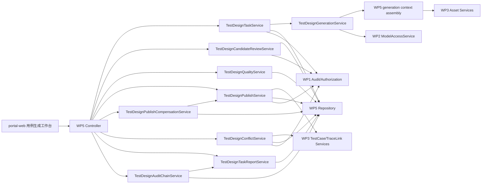

# WP5 AI 用例生成与评审 - 技术设计与接口契约

| 项目 | 内容 |
|---|---|
| 工作包 | WP5 AI 用例生成与评审 |
| 角色产出 | 资深服务端架构师 |
| 文档性质 | 技术设计、数据模型、接口契约和服务端质量约束 |
| 当前口径 | WP5 在 `platform-api` 内实现为独立领域模块，不新增独立部署服务；模块内应用服务按任务、生成、评审、质量、发布、发布补偿、冲突、报告、上下文策略和跨 WP 审计链聚合拆分；任务本域审计链摘要由报告服务聚合 WP5 任务、评审和发布记录；任务级跨 WP 审计链只读聚合由 `TestDesignAuditChainService` 输出 aggregate-only 看板骨架，聚合任务相关 WP1 audit_log、WP2 invocation/job、WP3 发布引用、WP5 本域事件和 audit outbox 状态计数，不导出审计事件明细或跨域标识；Prompt 趋势按版本输出聚合准出摘要和准出状态分布；`scope-summary` 按项目 scope 输出任务/候选/发布记录项目一致性和导出红线聚合；任务创建支持显式 API/页面/业务流上下文资产和 `environmentKey`，并将上下文裁剪策略、项目/环境 effective context policy、`generationOrchestrationPolicy` 生成编排策略、`scopePolicy` 权限与资源作用域策略、`evaluationCorpusPolicy` 评测语料运营策略、`releaseReadinessPolicy` 发布准出审批策略、`auditChainPolicy` 跨 WP 审计链策略、`modelObservationPolicy` 模型观测策略、`archivePolicy` 归档治理策略、`reportManifestPolicy` 报告清单策略、`contextAssemblyPolicy` v2 装配策略安全边界、治理状态快照和 `contextPolicyOperations` v2 运营聚合快照暴露到 health、任务诊断、模型上下文打包、任务上下文摘要和任务全量报告；发布服务在配置开启时按任务聚合质量 `BLOCKED` 阻断正式发布，dryRun 保持可诊断；portal-web 工作台已提供最小上下文策略运营面板，复用策略 API 查询 effective policy/覆盖记录、提交项目或环境级 bounded 覆盖并审批/驳回 PENDING 记录；任务报告导出增加治理聚合行、生成编排策略聚合行、作用域策略聚合行、评测语料策略聚合行、发布准出审批策略聚合行、跨 WP 审计链策略聚合行、上下文装配策略 v2 聚合行、上下文策略治理聚合行、上下文策略运营 v2 聚合行、模型观测策略聚合行、质量准出阈值策略聚合行、导出审计策略聚合行、安全扫描策略聚合行、归档策略聚合行、报告清单策略聚合行、Prompt 校准策略聚合行、发布补偿策略聚合行、报告 manifest 聚合行、最终安全扫描和安全扫描通过后的 aggregate-only manifest 持久化；发布补偿后台仅自动处理已持有 WP3 用例引用的失败候选，不自动首次创建用例或解决高相似冲突 |
| 版本 | v0.37 |
| 日期 | 2026-05-31 |

## 1. 架构原则

1. WP5 是任务/领域拆分，不是独立部署服务拆分，包路径建议为 `com.songhg.veri.agent.testdesign`；模块内部不得用单一 God Object 承载任务、生成、质量、发布、冲突和报告职责。
2. API 使用统一 envelope，JSON 字段使用 camelCase，分页使用 `index`、`size`。
3. SQL 放在 MyBatis Mapper XML，不在 Java 代码拼接 SQL。
4. 不恢复多租户，不在 WP5 表中增加 `tenant_id`。
5. WP5 不直接调用模型厂商 SDK，只通过 WP2 模型接入应用服务。
6. WP5 不直接读写 WP3 表，只通过 WP3 应用服务读取资产、创建用例和创建追踪关系。
7. 生成候选必须人工评审后才能发布到 WP3。
8. Java 代码需符合《阿里巴巴 Java 开发手册》和仓库 `AGENTS.md` 注释准入要求。

## 2. 模块边界



| 组件 | 职责 |
|---|---|
| `TestDesignTaskController` | 任务创建、列表、详情、取消、重试。 |
| `TestDesignCandidateController` | 候选查询、详情、编辑、确认、驳回、忽略、批量操作。 |
| `TestDesignTaskPublishController` | 发布 dryRun、正式发布、发布记录查询和任务评审历史导出。 |
| `TestDesignTaskService` | 任务查询、任务摘要、服务健康、创建、重试、取消、异步消费认领、状态落库、幂等和任务审计。 |
| `TestDesignGenerationService` | 装配脱敏上下文、读取任务创建时固化的 effective context policy、选择规则模板或 WP2 模型生成、解析模型输出、生成候选批次并执行生成质量校验；不创建任务、不做状态流转、不写审计。 |
| `TestDesignContextPolicyService` | 管理 WP5 项目/环境上下文策略覆盖元数据、审批状态和 effective policy 解析；只保存有界数字、固定状态和原因枚举捕获状态，不保存策略正文、策略 diff、审批备注、工单 URL 或上下文正文。 |
| `TestDesignCandidateReviewService` | 候选查询、编辑、确认、驳回、忽略、批量评审和评审记录导出。 |
| `TestDesignQualityService` | 判断空步骤、缺断言、重复风险、覆盖缺口、敏感信息风险和发布就绪。 |
| `TestDesignPublishService` | 发布 dryRun、正式发布、发布记录查询，将已确认候选写入 WP3 测试用例并建立追踪关系。 |
| `TestDesignPublishCompensationService` | 定时扫描已持有 WP3 用例引用的失败候选，复用发布服务的 sourceRef 回放与 trace link 修复路径；执行时通过候选级事务锁、锁内重读和自动补偿记录唯一约束避免重复补偿记账；不自动首次创建用例，也不自动处理高相似冲突。 |
| `TestDesignConflictService` | 发布冲突人工链接和批量冲突处理，复用 WP3 用例需求追踪校验和审计记录。 |
| `TestDesignTaskReportService` | 导出任务级聚合报告，提供任务本域审计链摘要，并在最终安全扫描通过后保存 aggregate-only manifest 归档核验记录，避免报告拼装逻辑回流到任务服务。 |
| `TestDesignAuditChainService` | 提供任务级跨 WP 审计链只读聚合骨架，复用本域审计摘要并通过仓储读取 WP1/WP2/WP3/outbox 计数；只返回 aggregate-only 指标和 readiness，不返回审计行、候选 ID、traceId、模型调用 ID、sourceRef 或 WP3 资产 ID。 |
| `TestDesignScopeService` | 为权限解析提供任务/候选项目作用域，不承载业务流。 |
| `TestDesignRepository` | 维护生成任务、候选、评审记录、发布记录、报告 manifest 聚合记录和任务级跨 WP 审计链聚合只读查询。 |

服务拆分准入：`ModuleLayerDependencyTest` 禁止重新引入 `TestDesignService` 或 `Facade` 命名服务，禁止 `TestDesignGenerationService` 持有创建/重试/异步消费入口，并将 WP5 单个应用服务上限收紧为 1200 行。

## 3. 状态机

### 3.1 生成任务状态

```text
DRAFT -> RUNNING -> SUCCEEDED
DRAFT -> RUNNING -> PARTIAL_SUCCESS
DRAFT -> RUNNING -> FAILED
RUNNING -> CANCELLED
FAILED -> RUNNING
PARTIAL_SUCCESS -> RUNNING
SUCCEEDED -> PUBLISHING -> PUBLISHED
SUCCEEDED -> PUBLISHING -> PARTIAL_SUCCESS
```

非法状态流必须返回 `INVALID_STATE` 并写入拒绝审计。

### 3.2 候选状态

```text
GENERATED -> EDITED -> CONFIRMED -> PUBLISHED
GENERATED -> CONFIRMED -> PUBLISHED
GENERATED -> REJECTED
GENERATED -> IGNORED
EDITED -> REJECTED
EDITED -> IGNORED
CONFIRMED -> EDITED
CONFIRMED -> IGNORED
```

已 `PUBLISHED` 候选不可再次编辑，只能查看和跳转 WP3 用例。

## 4. 建议数据模型

### 4.1 `test_design_task`

| 字段 | 类型 | 说明 |
|---|---|---|
| `id` | uuid | 主键 |
| `project_id` | varchar(64) | 项目 ID |
| `name` | varchar(160) | 任务名称 |
| `strategy` | varchar(64) | 主策略，如 `FUNCTIONAL` |
| `coverage_types` | text | 逗号分隔覆盖类型或 JSON 数组 |
| `requirement_ids` | jsonb | 本任务需求 ID 列表 |
| `context_options_json` | jsonb | 是否带入 API、页面、流程、历史用例等 |
| `status` | varchar(32) | 任务状态 |
| `prompt_key` | varchar(128) | 默认 `wp5-test-case-design` |
| `prompt_version` | varchar(64) | Prompt 版本 |
| `model_invocation_id` | uuid | WP2 调用 ID |
| `model_provider_name` | varchar(128) | provider 名称 |
| `model_name` | varchar(128) | 模型名称 |
| `input_digest` | varchar(96) | 上下文摘要 hash |
| `context_summary_json` | jsonb | 脱敏后的上下文摘要 |
| `quality_summary_json` | jsonb | 覆盖、重复、质量提示摘要 |

### 3.1.1 test_design_context_policy_override

`test_design_context_policy_override` 保存 WP5 上下文裁剪策略覆盖元数据。表只允许存储 bounded 数字、审批状态、项目/环境 scope 和原因枚举编码，不允许新增策略正文、策略 diff、审批备注、工单 URL、上下文正文、Prompt 正文或报告正文列。

| 字段 | 类型 | 说明 |
|---|---|---|
| `id` | uuid | 覆盖记录 ID |
| `scope_type` | varchar(32) | `PROJECT` 或 `ENVIRONMENT` |
| `project_id` | varchar(64) | 所属项目 |
| `environment_key` | varchar(64) | 环境级覆盖键；项目级为空 |
| `status` | varchar(32) | `PENDING`、`APPROVED`、`REJECTED` |
| `context_linked_assets_per_requirement` | int | 每需求关联资产上限，可空，约束 `1..50` |
| `context_explicit_assets_per_type` | int | 每类显式资产上限，可空，约束 `1..50` |
| `context_existing_cases_per_requirement` | int | 每需求历史用例上限，可空，约束 `1..50` |
| `context_requirement_description_chars` | int | 需求描述摘要字符上限，可空，约束 `1..2000` |
| `context_acceptance_criteria_chars` | int | 验收标准摘要字符上限，可空，约束 `1..2000` |
| `context_asset_schema_chars` | int | 资产 schema 摘要字符上限，可空，约束 `1..2000` |
| `change_reason_code` | varchar(64) | 固定原因编码，只在 API 响应中披露 captured 布尔值 |
| `approval_reason_code` | varchar(64) | 固定审批原因编码，只在 API 响应中披露 captured 布尔值 |
| `requested_by` / `approved_by` | varchar(128) | 操作人摘要 |
| `created_at` / `updated_at` | timestamptz | 时间戳 |
| `candidate_count` | int | 候选数 |
| `confirmed_count` | int | 已确认数 |
| `published_count` | int | 已发布数 |
| `last_error_code` | varchar(64) | 最近错误码 |
| `last_error_message` | varchar(500) | 脱敏错误摘要 |
| `trace_id` | varchar(64) | 最近 traceId |
| `created_by` | varchar(64) | 创建人 |
| `created_at` | timestamptz | 创建时间 |
| `updated_at` | timestamptz | 更新时间 |

建议索引：

- `idx_test_design_task_project_status(project_id, status, updated_at desc)`
- `idx_test_design_task_created_by(created_by, created_at desc)`
- `uk_test_design_task_input(project_id, input_digest, prompt_key, prompt_version)` 可用于幂等提示，不强制唯一阻断。

### 4.2 `test_design_candidate`

| 字段 | 类型 | 说明 |
|---|---|---|
| `id` | uuid | 主键 |
| `task_id` | uuid | 任务 ID |
| `project_id` | varchar(64) | 项目 ID |
| `requirement_id` | uuid | WP3 需求 ID |
| `api_id` | uuid | WP3 API ID，可空 |
| `page_id` | uuid | WP3 页面 ID，可空 |
| `flow_id` | uuid | WP3 业务流 ID，可空 |
| `asset_test_case_id` | uuid | 发布后 WP3 测试用例 ID |
| `title` | varchar(200) | 标题 |
| `description` | text | 描述 |
| `precondition` | text | 前置条件 |
| `priority` | varchar(16) | 优先级 |
| `coverage_type` | varchar(32) | 覆盖类型 |
| `steps_json` | jsonb | 步骤数组 |
| `tags` | varchar(500) | 标签 |
| `rationale` | text | 生成依据 |
| `source_refs_json` | jsonb | 来源引用 |
| `quality_flags_json` | jsonb | 质量提示 |
| `duplicate_key` | varchar(128) | 标题/需求/步骤摘要 hash |
| `status` | varchar(32) | 候选状态 |
| `review_comment` | varchar(500) | 驳回或忽略原因 |
| `version` | int | 乐观锁 |
| `created_at` | timestamptz | 创建时间 |
| `updated_at` | timestamptz | 更新时间 |

建议索引：

- `idx_test_design_candidate_task(task_id, status, updated_at desc)`
- `idx_test_design_candidate_project(project_id, requirement_id, status)`
- `idx_test_design_candidate_duplicate(project_id, requirement_id, duplicate_key)`
- `uk_test_design_candidate_source(task_id, requirement_id, duplicate_key)` 防止同任务重复候选。

### 4.3 `test_design_review_record`

| 字段 | 类型 | 说明 |
|---|---|---|
| `id` | uuid | 主键 |
| `candidate_id` | uuid | 候选 ID |
| `action` | varchar(32) | `EDIT/CONFIRM/REJECT/IGNORE/PUBLISH` |
| `before_json` | jsonb | 操作前快照 |
| `after_json` | jsonb | 操作后快照 |
| `diff_json` | jsonb | 字段差异 |
| `comment` | varchar(500) | 评审备注 |
| `actor_user_id` | varchar(64) | 操作者 |
| `trace_id` | varchar(64) | traceId |
| `created_at` | timestamptz | 创建时间 |

### 4.4 `test_design_publish_record`

| 字段 | 类型 | 说明 |
|---|---|---|
| `id` | uuid | 主键 |
| `task_id` | uuid | 任务 ID |
| `candidate_id` | uuid | 候选 ID |
| `asset_test_case_id` | uuid | WP3 用例 ID |
| `action` | varchar(32) | `CREATE/SKIP_PUBLISHED/SKIP_UNCONFIRMED/LINK_EXISTING/RETRY_LINK_EXISTING/DUPLICATE_REVIEW_REQUIRED/MANUAL_LINK_EXISTING/AUTO_COMPENSATE_LINK_EXISTING` |
| `status` | varchar(32) | `PLANNED/SUCCEEDED/SKIPPED/FAILED/CONFLICT` |
| `message` | varchar(500) | 脱敏摘要 |
| `trace_id` | varchar(64) | traceId |
| `created_at` | timestamptz | 创建时间 |

发布补偿记录约束：同一 `candidate_id` 最多允许一条 `AUTO_COMPENSATE_LINK_EXISTING` 记录；服务层在候选级事务锁内重读候选和发布记录，若已存在成功发布或自动补偿尝试则只返回跳过结果，不再追加第二条自动补偿记录。

### 4.5 `test_design_report_manifest`

| 字段 | 类型 | 说明 |
|---|---|---|
| `id` | uuid | 主键 |
| `task_id` | uuid | 已导出 WP5 任务 ID，随任务删除级联清理 |
| `project_id` | varchar(64) | 项目 ID，用于后续运营查询和 scope 对齐 |
| `schema_version` | varchar(64) | 报告 schema 版本，当前为 `wp5-task-report-v1` |
| `field_set_version` | varchar(64) | aggregate-only 字段集版本，当前为 `aggregate-only-v1` |
| `manifest_mode` | varchar(64) | 清单核验模式，当前仅允许 `AGGREGATE_RECONCILIATION` |
| `row_count_before_manifest` | bigint | 追加 manifest 行前的报告数据行数 |
| `report_row_count` | bigint | 追加 manifest 行后的报告数据行数 |
| `aggregate_only` | boolean | 固定为 `true` |
| `detail_rows_exported` | boolean | 固定为 `false` |
| `manifest_status` | varchar(32) | 当前仅允许 `COMPLETE` |
| `content_digest` | varchar(64) | 返回 CSV 内容的 SHA-256 hex digest；不保存 CSV 正文 |
| `generated_at` | timestamptz | 报告内嵌生成时间 |
| `created_at` | timestamptz | manifest 持久化时间 |

约束与索引：

- `ck_test_design_report_manifest_aggregate_only` 固定 `aggregate_only=true` 且 `detail_rows_exported=false`。
- `uk_test_design_report_manifest_content_digest(task_id, schema_version, field_set_version, content_digest)` 保证同一任务同一导出内容幂等。
- `idx_test_design_report_manifest_task_created(task_id, created_at desc)` 支持任务维度回查。
- `idx_test_design_report_manifest_project_created(project_id, created_at desc)` 预留项目维度运营查询。

该表不得新增报告正文、CSV 内容、行级完整性值、行内容摘要、候选 ID、trace ID、审计 ID 或可反查报告明细的字段；DB validation 必须持续检查这些禁止列。

## 5. Prompt 和模型契约

| 项 | 内容 |
|---|---|
| Prompt key | `wp5-test-case-design` |
| 调用方 | `wp5-test-design` |
| capability | `CHAT` 或 WP2 支持的结构化输出能力 |
| 敏感策略 | 继承项目/应用 `sensitivityLevel` 和 `allowPublicModel` |
| 失败策略 | WP2 阻断时不绕过；可按配置使用规则模板 fallback |

模型输出 JSON 结构：

```json
{
  "cases": [
    {
      "title": "账号密码登录成功",
      "description": "验证有效账号可正常登录后台",
      "precondition": "用户账号已启用",
      "priority": "HIGH",
      "coverageType": "SMOKE",
      "requirementRef": "需求ID或外部引用",
      "apiRefs": ["API ID"],
      "pageRefs": ["PAGE ID"],
      "flowRefs": [],
      "steps": [
        {
          "action": "打开登录页并输入有效用户名和密码",
          "expectedResult": "登录成功并进入系统概览页"
        }
      ],
      "tags": ["auth", "login"],
      "rationale": "覆盖登录需求的主成功路径",
      "riskNotes": ["需准备启用状态账号"]
    }
  ]
}
```

服务端必须对 JSON 做结构校验和业务校验，不能把模型原始字符串直接入库为候选。

### 5.1 上下文摘要契约

当前实现的 `context_summary_json` 只保存脱敏摘要，不保存完整 Prompt 或原始文档正文。任务创建时通过 WP3 应用服务读取需求、追踪链接、关联 API、页面、业务流和历史用例摘要；请求可额外传入 `contextApiIds/contextPageIds/contextFlowIds`，用于显式纳入未建立需求追踪关系但本次生成需要参考的上下文资产；请求也可传入 `environmentKey`，用于解析项目/环境级 effective context policy。上下文裁剪上限默认由 `veri-agent.test-design.context-*` 配置驱动；创建任务时按平台默认 -> 已审批项目覆盖 -> 已审批环境覆盖解析 effective limits，并写入 `contextSummary.limits`、`requestDigest`、模型请求 `contextPacking`、前端任务诊断和后端任务报告的聚合行，旧任务重试始终回放创建时的 `contextSummary` 快照，不受后续策略变化污染；`generationOrchestrationPolicy` 固定输出 `wp5-generation-orchestration-policy-v1`、同步/异步编排模式、`QUEUED -> RUNNING` 条件认领、创建幂等回放、重复事件安全、恢复扫描、运行中超时回收、显式重试、人工任务重试、人工排队事件重发、队列 lag 指标、超时聚合告警、恢复批次上限、队列 lag 阈值和运行超时阈值；health 和恢复扫描结果额外输出排队/运行/最旧排队年龄/超时运行聚合计数与告警布尔值，任务响应额外输出当前任务排队/运行/超时失败信号，`contextSummary.generationOrchestrationPolicy` 与模型 `contextPacking.generationOrchestrationPolicy` 只携带静态能力边界和阈值，不写入动态任务队列明细；该策略同步到 health、任务响应、`contextSummary.generationOrchestrationPolicy`、模型 `contextPacking.generationOrchestrationPolicy`、前端任务诊断和任务报告，并明确人工排队事件重发入口已就绪，多 worker 并发重复事件认领证据已纳入自动化测试；`contextAssemblyPolicy` v2 固定输出 `SNAPSHOT_DIGEST_ONLY` 装配模式、`SHA256_CONTEXT_SUMMARY` digest 策略、inputDigest 要求、摘要持久化、WP3 应用服务边界、原文/模型载荷持久化和上下文明细导出红线，并同步到 health、任务响应、`contextSummary.assemblyPolicy`、模型 `contextPacking.assemblyPolicy`、前端任务诊断和任务报告；`contextPolicyGovernance` 在 health 无项目场景保持平台默认治理状态，在任务 effective snapshot 中声明项目/环境 metadata 覆盖能力、审批要求和任务创建时固化；`contextPolicyOperations` v2 在 health 无项目场景保持平台默认-only/工作流未就绪口径，在项目和任务场景输出 `PROJECT_ENVIRONMENT_OVERRIDE`、`PLATFORM_DEFAULT_PROJECT_ENVIRONMENT`、`FALLBACK_TO_PLATFORM_DEFAULT`、`METADATA_APPROVAL_READY`、覆盖存储就绪状态和任务创建时快照固化状态，并同步到 health、任务响应、`contextSummary.policyOperations`、模型 `contextPacking.policyOperations`、前端任务诊断和任务报告；`scopePolicy` 固定输出 `PROJECT_RESOURCE_SCOPE`、列表无项目筛选时的平台级 fallback、任务/候选/批量/发布/异步生成/HTTP smoke/质量评测项目隔离标记，以及候选 ID、角色规则和服务令牌原值不导出标记，并同步到 health、任务响应、`contextSummary.scopePolicy`、模型 `contextPacking.scopePolicy`、前端任务诊断和任务报告；`evaluationCorpusPolicy` 固定输出 `GOLDEN_SET_BASELINE`、`MANUAL_OPT_IN_AI_EVAL`、`DEPLOY_CONFIG` 阈值来源、项目作用域、golden set 基线、AI 评测脚本、质量门禁接入、准出分布与 Prompt 版本跟踪，以及样本维护、长期校准和运营后台未就绪状态，并同步到 health、任务响应、`contextSummary.evaluationCorpusPolicy`、模型 `contextPacking.evaluationCorpusPolicy`、前端任务诊断和任务报告；`releaseReadinessPolicy` 默认输出 `ADVISORY_QUALITY_GATE`、`DEPLOY_CONFIG` 阈值来源、质量阈值已评估、advisory-only、发布阻断关闭、人工准出要求、审批流未就绪、自动发布关闭、候选确认要求和导出红线；开启 `veri-agent.test-design.release-readiness-publish-blocking-enabled=true` 后输出 `BLOCKING_QUALITY_GATE` 和发布阻断开启，正式发布在写入 WP3 前按任务聚合 readiness=`BLOCKED` 失败关闭，dryRun 不受阻断影响；该策略同步到 health、任务响应、`contextSummary.releaseReadinessPolicy`、模型 `contextPacking.releaseReadinessPolicy`、前端任务诊断和任务报告；`auditChainPolicy` 固定输出 `wp5-audit-chain-policy-v1`、`WP5_DOMAIN_AGGREGATE_WITH_WP1_AUDIT`、`TASK_REVIEW_PUBLISH_MODEL_REFERENCES`、WP1 审计事件写入、WP2 调用引用跟踪、WP3 发布引用跟踪、WP5 本域事件跟踪、项目作用域、trace 信号、跨 WP 审计看板未就绪、audit outbox 重放看板未就绪和 aggregate-only 标记，并同步到 health、任务响应、`contextSummary.auditChainPolicy`、模型 `contextPacking.auditChainPolicy`、前端任务诊断和任务报告；`modelObservationPolicy` 固定输出 `wp5-model-observation-policy-v1`、`ROUTING_COST_LATENCY_AGGREGATE`、WP2 调用引用跟踪、trace/job/routing/token/latency/cost/fallback 跟踪能力、Prompt 载荷不存储、载荷预览不导出、trace/job/invocation ID 原值不导出、provider 错误正文不导出、actor service 不导出和 aggregate-only 标记，并同步到 health、任务响应、`contextSummary.modelObservationPolicy`、模型 `contextPacking.modelObservationPolicy`、前端任务诊断和任务报告；`archivePolicy` 固定输出 `wp5-archive-policy-v1`、有界保留天数、`platformManaged` 存储策略、审批要求、审批流未就绪、真实归档存储未就绪、外发开关、保留策略跟踪、归档路径/归档备注/审批说明/工单 URL 不导出和 aggregate-only 标记，并同步到 health、任务响应、`contextSummary.archivePolicy`、模型 `contextPacking.archivePolicy`、前端任务诊断和任务报告；`reportManifestPolicy` 固定输出 `wp5-report-manifest-policy-v1`、`wp5-task-report-v1`、`aggregate-only-v1`、`AGGREGATE_RECONCILIATION` 模式、行数/完成状态跟踪、归档核验就绪、明细行/行级完整性值/行内容摘要/候选 ID/trace ID/审计 ID 不导出和 aggregate-only 标记，并同步到 health、任务响应、`contextSummary.reportManifestPolicy`、模型 `contextPacking.reportManifestPolicy`、前端任务诊断和任务报告。WP5 不直连 WP3 表，也不在 `auditChainPolicy` 中查询或导出全局 `audit_log` 明细；本阶段已创建 context policy override 元数据表和 aggregate-only 报告 manifest 持久化记录，但不创建真实策略运营前端、策略正文存储、策略 diff 管理、审批备注/工单流转、真实报告归档存储、归档审批流、外发流程、报告正文存储、报告行级明细索引或模型观测明细看板。

```json
{
  "contextVersion": "wp5-context-v1",
  "requirements": [
    {
      "id": "4d76b2c1-0000-4000-8000-000000000001",
      "code": "REQ-001",
      "title": "账号密码登录",
      "acceptanceCriteriaPreview": "登录成功后进入工作台"
    }
  ],
  "linkedAssetsByRequirement": [
    {
      "requirementId": "4d76b2c1-0000-4000-8000-000000000001",
      "apiCount": 1,
      "pageCount": 1,
      "flowCount": 1,
      "apis": [{"id": "a111...", "method": "POST", "path": "/api/login", "summary": "登录接口"}],
      "pages": [{"id": "p111...", "name": "登录页", "urlPattern": "/login"}],
      "flows": [{"id": "f111...", "name": "登录主流程", "priority": "HIGH"}]
    }
  ],
  "existingCasesByRequirement": [
    {
      "requirementId": "4d76b2c1-0000-4000-8000-000000000001",
      "count": 1,
      "cases": [{"id": "c111...", "title": "历史登录主流程用例", "stepCount": 3}]
    }
  ],
  "explicitAssets": {
    "apiCount": 1,
    "pageCount": 1,
    "flowCount": 1,
    "apiIds": ["a222..."],
    "pageIds": ["p222..."],
    "flowIds": ["f222..."],
    "apis": [{"id": "a222...", "method": "POST", "path": "/api/reset-password", "summary": "密码重置接口"}],
    "pages": [{"id": "p222...", "name": "密码重置页", "urlPattern": "/reset-password"}],
    "flows": [{"id": "f222...", "name": "密码重置流程", "priority": "HIGH"}]
  },
  "limits": {
    "linkedAssetsPerRequirement": 5,
    "explicitAssetsPerType": 5,
    "linkedAssetSchemaChars": 240,
    "existingCasesPerRequirement": 5,
    "rawPromptStored": false
  },
  "policyGovernance": {
    "policyVersion": "wp5-context-policy-v1",
    "policySource": "PLATFORM_DEFAULT",
    "governanceStatus": "PLATFORM_DEFAULT_ONLY",
    "changeMode": "DEPLOY_CONFIG_CHANGE",
    "projectOverrideSupported": false,
    "environmentOverrideSupported": false,
    "changeApprovalRequired": true,
    "changeApprovalWorkflowReady": false,
    "effectiveAtTaskCreation": true,
    "aggregateOnly": true
  },
  "policyOperations": {
    "policyVersion": "wp5-context-policy-operations-v2",
    "operationMode": "PLATFORM_DEFAULT_ONLY",
    "policyResolutionOrder": "PLATFORM_DEFAULT_ONLY",
    "policyFallbackBehavior": "DEPLOY_CONFIG_CHANGE_REQUIRED",
    "approvalStatus": "WORKFLOW_NOT_READY",
    "projectOverrideStoreReady": false,
    "environmentOverrideStoreReady": false,
    "changeApprovalWorkflowReady": false,
    "effectivePolicySnapshotMaterialized": true,
    "aggregateOnly": true
  }
}
```

任务创建时若传入已审批项目/环境覆盖，`contextSummary` 和模型 `contextPacking` 会固化 effective snapshot。示例：

```json
{
  "environmentKey": "qa",
  "limits": {
    "linkedAssetsPerRequirement": 3,
    "explicitAssetsPerType": 2,
    "linkedAssetSchemaChars": 180,
    "existingCasesPerRequirement": 4,
    "rawPromptStored": false
  },
  "policyGovernance": {
    "policyVersion": "wp5-context-policy-v1",
    "policySource": "PROJECT_ENVIRONMENT_OVERRIDE",
    "governanceStatus": "METADATA_APPROVAL_READY",
    "projectOverrideSupported": true,
    "environmentOverrideSupported": true,
    "changeApprovalRequired": true,
    "changeApprovalWorkflowReady": true,
    "effectiveAtTaskCreation": true,
    "aggregateOnly": true
  },
  "policyOperations": {
    "policyVersion": "wp5-context-policy-operations-v2",
    "operationMode": "PROJECT_ENVIRONMENT_OVERRIDE",
    "policyResolutionOrder": "PLATFORM_DEFAULT_PROJECT_ENVIRONMENT",
    "policyFallbackBehavior": "FALLBACK_TO_PLATFORM_DEFAULT",
    "approvalStatus": "METADATA_APPROVAL_READY",
    "projectOverrideStoreReady": true,
    "environmentOverrideStoreReady": true,
    "changeApprovalWorkflowReady": true,
    "effectivePolicySnapshotMaterialized": true,
    "aggregateOnly": true
  }
}
```

当前可配置项：

- `context-linked-assets-per-requirement`
- `context-explicit-assets-per-type`
- `context-existing-cases-per-requirement`
- `context-requirement-description-chars`
- `context-acceptance-criteria-chars`
- `context-asset-schema-chars`

任务报告只导出上下文规模和策略数字，例如 requirement/linked asset/explicit asset/existing case 计数、`contextPolicy` 上限、`scopePolicy` 固定作用域安全标记、`evaluationCorpusPolicy` 评测语料运营边界、`releaseReadinessPolicy` 发布准出审批边界、`auditChainPolicy` 跨 WP 审计链边界、`modelObservationPolicy` 模型观测治理边界、`archivePolicy` 归档治理边界、`reportManifestPolicy` 报告清单治理边界、`contextAssemblyPolicy` v2 固定装配安全标记、`contextPolicyGovernance` 治理状态和 `contextPolicyOperations` v2 运营状态；不得导出显式资产 ID、digest 值、API schema、页面树、流程 JSON、需求正文、历史用例步骤、候选 ID 列表、角色规则明细、服务令牌原值、评测语料行、候选级准出证据、阈值规则明细、平台审计标识原值、发布 sourceRef、资产 ID、策略审批说明、策略工单、项目/环境覆盖规则、原因编码原文、策略 diff 预览、行级完整性值、行内容摘要、trace/job/invocation ID 原值、provider 错误正文、actor service 或原始 Prompt。报告导出会追加 `generationOrchestrationPolicy` 聚合行，只输出策略版本、同步/异步编排模式、条件认领、幂等创建回放、重复事件安全、事件恢复、运行中超时回收、显式重试、人工任务重试、人工队列事件重发、队列 lag 指标、超时告警、多 worker 重复事件认领证据、有效恢复批次和状态/超时信号等固定标记与计数；不导出事件 ID、队列消息体、事件 payload、恢复明细列表、幂等键或超时错误正文。报告导出会追加 `scopePolicy` 聚合行，只输出策略版本、项目资源作用域、列表 fallback、任务/候选/批量/发布/异步生成/HTTP smoke/质量评测项目隔离、评测语料运营后台和跨 WP scope 看板未就绪状态，以及候选 ID/角色规则/服务令牌不导出标记；会追加 `evaluationCorpusPolicy` 聚合行，只输出策略版本、`GOLDEN_SET_BASELINE`、`MANUAL_OPT_IN_AI_EVAL`、阈值来源、项目作用域、golden set 基线、AI 评测脚本、质量门禁接入、准出分布、Prompt 版本跟踪、样本维护/长期校准/运营后台未就绪状态和 aggregate-only 标记，不导出语料行、候选正文、评审评论或 Prompt 正文；会追加 `releaseReadinessPolicy` 聚合行，只输出策略版本、`ADVISORY_QUALITY_GATE` 或 `BLOCKING_QUALITY_GATE`、阈值来源、质量阈值已评估、advisory-only/发布阻断开关、人工准出要求、审批流未就绪、自动发布关闭、候选确认要求、覆盖例外未就绪、候选证据/审批备注/阈值规则不导出标记和当前 readiness 聚合计数，不导出候选级准出证据、审批备注或阈值规则明细；会追加 `auditChainPolicy` 聚合行，只输出策略版本、`WP5_DOMAIN_AGGREGATE_WITH_WP1_AUDIT` 模式、`TASK_REVIEW_PUBLISH_MODEL_REFERENCES` 来源、WP1 审计写入、WP2 调用引用、WP3 发布引用、WP5 本域事件、项目作用域、trace 信号、跨 WP 审计看板未就绪、audit outbox 重放看板未就绪、任务/评审/发布事件计数、说明覆盖计数和 aggregate-only 标记，不导出审计事件明细、候选 ID 清单、平台审计标识原值、traceId 原值、模型调用 ID 原值、发布 sourceRef 或资产 ID 原值；会追加 `contextAssemblyPolicy` v2 聚合行，只输出策略版本、`SNAPSHOT_DIGEST_ONLY` 装配模式、`SHA256_CONTEXT_SUMMARY` digest 策略、inputDigest 要求和跟踪、仅持久化摘要、仅通过 WP3 应用服务装配、上下文正文/模型载荷/digest 值/需求正文/schema/页面树/流程 JSON/显式资产 ID/历史步骤均不导出，以及需求快照组、关联资产组、历史用例组、显式资产类型和裁剪上限计数；还会追加 `contextPolicyOperations` 聚合行，优先读取任务创建时的 `contextSummary.policyOperations` 固化快照，只输出策略版本、运营模式、策略解析顺序、回退行为、审批状态、项目/环境覆盖存储就绪状态、审批流就绪状态、任务创建时策略快照已固化、策略 diff/审批备注/工单 URL/覆盖规则不导出和 aggregate-only 标记；还会追加 `modelObservationPolicy` 聚合行，复用共享策略快照输出策略版本、`ROUTING_COST_LATENCY_AGGREGATE` 观测模式、WP2 调用引用跟踪、trace/job/routing/token/latency/cost/fallback 跟踪能力、prompt 载荷不存储、载荷预览不导出、trace/job/invocation ID 原值不导出、provider 错误正文不导出、actor service 不导出和 aggregate-only 标记，并只按实际脱敏观测补充路由元数据、token、成本、延迟聚合计数，不导出模型调用 ID、异步 job ID、traceId 原值、请求/响应预览、原始 Prompt、provider 错误正文或 actor 服务；还会追加 `exportGovernance` 聚合行，声明 `aggregateOnly`、候选正文/评审评论/模型载荷/上下文正文/trace 明细均不允许导出；还会追加 `readinessPolicy` 聚合行，只输出策略版本、阈值来源、准出状态、阻断/风险计数、逐项检查状态、当前值、阈值、单位、严重级别和 advisory-only/publish-blocking 标记，不导出候选证据、检查说明正文、候选 ID 或候选正文；还会追加 `auditPolicy` 聚合行，只声明导出动作、资源类型、项目作用域、是否写审计事件和审计明细不导出，不复制 WP1 audit_log 明细、审计事件 ID、trace 明细或 after-json；还会追加 `safetyScanPolicy` 聚合行，只声明 fail-closed 模式、敏感文本扫描、原始载荷标记扫描、request/response preview 标记扫描和命中详情不导出；还会追加 `archivePolicy` 聚合行，只输出策略版本、有界保留天数、固定 `platformManaged` 存储策略、是否需要审批、审批流未就绪、是否允许外发、策略跟踪状态、真实归档存储未就绪、路径/备注/审批说明/工单 URL 不导出和 aggregate-only，不输出归档路径、归档备注、审批说明、工单 URL 或其他自由文本；还会追加 `reportManifestPolicy` 聚合行，只输出策略版本、报告 schema 版本、字段集版本、`AGGREGATE_RECONCILIATION` 模式、行数/完成状态跟踪、归档核验 ready、明细行/行级完整性值/行内容摘要/候选 ID/trace ID/审计 ID 不导出和 aggregate-only，不输出任何可反查报告行或项目结构的清单明细；还会追加 `promptCalibrationPolicy` 聚合行，只输出策略版本、样本来源、校准状态、反馈信号计数、样本候选计数、说明覆盖计数、样本维护/长期校准就绪状态和 aggregate-only 标记，不输出样本行、候选 ID、候选正文、评审评论或 Prompt 正文；还会追加 `publishCompensationPolicy` 聚合行，只输出补偿策略版本、回放键族、幂等回放、部分 trace link 修复、失败候选重试、人工冲突链接、受限异步补偿后台候选范围、自动冲突处理关闭、自动首次创建关闭和跨 WP 编排就绪状态，以及 auto/retry/link/manual/conflict/failed 聚合计数，不输出候选 ID、资产用例 ID、sourceRef、trace 明细、发布错误正文或评审说明；最后追加 `reportManifest` 聚合行，只输出报告 schema 版本、字段集版本、manifest 追加前行数、aggregate-only 标记、明细行不导出和完成状态，不输出候选 ID 清单、trace 清单、审计 ID 清单、行级完整性值或行内容摘要；CSV 返回前还会执行最终安全扫描，命中未脱敏 secret/token/Bearer、原始 Prompt 标记或 request/response preview 标记时阻断导出。安全扫描通过后，服务端只将任务、项目、schema/字段集、manifest 模式、manifest 前后行数、完成状态、aggregate-only 标记和 CSV 内容 SHA-256 digest 写入 `test_design_report_manifest`，不保存报告正文、CSV 内容、候选 ID、trace ID、审计 ID、行级完整性值或行内容摘要。

## 6. API 契约

基础路径：`/api/v1/test-design`

### 6.1 任务 API

| 方法 | 路径 | 权限 | 说明 |
|---|---|---|---|
| `GET` | `/tasks` | `testDesign:read` | 分页查询任务。 |
| `POST` | `/tasks` | `testDesign:generate` | 创建生成任务。 |
| `GET` | `/tasks/{id}` | `testDesign:read` | 查询任务详情和质量摘要。 |
| `POST` | `/tasks/{id}/retry` | `testDesign:generate` | 重试失败或部分成功任务。 |
| `POST` | `/tasks/{id}/cancel` | `testDesign:generate` | 取消运行中任务。 |

创建任务请求：

```json
{
  "projectId": "project-001",
  "title": "登录需求用例生成",
  "requirementIds": ["4d76b2c1-0000-4000-8000-000000000001"],
  "contextApiIds": ["a2220000-0000-4000-8000-000000000001"],
  "contextPageIds": ["b2220000-0000-4000-8000-000000000001"],
  "contextFlowIds": ["c2220000-0000-4000-8000-000000000001"],
  "environmentKey": "qa",
  "coverageTypes": ["SMOKE", "FUNCTIONAL", "EXCEPTION", "BOUNDARY"],
  "caseCountPerRequirement": 5
}
```

任务响应：

```json
{
  "id": "0f0d47d0-0000-4000-8000-000000000001",
  "projectId": "project-001",
  "name": "登录需求用例生成",
  "strategy": "FUNCTIONAL",
  "coverageTypes": ["SMOKE", "FUNCTIONAL", "EXCEPTION", "BOUNDARY"],
  "status": "SUCCEEDED",
  "candidateCount": 8,
  "confirmedCount": 0,
  "publishedCount": 0,
  "promptKey": "wp5-test-case-design",
  "promptVersion": "v1",
  "modelInvocationId": "8e979021-0000-4000-8000-000000000001",
  "modelProviderName": "local-echo",
  "modelName": "echo",
  "qualitySummary": {
    "emptyStepCount": 0,
    "duplicateRiskCount": 1,
    "coverageTypes": ["SMOKE", "FUNCTIONAL"]
  },
  "lastErrorCode": null,
  "lastErrorMessage": null,
  "traceId": "trc_xxx",
  "createdAt": "2026-05-25T10:00:00Z",
  "updatedAt": "2026-05-25T10:00:30Z"
}
```

### 6.2 候选 API

| 方法 | 路径 | 权限 | 说明 |
|---|---|---|---|
| `GET` | `/candidates` | `testDesign:read` | 分页查询候选，支持任务、需求、状态、优先级和关键词筛选。 |
| `GET` | `/candidates/{id}` | `testDesign:read` | 查询候选详情。 |
| `PUT` | `/candidates/{id}` | `testDesign:review` | 编辑候选。 |
| `POST` | `/candidates/{id}/confirm` | `testDesign:review` | 确认候选。 |
| `POST` | `/candidates/{id}/reject` | `testDesign:review` | 驳回候选。 |
| `POST` | `/candidates/{id}/ignore` | `testDesign:review` | 忽略候选。 |
| `POST` | `/candidates/{id}/resolve-conflict` | `testDesign:publish` | 人工确认发布冲突并链接既有 WP3 测试用例。 |
| `POST` | `/candidates/batch-action` | `testDesign:review` | 批量确认、驳回、忽略。 |
| `POST` | `/candidates/batch-resolve-conflicts` | `testDesign:publish` | 批量人工处理发布冲突并返回逐项结果。 |

候选查询参数：

| 参数 | 说明 |
|---|---|
| `projectId` | 项目 ID |
| `taskId` | 任务 ID |
| `requirementId` | 需求 ID |
| `status` | 候选状态 |
| `priority` | 优先级 |
| `coverageType` | 覆盖类型 |
| `keyword` | 标题、标签或说明关键词 |
| `index`、`size` | 分页 |

批量操作请求：

```json
{
  "action": "CONFIRM",
  "candidates": [
    {"id": "40c21d62-0000-4000-8000-000000000001", "version": 1}
  ],
  "comment": "本批候选通过评审"
}
```

批量冲突处理请求：

```json
{
  "items": [
    {
      "candidateId": "40c21d62-0000-4000-8000-000000000001",
      "version": 3,
      "caseId": "8b8eb5b4-0000-4000-8000-000000000901"
    }
  ],
  "reason": "人工确认复用既有覆盖",
  "comment": "已比对需求追踪和步骤"
}
```

批量冲突处理响应需要返回 `total/succeededCount/failedCount/items`，每个 item 包含候选 ID、`SUCCEEDED/FAILED`、发布记录或错误摘要。

### 6.3 发布 API

| 方法 | 路径 | 权限 | 说明 |
|---|---|---|---|
| `POST` | `/tasks/{id}/publish-dry-run` | `testDesign:publish` | 预览发布结果。 |
| `POST` | `/tasks/{id}/publish` | `testDesign:publish` | 发布确认候选到 WP3。 |
| `GET` | `/tasks/{id}/publish-records` | `testDesign:read` | 查询发布记录。 |

发布请求：

```json
{
  "candidateIds": ["40c21d62-0000-4000-8000-000000000001"],
  "targetStatus": "DRAFT",
  "duplicatePolicy": "REVIEW_REQUIRED"
}
```

发布结果：

```json
{
  "taskId": "0f0d47d0-0000-4000-8000-000000000001",
  "dryRun": true,
  "summary": {
    "createCount": 1,
    "duplicateRiskCount": 0,
    "failedCount": 0
  },
  "items": [
    {
      "candidateId": "40c21d62-0000-4000-8000-000000000001",
      "action": "CREATE",
      "assetTestCaseId": null,
      "message": "将创建 WP3 测试用例"
    }
  ]
}
```

### 6.4 健康和配置 API

| 方法 | 路径 | 权限 | 说明 |
|---|---|---|---|
| `GET` | `/health` | `testDesign:read` | 返回 WP5 开关、Prompt、fallback、质量阈值、上下文/生成编排/作用域/评测/发布准出、`auditChainPolicy`、`modelObservationPolicy`、`archivePolicy` 和 `reportManifestPolicy` 聚合摘要。 |
| `GET` | `/tasks/{id}/quality/summary` | `testDesign:read` | 返回任务全量质量摘要和按当前阈值计算的任务准出状态。 |
| `GET` | `/quality/prompt-trend` | `testDesign:read` | 返回最近任务按 Prompt key/version 聚合的质量趋势，每个版本桶包含聚合准出摘要，并返回顶层准出状态分布。 |
| `GET` | `/quality/scope-summary` | `testDesign:read` | 返回权限与资源作用域只读聚合摘要，按项目 scope 聚合任务/候选/发布记录项目一致性、作用域覆盖率、模型调用引用、发布作用域记录和导出红线。 |
| `GET` | `/tasks/{id}/report/audit-summary` | `testDesign:read` | 返回任务本域审计链摘要，聚合 WP5 任务、评审记录和发布记录，不查询全局 `audit_log`。 |
| `GET` | `/tasks/{id}/report/audit-chain` | `testDesign:read` | 返回任务级跨 WP 审计链只读聚合骨架，聚合 WP1 审计、WP2 调用/job、WP3 发布引用、WP5 本域事件和任务相关 audit outbox 状态计数；固定不导出审计事件明细、候选 ID、traceId、模型调用 ID、发布 sourceRef 或 WP3 资产 ID。 |

质量与趋势响应不得暴露模型密钥、provider token、完整 prompt 内容、候选正文、评审评论或敏感上下文。`prompt-trend.buckets[].readiness` 复用任务质量阈值，只作为 Prompt 运营提示，不改变发布权限或候选状态。`prompt-trend.readinessDistribution` 仅按版本桶聚合 `PASSED/WARNING/BLOCKED/UNKNOWN` 数量和比例，用于运营看板快速识别阻断或风险版本。

`/quality/scope-summary` 响应固定包含 `scopePolicy`、`aggregateOnly=true`、`candidateIdentifierListExported=false`、`roleRuleDetailExported=false` 和 `serviceTokenValueExported=false`。`metrics/readiness` 只允许返回聚合计数、布尔准入和固定说明；不得返回任务 ID、候选 ID、发布 sourceRef、WP3 资产 ID、角色规则明细、服务令牌原值、评审说明或错误正文。

`/tasks/{id}/report/audit-chain` 响应固定包含 `readOnlyAggregateDashboardReady=true`、`crossWpAuditDashboardReady=false`、`auditOutboxReplayDashboardReady=false` 和 `aggregateOnly=true`。`metrics` 仅允许返回聚合计数和语义 tone，`readiness` 仅允许返回就绪布尔值和固定说明；仓储 SQL 必须把 `audit_outbox` 计数限定在当前任务、候选或发布用例相关资源上，不得输出全局 outbox 运营计数。

### 6.5 上下文策略 API

| 方法 | 路径 | 权限 | 说明 |
|---|---|---|---|
| `GET` | `/context-policies/projects/{projectId}/overrides?environmentKey=qa` | `testDesign:read` | 查询项目及可选环境的策略覆盖元数据，响应只返回状态、bounded 数字和原因编码 captured 布尔值。 |
| `GET` | `/context-policies/projects/{projectId}/effective?environmentKey=qa` | `testDesign:read` | 查询平台默认、已审批项目覆盖和已审批环境覆盖解析后的 effective policy。 |
| `POST` | `/context-policies/projects/{projectId}/overrides` | `testDesign:policy_manage` | 创建项目级 PENDING 覆盖。 |
| `POST` | `/context-policies/projects/{projectId}/environments/{environmentKey}/overrides` | `testDesign:policy_manage` | 创建环境级 PENDING 覆盖。 |
| `POST` | `/context-policies/overrides/{id}/approve` | `testDesign:policy_manage` | 审批 PENDING 覆盖；仅审批后影响新任务 effective snapshot。 |
| `POST` | `/context-policies/overrides/{id}/reject` | `testDesign:policy_manage` | 驳回 PENDING 覆盖并保留元数据记录。 |

创建覆盖请求只允许 bounded 数字和固定原因编码：

```json
{
  "contextLinkedAssetsPerRequirement": 3,
  "contextExplicitAssetsPerType": 2,
  "contextExistingCasesPerRequirement": 4,
  "contextRequirementDescriptionChars": 180,
  "contextAcceptanceCriteriaChars": 180,
  "contextAssetSchemaChars": 180,
  "changeReasonCode": "QUALITY_BASELINE"
}
```

审批请求：

```json
{
  "approvalReasonCode": "SMOKE_VALIDATION"
}
```

覆盖响应不得返回原因编码原文：

```json
{
  "id": "1f50bd42-0000-4000-8000-000000000001",
  "scopeType": "ENVIRONMENT",
  "projectId": "project-001",
  "environmentKey": "qa",
  "status": "APPROVED",
  "overrideLimits": {
    "linkedAssetsPerRequirement": 3,
    "explicitAssetsPerType": 2,
    "linkedAssetSchemaChars": 180
  },
  "changeReasonCodeCaptured": true,
  "approvalReasonCodeCaptured": true,
  "requestedBy": "project-owner",
  "approvedBy": "project-owner",
  "createdAt": "2026-05-31T10:00:00Z",
  "updatedAt": "2026-05-31T10:05:00Z"
}
```

允许的原因编码：`QUALITY_BASELINE`、`PROJECT_COMPLEXITY`、`REGULATED_CONTEXT`、`PROMPT_BUDGET`、`SMOKE_VALIDATION`。item 上限约束为 `1..50`，字符上限约束为 `1..2000`。Developer 等无 `testDesign:policy_manage` 权限的用户创建覆盖返回 403；其他项目负责人审批非本项目覆盖返回 403。

### 6.6 前端上下文策略运营面板

portal-web 的 WP5 工作台在侧栏提供最小策略运营面板：

- `testDesign:read` 用户可输入项目 ID 和可选环境键，调用 `/context-policies/projects/{projectId}/overrides` 与 `/effective` 查看覆盖记录、生效限制、解析顺序、状态分布和导出红线。
- `testDesign:policy_manage` 用户可选择 PROJECT/ENVIRONMENT 范围、固定原因编码和 bounded 数字上限，提交项目级或环境级 PENDING 覆盖。
- `testDesign:policy_manage` 用户可对 PENDING 覆盖执行 approve/reject，审批请求仅发送固定 `approvalReasonCode`。
- 面板、API helper 和测试只处理数字、状态、时间、申请/审批人和 captured 布尔语义；不得展示或构造策略正文、策略 diff、审批备注、工单 URL、上下文正文、原因编码自由文本或可反查上下文明细。

## 7. 错误码建议

| 错误码 | 场景 |
|---|---|
| `TEST_DESIGN_TASK_NOT_FOUND` | 任务不存在 |
| `TEST_DESIGN_CANDIDATE_NOT_FOUND` | 候选不存在 |
| `TEST_DESIGN_INVALID_STATE` | 状态流非法 |
| `TEST_DESIGN_CONTEXT_EMPTY` | 未找到可生成的需求上下文 |
| `TEST_DESIGN_MODEL_BLOCKED` | WP2 策略、预算或敏感内容阻断 |
| `TEST_DESIGN_MODEL_OUTPUT_INVALID` | 模型输出结构非法 |
| `TEST_DESIGN_CANDIDATE_VERSION_CONFLICT` | 候选版本冲突 |
| `TEST_DESIGN_DUPLICATE_REVIEW_REQUIRED` | 重复风险需人工处理 |
| `TEST_DESIGN_PUBLISH_FAILED` | 写入 WP3 失败 |

错误响应仍使用统一 envelope。

## 8. 审计事件

| action | resourceType | 触发 |
|---|---|---|
| `CREATE` | `TEST_DESIGN_TASK` | 创建任务 |
| `RETRY` | `TEST_DESIGN_TASK` | 重试任务 |
| `CANCEL` | `TEST_DESIGN_TASK` | 取消任务 |
| `MODEL_GENERATE` | `TEST_DESIGN_TASK` | 调用模型生成 |
| `MODEL_FALLBACK` | `TEST_DESIGN_TASK` | 模型失败后规则 fallback |
| `UPDATE` | `TEST_DESIGN_CANDIDATE` | 编辑候选 |
| `CONFIRM` | `TEST_DESIGN_CANDIDATE` | 确认候选 |
| `REJECT` | `TEST_DESIGN_CANDIDATE` | 驳回候选 |
| `IGNORE` | `TEST_DESIGN_CANDIDATE` | 忽略候选 |
| `PUBLISH_DRY_RUN` | `TEST_DESIGN_TASK` | 发布预览 |
| `PUBLISH` | `TEST_DESIGN_CANDIDATE` | 发布到 WP3 |
| `EXPORT` | `TEST_DESIGN_TASK_REPORT` | 导出任务全量聚合报告 |
| `STATUS_CHANGE_DENIED` | `TEST_DESIGN_TASK/CANDIDATE` | 状态流拒绝 |

审计不记录完整模型输入、完整需求原文、密钥、token 或隐私字段。

## 9. 配置项

| 配置 | 默认 | 说明 |
|---|---|---|
| `WP5_SERVICE_TOKEN` | `local-test-design-token` | WP5 服务间调用令牌 |
| `WP5_GENERATION_MODE` | `RULE_TEMPLATE` | 生成模式；支持 `RULE_TEMPLATE`、`MODEL`、`MODEL_WITH_FALLBACK` |
| `WP5_MODEL_FALLBACK_ENABLED` | `false` | `generation-mode=MODEL` 时是否等价为 `MODEL_WITH_FALLBACK` |
| `WP5_PROMPT_KEY` | `wp5-test-design-v1` | 默认 WP2 Prompt key |
| `WP5_PROMPT_VERSION` | `1.0.0` | WP5 任务记录中的 Prompt 版本口径 |
| `WP5_CASE_COUNT_PER_REQUIREMENT_MAX` | `3` | 单需求最大生成数 |
| `WP2_MAX_PROMPT_CHARS` | `12000` | WP2 模型输入最大字符数 |
| `WP5_DUPLICATE_SIMILARITY_THRESHOLD` | `0.86` | 重复风险阈值 |
| `WP5_BATCH_ACTION_MAX_SIZE` | `100` | 批量操作上限 |
| `WP5_QUALITY_MIN_EXPECTED_STEP_RATIO` | `0.95` | 有预期结果步骤比例阈值 |
| `WP5_REPORT_ARCHIVE_RETENTION_DAYS` | `180` | 任务报告归档保留天数；服务端按 1-3650 有界化后写入 `archivePolicy` 聚合行 |
| `WP5_REPORT_ARCHIVE_EXTERNAL_SHARING_ALLOWED` | `false` | 任务报告归档是否允许外发；只以布尔值进入聚合报告 |
| `WP5_REPORT_ARCHIVE_APPROVAL_REQUIRED` | `true` | 任务报告归档是否要求审批；只以布尔值进入聚合报告 |

Spring 配置命名建议同步提供 `veri-agent.test-design.*` 形式，环境变量作为部署注入入口。

## 10. 服务端代码质量要求

1. 核心服务方法必须有方法级 JavaDoc 或关键逻辑注释，说明输入前提、输出语义、状态流和副作用。
2. 生成任务执行、候选状态流、发布到 WP3、模型 fallback、上下文脱敏和重复检测属于核心逻辑，必须补充必要注释。
3. 所有外部输入使用 Bean Validation 和业务校验双层保护。
4. 事务边界以“候选状态变更”和“发布单批候选”为单位，避免长事务包住模型调用。
5. 模型调用不得在数据库事务内执行。
6. 发布到 WP3 失败时记录发布失败记录，不把候选误标为已发布。
7. 日志只记录 ID、状态、traceId 和脱敏摘要，不记录完整 prompt、需求原文、密钥或用户隐私。
8. 导出类接口必须使用白名单字段和最终安全扫描；新增报告字段时必须证明不会输出候选正文、评审评论、模型请求/响应 preview、上下文正文、trace/job 明细、审计事件明细、候选/trace/审计 ID 清单、行级摘要、安全扫描命中详情、归档自由文本或未脱敏密钥。
9. 单元测试覆盖状态机、校验、重复检测、模型输出解析和发布失败补偿。
