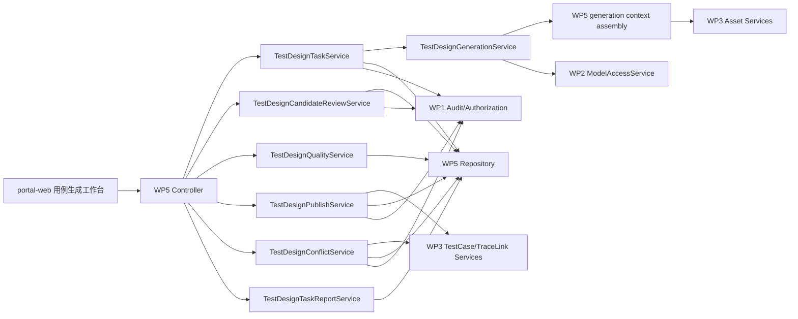

# WP5 AI 用例生成与评审 - 技术设计与接口契约

| 项目 | 内容 |
|---|---|
| 工作包 | WP5 AI 用例生成与评审 |
| 角色产出 | 资深服务端架构师 |
| 文档性质 | 技术设计、数据模型、接口契约和服务端质量约束 |
| 当前口径 | WP5 在 `platform-api` 内实现为独立领域模块，不新增独立部署服务；模块内应用服务按任务、生成、评审、质量、发布、冲突和报告拆分；任务本域审计链摘要由报告服务聚合 WP5 任务、评审和发布记录；Prompt 趋势按版本输出聚合准出摘要和准出状态分布；任务创建支持显式 API/页面/业务流上下文资产，并将上下文裁剪策略配置化暴露 |
| 版本 | v0.7 |
| 日期 | 2026-05-30 |

## 1. 架构原则

1. WP5 是任务/领域拆分，不是独立部署服务拆分，包路径建议为 `com.songhg.veri.agent.testdesign`；模块内部不得用单一 God Object 承载任务、生成、质量、发布、冲突和报告职责。
2. API 使用统一 envelope，JSON 字段使用 camelCase，分页使用 `index`、`size`。
3. SQL 放在 MyBatis Mapper XML，不在 Java 代码拼接 SQL。
4. 不恢复多租户，不在 WP5 表中增加 `tenant_id`。
5. WP5 不直接调用模型厂商 SDK，只通过 WP2 模型接入应用服务。
6. WP5 不直接读写 WP3 表，只通过 WP3 应用服务读取资产、创建用例和创建追踪关系。
7. 生成候选必须人工评审后才能发布到 WP3。
8. Java 代码需符合《阿里巴巴 Java 开发手册》和仓库 `AGENTS.md` 注释准入要求。

## 2. 模块边界



| 组件 | 职责 |
|---|---|
| `TestDesignTaskController` | 任务创建、列表、详情、取消、重试。 |
| `TestDesignCandidateController` | 候选查询、详情、编辑、确认、驳回、忽略、批量操作。 |
| `TestDesignTaskPublishController` | 发布 dryRun、正式发布、发布记录查询和任务评审历史导出。 |
| `TestDesignTaskService` | 任务查询、任务摘要、服务健康、创建、重试、取消、异步消费认领、状态落库、幂等和任务审计。 |
| `TestDesignGenerationService` | 装配脱敏上下文、选择规则模板或 WP2 模型生成、解析模型输出、生成候选批次并执行生成质量校验；不创建任务、不做状态流转、不写审计。 |
| `TestDesignCandidateReviewService` | 候选查询、编辑、确认、驳回、忽略、批量评审和评审记录导出。 |
| `TestDesignQualityService` | 判断空步骤、缺断言、重复风险、覆盖缺口、敏感信息风险和发布就绪。 |
| `TestDesignPublishService` | 发布 dryRun、正式发布、发布记录查询，将已确认候选写入 WP3 测试用例并建立追踪关系。 |
| `TestDesignConflictService` | 发布冲突人工链接和批量冲突处理，复用 WP3 用例需求追踪校验和审计记录。 |
| `TestDesignTaskReportService` | 导出任务级聚合报告，并提供任务本域审计链摘要，避免报告拼装逻辑回流到任务服务。 |
| `TestDesignScopeService` | 为权限解析提供任务/候选项目作用域，不承载业务流。 |
| `TestDesignRepository` | 维护生成任务、候选、评审记录和发布记录。 |

服务拆分准入：`ModuleLayerDependencyTest` 禁止重新引入 `TestDesignService` 或 `Facade` 命名服务，禁止 `TestDesignGenerationService` 持有创建/重试/异步消费入口，并将 WP5 单个应用服务上限收紧为 1200 行。

## 3. 状态机

### 3.1 生成任务状态

```text
DRAFT -> RUNNING -> SUCCEEDED
DRAFT -> RUNNING -> PARTIAL_SUCCESS
DRAFT -> RUNNING -> FAILED
RUNNING -> CANCELLED
FAILED -> RUNNING
PARTIAL_SUCCESS -> RUNNING
SUCCEEDED -> PUBLISHING -> PUBLISHED
SUCCEEDED -> PUBLISHING -> PARTIAL_SUCCESS
```

非法状态流必须返回 `INVALID_STATE` 并写入拒绝审计。

### 3.2 候选状态

```text
GENERATED -> EDITED -> CONFIRMED -> PUBLISHED
GENERATED -> CONFIRMED -> PUBLISHED
GENERATED -> REJECTED
GENERATED -> IGNORED
EDITED -> REJECTED
EDITED -> IGNORED
CONFIRMED -> EDITED
CONFIRMED -> IGNORED
```

已 `PUBLISHED` 候选不可再次编辑，只能查看和跳转 WP3 用例。

## 4. 建议数据模型

### 4.1 `test_design_task`

| 字段 | 类型 | 说明 |
|---|---|---|
| `id` | uuid | 主键 |
| `project_id` | varchar(64) | 项目 ID |
| `name` | varchar(160) | 任务名称 |
| `strategy` | varchar(64) | 主策略，如 `FUNCTIONAL` |
| `coverage_types` | text | 逗号分隔覆盖类型或 JSON 数组 |
| `requirement_ids` | jsonb | 本任务需求 ID 列表 |
| `context_options_json` | jsonb | 是否带入 API、页面、流程、历史用例等 |
| `status` | varchar(32) | 任务状态 |
| `prompt_key` | varchar(128) | 默认 `wp5-test-case-design` |
| `prompt_version` | varchar(64) | Prompt 版本 |
| `model_invocation_id` | uuid | WP2 调用 ID |
| `model_provider_name` | varchar(128) | provider 名称 |
| `model_name` | varchar(128) | 模型名称 |
| `input_digest` | varchar(96) | 上下文摘要 hash |
| `context_summary_json` | jsonb | 脱敏后的上下文摘要 |
| `quality_summary_json` | jsonb | 覆盖、重复、质量提示摘要 |
| `candidate_count` | int | 候选数 |
| `confirmed_count` | int | 已确认数 |
| `published_count` | int | 已发布数 |
| `last_error_code` | varchar(64) | 最近错误码 |
| `last_error_message` | varchar(500) | 脱敏错误摘要 |
| `trace_id` | varchar(64) | 最近 traceId |
| `created_by` | varchar(64) | 创建人 |
| `created_at` | timestamptz | 创建时间 |
| `updated_at` | timestamptz | 更新时间 |

建议索引：

- `idx_test_design_task_project_status(project_id, status, updated_at desc)`
- `idx_test_design_task_created_by(created_by, created_at desc)`
- `uk_test_design_task_input(project_id, input_digest, prompt_key, prompt_version)` 可用于幂等提示，不强制唯一阻断。

### 4.2 `test_design_candidate`

| 字段 | 类型 | 说明 |
|---|---|---|
| `id` | uuid | 主键 |
| `task_id` | uuid | 任务 ID |
| `project_id` | varchar(64) | 项目 ID |
| `requirement_id` | uuid | WP3 需求 ID |
| `api_id` | uuid | WP3 API ID，可空 |
| `page_id` | uuid | WP3 页面 ID，可空 |
| `flow_id` | uuid | WP3 业务流 ID，可空 |
| `asset_test_case_id` | uuid | 发布后 WP3 测试用例 ID |
| `title` | varchar(200) | 标题 |
| `description` | text | 描述 |
| `precondition` | text | 前置条件 |
| `priority` | varchar(16) | 优先级 |
| `coverage_type` | varchar(32) | 覆盖类型 |
| `steps_json` | jsonb | 步骤数组 |
| `tags` | varchar(500) | 标签 |
| `rationale` | text | 生成依据 |
| `source_refs_json` | jsonb | 来源引用 |
| `quality_flags_json` | jsonb | 质量提示 |
| `duplicate_key` | varchar(128) | 标题/需求/步骤摘要 hash |
| `status` | varchar(32) | 候选状态 |
| `review_comment` | varchar(500) | 驳回或忽略原因 |
| `version` | int | 乐观锁 |
| `created_at` | timestamptz | 创建时间 |
| `updated_at` | timestamptz | 更新时间 |

建议索引：

- `idx_test_design_candidate_task(task_id, status, updated_at desc)`
- `idx_test_design_candidate_project(project_id, requirement_id, status)`
- `idx_test_design_candidate_duplicate(project_id, requirement_id, duplicate_key)`
- `uk_test_design_candidate_source(task_id, requirement_id, duplicate_key)` 防止同任务重复候选。

### 4.3 `test_design_review_record`

| 字段 | 类型 | 说明 |
|---|---|---|
| `id` | uuid | 主键 |
| `candidate_id` | uuid | 候选 ID |
| `action` | varchar(32) | `EDIT/CONFIRM/REJECT/IGNORE/PUBLISH` |
| `before_json` | jsonb | 操作前快照 |
| `after_json` | jsonb | 操作后快照 |
| `diff_json` | jsonb | 字段差异 |
| `comment` | varchar(500) | 评审备注 |
| `actor_user_id` | varchar(64) | 操作者 |
| `trace_id` | varchar(64) | traceId |
| `created_at` | timestamptz | 创建时间 |

### 4.4 `test_design_publish_record`

| 字段 | 类型 | 说明 |
|---|---|---|
| `id` | uuid | 主键 |
| `task_id` | uuid | 任务 ID |
| `candidate_id` | uuid | 候选 ID |
| `asset_test_case_id` | uuid | WP3 用例 ID |
| `action` | varchar(32) | `CREATE/LINK_EXISTING/SKIPPED/FAILED` |
| `status` | varchar(32) | `SUCCEEDED/FAILED` |
| `message` | varchar(500) | 脱敏摘要 |
| `trace_id` | varchar(64) | traceId |
| `created_at` | timestamptz | 创建时间 |

## 5. Prompt 和模型契约

| 项 | 内容 |
|---|---|
| Prompt key | `wp5-test-case-design` |
| 调用方 | `wp5-test-design` |
| capability | `CHAT` 或 WP2 支持的结构化输出能力 |
| 敏感策略 | 继承项目/应用 `sensitivityLevel` 和 `allowPublicModel` |
| 失败策略 | WP2 阻断时不绕过；可按配置使用规则模板 fallback |

模型输出 JSON 结构：

```json
{
  "cases": [
    {
      "title": "账号密码登录成功",
      "description": "验证有效账号可正常登录后台",
      "precondition": "用户账号已启用",
      "priority": "HIGH",
      "coverageType": "SMOKE",
      "requirementRef": "需求ID或外部引用",
      "apiRefs": ["API ID"],
      "pageRefs": ["PAGE ID"],
      "flowRefs": [],
      "steps": [
        {
          "action": "打开登录页并输入有效用户名和密码",
          "expectedResult": "登录成功并进入系统概览页"
        }
      ],
      "tags": ["auth", "login"],
      "rationale": "覆盖登录需求的主成功路径",
      "riskNotes": ["需准备启用状态账号"]
    }
  ]
}
```

服务端必须对 JSON 做结构校验和业务校验，不能把模型原始字符串直接入库为候选。

### 5.1 上下文摘要契约

当前实现的 `context_summary_json` 只保存脱敏摘要，不保存完整 Prompt 或原始文档正文。任务创建时通过 WP3 应用服务读取需求、追踪链接、关联 API、页面、业务流和历史用例摘要；请求可额外传入 `contextApiIds/contextPageIds/contextFlowIds`，用于显式纳入未建立需求追踪关系但本次生成需要参考的上下文资产。上下文裁剪上限由 `veri-agent.test-design.context-*` 配置驱动，并写入 `contextSummary.limits` 与 `requestDigest`，确保重放和问题定位基于同一策略快照。WP5 不直连 WP3 表。

```json
{
  "contextVersion": "wp5-context-v1",
  "requirements": [
    {
      "id": "4d76b2c1-0000-4000-8000-000000000001",
      "code": "REQ-001",
      "title": "账号密码登录",
      "acceptanceCriteriaPreview": "登录成功后进入工作台"
    }
  ],
  "linkedAssetsByRequirement": [
    {
      "requirementId": "4d76b2c1-0000-4000-8000-000000000001",
      "apiCount": 1,
      "pageCount": 1,
      "flowCount": 1,
      "apis": [{"id": "a111...", "method": "POST", "path": "/api/login", "summary": "登录接口"}],
      "pages": [{"id": "p111...", "name": "登录页", "urlPattern": "/login"}],
      "flows": [{"id": "f111...", "name": "登录主流程", "priority": "HIGH"}]
    }
  ],
  "existingCasesByRequirement": [
    {
      "requirementId": "4d76b2c1-0000-4000-8000-000000000001",
      "count": 1,
      "cases": [{"id": "c111...", "title": "历史登录主流程用例", "stepCount": 3}]
    }
  ],
  "explicitAssets": {
    "apiCount": 1,
    "pageCount": 1,
    "flowCount": 1,
    "apiIds": ["a222..."],
    "pageIds": ["p222..."],
    "flowIds": ["f222..."],
    "apis": [{"id": "a222...", "method": "POST", "path": "/api/reset-password", "summary": "密码重置接口"}],
    "pages": [{"id": "p222...", "name": "密码重置页", "urlPattern": "/reset-password"}],
    "flows": [{"id": "f222...", "name": "密码重置流程", "priority": "HIGH"}]
  },
  "limits": {
    "linkedAssetsPerRequirement": 5,
    "explicitAssetsPerType": 5,
    "linkedAssetSchemaChars": 240,
    "existingCasesPerRequirement": 5,
    "rawPromptStored": false
  }
}
```

当前可配置项：

- `context-linked-assets-per-requirement`
- `context-explicit-assets-per-type`
- `context-existing-cases-per-requirement`
- `context-requirement-description-chars`
- `context-acceptance-criteria-chars`
- `context-asset-schema-chars`

## 6. API 契约

基础路径：`/api/v1/test-design`

### 6.1 任务 API

| 方法 | 路径 | 权限 | 说明 |
|---|---|---|---|
| `GET` | `/tasks` | `testDesign:read` | 分页查询任务。 |
| `POST` | `/tasks` | `testDesign:generate` | 创建生成任务。 |
| `GET` | `/tasks/{id}` | `testDesign:read` | 查询任务详情和质量摘要。 |
| `POST` | `/tasks/{id}/retry` | `testDesign:generate` | 重试失败或部分成功任务。 |
| `POST` | `/tasks/{id}/cancel` | `testDesign:generate` | 取消运行中任务。 |

创建任务请求：

```json
{
  "projectId": "project-001",
  "title": "登录需求用例生成",
  "requirementIds": ["4d76b2c1-0000-4000-8000-000000000001"],
  "contextApiIds": ["a2220000-0000-4000-8000-000000000001"],
  "contextPageIds": ["b2220000-0000-4000-8000-000000000001"],
  "contextFlowIds": ["c2220000-0000-4000-8000-000000000001"],
  "coverageTypes": ["SMOKE", "FUNCTIONAL", "EXCEPTION", "BOUNDARY"],
  "caseCountPerRequirement": 5
}
```

任务响应：

```json
{
  "id": "0f0d47d0-0000-4000-8000-000000000001",
  "projectId": "project-001",
  "name": "登录需求用例生成",
  "strategy": "FUNCTIONAL",
  "coverageTypes": ["SMOKE", "FUNCTIONAL", "EXCEPTION", "BOUNDARY"],
  "status": "SUCCEEDED",
  "candidateCount": 8,
  "confirmedCount": 0,
  "publishedCount": 0,
  "promptKey": "wp5-test-case-design",
  "promptVersion": "v1",
  "modelInvocationId": "8e979021-0000-4000-8000-000000000001",
  "modelProviderName": "local-echo",
  "modelName": "echo",
  "qualitySummary": {
    "emptyStepCount": 0,
    "duplicateRiskCount": 1,
    "coverageTypes": ["SMOKE", "FUNCTIONAL"]
  },
  "lastErrorCode": null,
  "lastErrorMessage": null,
  "traceId": "trc_xxx",
  "createdAt": "2026-05-25T10:00:00Z",
  "updatedAt": "2026-05-25T10:00:30Z"
}
```

### 6.2 候选 API

| 方法 | 路径 | 权限 | 说明 |
|---|---|---|---|
| `GET` | `/candidates` | `testDesign:read` | 分页查询候选，支持任务、需求、状态、优先级和关键词筛选。 |
| `GET` | `/candidates/{id}` | `testDesign:read` | 查询候选详情。 |
| `PUT` | `/candidates/{id}` | `testDesign:review` | 编辑候选。 |
| `POST` | `/candidates/{id}/confirm` | `testDesign:review` | 确认候选。 |
| `POST` | `/candidates/{id}/reject` | `testDesign:review` | 驳回候选。 |
| `POST` | `/candidates/{id}/ignore` | `testDesign:review` | 忽略候选。 |
| `POST` | `/candidates/{id}/resolve-conflict` | `testDesign:publish` | 人工确认发布冲突并链接既有 WP3 测试用例。 |
| `POST` | `/candidates/batch-action` | `testDesign:review` | 批量确认、驳回、忽略。 |
| `POST` | `/candidates/batch-resolve-conflicts` | `testDesign:publish` | 批量人工处理发布冲突并返回逐项结果。 |

候选查询参数：

| 参数 | 说明 |
|---|---|
| `projectId` | 项目 ID |
| `taskId` | 任务 ID |
| `requirementId` | 需求 ID |
| `status` | 候选状态 |
| `priority` | 优先级 |
| `coverageType` | 覆盖类型 |
| `keyword` | 标题、标签或说明关键词 |
| `index`、`size` | 分页 |

批量操作请求：

```json
{
  "action": "CONFIRM",
  "candidates": [
    {"id": "40c21d62-0000-4000-8000-000000000001", "version": 1}
  ],
  "comment": "本批候选通过评审"
}
```

批量冲突处理请求：

```json
{
  "items": [
    {
      "candidateId": "40c21d62-0000-4000-8000-000000000001",
      "version": 3,
      "caseId": "8b8eb5b4-0000-4000-8000-000000000901"
    }
  ],
  "reason": "人工确认复用既有覆盖",
  "comment": "已比对需求追踪和步骤"
}
```

批量冲突处理响应需要返回 `total/succeededCount/failedCount/items`，每个 item 包含候选 ID、`SUCCEEDED/FAILED`、发布记录或错误摘要。

### 6.3 发布 API

| 方法 | 路径 | 权限 | 说明 |
|---|---|---|---|
| `POST` | `/tasks/{id}/publish-dry-run` | `testDesign:publish` | 预览发布结果。 |
| `POST` | `/tasks/{id}/publish` | `testDesign:publish` | 发布确认候选到 WP3。 |
| `GET` | `/tasks/{id}/publish-records` | `testDesign:read` | 查询发布记录。 |

发布请求：

```json
{
  "candidateIds": ["40c21d62-0000-4000-8000-000000000001"],
  "targetStatus": "DRAFT",
  "duplicatePolicy": "REVIEW_REQUIRED"
}
```

发布结果：

```json
{
  "taskId": "0f0d47d0-0000-4000-8000-000000000001",
  "dryRun": true,
  "summary": {
    "createCount": 1,
    "duplicateRiskCount": 0,
    "failedCount": 0
  },
  "items": [
    {
      "candidateId": "40c21d62-0000-4000-8000-000000000001",
      "action": "CREATE",
      "assetTestCaseId": null,
      "message": "将创建 WP3 测试用例"
    }
  ]
}
```

### 6.4 健康和配置 API

| 方法 | 路径 | 权限 | 说明 |
|---|---|---|---|
| `GET` | `/health` | `testDesign:read` | 返回 WP5 开关、Prompt、fallback 和质量阈值摘要。 |
| `GET` | `/tasks/{id}/quality/summary` | `testDesign:read` | 返回任务全量质量摘要和按当前阈值计算的任务准出状态。 |
| `GET` | `/quality/prompt-trend` | `testDesign:read` | 返回最近任务按 Prompt key/version 聚合的质量趋势，每个版本桶包含聚合准出摘要，并返回顶层准出状态分布。 |
| `GET` | `/tasks/{id}/report/audit-summary` | `testDesign:read` | 返回任务本域审计链摘要，聚合 WP5 任务、评审记录和发布记录，不查询全局 `audit_log`。 |

质量与趋势响应不得暴露模型密钥、provider token、完整 prompt 内容、候选正文、评审评论或敏感上下文。`prompt-trend.buckets[].readiness` 复用任务质量阈值，只作为 Prompt 运营提示，不改变发布权限或候选状态。`prompt-trend.readinessDistribution` 仅按版本桶聚合 `PASSED/WARNING/BLOCKED/UNKNOWN` 数量和比例，用于运营看板快速识别阻断或风险版本。

## 7. 错误码建议

| 错误码 | 场景 |
|---|---|
| `TEST_DESIGN_TASK_NOT_FOUND` | 任务不存在 |
| `TEST_DESIGN_CANDIDATE_NOT_FOUND` | 候选不存在 |
| `TEST_DESIGN_INVALID_STATE` | 状态流非法 |
| `TEST_DESIGN_CONTEXT_EMPTY` | 未找到可生成的需求上下文 |
| `TEST_DESIGN_MODEL_BLOCKED` | WP2 策略、预算或敏感内容阻断 |
| `TEST_DESIGN_MODEL_OUTPUT_INVALID` | 模型输出结构非法 |
| `TEST_DESIGN_CANDIDATE_VERSION_CONFLICT` | 候选版本冲突 |
| `TEST_DESIGN_DUPLICATE_REVIEW_REQUIRED` | 重复风险需人工处理 |
| `TEST_DESIGN_PUBLISH_FAILED` | 写入 WP3 失败 |

错误响应仍使用统一 envelope。

## 8. 审计事件

| action | resourceType | 触发 |
|---|---|---|
| `CREATE` | `TEST_DESIGN_TASK` | 创建任务 |
| `RETRY` | `TEST_DESIGN_TASK` | 重试任务 |
| `CANCEL` | `TEST_DESIGN_TASK` | 取消任务 |
| `MODEL_GENERATE` | `TEST_DESIGN_TASK` | 调用模型生成 |
| `MODEL_FALLBACK` | `TEST_DESIGN_TASK` | 模型失败后规则 fallback |
| `UPDATE` | `TEST_DESIGN_CANDIDATE` | 编辑候选 |
| `CONFIRM` | `TEST_DESIGN_CANDIDATE` | 确认候选 |
| `REJECT` | `TEST_DESIGN_CANDIDATE` | 驳回候选 |
| `IGNORE` | `TEST_DESIGN_CANDIDATE` | 忽略候选 |
| `PUBLISH_DRY_RUN` | `TEST_DESIGN_TASK` | 发布预览 |
| `PUBLISH` | `TEST_DESIGN_CANDIDATE` | 发布到 WP3 |
| `STATUS_CHANGE_DENIED` | `TEST_DESIGN_TASK/CANDIDATE` | 状态流拒绝 |

审计不记录完整模型输入、完整需求原文、密钥、token 或隐私字段。

## 9. 配置项

| 配置 | 默认 | 说明 |
|---|---|---|
| `WP5_SERVICE_TOKEN` | `local-test-design-token` | WP5 服务间调用令牌 |
| `WP5_GENERATION_MODE` | `RULE_TEMPLATE` | 生成模式；支持 `RULE_TEMPLATE`、`MODEL`、`MODEL_WITH_FALLBACK` |
| `WP5_MODEL_FALLBACK_ENABLED` | `false` | `generation-mode=MODEL` 时是否等价为 `MODEL_WITH_FALLBACK` |
| `WP5_PROMPT_KEY` | `wp5-test-design-v1` | 默认 WP2 Prompt key |
| `WP5_PROMPT_VERSION` | `1.0.0` | WP5 任务记录中的 Prompt 版本口径 |
| `WP5_CASE_COUNT_PER_REQUIREMENT_MAX` | `3` | 单需求最大生成数 |
| `WP2_MAX_PROMPT_CHARS` | `12000` | WP2 模型输入最大字符数 |
| `WP5_DUPLICATE_SIMILARITY_THRESHOLD` | `0.86` | 重复风险阈值 |
| `WP5_BATCH_ACTION_MAX_SIZE` | `100` | 批量操作上限 |
| `WP5_QUALITY_MIN_EXPECTED_STEP_RATIO` | `0.95` | 有预期结果步骤比例阈值 |

Spring 配置命名建议同步提供 `veri-agent.test-design.*` 形式，环境变量作为部署注入入口。

## 10. 服务端代码质量要求

1. 核心服务方法必须有方法级 JavaDoc 或关键逻辑注释，说明输入前提、输出语义、状态流和副作用。
2. 生成任务执行、候选状态流、发布到 WP3、模型 fallback、上下文脱敏和重复检测属于核心逻辑，必须补充必要注释。
3. 所有外部输入使用 Bean Validation 和业务校验双层保护。
4. 事务边界以“候选状态变更”和“发布单批候选”为单位，避免长事务包住模型调用。
5. 模型调用不得在数据库事务内执行。
6. 发布到 WP3 失败时记录发布失败记录，不把候选误标为已发布。
7. 日志只记录 ID、状态、traceId 和脱敏摘要，不记录完整 prompt、需求原文、密钥或用户隐私。
8. 单元测试覆盖状态机、校验、重复检测、模型输出解析和发布失败补偿。
