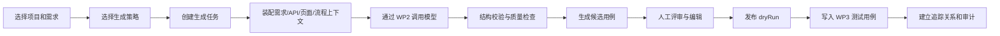

# WP5 AI 用例生成与评审 - 需求文档与 PRD

| 项目 | 内容 |
|---|---|
| 工作包 | WP5 AI 用例生成与评审 |
| 角色产出 | 资深产品经理 |
| 文档性质 | 需求文档与产品 PRD |
| 当前口径 | 基于 WP4 已发布需求资产、WP3 资产库和 WP2 模型接入生成可评审测试用例；任务诊断和任务报告仅以聚合方式披露生成编排策略、权限与资源作用域策略、评测语料运营策略、发布准出审批策略、跨 WP 审计链策略、归档治理策略、报告清单策略、上下文装配策略 v2、上下文策略治理、上下文策略运营 v2 状态、模型观测策略和质量/导出治理状态 |
| 版本 | v0.12 |
| 日期 | 2026-05-30 |

## 1. 背景

WP1-WP4 已经形成平台底座、模型接入、测试资产库和需求输入链路。当前用户可以将需求文档、Webhook 或文件解析为需求资产，也可以在 WP3 手工维护测试用例。下一阶段的核心价值是减少测试设计的重复劳动，让 QA 能基于已确认需求快速生成覆盖正向、异常、边界、权限和回归场景的测试用例草案，并在人工评审后沉淀到 WP3。

WP5 是“需求到测试用例”的智能生产环节，不负责脚本生成和执行。

## 2. 用户与场景

| 用户 | 场景 | 价值 |
|---|---|---|
| 测试人员 | 从一批已确认需求生成测试用例草案，并逐条评审入库 | 降低初稿编写成本，提高覆盖完整性。 |
| 测试负责人 | 查看生成任务质量、覆盖情况、重复风险和评审进度 | 管理需求测试准备状态，减少遗漏。 |
| 开发人员 | 查看需求关联的 AI 候选和已入库用例 | 提前理解验收和回归关注点。 |
| 项目负责人 | 关注需求是否已有足够用例覆盖 | 判断提测准备度和质量风险。 |
| 审计人员 | 追踪 AI 生成、人工修改、发布入库和模型调用记录 | 满足合规、成本和质量追溯。 |

## 3. 产品目标

| 目标 | 指标 |
|---|---|
| 提升用例初稿产出效率 | 单个需求生成候选用例可在 1 个任务内完成，支持批量需求。 |
| 保证人工可控 | 所有候选必须经过人工确认才能写入 WP3。 |
| 保持资产追踪 | 每条入库用例可追溯到需求、AI 任务、模型调用、评审人和候选版本。 |
| 降低重复和低质用例 | 发布前提供重复风险、空步骤、缺预期结果和覆盖缺口提示。 |
| 支持后续自动化 | 用例步骤结构稳定，能被 WP6/WP7 脚本生成复用。 |

## 4. MVP 范围

| 功能 | MVP 口径 | 验收关注点 |
|---|---|---|
| 任务创建 | 基于项目、需求集合、生成策略和生成数量创建任务 | 需求必须属于同一项目；无权限不能创建。 |
| 生成策略 | 支持冒烟、功能、异常、边界、权限、回归六类覆盖偏好 | 策略影响候选标签和场景分布。 |
| AI 生成 | 通过 WP2 统一模型接入调用 Prompt，输出结构化候选 | 保存 promptKey、promptVersion、modelInvocationId 和成本摘要。 |
| 候选评审 | 支持列表筛选、详情查看、编辑、确认、驳回、忽略和批量操作 | 操作有版本保护和审计。 |
| 发布预览 | 发布前 dryRun 展示创建、关联、重复、冲突和失败明细 | 用户能理解为什么某条不能发布。 |
| 写入 WP3 | 确认候选写入 WP3 测试用例，建立需求/API 追踪关系 | 入库用例默认不是 `APPROVED`，继续遵守 WP3 状态流。 |
| 质量提示 | 展示覆盖维度、重复风险、空步骤、缺断言、敏感阻断和模型失败原因 | 不用不可解释的“生成失败”。 |
| 任务记录 | 支持任务列表、任务详情、候选数量、成功/失败、评审进度、traceId 和聚合任务报告 | 可按项目和状态查询；任务诊断和报告只输出生成编排、权限与资源作用域策略、评测语料运营策略、发布准出审批策略、跨 WP 审计链策略、归档治理策略、报告清单策略、固定治理、上下文装配策略 v2、策略运营 v2 聚合字段、模型观测策略、安全边界和质量聚合字段；生成编排策略仅展示条件认领、幂等回放、重复事件安全、事件恢复、超时回收、队列 lag 指标、超时告警、恢复批次上限、排队/运行/最旧排队年龄/超时运行聚合计数和人工重发/多实例证据缺口，不导出事件 ID、队列消息体、事件 payload、恢复明细、幂等键或超时错误正文；作用域策略仅展示项目资源作用域、列表 fallback、任务/候选/批量/发布/异步/HTTP smoke/评测项目隔离和运营缺口，不导出候选 ID、角色规则或服务令牌原值；评测语料策略仅展示 `GOLDEN_SET_BASELINE`、`MANUAL_OPT_IN_AI_EVAL`、部署配置阈值来源、项目作用域、golden set 基线、AI 评测脚本、质量门禁接入、准出分布、Prompt 版本跟踪和样本维护/长期校准/运营后台未就绪状态，不导出语料行、候选正文、评审评论或 Prompt 正文；发布准出策略仅展示 `ADVISORY_QUALITY_GATE`、阈值来源、质量阈值已评估、advisory-only、发布阻断关闭、审批流未就绪、禁止自动发布和候选确认要求，不导出候选级准出证据、审批备注或阈值规则明细；审计链策略仅展示 `WP5_DOMAIN_AGGREGATE_WITH_WP1_AUDIT` 模式、WP1 审计写入、WP2 调用引用、WP3 发布引用、WP5 本域事件、项目作用域、trace 信号和跨 WP 看板/outbox 重放看板未就绪状态，不导出审计事件明细、候选 ID 清单、平台审计标识原值、traceId 原值、模型调用 ID 原值、发布 sourceRef 或资产 ID 原值；归档治理策略仅展示 `wp5-archive-policy-v1`、有界保留天数、`platformManaged` 存储策略、审批要求、审批流 pending、真实归档存储 pending、外发开关、保留策略跟踪和 aggregate-only 标记，不导出归档路径、归档备注、审批说明或工单 URL；报告清单策略仅展示 `wp5-report-manifest-policy-v1`、报告 schema/字段集版本、行数/完成状态跟踪、归档核验 ready 和明细导出关闭，不导出行级完整性值、行内容摘要、候选 ID 清单、trace ID 清单或审计 ID 清单；模型观测策略仅展示 `wp5-model-observation-policy-v1`、`ROUTING_COST_LATENCY_AGGREGATE`、WP2 调用引用、trace/job/routing/token/latency/cost/fallback 跟踪能力、Prompt 载荷不存储、载荷预览关闭、trace/job/invocation ID 原值不导出、provider 错误正文不导出、actor service 不导出和 aggregate-only 标记；装配策略仅展示装配模式、digest 策略、inputDigest 要求、摘要持久化、WP3 应用服务边界、原文/模型载荷持久化和明细导出红线；策略运营仅展示平台默认模式、解析顺序、部署配置回退行为、审批状态、覆盖存储和审批流就绪状态，不导出候选正文、原始 Prompt、上下文正文、digest 值、模型调用 ID 原值、trace/job 原值、载荷预览、provider 错误正文、actor service、策略 diff、审批备注、工单 URL、覆盖规则或策略正文。 |

## 5. 非目标

| 非目标 | 说明 |
|---|---|
| 直接生成自动化脚本 | WP5 只产出测试用例资产，不产出 Pytest/Playwright 等脚本。 |
| 直接执行测试 | 不创建测试计划、不调度 worker、不采集结果。 |
| 自动创建缺陷 | 不生成缺陷草稿或同步缺陷系统。 |
| 完全自动评审 | AI 可给出评审建议，但不能替代人工最终确认。 |
| 评测语料运营后台 | 当前只暴露评测语料运营策略聚合快照，不提供样本维护、长期校准或语料后台。 |
| 发布准出审批后台 | 当前只暴露发布准出审批策略聚合快照，不提供可配置审批流或自动阻断发布的运营后台。 |
| 跨 WP 审计链看板 | 当前只暴露 `auditChainPolicy` 聚合快照，不提供跨 WP1 audit_log、WP2 调用和 WP3 发布记录的统一审计看板或 audit outbox 重放看板。 |
| 真实报告归档存储与审批流 | 当前只暴露 `archivePolicy` 聚合快照，不提供真实归档存储、归档审批流、外发流程或归档工单流转。 |
| 报告清单明细索引 | 当前只暴露 `reportManifestPolicy` 和 `reportManifest` 聚合快照，不提供行级完整性值、行内容摘要、候选/trace/审计 ID 清单或可反查项目结构的明细索引。 |
| 模型观测明细导出和真实调用看板 | 当前只暴露 `modelObservationPolicy` 聚合快照和脱敏 `modelObservation` 摘要，不提供 traceId/jobId/invocationId 原值导出、provider 错误正文导出、actor service 导出、模型载荷预览或真实跨 WP 模型调用明细看板。 |
| 真实原型连接器 | 页面/原型上下文只读取 WP3 已有页面资产，不接第三方原型平台。 |
| 绕过 WP2/WP3 | 不直接调用模型厂商，不直接写资产表。 |

## 6. 核心流程

## 7. 页面与交互需求

### 7.1 任务列表

| 元素 | 说明 |
|---|---|
| 筛选 | projectId、status、strategy、createdBy、createdFrom、createdTo、keyword。 |
| 列表字段 | 任务名称、项目、需求数、候选数、确认数、发布数、状态、创建人、耗时、最近错误、traceId。 |
| 操作 | 查看详情、重试、取消、导出摘要。 |
| 状态 | `DRAFT`、`RUNNING`、`PARTIAL_SUCCESS`、`SUCCEEDED`、`FAILED`、`CANCELLED`、`PUBLISHING`、`PUBLISHED`。 |

### 7.2 创建任务

| 字段 | 规则 |
|---|---|
| 项目 | 必填；只展示用户有权限的项目。 |
| 需求 | 必填；支持按状态、关键词、来源筛选；默认只选择 `APPROVED` 或可生成状态的需求。 |
| 生成策略 | 必填；默认 `FUNCTIONAL`；可多选覆盖维度。 |
| 每个需求生成数量 | 默认 5，MVP 最大 20。 |
| 关联上下文 | 可选择是否带入 API、页面、业务流、历史用例摘要。 |
| 公开模型提示 | 展示项目/应用策略结果；高敏项目不允许绕过 WP2。 |

### 7.3 候选评审

| 功能 | 规则 |
|---|---|
| 候选筛选 | status、requirementId、priority、coverageType、duplicateRisk、keyword。 |
| 候选详情 | 展示标题、描述、前置条件、步骤、预期、标签、优先级、覆盖依据、风险说明和来源引用。 |
| 编辑 | 可修改标题、描述、优先级、标签、步骤和预期结果；保留人工修改 diff。 |
| 确认 | 确认后可进入发布候选池。 |
| 驳回 | 必须填写原因。 |
| 忽略 | 用于重复、非本期范围或价值低候选。 |
| 批量操作 | 需要携带候选版本号；并发冲突返回明确错误。 |

### 7.4 发布预览和入库结果

| 功能 | 规则 |
|---|---|
| dryRun | 返回 `CREATE`、`LINK_EXISTING`、`DUPLICATE_REVIEW_REQUIRED`、`SKIPPED`、`FAILED`。 |
| 发布 | 只发布已确认候选；写入 WP3 失败时保留候选状态和失败原因。 |
| 入库状态 | 成功后展示 WP3 用例编码、标题、状态和跳转入口。 |
| 重复风险 | 高相似候选不得静默创建，需要用户确认处理。 |

## 8. 候选用例字段

| 字段 | 说明 | 必填 |
|---|---|---|
| `id` | 候选 ID | 是 |
| `taskId` | 生成任务 ID | 是 |
| `projectId` | 项目 ID | 是 |
| `requirementId` | 需求资产 ID | 是 |
| `apiId` | API 资产 ID | 否 |
| `pageId` | 页面资产 ID | 否 |
| `flowId` | 业务流资产 ID | 否 |
| `title` | 用例标题 | 是 |
| `description` | 用例说明 | 否 |
| `precondition` | 前置条件 | 否 |
| `priority` | `CRITICAL/HIGH/MEDIUM/LOW` | 是 |
| `coverageType` | `SMOKE/FUNCTIONAL/EXCEPTION/BOUNDARY/PERMISSION/REGRESSION` | 是 |
| `steps` | 步骤数组，包含 action 和 expectedResult | 是 |
| `tags` | 标签 | 否 |
| `rationale` | 生成依据和覆盖说明 | 是 |
| `sourceRefs` | 需求、API、页面、业务流和文档片段引用 | 是 |
| `qualityFlags` | 质量提示，如缺断言、重复风险、低置信度 | 否 |
| `status` | `GENERATED/EDITED/CONFIRMED/REJECTED/IGNORED/PUBLISHED/FAILED` | 是 |
| `version` | 乐观锁版本 | 是 |

## 9. 业务规则

1. 只有已授权项目内的需求可以参与生成。
2. 一个生成任务内的需求必须属于同一项目。
3. 候选必须有标题和至少一个步骤；每个步骤必须有 action 和 expectedResult。
4. 候选发布到 WP3 前必须处于 `CONFIRMED`。
5. 入库 WP3 的测试用例默认状态为 `DRAFT`；若用户具备 `asset:review`，可在后续 WP3 流程中评审为 `APPROVED`。
6. AI 候选不允许直接覆盖人工维护的 `APPROVED` 用例。
7. 模型调用失败、预算阻断、敏感内容阻断时，任务必须展示可解释失败原因或 fallback 标识。
8. 候选编辑、确认、驳回、忽略和发布都必须写审计。
9. 发布成功后不得删除候选记录，只更新状态并保存 WP3 资产 ID。
10. 所有错误提示必须包含 traceId，敏感信息不得出现在页面、日志或导出文件中。

## 10. 验收标准

| 编号 | 验收项 |
|---|---|
| A1 | 用户可选择一个项目下的多个需求创建 AI 用例生成任务。 |
| A2 | 任务成功后生成结构化候选，候选包含标题、步骤、预期结果、优先级、覆盖类型和来源依据。 |
| A3 | 模型失败或 WP2 阻断时，页面展示可读错误、traceId 和下一步建议。 |
| A4 | 用户可编辑候选并确认，所有修改保留版本和审计记录。 |
| A5 | 发布 dryRun 能识别创建、重复、冲突和失败明细。 |
| A6 | 确认候选发布后可在 WP3 测试用例页看到对应用例和步骤。 |
| A7 | 入库用例与原需求、API 建立追踪关系，追踪矩阵可查询。 |
| A8 | 无权限用户不能查看、创建、评审或发布 WP5 任务。 |
| A9 | 前端覆盖 loading、empty、error、权限不足、冲突和部分成功状态。 |
| A10 | 后端、前端、smoke 和 AI 质量评测达到 WP5 准出要求。 |
| A11 | 任务诊断和任务报告可查看生成编排策略、权限与资源作用域策略、评测语料运营策略、发布准出审批策略、跨 WP 审计链策略、上下文装配策略 v2、上下文策略治理、上下文策略运营 v2 状态、模型观测策略和质量/导出治理状态；生成编排策略只展示条件认领、幂等回放、重复事件安全、恢复扫描、超时回收、队列 lag 指标、超时告警、恢复批次上限、排队/运行/最旧排队年龄/超时运行聚合计数和人工重发/多实例证据缺口，作用域策略只展示项目资源作用域、列表 fallback、任务/候选/批量/发布/异步/HTTP smoke/评测项目隔离和运营缺口，评测语料策略只展示 golden set 基线、手动可选 AI 评测、部署配置阈值、项目隔离、质量门禁接入、准出分布/Prompt 版本跟踪和样本维护/长期校准/运营后台缺口，发布准出策略只展示质量阈值已评估、advisory-only、发布阻断关闭、审批流未就绪、禁止自动发布和候选确认要求，审计链策略只展示 WP1/WP2/WP3/WP5 引用状态、项目作用域、trace 信号、跨 WP 看板和 audit outbox 重放看板就绪状态，归档治理策略只展示保留天数、存储策略、审批要求、审批流和真实归档存储 pending、外发开关、保留策略跟踪和导出红线，模型观测策略只展示聚合观测模式、WP2 调用引用、trace/job/routing/token/latency/cost/fallback 跟踪能力、Prompt 载荷不存储和细节导出关闭，装配策略 v2 只展示装配模式、digest 策略、inputDigest 要求、摘要持久化、WP3 应用服务边界和导出红线，策略运营 v2 只展示平台默认模式、解析顺序、部署配置回退行为、审批状态和就绪布尔值，不得泄露事件 ID、队列消息、恢复明细、幂等键、超时错误正文、候选 ID、角色规则、服务令牌原值、评测语料行、候选级准出证据、阈值规则明细、项目/环境覆盖规则、策略 diff、审批备注、工单 URL、策略正文、候选正文、评审评论、原始 Prompt、上下文正文、digest 值、显式资产 ID、schema、页面树、流程 JSON、历史用例步骤、模型调用 ID 原值、trace/job 原值、平台审计标识原值、发布 sourceRef、资产 ID、载荷预览、provider 错误正文或 actor service。 |
| A12 | `reportManifestPolicy` 在 health、任务响应、任务诊断、`contextSummary.reportManifestPolicy`、模型 `contextPacking.reportManifestPolicy` 和任务报告中保持一致，只展示 schema/字段集版本、行数跟踪、完成状态跟踪、归档核验 ready、明细导出关闭和 aggregate-only，不导出行级完整性值、行内容摘要、候选 ID 清单、trace ID 清单或审计 ID 清单。 |
| A13 | `modelObservationPolicy` 在 health、任务响应、任务诊断、`contextSummary.modelObservationPolicy`、模型 `contextPacking.modelObservationPolicy` 和任务报告中保持一致，只展示 `wp5-model-observation-policy-v1`、聚合观测模式、WP2 调用引用、trace/job/routing/token/latency/cost/fallback 跟踪能力、Prompt 载荷不存储、细节导出关闭和 aggregate-only，不导出 traceId/jobId/invocationId 原值、载荷预览、provider 错误正文或 actor service。 |

## 11. 产品验收结论口径

产品验收通过条件：

1. 至少一条 WP4 发布到 WP3 的需求可被 WP5 生成候选。
2. 至少一组候选可被人工编辑、确认、dryRun 并发布为 WP3 测试用例。
3. 生成结果可解释，来源可追踪，失败可定位。
4. 页面主流程不依赖 curl 或后台手工改库。
5. 非目标功能在演示和验收材料中明确说明，避免误判为缺陷。
