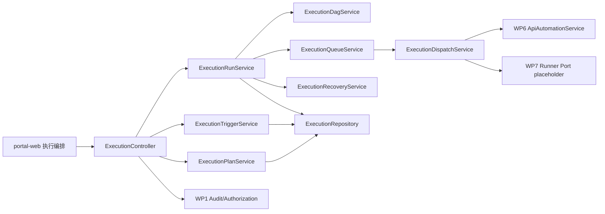

# WP9 执行编排与任务调度 - 技术设计与接口契约

| 项目 | 内容 |
|---|---|
| 工作包 | WP9 执行编排与任务调度 |
| 角色产出 | 资深服务端架构师 |
| 文档性质 | 技术设计、数据模型、状态机、接口契约和服务端质量约束 |
| 当前口径 | `platform-api` 内新增 execution 模块；调度端口可替换；P0 通过 WP6 应用服务调度 API automation run |
| 版本 | v0.1 |
| 日期 | 2026-06-13 |

## 1. 架构原则

1. WP9 是执行编排控制面，不直接实现 Pytest/Playwright runner。
2. API 使用统一 envelope，JSON 字段使用 camelCase，分页使用 `index/size`。
3. SQL 放在 MyBatis Mapper XML，不在 Java 代码拼接 SQL。
4. 不恢复多租户，不新增 `tenant_id`。
5. WP9 不直接读写 WP3/WP6 表，必须通过对应应用服务或明确 port。
6. 调度状态必须可恢复，所有认领使用条件更新和幂等键。
7. 不保存 secret 明文、完整 stdout/stderr、完整请求响应正文或外部 webhook secret。
8. Java 代码需符合《阿里巴巴 Java 开发手册》和仓库 `AGENTS.md` 注释准入要求。

## 2. 模块边界



| 组件 | 职责 |
|---|---|
| `ExecutionPlanController` | 计划创建、更新、列表、详情、dryRun、归档。 |
| `ExecutionRunController` | 手动触发、运行列表、详情、取消、重试、导出摘要。 |
| `ExecutionTriggerController` | webhook/cron 触发配置、启停、dryRun 和事件查询。 |
| `ExecutionPlanService` | 计划状态、DAG 持久化、资源引用校验、幂等键计算。 |
| `ExecutionDagService` | DAG 循环检测、依赖拓扑排序、失败策略和节点输入 schema 校验。 |
| `ExecutionRunService` | 创建 run、生成 node run、状态聚合、取消和重试。 |
| `ExecutionQueueService` | 条件认领、优先级、并发限制、heartbeat 和超时回收。 |
| `ExecutionDispatchService` | 按节点类型调用 WP6/WP7/utility port，并归一化节点结果。 |
| `ExecutionTriggerService` | webhook 签名、sourceEventId 幂等、cron 元数据、触发审计。 |
| `ExecutionRecoveryService` | 扫描超时 RUNNING、过期 heartbeat、卡死 QUEUED，并执行状态收敛或重发。 |
| `ExecutionRepository` | MyBatis 仓储，维护计划、节点、运行、触发、队列和审计聚合查询。 |

### 2.1 当前已落地实现

截至 2026-06-14 M8A，本仓库已完成 `ExecutionPlanController`、`ExecutionRunController`、`ExecutionTriggerController`、`ExecutionPlanService`、`ExecutionRunService`、`ExecutionTriggerService`、`ExecutionSchedulerService`、`ExecutionDagValidator`、`ExecutionRepository`、`JdbcExecutionRepository`、`ExecutionMapper` 和 local 测试仓储。已支持 plan 创建、列表、详情、更新、归档、dry-run、READY 计划手动触发、run/node run 初始化、requestKey 幂等回放、run 列表、run 详情、run cancel、控制面 retry、脱敏 run export、内部队列 claim、claim heartbeat、过期 claim recovery、节点完成回传、依赖推进、run 状态聚合，以及 claimed `API_TEST` 节点通过 WP6 应用服务创建 API automation run 并同步脱敏摘要；`baseUrlRef=env:<key>` 可解析同项目 WP1 环境 `api_base_url`，计划输入 `runtimeSecretRefs` 可作为 WP6 runtime secretRefs 默认值安全中继；后台 scheduler loop 可按配置启用，通过既有 claim/recovery/dispatch 契约执行 `API_TEST` 和 `REPORT_HANDOFF` 节点；M5 已新增 webhook/cron 触发器管理、cron 元数据摘要、webhook 签名校验、sourceEventId 幂等和事件记录；M7B 已新增生产 CRON scanner，scheduler tick 在 recovery/claim 前扫描到期 CRON trigger，使用 trigger event 和 run requestKey 幂等创建 CRON run，并推进 `nextFireAt`；M7C 已新增 `GET /runs/{id}/export`，按 run 项目 scope 校验 `execution:export`，返回 `schemaVersion/exportedAt/run/nodeStatusCounts/redactionPolicy`，只复用已脱敏的 run detail 和节点摘要；M7D 已新增 webhook HTTP smoke，使用真实 HTTP 入口验证 HMAC 签名、错误签名拒绝、`sourceEventId` 幂等、trigger event 证据、WP6 approved bundle 到 WP9 READY plan 的链路和 run export 脱敏；M8A 已新增 webhook 签名 helper 和 GitHub/GitLab/Jenkins CI 接入样例，明确外部 CI 只保存 secret 明文值、不传 `secret://` 引用，并按稳定 `eventId` 与 raw body 维持幂等；health policy 中 `planCrudReady=true`、`dagDryRunReady=true`、`manualTriggerReady=true`、`cancelRetryReady=true`、`queueClaimReady=true`、`heartbeatRecoveryReady=true`、`stateAggregationReady=true`、`wp6DispatchReady=true`、`schedulerLoopReady=true`、`cronScannerReady=true`。

M2 的资源校验通过 `ApiAutomationBundleScopeService` 查询 WP6 应用服务暴露的 bundle scope，不直读 WP6 表，不调用 runner adapter。`API_TEST` 节点要求 `apiAutomationBundleId` 存在、同项目且脚本包状态为 `APPROVED`；否则返回 `EXECUTION_DAG_INVALID`，具体 issue code 为 `EXECUTION_RESOURCE_NOT_FOUND`、`EXECUTION_RESOURCE_SCOPE_DENIED` 或 `EXECUTION_RESOURCE_NOT_READY`。

M3A 的手动触发只创建 orchestration 记录，不认领队列、不调用 WP6 runner。`POST /plans/{id}/runs` 只允许 `READY` 计划，初始 run 状态为 `QUEUED`；无依赖节点初始化为 `QUEUED`，有依赖节点初始化为 `PENDING`。相同 plan/requestKey 会回放既有 run，响应中 `idempotentReplay=true`，不会重复生成 node run。

M3B 的取消和重试仍只处理 orchestration 记录，不调用 runner cancel 或 dispatch。`POST /runs/{id}/cancel` 将非终态 run 收敛为 `CANCELED` 并关闭 PENDING/QUEUED/RUNNING node run；终态 run 重复取消幂等返回当前详情。`POST /runs/{id}/retry` 只允许 `FAILED`、`PARTIAL_SUCCESS`、`TIMEOUT` run，并在同一 run 下为最新 FAILED/TIMEOUT/BLOCKED 节点插入新 attempt；已处于 `QUEUED + RETRY + retryInFlight=true` 的 run 重复 retry 不重复插入 attempt。

M3C 增加内部调度控制面，不启用后台 scheduler 线程、不调用 WP6 runner。`POST /internal/queue/claims?workerId=...` 按创建时间和 nodeKey 认领一个 `QUEUED` node run，写入 `execution_queue_claim`，再用条件更新将节点推进为 `RUNNING`；若并发导致节点状态变化，则释放 claim 并尝试下一个候选。`POST /internal/queue/node-runs/{id}/complete` 使用 claimToken 完成节点，支持 `SUCCEEDED/SKIPPED/FAILED/TIMEOUT/BLOCKED`，只保存脱敏 resultSummary；完成后根据依赖关系把满足依赖的 `PENDING` 节点推进为 `QUEUED`，或在 fail-fast 依赖失败时标记为 `BLOCKED`，并聚合 run 为 `RUNNING/SUCCEEDED/FAILED/PARTIAL_SUCCESS/TIMEOUT`。

M3D 补齐内部 heartbeat 与 recovery 控制面，仍不启用后台 scheduler 线程、不调用 WP6 runner。`POST /internal/queue/claims/heartbeat` 使用 claimToken 续约 active claim，并同步 node heartbeat；claim 已过期、已完成或节点不在 `RUNNING` 时拒绝。`POST /internal/queue/recover-expired` 扫描过期 `CLAIMED` claim，先把 claim 标记为 `EXPIRED` 释放 active 唯一索引，再根据 plan node timeout 决定把节点重排为 `QUEUED` 或标记为 `TIMEOUT`，最后聚合 run 状态。没有 active claim 的 stale `RUNNING` 节点也会在超过节点 timeout 后收敛为 `TIMEOUT`。

M4A 接入 claimed `API_TEST` 节点的 WP6 dispatch，但仍不启用后台 scheduler 线程。`POST /internal/queue/node-runs/{id}/dispatch` 要求 active claimToken、node run 仍为 `RUNNING` 且 plan node 类型为 `API_TEST`；请求体携带运行时 `baseUrl`、可选 `environmentId/caseIds/secretRefs`。服务端通过 `ApiAutomationService#createRun` 创建 WP6 run，复用 WP6 runner-enabled、allowlist、secretRef 解析、host/digest 持久化和 runner 输出脱敏策略，再把 WP6 `PASSED/BLOCKED/TIMEOUT/FAILED` 归一为 WP9 `SUCCEEDED/BLOCKED/TIMEOUT/FAILED`。WP9 node summary 只保存 `wp6RunId`、`wp6Status`、`wp6RunnerMode`、case/result 计数、baseUrl host/digest、traceId 和安全策略布尔值。

M4B 补齐 `baseUrlRef` 与计划密钥中继。请求体显式 `baseUrl` 优先；否则读取请求或 plan input 中的 `baseUrlRef`，当前仅支持 `env:<environmentKey>`，通过 WP1 management runtime ref 查询同项目启用环境的 `api_base_url`，再交给 WP6 做 URL 安全、host allowlist 和 digest 持久化。请求体 `secretRefs` 优先；否则读取 plan input 的 `runtimeSecretRefs` 作为 WP6 runtime secretRefs 默认值。`runtimeSecretRefs` 仅用于服务端内存中继，plan 详情、run 详情和 dispatch summary 只返回 masked/count/digest，仍不持久化 raw baseUrl、secretRef 明文、请求响应或 runner artifact。原有 `secretRefs` 字段仍按敏感输入脱敏展示，不用于还原运行期引用。

M4C 增加后台 scheduler loop，默认仍由 `veri-agent.execution.scheduler-enabled=false` 关闭。启用后，`ExecutionSchedulerService` 先执行过期 claim recovery，再按 bounded batch size 调用 `claimNextQueuedNode(workerId)`；`WP6_API` 节点只通过 `ExecutionRunService#dispatchClaimedApiTestNodeRun` 进入 WP6 应用服务，`REPORT` 节点完成为 report handoff 摘要，未知 runnerType 标记为 `BLOCKED`。调度器不直连 runner adapter，不保存 raw baseUrl、secretRef、请求响应或 runner 输出；dispatch 失败时使用脱敏 summary 关闭 claim，避免 active claim 卡死。

M5 增加触发控制面，默认仍由 `veri-agent.execution.webhook-enabled=false` 和 `veri-agent.execution.cron-enabled=false` 关闭。`POST /plans/{id}/triggers` 和 `PATCH /triggers/{id}` 保存 WEBHOOK/CRON 元数据，配置只保留安全摘要和 digest；webhook secret 保存为 `secretRef` 引用与 digest，不保存 secret 明文。`POST /webhooks/{id}` 为外部免登录入口，只接受 `X-VA-Timestamp`、`X-VA-Event-Id`、`X-VA-Signature`，签名串为 `timestamp.eventId.rawBody` 的 HMAC-SHA256 小写 hex，时间窗由 `veri-agent.execution.webhook-clock-skew-seconds` 控制；事件表以 `(trigger_id, source_event_id)` 保证幂等，重复事件返回既有 runId，不重复创建 run。M7B 起，CRON 配置由服务端校验 Spring `CronExpression` 和 `ZoneId`，未传 `nextFireAt` 时自动计算下一次触发；scheduler tick 扫描到期 CRON trigger，用 `triggerId + nextFireAt` 生成稳定 sourceEventId/requestKey 创建或回放 CRON run，run summary 只保存 trigger/config digest、scheduledFireAt 和 `cronPayloadStored=false`。本切片不做错过多次 fire 的批量补偿。

M7C 增加执行摘要导出。`GET /runs/{id}/export` 复用 run detail 的脱敏响应，导出 schema 版本、导出时间、run/detail、节点状态计数和 redaction policy；导出动作写 `execution.run.exported` 审计。该接口不读取 runner 原始产物，不导出 stdout/stderr、请求响应正文、baseUrl 明文、secretRef 明文、webhook payload 或 claimToken。

M7D 增加 webhook HTTP smoke 和 release gate 编排约束。`scripts/wp9_webhook_http_smoke.sh` 支持 `WP9_WEBHOOK_SMOKE_MODE=managed|external|auto`：managed 模式启动临时 Postgres 与 platform-api，并显式设置 `WP9_WEBHOOK_ENABLED=true`；external 模式通过 `WP9_WEBHOOK_SMOKE_BASE_URL` 指向已运行服务。脚本以平台管理 API 创建项目上下文和 `WEBHOOK_SIGNING` secretRef，经 WP6 API automation 生成并审批 bundle，再创建 WP9 READY plan 与 enabled WEBHOOK trigger；随后对 `/execution/webhooks/{id}` 发起错误签名和有效签名请求，验证 ACCEPTED/DUPLICATE 语义、trigger event 查询、run detail 和 run export 均不包含 webhook payload token、secret 值或 secretRef 明文。`scripts/wp9_quality_gate.sh` 的 release 模式必须显式启用 `WP9_SCHEDULER_SMOKE=managed` 与 `WP9_WEBHOOK_HTTP_SMOKE=managed`，避免发布准出漏掉真实 HTTP webhook 链路。

M8A 增加供应商 CI 接入样例，不改变服务端接口契约。`scripts/wp9_webhook_sign.sh` 按 `timestamp.eventId.rawBody` 生成 HMAC-SHA256 小写 hex，可输出 curl/header/signature；默认不发送请求，只有 `WP9_WEBHOOK_SEND=1` 才调用 webhook。`WP9-Webhook签名样例与CI接入说明.md` 给出 GitHub Actions、GitLab CI 和 Jenkins Pipeline 样例，要求 CI 使用稳定 eventId、固定 raw body、masked/protected secret，并避免把 secret、signature、raw payload 写入日志或制品。

## 3. 状态机

### 3.1 Plan

```text
DRAFT -> READY
READY -> DISABLED
DISABLED -> READY
DRAFT -> ARCHIVED
READY -> ARCHIVED
DISABLED -> ARCHIVED
```

### 3.2 Run

```text
QUEUED -> RUNNING -> SUCCEEDED
QUEUED -> RUNNING -> PARTIAL_SUCCESS
QUEUED -> RUNNING -> FAILED
QUEUED -> RUNNING -> TIMEOUT
QUEUED -> CANCELED
RUNNING -> CANCELED
FAILED -> QUEUED   (retry creates new attempt)
PARTIAL_SUCCESS -> QUEUED (retry failed nodes)
```

### 3.3 NodeRun

```text
PENDING -> QUEUED -> RUNNING -> SUCCEEDED
PENDING -> QUEUED -> RUNNING -> FAILED
PENDING -> QUEUED -> RUNNING -> TIMEOUT
PENDING -> SKIPPED
PENDING -> BLOCKED
QUEUED -> CANCELED
RUNNING -> CANCELED
FAILED -> QUEUED   (retry attempt)
```

非法状态流返回 `INVALID_STATE` 并写入拒绝审计。

## 4. 建议数据模型

| 表 | 关键字段 | 说明 |
|---|---|---|
| `execution_plan` | `id/project_id/name/status/environment_key/trigger_policy_json/dag_digest/created_by/updated_by` | 执行计划主表。 |
| `execution_plan_node` | `id/plan_id/node_key/node_type/dependency_keys/input_summary_json/failure_policy/timeout_seconds/retry_policy_json` | DAG 节点定义。 |
| `execution_run` | `id/plan_id/project_id/status/trigger_type/request_key/source_event_id/attempt/started_at/finished_at/result_summary_json` | 一次执行。 |
| `execution_node_run` | `id/run_id/plan_node_id/status/attempt/runner_type/external_run_id/error_code/error_summary/result_summary_json/heartbeat_at` | 节点运行记录。 |
| `execution_trigger` | `id/plan_id/trigger_type/status/config_digest/config_summary_json/secret_ref/secret_ref_digest/next_fire_at/last_fire_at` | webhook/cron 配置摘要；`secret_ref` 仅为密钥引用。 |
| `execution_trigger_event` | `id/trigger_id/source_event_id/request_digest/status/run_id/received_at/error_code` | 触发事件和幂等记录。 |
| `execution_queue_claim` | `id/node_run_id/claim_token/worker_id/claimed_at/heartbeat_at/expires_at/status` | 条件认领和恢复证据。 |

索引要求：

1. `execution_plan(project_id,status,updated_at)`。
2. `execution_run(project_id,status,created_at)`。
3. `execution_run(plan_id,request_key)` 唯一，空值按数据库能力拆分处理。
4. `execution_trigger_event(trigger_id,source_event_id)` 唯一。
5. `execution_node_run(run_id,status)`。

## 5. 配置项草案

| 配置 | 默认值 | 说明 |
|---|---|---|
| `veri-agent.execution.scheduler-enabled` | `false` | 是否启用后台队列认领。 |
| `veri-agent.execution.webhook-enabled` | `false` | 是否允许 webhook 触发。 |
| `veri-agent.execution.cron-enabled` | `false` | 是否启用 cron 扫描触发。 |
| `veri-agent.execution.webhook-clock-skew-seconds` | `300` | webhook 签名时间戳允许偏移，按 `1..86400` 做安全边界。 |
| `veri-agent.execution.scheduler-interval-ms` | `5000` | 后台 scheduler fixed delay，按 `1..600000` 做安全边界。 |
| `veri-agent.execution.scheduler-initial-delay-ms` | `30000` | 后台 scheduler 初始延迟，按 `1..3600000` 做安全边界。 |
| `veri-agent.execution.scheduler-worker-id` | `wp9-managed-worker` | 后台 scheduler 使用的 workerId，空值回退默认值，最长 128 字符。 |
| `veri-agent.execution.scheduler-tick-batch-size` | `4` | 单次 scheduler tick 最大认领节点数，受单 run 节点并发上限约束。 |
| `veri-agent.execution.max-concurrent-runs-per-project` | `2` | 单项目并发 run 上限。 |
| `veri-agent.execution.max-concurrent-nodes-per-run` | `4` | 单 run 并发节点上限。 |
| `veri-agent.execution.node-heartbeat-timeout-seconds` | `180` | 节点 heartbeat 超时。 |
| `veri-agent.execution.default-run-timeout-seconds` | `1800` | 默认 run 超时。 |
| `veri-agent.execution.recovery-batch-size` | `50` | 恢复扫描批量。 |

## 6. 接口契约草案

统一前缀：`/api/v1/execution`

| 方法 | 路径 | 权限 | 说明 |
|---|---|---|---|
| `GET` | `/health` | `execution:read` | 返回 WP9 配置边界、调度开关和安全摘要。 |
| `POST` | `/plans` | `execution:manage` | 创建执行计划。 |
| `GET` | `/plans` | `execution:read` | 分页查询计划。 |
| `GET` | `/plans/{id}` | `execution:read` | 查询计划详情、DAG 和最近运行摘要。 |
| `PATCH` | `/plans/{id}` | `execution:manage` | 更新草稿或 READY 计划元数据。 |
| `POST` | `/plans/{id}/dry-run` | `execution:read` | 校验 DAG、权限、资源引用和 runner 策略。 |
| `POST` | `/plans/{id}/archive` | `execution:manage` | 归档计划。 |
| `POST` | `/plans/{id}/runs` | `execution:trigger` | 手动触发执行。 |
| `GET` | `/runs` | `execution:read` | 分页查询运行。 |
| `GET` | `/runs/{id}` | `execution:read` | 查询运行详情和节点状态。 |
| `POST` | `/runs/{id}/cancel` | `execution:trigger` | 取消运行和可取消节点。 |
| `POST` | `/runs/{id}/retry` | `execution:trigger` | 重试失败或超时节点。 |
| `POST` | `/internal/queue/claims` | `execution:admin` | 内部 worker 认领一个 queued node，返回 claimToken；无候选时返回 204 envelope。 |
| `POST` | `/internal/queue/claims/heartbeat` | `execution:admin` | 内部 worker 使用 claimToken 续约 active claim，并刷新 node heartbeat。 |
| `POST` | `/internal/queue/recover-expired` | `execution:admin` | 内部恢复入口，释放过期 claim、重排未超时节点或标记超时节点并聚合 run。 |
| `POST` | `/internal/queue/node-runs/{id}/complete` | `execution:admin` | 内部 worker 使用 claimToken 完成 node run，并触发依赖推进和 run 聚合。 |
| `GET` | `/runs/{id}/export` | `execution:export` | 导出脱敏执行摘要。 |
| `POST` | `/plans/{id}/triggers` | `execution:manage` | 创建 webhook/cron 触发配置。 |
| `GET` | `/plans/{id}/triggers` | `execution:read` | 分页查询计划下触发配置。 |
| `GET` | `/triggers/{id}` | `execution:read` | 查询触发配置详情。 |
| `PATCH` | `/triggers/{id}` | `execution:manage` | 启停或更新触发配置。 |
| `POST` | `/triggers/{id}/dry-run` | `execution:read` | 校验触发配置。 |
| `GET` | `/triggers/{id}/events` | `execution:read` | 查询触发事件和幂等证据。 |
| `POST` | `/webhooks/{id}` | HMAC 签名 | 外部 webhook 触发入口。 |

## 7. 关键请求体

### 创建计划

```json
{
  "projectId": "project-alpha",
  "name": "Release smoke",
  "environmentKey": "staging",
  "dag": {
    "nodes": [
      {
        "key": "api-smoke",
        "type": "API_TEST",
        "dependencies": [],
        "input": {
          "apiAutomationBundleId": "uuid",
          "baseUrlRef": "env:STAGING_BASE_URL",
          "secretRefs": ["secret://wp6/token"]
        },
        "timeoutSeconds": 300,
        "failurePolicy": "FAIL_FAST"
      }
    ]
  },
  "triggerPolicy": {
    "manualEnabled": true,
    "webhookEnabled": false,
    "cronEnabled": false
  }
}
```

### dryRun 响应

```json
{
  "planId": "uuid",
  "valid": true,
  "dagDigest": "sha256-hex",
  "nodes": [
    {
      "key": "api-smoke",
      "type": "API_TEST",
      "dependencies": [],
      "failurePolicy": "FAIL_FAST",
      "timeoutSeconds": 300,
      "runnerType": "WP6_API",
      "inputSummary": {
        "apiAutomationBundleId": "uuid",
        "secretRefs": {"masked": true, "count": 1}
      }
    }
  ],
  "issues": [],
  "policy": {
    "dryRun": true,
    "runCreated": false,
    "runnerDispatched": false,
    "secretPlaintextStored": false
  }
}
```

### 手动触发

```json
{
  "requestKey": "release-2026-06-13-smoke",
  "reason": "release gate",
  "variables": {
    "buildId": "20260613.1"
  }
}
```

### 手动触发响应

```json
{
  "id": "uuid",
  "planId": "uuid",
  "projectId": "project-alpha",
  "status": "QUEUED",
  "triggerType": "MANUAL",
  "requestKey": "release-2026-06-13-smoke",
  "attempt": 1,
  "traceId": "trc_xxx",
  "resultSummary": {
    "nodeCount": 2,
    "queuedNodeCount": 1,
    "pendingNodeCount": 1,
    "dagDigest": "sha256-hex",
    "variablesAccepted": true,
    "schedulerClaimCreated": false,
    "runnerDispatched": false
  },
  "nodes": [
    {
      "planNodeId": "uuid",
      "nodeKey": "api-smoke",
      "nodeType": "API_TEST",
      "status": "QUEUED",
      "runnerType": "WP6_API",
      "resultSummary": {
        "dependencyCount": 0,
        "dispatchReady": false
      }
    }
  ],
  "idempotentReplay": false
}
```

### 内部队列认领响应

```json
{
  "id": "claim-uuid",
  "runId": "run-uuid",
  "nodeRunId": "node-run-uuid",
  "planNodeId": "plan-node-uuid",
  "nodeKey": "api-smoke",
  "runnerType": "WP6_API",
  "claimToken": "wp9_claim_xxx",
  "workerId": "worker-a",
  "claimedAt": "2026-06-13T08:00:00Z",
  "heartbeatAt": "2026-06-13T08:00:00Z",
  "expiresAt": "2026-06-13T08:03:00Z"
}
```

### 内部节点完成请求

```json
{
  "claimToken": "wp9_claim_xxx",
  "status": "SUCCEEDED",
  "resultSummary": {
    "caseCount": 7,
    "durationMs": 1200
  }
}
```

节点完成请求体中的 `stdout`、`stderr`、`requestBody`、`responseBody`、`variables`、`environment`、`secret`、`token`、`password`、`authorization` 等字段会被丢弃；安全 key 中夹带的敏感文本会被替换为 `[REDACTED]`。WP9 只保存聚合证据，不保存 runner 原始输出。

### 内部 API_TEST dispatch 请求

```json
{
  "claimToken": "wp9_claim_xxx",
  "baseUrl": "https://api.example.test/billing",
  "baseUrlRef": "env:staging",
  "environmentId": "qa",
  "caseIds": ["case-uuid"],
  "secretRefs": ["secret://wp6/runtime-token"]
}
```

`baseUrl` 和 `secretRefs` 是运行时输入，WP9 只透传给 WP6 应用服务；`baseUrlRef` 在未传 `baseUrl` 时解析同项目 WP1 环境 `api_base_url`。plan input 可配置 `runtimeSecretRefs` 作为后续 scheduler/worker 的默认运行密钥引用，但对外响应只显示 `masked/count/digests`。持久化摘要仅包含 WP6 run ID、状态、runnerMode、case/result 计数、baseUrl host/digest、traceId、`baseUrlSource`、`baseUrlRefDigest`、`runtimeSecretRefCount`、`runtimeSecretRefDigests` 以及 `rawBaseUrlStored=false`、`secretRefsStored=false`、`rawOutputStored=false`、`requestResponseStored=false`。

### 内部 claim heartbeat 请求

```json
{
  "claimToken": "wp9_claim_xxx"
}
```

### 内部 recovery 响应

```json
{
  "expiredClaimCount": 1,
  "requeuedNodeCount": 1,
  "timedOutNodeCount": 0,
  "aggregatedRunCount": 1,
  "recoveredAt": "2026-06-13T08:05:00Z"
}
```

## 8. Runner 集成

| 节点类型 | P0/P1 | 集成方式 |
|---|---|---|
| `API_TEST` | P0 | 调用 WP6 应用服务创建 run，传递 bundle、运行时 baseUrl 或 `baseUrlRef=env:<key>` 解析值、environment、secretRefs 和 caseIds；plan `runtimeSecretRefs` 可作为默认运行密钥引用。 |
| `UI_TEST` | P1 | 预留 WP7 runner port，未实现时 dryRun 返回 `RUNNER_NOT_READY`。 |
| `SETUP` | P1 | 预留 utility runner，不执行数据库直连脚本。 |
| `VERIFY` | P1 | 预留验证节点，只保存摘要。 |
| `CLEANUP` | P1 | 预留清理节点，失败不删除审计证据。 |
| `REPORT_HANDOFF` | P0 | 生成 WP10 handoff 摘要事件，不生成报告正文。 |

## 9. 审计事件

| 事件 | 资源 |
|---|---|
| `execution.plan.created` | `EXECUTION_PLAN` |
| `execution.plan.updated` | `EXECUTION_PLAN` |
| `execution.plan.archived` | `EXECUTION_PLAN` |
| `execution.run.created` | `EXECUTION_RUN` |
| `execution.run.started` | `EXECUTION_RUN` |
| `execution.run.completed` | `EXECUTION_RUN` |
| `execution.run.canceled` | `EXECUTION_RUN` |
| `execution.run.retried` | `EXECUTION_RUN` |
| `execution.trigger.created` | `EXECUTION_TRIGGER` |
| `execution.trigger.fired` | `EXECUTION_TRIGGER_EVENT` |
| `execution.exported` | `EXECUTION_RUN` |

审计 payload 只保存状态、计数、digest、错误码和策略摘要，不保存 webhook secret、环境变量值、secret 明文、stdout/stderr 原文或请求响应正文。

## 10. 错误码

| 错误码 | 场景 |
|---|---|
| `EXECUTION_DAG_INVALID` | DAG 有环、节点缺失、输入非法。 |
| `EXECUTION_PLAN_NOT_READY` | 非 READY 计划触发。 |
| `EXECUTION_TRIGGER_DISABLED` | 触发器禁用或全局开关关闭。 |
| `EXECUTION_TRIGGER_SIGNATURE_INVALID` | webhook 签名错误。 |
| `EXECUTION_DUPLICATE_TRIGGER` | 幂等键重复且已有 run。 |
| `EXECUTION_RESOURCE_SCOPE_DENIED` | 跨项目或无权限引用资源。 |
| `EXECUTION_RUN_NOT_CANCELABLE` | 终态 run 取消幂等返回或拒绝。 |
| `EXECUTION_NODE_DISPATCH_FAILED` | 节点调度失败。 |
| `EXECUTION_RUN_TIMEOUT` | run 或节点超时。 |
| `EXECUTION_RUNNER_NOT_READY` | WP7/utility runner 未就绪。 |
| `EXECUTION_PLAN_ARCHIVED` | 已归档计划不可更新。 |
| `EXECUTION_PLAN_ARCHIVE_ENDPOINT_REQUIRED` | 归档必须走 `/plans/{id}/archive`，不得通过 create/update 直接写入 `ARCHIVED`。 |
| `EXECUTION_RESOURCE_REQUIRED` | `API_TEST` 节点缺少 `apiAutomationBundleId`。 |
| `EXECUTION_RESOURCE_NOT_FOUND` | 引用的 WP6 脚本包不存在。 |
| `EXECUTION_RESOURCE_NOT_READY` | 引用的 WP6 脚本包未审批通过。 |
| `EXECUTION_QUEUE_WORKER_REQUIRED` | 内部队列认领缺少 workerId。 |
| `EXECUTION_QUEUE_CLAIM_REQUIRED` | 内部节点完成缺少 nodeRunId 或 claimToken。 |
| `EXECUTION_QUEUE_CLAIM_INVALID` | claimToken 不存在。 |
| `EXECUTION_QUEUE_CLAIM_NODE_MISMATCH` | claimToken 与路径 nodeRunId 不匹配。 |
| `EXECUTION_QUEUE_CLAIM_NOT_ACTIVE` | claim 已完成、已释放或节点不在 RUNNING。 |
| `EXECUTION_NODE_STATUS_INVALID` | 节点完成状态不是允许的终态。 |
| `EXECUTION_DISPATCH_BASE_URL_REQUIRED` | API_TEST dispatch 缺少运行时 baseUrl。 |
| `EXECUTION_DISPATCH_BASE_URL_REF_UNSUPPORTED` | `baseUrlRef` 当前不是 `env:<key>` 引用。 |
| `EXECUTION_DISPATCH_ENVIRONMENT_SCOPE_DENIED` | `baseUrlRef` 解析到非当前计划项目的环境。 |
| `EXECUTION_DISPATCH_ENVIRONMENT_DISABLED` | `baseUrlRef` 解析到停用环境。 |
| `EXECUTION_RUNTIME_SECRET_REFS_INVALID` | plan node `runtimeSecretRefs` 不是合法 `secret://` 引用列表。 |
| `EXECUTION_NODE_DISPATCH_UNSUPPORTED` | 当前 claimed node 不是可 dispatch 的 API_TEST/WP6_API 节点。 |
| `EXECUTION_DISPATCH_CASE_IDS_INVALID` | plan node 中的 caseIds 不是合法 UUID 列表。 |

## 11. 安全与兼容

1. webhook secret 必须以 secretRef 或平台密钥能力保存，不落明文。
2. 外部 webhook 必须校验签名、时间窗口和 sourceEventId 幂等。
3. 计划和运行必须绑定 projectId，所有引用资源必须同项目或满足显式共享策略。
4. 运行变量只允许固定白名单类型，禁止用户上传任意 shell 脚本。
5. 对 WP6 的调用必须保留 traceId，并复用 WP6 自身 allowlist 和 secretRef 解析。

## 12. 当前实现切片建议

M1、M2、M3A、M3B、M3C、M3D、M4A、M4B、M4C、M5、M6A、M6B、M6C、M7A、M7B、M7C、M7D 和 M8A 已完成：

1. 权限、DB、health、plan CRUD、DAG validator、plan dry-run、手动触发、run/node run 初始化、取消、控制面重试、内部 queue claim、claim heartbeat、过期 claim recovery、节点完成回传、API_TEST 到 WP6 应用服务 dispatch、`baseUrlRef` 环境解析、计划 `runtimeSecretRefs` 安全中继、后台 scheduler loop、webhook/cron 触发控制面、生产 CRON scanner、run export、前端主链路、Playwright smoke、managed scheduler smoke、webhook HTTP smoke、CI webhook 签名样例、依赖推进和 run 聚合。
2. `API_TEST` 资源 scope 校验通过 WP6 应用服务端口，不直读 WP6 表。
3. 状态保护覆盖 `DRAFT/READY/DISABLED/ARCHIVED`，归档必须走专用 endpoint。
4. dry-run 不创建 run；手动触发只创建 orchestration 记录；内部 dispatch 只通过 WP6 应用服务，不直连 runner adapter，不保存 secret、变量明文、raw baseUrl 或 runner 原始输出。

后续切片继续推进：

1. scheduler heartbeat 和外部 worker 托管策略增强。
2. 供应商 marketplace/App 插件包和安装配置向导。
3. cron scanner 运维 runbook 和错过多次 fire 的容量策略评审。
4. WP10 报告 handoff 的后续集成与端到端发布准出。
